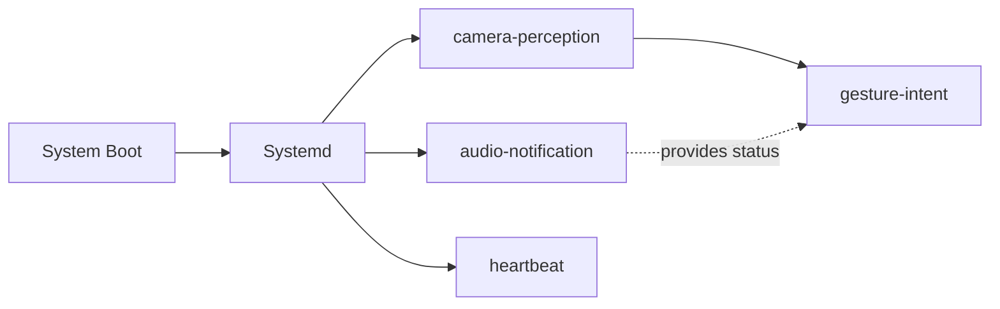

# R2D2 System Architecture Overview
**Date:** December 9, 2025 (Comprehensive Update)  
**Platform:** NVIDIA Jetson AGX Orin 64GB + ROS 2 Humble  
**Phase:** 1 - Perception, Face Recognition & Audio Notifications (Complete)  
**Latest Update:** December 21, 2025 - RED-first architecture implemented, documentation restructured

---

## Document Purpose

This document describes **how** the R2D2 system achieves its user experience goals.

**Primary Goal Document:** [`000_UX_AND_FUNCTIONS.md`](000_UX_AND_FUNCTIONS.md)  
**This Document:** Technical implementation serving those goals

All technical decisions documented here exist to enable the capabilities defined in the UX document. When evaluating changes or additions to this system, always ask: "Which UX capability does this serve?"

---

## Executive Summary

The R2D2 system is a modular ROS 2-based pipeline that provides seamless gesture-controlled speech-to-speech conversations with intelligent person recognition and multi-modal feedback. The system captures video from an OAK-D Lite camera, processes frames in real-time, detects and recognizes faces using RED-first architecture (~460ms response time), responds to person-specific gestures, and provides audio/visual feedback through sophisticated state machines. The system prioritizes conversation stability, fast recognition, and extensibility.

**Key System Capabilities (December 2025):**
- ✅ **RED-First Recognition:** Immediate face recognition without hysteresis gate (~460ms to RED status)
- ✅ **Rolling Window Filter:** 4 recognition matches in 1.5s window for robust RED entry
- ✅ **Multi-User Support:** Any trained person triggers RED via PersonRegistry auto-resolution
- ✅ **Person-Specific Gestures:** MediaPipe + SVM gesture recognition (only active in RED status)
- ✅ **Optimized Gesture Polling:** 10 Hz sampling (gesture_frame_skip=3) for snappy response
- ✅ **Warm-Start Speech:** Persistent OpenAI connection eliminates 1.5s handshake delay
- ✅ **Dual-Beep Feedback:** Immediate acknowledgment (~350ms) + ready confirmation (~750ms)
- ✅ **VAD-Based Conversation Protection:** 60s silence timeout (immune to camera flickers)
- ✅ **Production Auto-Start:** Systemd services with proper dependencies
- ✅ **Complete Documentation:** Reference, installation, quick start, and troubleshooting per system

**Current Processing Chain:**
```
OAK-D Lite → r2d2_camera node → /oak/rgb/image_raw (30 Hz)
             ↓
             r2d2_perception node (image_listener):
             ├─ Downscale (1920×1080 → 640×360)
             ├─ Brightness computation → /r2d2/perception/brightness (13 Hz)
             ├─ **Haar Cascade** face detection → /r2d2/perception/face_count (13 Hz, hysteresis)
             ├─ **LBPH** face recognition → /r2d2/perception/person_id (6.5 Hz, NO hysteresis)
             └─ **MediaPipe Hands + SVM** gesture recognition → /r2d2/perception/gesture_event (15 Hz, gated by RED)
             ↓
             r2d2_audio package (audio_notification_node):
             ├─ Rolling Window Filter: 4 matches in 1.5s → RED status
             ├─ State Machine: RED/GREEN/BLUE with 15s RED timer
             ├─ Audio feedback: "Hello!" (recognition), "Lost you!" (loss)
             └─ Status publishing: /r2d2/audio/person_status (10 Hz JSON)
             ↓
             r2d2_audio package (status_led_node):
             └─ White LED control: ON=RED, OFF=GREEN/BLUE
             ↓
             r2d2_gesture package (gesture_intent_node):
             ├─ Gesture gating: Only when person_status=RED
             ├─ Watchdog timer: 35s auto-shutdown if idle
             └─ Service calls: start_session/stop_session → speech_node
             ↓
             r2d2_speech package (speech_node):
             ├─ OpenAI Realtime API: WebSocket streaming
             ├─ **Whisper-1** STT, **GPT-4o Realtime** LLM, **OpenAI TTS**
             ├─ HyperX QuadCast S: Audio capture (48kHz → 24kHz)
             ├─ VAD-based timeout: 60s consecutive silence
             └─ Conversation persistence: SQLite database
```

**System Integration State Machines:**

**🔴 RED Status (Recognized):**
- Entry: 4 recognition matches within 1.5s rolling window
- Behavior: LED ON, "Hello!" beep (2%), 15s timer (resets on each match)
- Gestures: ENABLED (index finger up, fist) - 15 Hz sampling
- Exit: 15s timer expires without matches → GREEN (face) or BLUE (no face)

**🟢 GREEN Status (Unknown Person):**
- Entry: Face detected for 2s, not recognized
- Behavior: LED OFF, silent
- Exit: Target person → RED, No face 3s → BLUE

**🔵 BLUE Status (No Person):**
- Entry: No face for 5s + RED timer expired
- Behavior: LED OFF, "Lost you!" beep from RED
- Exit: Target person → RED, Unknown face 2s → GREEN

**For complete state machines and timing details, see:** `100_PERCEPTION_STATUS_REFERENCE.md`

### UX Capability to Technical Component Mapping

The following table shows which technical components serve each user-facing capability. For detailed capability descriptions and user perspective, see [`000_UX_AND_FUNCTIONS.md`](000_UX_AND_FUNCTIONS.md).

| UX Capability | Primary Components | Key Topics | Status |
|---------------|-------------------|------------|--------|
| **Person Recognition** | camera_node, image_listener, audio_notification_node, status_led_node | /r2d2/perception/person_id, /r2d2/audio/person_status | ✅ |
| **Natural Language** | speech_node, gesture_intent_node | /r2d2/speech/*, /r2d2/perception/gesture_event | ✅ |
| **Learning & Tutoring** | speech_node (tutor mode) | /r2d2/speech/assistant_prompt | ✅ |
| **Remote Monitoring** | web_dashboard, rosbridge, heartbeat_node | REST API, WebSocket | ✅ |
| **Physical Controls** | powerbutton service | GPIO 32, J42 header | ✅ |
| **Gesture Control** | image_listener, gesture_intent_node | /r2d2/perception/gesture_event | ✅ |
| **Head Movement** | (planned) dome motor control | (planned) /r2d2/cmd/head_pan | ⏳ |
| **Navigation** | (planned) SLAM, path planning | (planned) /r2d2/cmd_vel | ⏳ |

---

## System Components Map (December 2025)

### Complete Service & Package Overview

The R2D2 system consists of **10 systemd services**, **8 ROS 2 packages**, and **14 startup scripts** organized by function.

**For complete service documentation, see:** `005_SYSTEMD_SERVICES_REFERENCE.md`

#### Systemd Services (7 enabled, 3 disabled)

```
Auto-Start Services (Enabled):
├── r2d2-camera-perception.service     (launches r2d2_bringup package)
├── r2d2-audio-notification.service    (launches r2d2_audio package)
├── r2d2-gesture-intent.service        (launches r2d2_gesture package)
├── r2d2-speech-node.service           (launches r2d2_speech package)
├── r2d2-heartbeat.service             (system health monitoring)
├── r2d2-powerbutton.service           (physical button handler)
└── r2d2-wake-api.service              (minimal API mode)

On-Demand Services (Disabled):
├── r2d2-rosbridge.service             (WebSocket bridge for web UI)
├── r2d2-web-dashboard.service         (FastAPI + web interface)
└── r2d2-camera-stream.service         (MJPEG stream - conflicts with camera-perception!)
```

#### ROS 2 Packages

```
ros2_ws/src/
├── r2d2_camera/          Camera driver (OAK-D Lite via DepthAI SDK)
├── r2d2_perception/      Face & gesture recognition (image_listener node)
├── r2d2_audio/           Audio feedback, LED control, status machine
├── r2d2_gesture/         Gesture intent control (start/stop speech)
├── r2d2_speech/          OpenAI Realtime API conversation system
├── r2d2_common/          Shared utilities (PersonConfig, PersonRegistry)
├── r2d2_bringup/         Launch files (system orchestration)
└── r2d2_hello/           Legacy hello world example
```

#### Startup Scripts (Organized by Function)

```
scripts/start/
├── start_audio_notification.sh      (r2d2-audio-notification service)
├── start_speech_node.sh             (r2d2-speech-node service) ✅ Fixed Dec 24
├── start_gesture_intent.sh          (r2d2-gesture-intent service)
├── start_heartbeat.sh               (r2d2-heartbeat service)
├── start_rosbridge.sh               (r2d2-rosbridge service)
├── start_camera_stream.sh           (r2d2-camera-stream service)
├── launch_gesture_intent.sh         (alternative launcher)
├── launch_ros2_speech.sh            (alternative launcher)
├── start_audio_service.sh           (simplified audio launcher)
├── start_audio_service_now.sh       (immediate audio test)
├── START_FULL_SYSTEM.sh             (manual full startup)
└── START_SPEECH_NODE.sh             (alternative speech launcher)

Other script locations:
├── web_dashboard/scripts/start_web_dashboard.sh  (web UI)
└── /usr/local/bin/r2d2_power_button.py          (power button)
```

#### Service Dependencies & Boot Order

```
Boot Sequence (Auto-Start Services):
1. network.target
2. ├─ r2d2-audio-notification      (independent)
   ├─ r2d2-speech-node             (independent)
   ├─ r2d2-heartbeat               (independent)
   ├─ r2d2-powerbutton             (independent)
   └─ r2d2-wake-api                (independent)
3. └─ r2d2-camera-perception       (Wants: audio-notification)
4.    └─ r2d2-gesture-intent       (Requires: camera-perception)

Total Boot Time: ~5-7 seconds to full operational state
```

#### Critical Service Rules

**⚠️ Mutual Exclusions:**
- `r2d2-camera-perception` and `r2d2-camera-stream` are **MUTUALLY EXCLUSIVE**
- Both require exclusive OAK-D Lite camera access
- Never enable both for auto-start!

**Service Path Updates (December 2025):**
- ✅ **r2d2-speech-node:** Fixed Dec 24, 2025 (now points to `scripts/start/start_speech_node.sh`)
- ⚠️ **4 services still need updates:** audio-notification, heartbeat, rosbridge, camera-stream
- See `005_SYSTEMD_SERVICES_REFERENCE.md` for complete path audit

---

## 1. System-Level Architecture

> **Serves UX Capabilities:** Foundation for all capabilities - provides hardware and software platform for Person Recognition, Natural Language, Remote Monitoring, Physical Controls, and Gesture Control. See [`000_UX_AND_FUNCTIONS.md`](000_UX_AND_FUNCTIONS.md) for user perspective.

### 1.1 Hardware Components

```
┌─────────────────────────────────────────────────────────────────┐
│                     PHYSICAL HARDWARE                           │
├─────────────────────────────────────────────────────────────────┤
│                                                                 │
│  ┌──────────────────┐              ┌──────────────────────┐   │
│  │  OAK-D Lite      │              │  NVIDIA Jetson       │   │
│  │  Camera          │──USB 3.0────▶│  AGX Orin 64GB       │   │
│  │                  │              │                      │   │
│  │ • RGB Sensor     │              │ • 12-core ARM CPU    │   │
│  │   1920×1080@30Hz │              │ • 504-core GPU       │   │
│  │ • Stereo Pair    │              │ • 64GB LPDDR5X RAM   │   │
│  │ • Depth Engine   │              │ • 100W TDP (variable)│   │
│  │ • Auto Focus     │              │ • Ubuntu 22.04       │   │
│  │                  │              │ • JetPack 6.x        │   │
│  │ Serial:          │              │ • ROS 2 Humble       │   │
│  │ 19443010E1D30C7E00               │                      │   │
│  └──────────────────┘              └──────────────────────┘   │
│                                                                 │
│  Connection: USB 3.0 (direct to Jetson, not through hub)      │
│  Power: Bus-powered from Jetson (500mA @ 5V)                  │
│  Status: Fully detected and operational                        │
│                                                                 │
└─────────────────────────────────────────────────────────────────┘
```

**Key Hardware Specs:**
- **Camera:** OAK-D Lite Auto Focus
  - RGB: 1280×1080 actual, 1920×1080 reported (includes padding)
  - Depth: Stereo depth with OV9782 pair
  - FPS: 30 (native camera rate)
  - Interface: USB 3.0 with USB-C connector
  - Processor: Intel Movidius MyriadX

- **Jetson AGX Orin:** NVIDIA's flagship edge AI platform
  - CPU: 12-core ARM Cortex-A78 @ 2.4 GHz
  - GPU: 504-core NVIDIA (can accelerate deep learning)
  - RAM: 64 GB LPDDR5X
  - Storage: Internal eMMC (~32GB usable after JetPack)
  - Thermal: Passive/active cooling (can sustain 100W)

### 1.2 Hardware Fixed Constants Reference

**Critical system constants (do not change without documentation update):**

| Constant | Value | Location/Usage | Notes |
|----------|-------|---------------|-------|
| **Platform** | NVIDIA Jetson AGX Orin 64GB | Hardware | ARM64 architecture (not x86) |
| **OS** | Ubuntu 22.04 Jammy | System | Jetson-specific L4T image |
| **ROS 2 Version** | Humble | Software stack | Required version for compatibility |
| **Python Version** | 3.10.6 | Runtime | System or venv |
| **Camera Model** | OAK-D Lite Auto Focus | Hardware | Luxonis depth camera |
| **Camera Serial** | 19443010E1D30C7E00 | Hardware identifier | Specific unit identifier |
| **Camera Resolution** | 1920×1080 | Camera config | Reported resolution (includes padding) |
| **Camera FPS** | 30 Hz | Camera config | Native camera rate |
| **Project Root** | `~/dev/r2d2` | File system | NOT /opt, NOT /home/user |
| **ROS 2 Workspace** | `~/dev/r2d2/ros2_ws` | File system | Standard ROS 2 workspace location |
| **Audio Output Pin** | J511 Pin 9 (HPO_L) | Hardware | I2S interface for audio output |
| **Audio Device** | `hw:1,0` | ALSA config | Audio hardware device identifier |
| **LED GPIO Pins** | 17 (RED), 27 (GREEN), 22 (BLUE) | Hardware | GPIO pin assignments for RGB LED |
| **Power Button GPIO** | Pin 32 (40-pin header) | Hardware | Shutdown control |
| **Boot/Wake Pin** | J42 Pin 4 (POWER) | Hardware | Boot/wake control |
| **OPENBLAS_CORETYPE** | ARMV8 | Environment | Critical for ARM64 (prevents "Illegal instruction") |
| **Person Registry Database** | `~/dev/r2d2/data/persons.db` | File system | Central person entity database |
| **Face Recognition Models** | `~/dev/r2d2/data/face_recognition/models/{person}_lbph.xml` | File system | Per-person face models (auto-resolved) |
| **Gesture Recognition Models** | `~/dev/r2d2/data/gesture_recognition/models/{person}_gesture_classifier.pkl` | File system | Per-person gesture models (auto-resolved) |
| **Audio Assets Path** | `ros2_ws/src/r2d2_audio/r2d2_audio/assets/audio/` | File system | MP3 audio files location |

**Critical Environment Variables:**
- `OPENBLAS_CORETYPE=ARMV8` - **MUST** be set before ROS 2 commands (prevents crashes on ARM64)
- `ROS_DOMAIN_ID` - Optional, for ROS 2 network isolation

**For detailed hardware setup and troubleshooting, see:** [`000_INTERNAL_AGENT_NOTES.md`](000_INTERNAL_AGENT_NOTES.md)

---

### 1.3 Software Stack (Layered)

```
┌─────────────────────────────────────────────────────────────────┐
│                      APPLICATION LAYER                         │
│  ┌──────────────────────────────────────────────────────────┐  │
│  │  r2d2_perception (Python ROS 2 Node)                    │  │
│  │  └─ image_listener.py: 354 lines                        │  │
│  │     • Brightness computation                            │  │
│  │     • Haar Cascade face detection                       │  │
│  │     • LBPH face recognition (optional)                  │  │
│  │     • Gesture recognition (MediaPipe + SVM)             │  │
│  │     • Topic publishing (7 channels)                     │  │
│  └──────────────────────────────────────────────────────────┘  │
│  ┌──────────────────────────────────────────────────────────┐  │
│  │  r2d2_camera (Python ROS 2 Nodes)                       │  │
│  │  ├─ camera_node: OAK-D camera driver                    │  │
│  │  │  • Initializes DepthAI pipeline                      │  │
│  │  │  • Streams RGB frames at 30 FPS                      │  │
│  │  │  • Publishes /oak/rgb/image_raw                      │  │
│  │  └─ camera_stream_node: MJPEG stream server             │  │
│  │     • Subscribes to /oak/rgb/image_raw                  │  │
│  │     • Serves MJPEG stream via HTTP (port 8081)          │  │
│  │     • On-demand service (systemd)                       │  │
│  └──────────────────────────────────────────────────────────┘  │
│  ┌──────────────────────────────────────────────────────────┐  │
│  │  r2d2_hello (ROS 2 Nodes) [Basic Infrastructure]       │  │
│  │  ├─ heartbeat_node: Publish /r2d2/heartbeat (1 Hz)      │  │
│  │  │  • System health with metrics (CPU, GPU, temp)     │  │
│  │  │  • JSON format with system statistics               │  │
│  │  └─ beep_node: Alive signal demo                       │  │
│  └──────────────────────────────────────────────────────────┘  │
│  ┌──────────────────────────────────────────────────────────┐  │
│  │  r2d2_bringup (Launch Files)                           │  │
│  │  └─ r2d2_camera_perception.launch.py                   │  │
│  │     • Orchestrates camera + perception nodes           │  │
│  │     • Passes parameters to perception node             │  │
│  │     • Enables/disables face recognition                │  │
│  └──────────────────────────────────────────────────────────┘  │
│  ┌──────────────────────────────────────────────────────────┐  │
│  │  r2d2_audio (ROS 2 Package) [Audio & Status System]    │  │
│  │  ├─ audio_notification_node: Person recognition alerts │  │
│  │  │  • Subscribes to /r2d2/perception/person_id         │  │
│  │  │  • 3-state machine (RED/BLUE/GREEN)                 │  │
│  │  │  • MP3 audio alerts (recognition/loss)               │  │
│  │  │  • Publishes /r2d2/audio/person_status (JSON)       │  │
│  │  ├─ status_led_node: White LED control (GPIO)            │  │
│  │  │  • Visual feedback for recognition state             │  │
│  │  │  • ON=recognized, OFF=lost/unknown                   │  │
│  │  │  • GPIO pin 17 (Physical Pin 22)                     │  │
│  │  │  • Supports RGB mode for backward compatibility      │  │
│  │  ├─ database_logger_node: Event logging                │  │
│  │  │  • Tracks state transitions                          │  │
│  │  │  • Future: SQLite database integration              │  │
│  │  └─ audio_beep_node: Simple beep demo                  │  │
│  └──────────────────────────────────────────────────────────┘  │
│  ┌──────────────────────────────────────────────────────────┐  │
│  │  r2d2_gesture (ROS 2 Package) [Gesture Recognition]    │  │
│  │  └─ gesture_intent_node: Gesture-to-speech control      │  │
│  │     • Subscribes to /r2d2/perception/gesture_event      │  │
│  │     • Subscribes to /r2d2/audio/person_status           │  │
│  │     • Subscribes to /r2d2/speech/session_status         │  │
│  │     • Gating logic (person_status = RED)                │  │
│  │     • Gesture triggers (start/stop speech)              │  │
│  │     • Watchdog timer (35s auto-shutdown)                │  │
│  │     • Audio feedback (R2D2 beeps)                       │  │
│  │     • Service clients: start/stop_session               │  │
│  └──────────────────────────────────────────────────────────┘  │
│  ┌──────────────────────────────────────────────────────────┐  │
│  │  web_dashboard (Web Interface) [NEW]                   │  │
│  │  ├─ rosbridge_server: WebSocket bridge (port 9090)     │  │
│  │  │  • Exposes ROS 2 topics via WebSocket               │  │
│  │  │  • Real-time topic streaming                        │  │
│  │  ├─ FastAPI web server: REST API (port 8080)          │  │
│  │  │  • Service control (start/stop/restart)              │  │
│  │  │  • Volume control                                   │  │
│  │  │  • Training management                              │  │
│  │  │  • Static file serving                              │  │
│  │  ├─ Camera Stream Service: MJPEG server (port 8081)   │  │
│  │  │  • On-demand camera video stream                    │  │
│  │  │  • Toggleable from dashboard                        │  │
│  │  └─ HTML/JavaScript dashboard:                         │  │
│  │     • Real-time monitoring                             │  │
│  │     • Three-state visualization (RED/BLUE/GREEN)      │  │
│  │     • System health metrics (CPU, GPU, temperature)    │  │
│  │     • Camera stream viewer                             │  │
│  │     • Service control interface                        │  │
│  │     • Training interface (all 7 options)               │  │
│  │     • Star Wars themed UI (dark futuristic)            │  │
│  │     • Optimized for 1920x1200 single-page display       │  │
│  │     • Accessible via Tailscale VPN                     │  │
│  └──────────────────────────────────────────────────────────┘  │
├─────────────────────────────────────────────────────────────────┤
│                    ROS 2 HUMBLE LAYER                          │
│  • rclpy (Python client library)                              │
│  • sensor_msgs (Image message type)                           │
│  • std_msgs (Float32, Int32, String, Bool types)             │
│  • cv_bridge (ROS Image ↔ OpenCV conversion)                 │
│  • roslaunch (launch file system)                            │
├─────────────────────────────────────────────────────────────────┤
│                  COMPUTER VISION & PROCESSING                  │
│  • OpenCV (face detection, image manipulation)                │
│  • OpenCV contrib (LBPH face recognizer)                      │
│  • NumPy (numerical computing)                                │
│  • cv_bridge (image format conversion)                        │
├─────────────────────────────────────────────────────────────────┤
│                    HARDWARE ABSTRACTION                        │
│  • DepthAI SDK 2.31.0.0 (OAK-D camera interface)             │
│  • DepthAI Python bindings                                    │
│  • USB driver (kernel-level USB 3.0 support)                │
├─────────────────────────────────────────────────────────────────┤
│                    OPERATING SYSTEM                            │
│  • Ubuntu 22.04 Jammy (ARM64 aarch64)                        │
│  • Linux kernel 5.10.192-tegra (custom Jetson kernel)        │
│  • JetPack 6.x (NVIDIA system image)                         │
│  • CUDA 12.x + cuDNN (GPU acceleration, optional)            │
├─────────────────────────────────────────────────────────────────┤
│                  HARDWARE (Jetson AGX Orin)                    │
│  • 12-core ARM CPU + 504-core GPU                            │
│  • 64 GB LPDDR5X memory                                      │
│  • Internal eMMC storage                                      │
└─────────────────────────────────────────────────────────────────┘
```

---

## 2. Data Flow Architecture

> **Serves UX Capabilities:** Person Recognition and Awareness (Section 1), Gesture Control (Section 6). See [`000_UX_AND_FUNCTIONS.md`](000_UX_AND_FUNCTIONS.md) for user perspective.

### 2.1 Complete Message Flow (Simplified)

```
OAK-D Camera (30 Hz)
      ↓
r2d2_camera node
      ↓
/oak/rgb/image_raw (30 Hz)
      ↓
r2d2_perception node
      ├─ Downscale + Grayscale
      ├─ Brightness calculation → /r2d2/perception/brightness (13 Hz)
      ├─ Face detection → /r2d2/perception/face_count (13 Hz)
      ├─ Face recognition (optional) → /r2d2/perception/person_id (6.5 Hz)
      └─ Gesture recognition (when target person present) → /r2d2/perception/gesture_event (event-based)
      ↓
r2d2_audio package
      ├─ audio_notification_node: State machine → /r2d2/audio/person_status (10 Hz)
      ├─ status_led_node: LED control (GPIO)
      └─ database_logger_node: Event logging
      ↓
r2d2_gesture/gesture_intent_node (NEW)
      ├─ Gesture event processing (gated by person_status = "red")
      ├─ Watchdog timer (35s auto-shutdown when no person)
      ├─ Audio feedback (R2D2 beeps on start/stop)
      └─ Service calls to speech system (start/stop session)
      ↓
Downstream consumers (Phase 2: speech, Phase 3-4: navigation, memory)
```

### 2.2 Component Interaction Diagram

**Complete System Flow with Timing and Dependencies:**

```
┌─────────────────────────────────────────────────────────────────────────┐
│                    R2D2 SYSTEM ARCHITECTURE                             │
│                    Component Interaction & Data Flow                   │
└─────────────────────────────────────────────────────────────────────────┘

HARDWARE LAYER:
┌──────────────┐
│  OAK-D Lite  │ 30 FPS RGB frames (1920×1080)
│   Camera     │ USB 3.0 connection
└──────┬───────┘
       │
       ↓ [30 Hz raw frames]
       
ROS 2 NODE LAYER:
┌─────────────────────┐
│  r2d2_camera        │ Node: camera_node
│  (camera driver)    │ CPU: 2-3% (one core)
│                     │ Memory: ~50 MB
│  Publishes:         │ Frequency: 30 Hz
│  /oak/rgb/image_raw │ Message: sensor_msgs/Image
└──────┬──────────────┘
       │
       ↓ [30 Hz image stream]
       
┌─────────────────────┐
│  r2d2_perception    │ Node: image_listener
│  (image processing) │ CPU: 8-15% (one core)
│                     │ Memory: ~200 MB
│  Processing:        │ Frequency: 13 Hz (downscaled from 30 Hz)
│  • Downscale        │
│  • Grayscale        │
│  • Brightness       │
│  • Face detection   │
│  • Face recognition │ (optional, 6.5 Hz when enabled)
│                     │
│  Publishes:         │
│  • /r2d2/perception/brightness (13 Hz)      │
│  • /r2d2/perception/face_count (13 Hz)      │
│  • /r2d2/perception/person_id (6.5 Hz*)     │
│  • /r2d2/perception/face_confidence (6.5 Hz*)│
│  • /r2d2/perception/is_target_person (6.5 Hz*)     │
└──────┬──────────────┘
       │
       ↓ [6.5 Hz person_id stream]
       
┌─────────────────────┐
│  r2d2_audio          │ Package: r2d2_audio
│  (audio & status)    │
│                      │
│  ┌─────────────────────────────────────┐
│  │ audio_notification_node             │
│  │ CPU: 2-4% | Memory: ~50 MB          │
│  │ Frequency: 10 Hz (status publishing) │
│  │                                     │
│  │ Subscribes:                         │
│  │ • /r2d2/perception/person_id        │
│  │                                     │
│  │ State Machine:                      │
│  │ • RED (recognized)                 │
│  │ • BLUE (lost/idle)                 │
│  │ • GREEN (unknown person)            │
│  │                                     │
│  │ Publishes:                          │
│  │ • /r2d2/audio/person_status (10 Hz)│
│  │ • /r2d2/audio/notification_event   │
│  │                                     │
│  │ Actions:                            │
│  │ • MP3 audio alerts (ffplay)         │
│  └─────────────────────────────────────┘
│           │
│           ↓ [10 Hz status JSON]
│           
│  ┌─────────────────────────────────────┐
│  │ status_led_node                     │
│  │ CPU: <0.1% | Memory: ~20 MB         │
│  │ Frequency: 10 Hz (LED updates)      │
│  │                                     │
│  │ Subscribes:                         │
│  │ • /r2d2/audio/person_status         │
│  │                                     │
│  │ Controls:                           │
│  │ • GPIO Pin 17 (WHITE LED)          │
│  │ • Physical Pin 22 on 40-pin header │
│  │ • ON/OFF control for status        │
│  └─────────────────────────────────────┘
│           │
│           ↓ [10 Hz status JSON]
│           
│  ┌─────────────────────────────────────┐
│  │ database_logger_node                │
│  │ CPU: <0.1% | Memory: ~30 MB         │
│  │ Frequency: 10 Hz (event logging)     │
│  │                                     │
│  │ Subscribes:                         │
│  │ • /r2d2/audio/person_status         │
│  │                                     │
│  │ Logs:                               │
│  │ • State transitions                 │
│  │ • Recognition events                │
│  │ • (Future: SQLite database)         │
│  └─────────────────────────────────────┘
└─────────────────────────────────────────┘

* Only published if enable_face_recognition=true
```

**Key Timing Relationships:**
- **Camera → Perception:** 30 Hz → 13 Hz (frame skipping for CPU efficiency)
- **Perception → Audio:** 6.5 Hz → 10 Hz (audio node publishes status faster than recognition rate)
- **Audio → LED/Logger:** 10 Hz → 10 Hz (synchronized updates)

---

### 2.3 ROS 2 Topic Reference

Complete list of all topics published:

```
TOPIC                                  TYPE                  FREQ   DESCRIPTION
───────────────────────────────────────────────────────────────────────────────────────────────────────────────────────
PERCEPTION TOPICS:
/oak/rgb/image_raw                     sensor_msgs/Image     30 Hz  Raw RGB camera frames from OAK-D Lite (1920x1080)
                                                                    Published by: camera_node
                                                                    
/r2d2/perception/brightness            std_msgs/Float32      13 Hz  Mean pixel brightness value (0-255 scale)
                                                                    Used for: Lighting condition detection
                                                                    Published by: image_listener
                                                                    
/r2d2/perception/face_count            std_msgs/Int32        13 Hz  Number of faces detected in frame (0, 1, 2, ...)
                                                                    Uses: Haar Cascade detection with hysteresis filter (2s/5s)
                                                                    Published by: image_listener
                                                                    
/r2d2/perception/person_id             std_msgs/String       6.5 Hz* Person name from face recognition
                                                                    Values: Person name (from PersonRegistry), "unknown", "no_person"
                                                                    Uses: LBPH face recognizer with trained models
                                                                    Published by: image_listener
                                                                    
/r2d2/perception/face_confidence       std_msgs/Float32      6.5 Hz* LBPH confidence score (lower = better match)
                                                                    Range: 0-200+ (typical: 35-50 for recognized, 80-120 for unknown)
                                                                    Threshold: Configurable (default: 70.0)
                                                                    Published by: image_listener
                                                                    
/r2d2/perception/is_target_person      std_msgs/Bool         6.5 Hz* Boolean convenience topic
                                                                    Values: true (recognized person), false (unknown/no person)
                                                                    Published by: image_listener
                                                                    
/r2d2/perception/gesture_event         std_msgs/String       Event** Hand gesture recognition events
                                                                    Values: "index_finger_up" (start), "fist" (stop)
                                                                    Uses: MediaPipe Hands + person-specific SVM classifier
                                                                    Published by: image_listener
                                                                    Gated by: Only when recognized person present (RED status)

AUDIO & STATUS TOPICS:
/r2d2/audio/person_status              std_msgs/String       10 Hz  Person recognition state machine status (JSON)
                                                                    Format: {"status": "red|blue|green", "person_identity": "...", ...}
                                                                    States: RED (recognized), BLUE (lost/idle), GREEN (unknown person)
                                                                    Published by: audio_notification_node
                                                                    Used by: LED controller, gesture gating, watchdog timer
                                                                    
/r2d2/audio/notification_event         std_msgs/String       Event  Audio alert event notifications
                                                                    Values: "recognition", "loss", state transitions
                                                                    Published by: audio_notification_node
                                                                    
/r2d2/audio/status                     std_msgs/String       Event  Audio system status messages
                                                                    Published by: audio_notification_node
                                                                    
/r2d2/audio/beep_count                 std_msgs/UInt32        Event  Beep counter (demo node only)
                                                                    Published by: audio_beep_node (testing)
                                                                    
/r2d2/audio/last_frequency             std_msgs/Float32       Event  Last beep frequency (demo node only)
                                                                    Published by: audio_beep_node (testing)

SPEECH TOPICS (Phase 2 - OPERATIONAL):
/r2d2/speech/session_status            std_msgs/String       Event  Speech session state (JSON)
                                                                    Format: {"status": "connected|disconnected", ...}
                                                                    Published by: speech_node
                                                                    Used by: gesture_intent_node for gating
                                                                    
/r2d2/speech/user_transcript           std_msgs/String       Event  User speech transcribed to text
                                                                    Published by: speech_node (OpenAI Whisper-1)
                                                                    
/r2d2/speech/assistant_transcript      std_msgs/String       Event  AI assistant response text
                                                                    Published by: speech_node (OpenAI GPT-4o)
                                                                    
/r2d2/speech/voice_activity            std_msgs/String       Event  Voice activity detection events (JSON)
                                                                    Values: {"status": "speaking|silent"}
                                                                    Published by: speech_node
                                                                    Used by: gesture_intent_node for VAD-based timeout

SYSTEM TOPICS:
/r2d2/heartbeat                        std_msgs/String       1 Hz   System health heartbeat (JSON)
                                                                    Format: {"timestamp": "...", "status": "running"}
                                                                    Published by: heartbeat_node
                                                                    Note: Detailed metrics (CPU/GPU/temp) available via REST API

* Only published if enable_face_recognition=true
** Only published when target person is recognized (gated by person_status="red")
```

---

## 3. Node Architecture

> **Serves UX Capabilities:** All capabilities - this section documents the ROS 2 nodes that implement the system features. See [`000_UX_AND_FUNCTIONS.md`](000_UX_AND_FUNCTIONS.md) for user perspective.

### 3.1 Node Details

| Node | Package | Type | Description | FPS In | FPS Out | CPU | Status |
|------|---------|------|-------------|--------|---------|-----|--------|
| **camera_node** | r2d2_camera | Sensor driver | OAK-D Lite camera driver using DepthAI SDK. Captures RGB frames via USB 3.0 and publishes to ROS 2. Exclusive camera access (cannot run with camera_stream_node). | N/A | 30 Hz | 2-3% | ✅ |
| **image_listener** | r2d2_perception | Computer vision | Main perception pipeline: downscales frames (1920x1080→640x360), computes brightness, detects faces (**Haar Cascade**), recognizes persons (**LBPH**), detects gestures (**MediaPipe Hands + SVM**). Uses PersonRegistry for dynamic model loading. | 30 Hz | 6 topics | 8-15% | ✅ |
| **heartbeat_node** | r2d2_hello | Health monitor | Lightweight alive ping publishing timestamp and status. System metrics (CPU/GPU/temp) available via REST API (/api/system/health) to save resources. | N/A | 1 Hz | <0.5% | ✅ |
| **camera_stream_node** | r2d2_camera | MJPEG stream | On-demand HTTP MJPEG video stream server for web dashboard (port 8081). Mutually exclusive with camera_node (device conflict). Started manually or via dashboard. | 30 Hz | 15 FPS | 2-5% | ✅ |
| **audio_notification_node** | r2d2_audio | State machine | 3-state recognition state machine (RED/BLUE/GREEN). Tracks person presence with 15s timer, plays MP3 alerts on transitions, publishes JSON status for LED/gesture gating. Uses PersonConfig for dynamic person resolution. | 6.5 Hz | 10 Hz | 2-4% | ✅ |
| **status_led_node** | r2d2_audio | GPIO control | Controls white LED (GPIO 17, Pin 22) for visual feedback. LED ON=recognized (RED), OFF=lost/unknown (BLUE/GREEN). Subscribes to person_status JSON, updates at 10 Hz. | 10 Hz | N/A | <0.1% | ✅ |
| **database_logger_node** | r2d2_audio | Event logging | Logs state transitions and recognition events to console. Structure ready for future SQLite integration. Tracks recognition events for conversation history. | 10 Hz | N/A | <0.1% | ✅ |
| **audio_beep_node** | r2d2_audio | Audio demo | Demo node for testing audio hardware with simple tone generation. NOT used in production (recognition/loss alerts handled by audio_notification_node). | N/A | Event | <0.1% | ✅ |
| **gesture_intent_node** | r2d2_gesture | Gesture control | Translates gesture events into speech service calls with strict gating (person must be RED). Implements cooldowns (5s start, 3s stop), watchdog timer (35s auto-shutdown), and audio feedback (R2D2 beeps). | Event | Service calls | <1% | ✅ |
| **speech_node** | r2d2_speech | Speech system | OpenAI Realtime API integration for speech-to-speech conversations (**Whisper-1** STT, **GPT-4o Realtime** LLM, **OpenAI TTS**). Lifecycle node with WebSocket streaming, HyperX mic input, PAM8403 speaker output. Provides start/stop services, publishes transcripts and session status. | Audio stream | Audio+Topics | 10-15% | ✅ |

### 3.2 Launch Sequence

```
ros2 launch r2d2_bringup r2d2_camera_perception.launch.py
        ↓
r2d2_camera_perception.launch.py loads
        ↓
   ┌────┴─────────────────────┐
   ↓                           ↓
camera.launch.py      perception.launch.py
   ↓                           ↓
camera_node started    image_listener started
(1-2 sec to ready)     (waits for /oak/rgb/image_raw)
   ↓                           ↓
   └────┬─────────────────────┘
        ↓
   System Ready (5-7 sec total)
   All topics publishing
   Ready for subscribers
```

---

## 4. Audio Notification System & State Machine

> **Serves UX Capabilities:** Person Recognition and Awareness (Section 1 of [`000_UX_AND_FUNCTIONS.md`](000_UX_AND_FUNCTIONS.md)) - provides audio and visual feedback when people are recognized.

### 4.1 Person Recognition State Machine

The `r2d2_audio` package implements a sophisticated 3-state recognition system:

```
┌─────────────────────────────────────────────────────────────┐
│              PERSON RECOGNITION STATE MACHINE                │
├─────────────────────────────────────────────────────────────┤
│                                                              │
│  🔴 RED STATE (Recognized)                                   │
│     • Target person is currently visible                     │
│     • Audio: "Hello!" MP3 plays on transition               │
│     • LED: Solid RED (GPIO pin 17)                          │
│     • Status: Active engagement                             │
│     • Transitions: → BLUE (after loss confirmation)          │
│                    → GREEN (if unknown person appears)      │
│                                                              │
│  🔵 BLUE STATE (Lost/Idle)                                   │
│     • No target person visible                              │
│     • Audio: "Oh, I lost you!" MP3 plays on transition     │
│     • LED: Solid BLUE (GPIO pin 22)                         │
│     • Status: Idle, waiting for recognition                  │
│     • Timing: 5s jitter tolerance + 15s confirmation        │
│     • Transitions: → RED (when target person detected)      │
│                    → GREEN (if unknown person appears)       │
│                                                              │
│  🟢 GREEN STATE (Unknown Person)                            │
│     • Face detected but not the target person               │
│     • Audio: Silent (no alerts)                             │
│     • LED: Solid GREEN (GPIO pin 27)                        │
│     • Status: Caution mode                                   │
│     • Transitions: → RED (if target person appears)         │
│                    → BLUE (if unknown person leaves)        │
│                                                              │
└─────────────────────────────────────────────────────────────┘
```

**State Machine Features:**
- **Jitter Tolerance:** 5-second window for brief interruptions (prevents false loss alerts)
- **Loss Confirmation:** 15-second confirmation window after jitter (total ~20s to loss alert)
- **Cooldown Periods:** 2s between recognition alerts, 5s quiet period after loss alert
- **Status Publishing:** JSON messages at 10 Hz for LED, database, and future dialogue system

**Status Message Format (JSON):**
```json
{
  "status": "red|blue|green",
  "person_identity": "target_person|no_person|unknown",
  "timestamp_sec": 1765212914,
  "timestamp_nanosec": 949382424,
  "confidence": 0.95,
  "duration_seconds": 15.3,
  "is_loss_state": false,
  "audio_event": "recognition|loss|none"
}
```

**For complete person recognition and status system setup, see:** [`100_PERSON_RECOGNITION_AND_STATUS.md`](100_PERSON_RECOGNITION_AND_STATUS.md) ⭐ **Complete Setup Guide**

### 4.2 Audio Notification Components

**audio_notification_node:**
- Subscribes to `/r2d2/perception/person_id`
- Implements 3-state machine (RED/BLUE/GREEN)
- Plays MP3 audio alerts via ffplay
- Publishes status JSON for downstream consumers
- Configurable parameters: volume, timing, audio files

**status_led_node:**
- Subscribes to `/r2d2/audio/person_status`
- Controls RGB LED via GPIO (pins 17, 27, 22)
- Real-time visual feedback synchronized with audio
- Auto-detects GPIO availability (simulation mode fallback)

**database_logger_node:**
- Subscribes to `/r2d2/audio/person_status`
- Logs state transitions to console (structure ready for SQLite)
- Tracks recognition events for conversation history
- Future: SQLite database for analytics and memory

**For complete system setup including audio, see:** [`100_PERSON_RECOGNITION_AND_STATUS.md`](100_PERSON_RECOGNITION_AND_STATUS.md)

---

## 5. Processing Pipeline

> **Serves UX Capabilities:** Person Recognition and Awareness, Gesture Control - image processing foundation. See [`000_UX_AND_FUNCTIONS.md`](000_UX_AND_FUNCTIONS.md) for user perspective.

### 5.1 Step-by-Step Image Processing

```
Each frame (30 FPS):
  1. Receive /oak/rgb/image_raw
  2. Convert ROS Image → OpenCV (BGR array)
  3. Downscale 1920×1080 → 640×360 (4× size reduction)
  4. Convert to grayscale
  5. Compute brightness (mean pixel value)
  6. Detect faces (Haar Cascade)
  7. (If face_count > 0 AND recognition enabled AND skip counter met)
     → Extract face, resize to 100×100, run LBPH recognizer
  8. Publish all results on respective topics

Frame processing time: ~10 ms (without recognition)
                      ~25 ms (with recognition, when triggered)
```

### 5.2 Performance Characteristics & Resource Allocation

**Current Resource Usage (All Components Running):**

| Component | CPU Usage | Memory | GPU | Frequency | Notes |
|-----------|-----------|--------|-----|-----------|-------|
| **camera_node** | 2-3% (1 core) | ~50 MB | 0% | 30 Hz | Camera driver |
| **image_listener** | 8-15% (1 core) | ~200 MB | 0% | 13 Hz | Image processing |
| **audio_notification_node** | 2-4% (1 core) | ~50 MB | 0% | 10 Hz | State machine |
| **status_led_node** | <0.1% (1 core) | ~20 MB | 0% | 10 Hz | GPIO control |
| **database_logger_node** | <0.1% (1 core) | ~30 MB | 0% | 10 Hz | Event logging |
| **heartbeat_node** | <0.1% (1 core) | ~10 MB | 0% | 1 Hz | Health monitor |
| **System overhead** | 5-10% | ~140 MB | 0% | N/A | ROS 2, OS |
| **TOTAL** | **~15-25%** | **~500 MB** | **0%** | — | **All Phase 1 components** |

**Resource Headroom Available (for Phase 2-4):**

```
CPU:
  Total cores: 12 (ARM Cortex-A78)
  Used: ~1-2 cores (15-25% total)
  Available: ~10-11 cores (75-85% headroom)
  
Memory:
  Total: 64 GB LPDDR5X
  Used: ~500 MB (0.8%)
  Available: ~63.5 GB (99.2% headroom)
  
GPU:
  Total: 504 CUDA cores (Ampere architecture)
  Used: 0% (not accelerated yet)
  Available: 100% (full GPU available for Phase 2 LLM, Phase 3 SLAM)
  
Storage:
  Total: ~32 GB usable (eMMC)
  Used: ~5-10 GB (OS, ROS 2, models)
  Available: ~22-27 GB (sufficient for Phase 2-3 models)
```

**Performance Baselines (Expected Values):**

| Metric | Expected Value | Issue When | Notes |
|--------|---------------|------------|-------|
| Camera FPS | 30 Hz | <25 Hz | USB bandwidth or camera issue |
| Perception rate | 13 Hz | <10 Hz | CPU overload or frame processing issue |
| Face recognition rate | 6.5 Hz | <5 Hz | Recognition enabled but slow |
| Audio status rate | 10 Hz | <5 Hz | Audio node performance issue |
| CPU usage (total) | 15-25% | >50% | System overload, check processes |
| Memory usage | ~500 MB | >2 GB | Memory leak, check nodes |
| GPU usage | 0% | N/A | Not used in Phase 1 (available for Phase 2) |

**Timing Guarantees:**

| Data Flow | Latency | Notes |
|-----------|---------|-------|
| Camera → Perception | <33 ms | Frame-to-frame processing |
| Perception → Audio | <100 ms | Topic subscription + state update |
| Audio → LED | <100 ms | GPIO response time |
| Recognition → Alert | <200 ms | State transition to audio playback start |
| End-to-end (camera → alert) | <500 ms | Total system latency |

**For detailed performance analysis, see:** `_ANALYSIS_AND_DOCUMENTATION/COMPUTE_COST_ANALYSIS.md`

---

## 6. AI Models and Algorithms Reference

> **Serves UX Capabilities:** Foundation for all intelligent capabilities - provides the AI models powering Person Recognition, Gesture Control, and Natural Language interactions. See [`000_UX_AND_FUNCTIONS.md`](000_UX_AND_FUNCTIONS.md) for user perspective.

### 6.0 Executive Summary: All AI Models Used in R2D2

**Summary of All AI Models Used in R2D2 System:**

| Component | Model/Algorithm | Provider/Library | Location | Status |
|-----------|----------------|------------------|----------|--------|
| **Face Detection** | **Haar Cascade** | OpenCV | System paths | ✅ Active |
| **Face Recognition** | **LBPH** (Local Binary Patterns Histogram) | OpenCV contrib | `~/dev/r2d2/data/face_recognition/models/` | ✅ Active |
| **Gesture Detection** | **MediaPipe Hands** | Google MediaPipe | Python package | ✅ Active |
| **Gesture Classification** | **SVM** (RBF kernel) | scikit-learn | `~/dev/r2d2/data/gesture_recognition/models/` | ✅ Active |
| **Speech-to-Text** | **Whisper-1** | OpenAI (Realtime API) | Cloud | ✅ Active |
| **Language Model** | **GPT-4o Realtime** | OpenAI (Realtime API) | Cloud | ✅ Active |
| **Text-to-Speech** | **OpenAI TTS** | OpenAI (Realtime API) | Cloud | ✅ Active |

**Quick Performance Summary:**

| Model | Latency | Accuracy | CPU Usage | Training Required |
|-------|---------|----------|-----------|-------------------|
| **Haar Cascade** | ~40ms | ~90-95% | 2-5% | ❌ None (pre-trained) |
| **LBPH** | ~25ms | ~95% | 3-5% | ✅ Simple (20-50 images) |
| **MediaPipe Hands** | ~50ms | ~92% | 5-8% | ❌ None (pre-trained) |
| **SVM** | ~10ms | ~92% | <1% | ✅ Moderate (50+ gestures) |
| **Whisper-1** | ~300ms | ~95%+ | 0%* | ❌ None (cloud) |
| **GPT-4o Realtime** | ~300ms | Excellent | 0%* | ❌ None (cloud) |
| **OpenAI TTS** | ~150ms | Excellent | 0%* | ❌ None (cloud) |

*Cloud-based processing (no local CPU usage)

---

### 6.1 Face Detection: **`Haar Cascade Classifier`**

> **CURRENT MODEL IN USE**  
> **Model**: `haarcascade_frontalface_default.xml`  
> **Library**: OpenCV (built-in)  
> **Status**: ✅ Active in production

**🔍 Model Quick Reference:**
- **Name**: Haar Cascade Classifier
- **Type**: Pre-trained cascade object detector
- **File**: `haarcascade_frontalface_default.xml`
- **Latency**: ~40ms per frame (640×360 grayscale)
- **Accuracy**: ~90-95% (frontal faces)
- **CPU Usage**: 2-5% (single core)
- **Training**: None required (pre-trained on thousands of faces)

#### Why This Model Was Chosen

The **Haar Cascade Classifier** was selected for face detection because it provides the optimal balance of speed, reliability, and resource efficiency for the R2D2 system's real-time person recognition requirements:

**Key Advantages:**
- ✅ **Extremely Fast**: ~40ms per frame on Jetson Orin (13 Hz processing rate)
- ✅ **Low CPU Usage**: Only 2-5% of one CPU core, leaving resources for recognition and gestures
- ✅ **No Training Required**: Pre-trained model works out-of-the-box
- ✅ **Small Memory Footprint**: <1MB model size
- ✅ **Robust to Lighting**: Works well in varied lighting conditions
- ✅ **Mature & Stable**: Battle-tested algorithm with 20+ years of use
- ✅ **Works with Downscaled Images**: Effective even at 640×360 resolution

**System Integration Benefits:**
- Processes frames at 13 Hz (after frame skip), providing smooth detection
- Hysteresis filter (2s/5s) smooths out transient false detections
- Leaves 75-85% CPU headroom for face recognition and gesture processing
- No GPU required (saves GPU for future Phase 3 SLAM/navigation)

#### Current Configuration

```python
# Location: ros2_ws/src/r2d2_perception/r2d2_perception/image_listener.py

# Model path (multiple fallback paths for compatibility)
cascade_paths = [
    cv2.data.haarcascades + 'haarcascade_frontalface_default.xml',
    '/usr/share/opencv4/haarcascades/haarcascade_frontalface_default.xml',
    '/usr/local/share/opencv4/haarcascades/haarcascade_frontalface_default.xml',
]

# Detection parameters
self.cascade_scale_factor = 1.05      # Multi-scale detection step (1.05 = 5% increase per scale)
self.cascade_min_neighbors = 5         # Minimum neighbors to confirm detection (reduces false positives)
self.cascade_min_size = (30, 30)      # Minimum face size in pixels
self.cascade_max_size = (500, 500)    # Maximum face size in pixels

# Usage
faces = self.face_cascade.detectMultiScale(
    gray_downscaled,                   # 640×360 grayscale image
    scaleFactor=self.cascade_scale_factor,
    minNeighbors=self.cascade_min_neighbors,
    minSize=self.cascade_min_size,
    maxSize=self.cascade_max_size,
    flags=cv2.CASCADE_SCALE_IMAGE
)
```

**Processing Pipeline:**
1. Downscale image to 640×360 (4× reduction from 1920×1080)
2. Convert to grayscale
3. Run Haar Cascade detection (~40ms)
4. Apply hysteresis filter (2s presence → 5s absence)
5. Publish face count at 13 Hz

#### Performance Characteristics

**Strengths:**
- Fast detection suitable for real-time person tracking
- Reliable for frontal and near-frontal faces (±30° rotation)
- Minimal false negatives in good lighting
- Consistent performance across different face sizes

**Limitations:**
- **Best for Frontal Faces**: Accuracy drops with extreme angles (>45° rotation)
- **Profile Faces**: May miss side-view faces (acceptable for this use case - user needs to face robot)
- **Lighting Sensitivity**: Can struggle in very dark or very bright conditions (mitigated by brightness monitoring)
- **Detection Rate**: ~90-95% in typical usage (acceptable trade-off for speed)

**Actual Performance Metrics (Jetson Orin, 640×360):**
- Detection latency: 35-45ms per frame
- False positive rate: <5% (with hysteresis filter)
- False negative rate: 5-10% (transient misses smoothed by hysteresis)
- CPU usage: 2-5% (one core)

#### When to Consider Alternatives

**Consider switching to a different model if:**

1. **Need Better Angle Detection**: If users frequently approach from extreme angles (>45°)
   - **Recommended**: MediaPipe Face Detection (see alternatives below)

2. **Very Low Light Conditions**: If system deployed in dark environments
   - **Recommended**: Deep learning detector with IR camera

3. **Multiple Face Tracking**: If need to track >3 faces simultaneously
   - **Recommended**: MTCNN or YOLOv8-face

4. **Higher Accuracy Required**: If 90-95% detection rate insufficient
   - **Recommended**: Deep learning detector (but at cost of speed and CPU)

#### Alternative Models

| Model | Latency | Accuracy | CPU Usage | GPU Required | When to Use |
|-------|---------|----------|-----------|--------------|-------------|
| **MediaPipe Face Detection** | ~50ms | ~95%+ | 8-12% | ❌ No | Better angle tolerance, similar speed |
| **dlib HOG Face Detector** | ~100ms | ~93% | 10-15% | ❌ No | Better profile face detection |
| **MTCNN** | ~200ms | ~97%+ | 25-35% | ⚠️ Optional | High accuracy, multiple faces |
| **YOLOv8-face** | ~300ms | ~98%+ | 5-10% | ✅ Yes (GPU) | Best accuracy, requires GPU |
| **RetinaFace** | ~250ms | ~98%+ | 5-10% | ✅ Yes (GPU) | State-of-the-art, GPU-accelerated |

**Migration Complexity:**
- **MediaPipe Face Detection**: Easy (2-3 hours) - similar API, drop-in replacement
- **dlib HOG**: Medium (4-6 hours) - different API, requires dlib installation
- **Deep learning (MTCNN, YOLO, RetinaFace)**: Hard (1-2 days) - requires TensorFlow/PyTorch, GPU setup, model optimization

**Recommendation**: **Stick with Haar Cascade** unless specific limitations encountered. The current performance (90-95% accuracy, 40ms latency) meets all system requirements with excellent resource efficiency.

---

### 6.2 Face Recognition: **`LBPH (Local Binary Patterns Histogram)`**

> **CURRENT MODEL IN USE**  
> **Model**: OpenCV `LBPHFaceRecognizer`  
> **Library**: OpenCV contrib (`cv2.face`)  
> **Status**: ✅ Active in production

**🔍 Model Quick Reference:**
- **Name**: LBPH (Local Binary Patterns Histogram) Face Recognizer
- **Type**: Texture-based face recognition
- **Model Files**: `~/dev/r2d2/data/face_recognition/models/{person}_lbph.xml`
- **Latency**: ~25ms per face (100×100 grayscale)
- **Accuracy**: ~95% (with proper training)
- **CPU Usage**: 3-5% (single core)
- **Training**: Simple (20-50 images per person, ~10 seconds training time)

#### Why This Model Was Chosen

The **LBPH Face Recognizer** was selected for person-specific face recognition because it excels with small training datasets while maintaining fast inference and low resource usage:

**Key Advantages:**
- ✅ **Excellent for Small Datasets**: Works well with just 20-50 training images per person
- ✅ **Fast Inference**: ~25ms per face (enables 6.5 Hz recognition rate)
- ✅ **Low Memory Footprint**: <1MB per person model
- ✅ **Robust to Lighting Variations**: Texture-based approach handles lighting changes well
- ✅ **No GPU Required**: CPU-only inference (saves GPU for future features)
- ✅ **Person-Specific Training**: Each person gets their own model (privacy-friendly)
- ✅ **Simple Training**: Easy to train new people via web dashboard or CLI
- ✅ **Fast Training**: 10 seconds to train on 100 images

**System Integration Benefits:**
- Processes faces at 6.5 Hz (every 2nd frame after detection)
- Recognition confidence threshold (70.0) provides reliable person identification
- Small model size allows multiple person models without memory concerns
- RED-first architecture (~460ms to recognition) provides snappy user experience

#### Current Configuration

```python
# Location: ros2_ws/src/r2d2_perception/r2d2_perception/image_listener.py

# Model initialization
self.face_recognizer = cv2.face.LBPHFaceRecognizer_create()
self.face_recognizer.read(self.recognition_model_path)

# Recognition parameters
self.recognition_threshold = 70.0          # Confidence threshold (lower = better match)
self.recognition_frame_skip = 2            # Process every 2nd frame (6.5 Hz)

# Usage
label, confidence = self.face_recognizer.predict(face_resized)
# label: person ID (0 for single-person models)
# confidence: distance metric (0-100+, lower = better match)

# Typical confidence ranges:
# - Recognized person: 35-50 (excellent match)
# - Recognized person (edge case): 50-70 (acceptable match)
# - Unknown person: 80-120+ (poor match, rejected)
```

**Model Storage:**
- Format: OpenCV XML (`.xml`)
- Location: `~/dev/r2d2/data/face_recognition/models/{person}_lbph.xml`
- Size: ~500KB-1MB per person
- Auto-resolved from PersonRegistry database

**LBPH Algorithm Parameters (defaults):**
```python
# Using default OpenCV LBPH parameters:
# - radius: 1 (LBP neighborhood radius)
# - neighbors: 8 (number of sampling points)
# - grid_x: 8 (horizontal cells for histogram grid)
# - grid_y: 8 (vertical cells for histogram grid)

cv2.face.LBPHFaceRecognizer_create()  # Uses optimal defaults
```

#### How LBPH Works

**Algorithm Overview:**

1. **Local Binary Patterns (LBP)**:
   - For each pixel, compare with 8 surrounding neighbors
   - Generate 8-bit binary pattern (1 if neighbor brighter, 0 if darker)
   - Convert to decimal value (0-255)
   - Creates texture-based representation

2. **Histogram Grid**:
   - Divide face into 8×8 grid (64 cells)
   - Compute LBP histogram for each cell (256 bins)
   - Concatenate all histograms (64 cells × 256 bins = 16,384 features)

3. **Recognition**:
   - Compare query face histograms with stored histograms
   - Use chi-square distance metric
   - Return person ID and confidence score

**Why This Works Well:**
- Texture patterns (not pixel values) make it lighting-robust
- Histogram approach handles small position/scale variations
- Simple algorithm = fast inference
- Works well with aligned, frontal faces

#### Performance Characteristics

**Strengths:**
- Excellent accuracy (95%+) with proper training data
- Fast recognition suitable for real-time operation
- Robust to different lighting conditions (texture-based)
- Small model size enables multi-person support
- Simple training process (no deep learning expertise required)

**Limitations:**
- **Requires Good Face Alignment**: Best with frontal, well-aligned faces
- **Angle Sensitivity**: Accuracy drops with extreme head rotation (>30°)
- **Expression Changes**: Can be sensitive to extreme expressions
- **Training Data Quality**: Requires diverse training set (distance, lighting, angles)

**Actual Performance Metrics (Jetson Orin, 100×100 faces):**
- Recognition latency: 20-30ms per face
- Accuracy (proper training): 95-98%
- False positive rate: <2% (with threshold 70.0)
- False negative rate: 2-5% (transient misses smoothed by rolling window filter)
- CPU usage: 3-5% (one core)

**Training Requirements:**
- Minimum images: 20 (usable but not optimal)
- Recommended images: 50-100 (excellent accuracy)
- Training time: ~10 seconds for 100 images
- Image format: 100×100 grayscale
- Diversity needed: Multiple distances (1-3m), slight angle variations, different lighting

#### When to Consider Alternatives

**Consider switching to a different model if:**

1. **Need Multi-Angle Recognition**: If users frequently at extreme angles (>45°)
   - **Recommended**: Deep learning model (FaceNet, ArcFace)

2. **Very Large Person Database**: If tracking >50 people simultaneously
   - **Recommended**: Deep learning with efficient indexing

3. **Insufficient Training Data**: If cannot collect 20+ images per person
   - **Recommended**: Transfer learning with deep learning model

4. **Need Mask Recognition**: If facial recognition through masks required
   - **Recommended**: Specialized mask-aware model

#### Alternative Models

| Model | Latency | Accuracy | Training Data | GPU Required | When to Use |
|-------|---------|----------|---------------|--------------|-------------|
| **Eigenfaces** | ~20ms | ~85% | 50+ images | ❌ No | Faster but less accurate |
| **Fisherfaces** | ~25ms | ~90% | 50+ images | ❌ No | Better than Eigenfaces, similar to LBPH |
| **FaceNet (Deep Learning)** | ~100ms | ~99%+ | 10-20 images (transfer learning) | ✅ Yes (GPU) | Best accuracy, needs GPU |
| **ArcFace/SphereFace** | ~100ms | ~99.5%+ | 10-20 images | ✅ Yes (GPU) | State-of-the-art, GPU required |
| **DeepFace** | ~500ms | ~97%+ | 20-50 images | ✅ Yes (GPU) | High accuracy but slow |

**Migration Complexity:**
- **Eigenfaces/Fisherfaces**: Easy (2-3 hours) - OpenCV built-in, similar API
- **FaceNet**: Hard (2-3 days) - Requires TensorFlow, GPU setup, model conversion, retraining
- **ArcFace/SphereFace**: Hard (3-5 days) - PyTorch, GPU setup, complex training pipeline

**Recommendation**: **Stick with LBPH** for current system. It provides excellent accuracy (95%+) with minimal resource usage and simple training. Only consider deep learning alternatives if accuracy requirements exceed 98% or if dealing with extreme angles/conditions.

---

### 6.3 Gesture Recognition: **`MediaPipe Hands + SVM Classifier`**

> **CURRENT MODEL IN USE**  
> **Detection**: Google MediaPipe Hands  
> **Classification**: SVM (RBF kernel) from scikit-learn  
> **Status**: ✅ Active in production

**🔍 Model Quick Reference:**
- **Name**: MediaPipe Hands + SVM Classifier (person-specific)
- **Type**: Hand landmark detection + supervised learning
- **Model Files**: `~/dev/r2d2/data/gesture_recognition/models/{person}_gesture_classifier.pkl`
- **Latency**: ~60ms total (~50ms MediaPipe + ~10ms SVM)
- **Accuracy**: ~92% (person-specific gestures)
- **CPU Usage**: 5-8% (MediaPipe Hands)
- **Training**: Moderate (50+ samples per gesture, ~30 seconds training time)

#### Why This Model Combination Was Chosen

The **MediaPipe Hands + SVM** pipeline was selected for gesture recognition because it provides robust hand tracking with person-specific gesture classification:

**MediaPipe Hands - Detection Component:**
- ✅ **Fast Hand Tracking**: ~50ms per frame on CPU (Jetson Orin)
- ✅ **Robust 21-Landmark Detection**: Provides rich features for classification
- ✅ **No GPU Required**: CPU-only operation saves GPU for future features
- ✅ **Excellent Hand Tracking**: Handles partial occlusion and varied backgrounds
- ✅ **Pre-trained**: No training required for landmark detection

**SVM Classifier - Classification Component:**
- ✅ **Person-Specific Training**: Each person trains their own gesture models
- ✅ **Fast Inference**: ~5-10ms per gesture (real-time suitable)
- ✅ **Small Model Size**: <50KB per person
- ✅ **Works Well with Small Datasets**: 50-100 samples per gesture sufficient
- ✅ **RBF Kernel**: Handles non-linear gesture boundaries
- ✅ **Feature Normalization**: Scale/position invariant (wrist-centered, hand-size normalized)

**System Integration Benefits:**
- Processes at ~10 Hz (gesture_frame_skip=3) - snappy response to gestures
- Gated by person recognition (only works when target person detected = RED status)
- Three gesture support: index_finger_up (start), fist (stop), open_hand (intelligent mode)
- Person-specific models prevent false triggers from other people

#### Current Configuration

```python
# Location: ros2_ws/src/r2d2_perception/r2d2_perception/image_listener.py

# MediaPipe Hands initialization
import mediapipe as mp
self.mp_hands = mp.solutions.hands
self.hands = self.mp_hands.Hands(
    static_image_mode=False,              # Video stream mode (faster tracking)
    max_num_hands=1,                      # Single hand detection (simpler, faster)
    min_detection_confidence=0.7,         # Detection threshold
    min_tracking_confidence=0.5           # Tracking threshold
)

# SVM Classifier loading
import pickle
with open(self.gesture_model_path, 'rb') as f:
    model_data = pickle.load(f)

self.gesture_classifier = model_data['classifier']    # SVM(kernel='rbf', probability=True)
self.gesture_scaler = model_data['scaler']           # StandardScaler
self.label_to_gesture = model_data['label_to_gesture']

# Gesture recognition parameters
self.gesture_confidence_threshold = 0.7    # Minimum confidence for gesture recognition
self.gesture_frame_skip = 3                # Process every 3rd frame (~10 Hz at 30 FPS)

# Supported gestures
gestures = ['index_finger_up', 'fist', 'open_hand']
```

**Model Storage:**
- Format: Python pickle (`.pkl`)
- Location: `~/dev/r2d2/data/gesture_recognition/models/{person}_gesture_classifier.pkl`
- Size: ~20-50KB per person
- Contents: SVM classifier, StandardScaler, gesture mappings, metadata

**Feature Extraction:**
```python
# MediaPipe extracts 21 landmarks per hand (3D coordinates)
# Total features: 21 landmarks × 3 coords = 63 features

# Feature normalization (scale/position invariant):
# 1. Translate to wrist origin (landmark 0)
# 2. Scale by hand size (wrist to middle finger MCP)
# 3. Flatten to 63-feature vector

landmarks_normalized = normalize_landmarks(hand_landmarks)
landmarks_scaled = self.gesture_scaler.transform([landmarks_normalized])
gesture_probs = self.gesture_classifier.predict_proba(landmarks_scaled)
```

#### How the Pipeline Works

**MediaPipe Hands - Landmark Detection:**

1. **Hand Detection**: Detect hand bounding box in image
2. **Landmark Regression**: Extract 21 3D landmarks (x, y, z coordinates)
3. **Tracking**: Track hand across frames for smooth detection

**21 Hand Landmarks:**
```
Wrist (0)
Thumb: 1-4 (CMC, MCP, IP, Tip)
Index: 5-8 (MCP, PIP, DIP, Tip)
Middle: 9-12 (MCP, PIP, DIP, Tip)
Ring: 13-16 (MCP, PIP, DIP, Tip)
Pinky: 17-20 (MCP, PIP, DIP, Tip)
```

**SVM Classification:**

1. **Feature Extraction**: Extract 21 landmarks from MediaPipe (63 features)
2. **Normalization**: Wrist-centered, hand-size normalized (scale/position invariant)
3. **Scaling**: StandardScaler normalization
4. **Classification**: SVM with RBF kernel predicts gesture
5. **Confidence Check**: Only accept if probability > 0.7

**Training Process** (simplified):
```python
# Location: tests/face_recognition/_gesture_train_module.py

# 1. Load training images (50-100 per gesture)
# 2. Extract landmarks using MediaPipe
# 3. Normalize features (wrist-centered, scaled)
# 4. Train SVM classifier
classifier = SVC(kernel='rbf', probability=True, random_state=42)
scaler = StandardScaler()
features_scaled = scaler.fit_transform(features)
classifier.fit(features_scaled, labels)

# 5. Save model as pickle
model_data = {
    'classifier': classifier,
    'scaler': scaler,
    'person_name': person_name,
    'gestures': ['index_finger_up', 'fist', 'open_hand'],
    'gesture_to_label': {0: 'index_finger_up', 1: 'fist', 2: 'open_hand'}
}
```

#### Performance Characteristics

**Strengths:**
- Fast detection and classification (~60ms total)
- Robust hand tracking across varied backgrounds
- Person-specific models prevent cross-person false triggers
- Works well with moderate lighting
- Normalized features handle different hand sizes and positions

**Limitations:**
- **Single Hand Only**: Cannot track multiple hands simultaneously (by design)
- **Requires Person-Specific Training**: Each person needs to train their own gestures
- **Lighting Sensitive**: MediaPipe can struggle in very dark conditions
- **Hand Must Be Visible**: Cannot recognize gestures with partial hand occlusion
- **Limited Gesture Set**: Currently only 3 gestures (extensible to more)

**Actual Performance Metrics (Jetson Orin, 640×360):**
- MediaPipe Hands latency: 45-60ms per frame
- SVM inference latency: 5-10ms
- Total latency: ~60ms (15 Hz capable, running at 10 Hz)
- Accuracy (person-specific): 90-95%
- False positive rate: <5% (with confidence threshold 0.7)
- CPU usage: 5-8% (one core)

**Training Requirements:**
- Minimum samples: 30 per gesture (usable but not optimal)
- Recommended samples: 50-100 per gesture (excellent accuracy)
- Training time: ~30 seconds for 300 total samples
- Diversity needed: Multiple hand positions, rotations, distances

#### When to Consider Alternatives

**Consider switching to a different model if:**

1. **Need More Gestures**: If want to recognize >10 different gestures
   - **Recommended**: Deep learning classifier (3D CNN or transformer)

2. **Dynamic Gestures**: If need motion-based gestures (swipes, waves)
   - **Recommended**: Temporal model (LSTM, GRU, or 3D CNN)

3. **Two-Hand Gestures**: If need to recognize gestures with both hands
   - **Recommended**: MediaPipe Hands (max_num_hands=2) + extended SVM

4. **Occlusion Handling**: If hands frequently partially hidden
   - **Recommended**: More robust deep learning detector

#### Alternative Models

| Model | Latency | Accuracy | Training Complexity | GPU Required | When to Use |
|-------|---------|----------|---------------------|--------------|-------------|
| **Rule-Based (hand geometry)** | ~20ms | ~80% | None (hardcoded rules) | ❌ No | Simple gestures, no training needed |
| **MediaPipe Gesture Recognizer** | ~50ms | ~85% | None (pre-trained) | ❌ No | Limited gesture set, no customization |
| **3D CNN (TensorFlow)** | ~150ms | ~95%+ | Complex (1000+ samples) | ✅ Yes (GPU) | Many gestures, temporal patterns |
| **Transformer-based** | ~200ms | ~98%+ | Very complex | ✅ Yes (GPU) | State-of-the-art, complex setup |

**Migration Complexity:**
- **Rule-based**: Easy (1-2 days) - No ML, just hand geometry logic
- **MediaPipe Gesture Recognizer**: Easy (2-3 hours) - Built-in, limited gestures
- **3D CNN**: Hard (1-2 weeks) - TensorFlow, GPU, large dataset, temporal modeling
- **Transformer**: Very Hard (2-4 weeks) - Complex architecture, significant dataset

**Recommendation**: **Stick with MediaPipe Hands + SVM** for current system. It provides excellent balance of speed (60ms), accuracy (92%), and ease of training. The person-specific approach prevents false triggers and aligns well with the system's privacy-first design.

---

### 6.4 Speech-to-Text: **`OpenAI Whisper-1`**

> **CURRENT MODEL IN USE**  
> **Model**: OpenAI Whisper-1 (via Realtime API)  
> **Provider**: OpenAI (cloud-based)  
> **Status**: ✅ Active in production

**🔍 Model Quick Reference:**
- **Name**: Whisper-1 (OpenAI's production speech-to-text model)
- **Type**: Automatic Speech Recognition (ASR)
- **Location**: Cloud-based (OpenAI API)
- **Latency**: ~200-400ms (streaming mode)
- **Accuracy**: ~95%+ word accuracy
- **Languages**: Multi-language support (English optimized)
- **Cost**: API usage-based ($0.006/minute as of 2024)

#### Why This Model Was Chosen

**OpenAI Whisper-1** was selected for speech-to-text because it provides exceptional accuracy with low latency through the Realtime API, while eliminating local GPU requirements:

**Key Advantages:**
- ✅ **Excellent Accuracy**: ~95%+ word accuracy (industry-leading)
- ✅ **Low Latency**: 200-400ms in streaming mode (acceptable for conversation)
- ✅ **No Local GPU Required**: Cloud processing saves GPU for future features
- ✅ **No Local Compute**: 0% CPU/GPU usage on Jetson
- ✅ **Handles Background Noise**: Robust to typical home environment noise
- ✅ **Multi-Language**: Supports 90+ languages (future expansion possible)
- ✅ **No Training Required**: Production-ready out of the box
- ✅ **Real-Time Streaming**: Integrated with OpenAI Realtime API

**System Integration Benefits:**
- Integrated into WebSocket streaming pipeline (no REST API overhead)
- Warm-start approach: persistent connection eliminates handshake delay
- VAD (Voice Activity Detection) built into API reduces false triggers
- Transcripts published to ROS 2 topics for logging and future features

#### Current Configuration

```python
# Location: ros2_ws/src/r2d2_speech/r2d2_speech_ros/speech_node.py

# OpenAI Realtime API connection
websocket_url = 'wss://api.openai.com/v1/realtime?model=gpt-4o-realtime-preview-2024-12-17'
headers = {
    'Authorization': f'Bearer {openai_api_key}',
    'OpenAI-Beta': 'realtime=v1'
}

# Session configuration
session_config = {
    'modalities': ['text', 'audio'],
    'input_audio_transcription': {
        'model': 'whisper-1'               # Automatic transcription
    },
    'turn_detection': {
        'type': 'server_vad',              # Voice Activity Detection
        'threshold': 0.5,                  # VAD sensitivity
        'prefix_padding_ms': 300,          # Audio before speech
        'silence_duration_ms': 500         # Silence threshold
    }
}

# Audio format (required by API)
input_audio_format = 'pcm16'                # 16-bit PCM
sample_rate = 24000                          # 24kHz mono
```

**Audio Pipeline:**
```
HyperX QuadCast S USB Microphone (48kHz stereo)
    ↓
Audio Capture (PyAudio)
    ↓
Resample to 24kHz mono (OpenAI requirement)
    ↓
Stream to OpenAI via WebSocket (base64 PCM16)
    ↓
Whisper-1 Transcription (cloud)
    ↓
Transcript Events via WebSocket
    ↓
Publish to /r2d2/speech/user_transcript (ROS 2)
```

#### Performance Characteristics

**Strengths:**
- Exceptional transcription accuracy (~95%+ word accuracy)
- Low latency for cloud-based system (~200-400ms)
- Robust to background noise and accents
- No local resource usage (0% CPU/GPU)
- Built-in VAD eliminates false triggers
- Streaming mode provides real-time experience

**Limitations:**
- **Requires Internet**: Cannot work offline
- **API Cost**: $0.006/minute of audio (~$0.36/hour)
- **Latency**: Higher than local models (but acceptable for conversation)
- **Privacy**: Audio sent to cloud (OpenAI's privacy policy applies)
- **Rate Limits**: Subject to OpenAI API rate limits

**Actual Performance Metrics:**
- Transcription latency: 200-400ms (streaming)
- Word accuracy: 95-98% (typical conversational speech)
- Sentence accuracy: 90-95% (with punctuation)
- Background noise handling: Excellent (robust to TV, background conversation)
- Network bandwidth: ~10-15 KB/s upload, ~5-10 KB/s download

#### Comparison: Cloud vs. Local Whisper

**Why Not Local Whisper (faster-whisper)?**

Original plan considered local Whisper (faster-whisper) for privacy and offline capability. Here's why cloud Whisper-1 was chosen:

| Aspect | Cloud Whisper-1 (Current) | Local faster-whisper (Alternative) |
|--------|---------------------------|-----------------------------------|
| **Latency** | 200-400ms (streaming) | 4-6 seconds (GPU) / 15-20 seconds (CPU) |
| **Accuracy** | 95-98% (optimized model) | 92-95% (base model) |
| **GPU Usage** | 0% (cloud) | 40-50% (large model) |
| **CPU Usage** | 0% (cloud) | 80-100% (CPU-only mode, unusable) |
| **Setup Complexity** | Simple (API key) | Complex (CUDA, model download, optimization) |
| **Cost** | $0.006/minute | Free (one-time hardware cost) |
| **Privacy** | Cloud-based | Fully local |
| **Offline** | ❌ No | ✅ Yes |

**Decision Rationale**: Cloud Whisper-1 provides far superior user experience (200ms vs. 4-6s latency) while saving GPU for future SLAM/navigation features. The latency difference is critical for natural conversation flow.

#### When to Consider Alternatives

**Consider switching to a different model if:**

1. **Privacy Concerns**: If audio privacy is paramount
   - **Recommended**: Local faster-whisper (GPU-accelerated)

2. **Offline Operation Required**: If robot must work without internet
   - **Recommended**: Local Whisper or Vosk

3. **Cost Optimization**: If API costs exceed budget
   - **Recommended**: Local model (one-time hardware cost)

4. **GPU Available**: If SLAM/navigation delayed and GPU free
   - **Recommended**: Local faster-whisper for lower latency

#### Alternative Models

| Model | Latency | Accuracy | GPU Required | Cost | When to Use |
|-------|---------|----------|--------------|------|-------------|
| **Local Whisper (faster-whisper)** | 4-6s | 92-95% | ✅ Yes (40-50% GPU) | Free | Offline, privacy-critical |
| **DeepSpeech (Mozilla)** | 2-3s | 85-90% | ⚠️ Optional | Free | Open-source, moderate accuracy |
| **Vosk** | 1-2s | 85-90% | ❌ No (CPU) | Free | Offline, low resource |
| **Wav2Vec 2.0** | 3-5s | 90-95% | ✅ Yes (GPU) | Free | Research-grade, complex setup |
| **Azure Speech API** | 300-500ms | 95%+ | N/A (cloud) | $1/hour | Alternative cloud option |
| **Google Speech-to-Text** | 300-500ms | 95%+ | N/A (cloud) | $0.024/min | Alternative cloud option |

**Migration Complexity:**
- **Local faster-whisper**: Medium (1-2 days) - CUDA setup, model download, testing
- **Vosk**: Easy (4-6 hours) - Simple Python API, CPU-only
- **Alternative Cloud APIs**: Easy (2-3 hours) - Similar API structure

**Recommendation**: **Stick with OpenAI Whisper-1** for current system. The latency advantage (200ms vs. 4-6s) is critical for natural conversation. Only switch to local if privacy/offline requirements change or if GPU becomes available long-term.

---

### 6.5 Language Model: **`GPT-4o Realtime`**

> **CURRENT MODEL IN USE**  
> **Model**: `gpt-4o-realtime-preview-2024-12-17`  
> **Provider**: OpenAI (cloud-based)  
> **Status**: ✅ Active in production

**🔍 Model Quick Reference:**
- **Name**: GPT-4o Realtime (December 2024 preview)
- **Type**: Large Language Model (LLM) with real-time streaming
- **Location**: Cloud-based (OpenAI API)
- **Latency**: ~200-400ms (streaming response)
- **Accuracy**: Excellent (GPT-4 level reasoning)
- **Personalities**: 2 modes (R2-D2 / AI Assistant)
- **Cost**: ~$0.06/minute input, ~$0.24/minute output (as of 2024)

#### Why This Model Was Chosen

**GPT-4o Realtime** was selected for conversational AI because it provides exceptional natural language understanding with low-latency streaming, enabling fluid speech-to-speech conversations:

**Key Advantages:**
- ✅ **Excellent Conversational Ability**: GPT-4 level reasoning and response quality
- ✅ **Low Latency**: 200-400ms response time (real-time suitable)
- ✅ **Streaming Responses**: Audio begins playing before complete response generated
- ✅ **Custom Instructions**: Supports personality customization (R2-D2, AI Assistant)
- ✅ **No Local GPU Required**: Cloud processing saves GPU for future features
- ✅ **Natural Conversation Flow**: Handles context, follow-ups, interruptions
- ✅ **Integrated Pipeline**: Speech-to-speech in one API (Whisper → GPT-4o → TTS)
- ✅ **Voice Activity Detection**: Built-in VAD for turn-taking

**System Integration Benefits:**
- Two distinct personalities via custom instructions
- Warm-start approach: persistent WebSocket eliminates handshake delay
- Conversation persistence: all exchanges saved to SQLite database
- ROS 2 topic publishing for system integration and logging

#### Current Configuration

```python
# Location: ros2_ws/src/r2d2_speech/config/speech_params.yaml

# Fast Mode (R2-D2 personality)
realtime_model: 'gpt-4o-realtime-preview-2024-12-17'
realtime_voice: 'sage'  # R2-D2-like voice
instructions: |
  You are R2-D2, the loyal astromech droid from Star Wars.
  You're chatty, helpful, and occasionally sassy.
  Keep responses concise and conversational.
  Mix helpfulness with personality.

# Intelligent Mode (AI Assistant personality)
intelligent_realtime_voice: 'nova'  # Clear, professional voice
intelligent_instructions: |
  You are a helpful, professional AI assistant.
  Provide clear, informative answers.
  Be friendly but focused.
  Explain concepts clearly.
```

**Session Configuration:**
```python
# WebSocket connection
wss://api.openai.com/v1/realtime?model=gpt-4o-realtime-preview-2024-12-17

# Session parameters
{
    'modalities': ['text', 'audio'],        # Full audio pipeline
    'instructions': '<personality_prompt>',  # Custom personality
    'voice': 'sage' or 'nova',              # Voice selection
    'input_audio_format': 'pcm16',          # 16-bit PCM
    'output_audio_format': 'pcm16',         # 16-bit PCM
    'input_audio_transcription': {
        'model': 'whisper-1'                # Auto transcription
    },
    'turn_detection': {
        'type': 'server_vad',               # Voice Activity Detection
        'threshold': 0.5,
        'silence_duration_ms': 500          # 500ms silence = end of turn
    },
    'temperature': 0.8,                     # Response creativity
    'max_response_output_tokens': 4096      # Max response length
}
```

#### How the Pipeline Works

**Complete Speech-to-Speech Flow:**

```
User speaks
    ↓
HyperX QuadCast S captures audio (48kHz stereo)
    ↓
Resample to 24kHz mono
    ↓
Stream to OpenAI via WebSocket (base64 PCM16)
    ↓
Whisper-1 transcribes speech (~200ms)
    ↓
GPT-4o processes transcript + context (~200ms)
    ↓
OpenAI TTS synthesizes response audio (~100ms)
    ↓
Audio streamed back via WebSocket
    ↓
PAM8403 speaker plays response (24kHz)
    ↓
User hears response (total latency: ~500-700ms)
```

**Parallel Processing:**
- Transcript published to `/r2d2/speech/user_transcript` (ROS 2)
- Response saved to SQLite database (`conversations.db`)
- Session status published to `/r2d2/speech/session_status`

#### Performance Characteristics

**Strengths:**
- Excellent natural language understanding
- Low latency for cloud-based LLM (~300ms)
- Streaming responses feel instant (audio starts in ~500ms)
- Handles context and follow-up questions well
- Custom personalities work excellently
- Integrated audio pipeline (no REST API overhead)

**Limitations:**
- **Requires Internet**: Cannot work offline
- **API Cost**: ~$0.06/min input + ~$0.24/min output
- **Latency**: Higher than local models (but acceptable for conversation)
- **Privacy**: Conversations sent to cloud (OpenAI's privacy policy)
- **Rate Limits**: Subject to OpenAI API limits
- **Model Changes**: Preview model may evolve or deprecate

**Actual Performance Metrics:**
- Response generation: 200-400ms (for typical responses)
- Streaming start: ~500ms (first audio chunk received)
- Total end-to-end: ~700-1000ms (user speech → robot speech starts)
- Conversation quality: Excellent (GPT-4 level)
- Context handling: 128K tokens (very long conversations)

#### Comparison: Cloud vs. Local LLMs

**Why Not Local LLM (Ollama, Llama)?**

| Aspect | GPT-4o Realtime (Current) | Local Llama 3 (Alternative) |
|--------|---------------------------|----------------------------|
| **Latency** | 200-400ms (cloud) | 2-5 seconds (GPU) |
| **Quality** | Excellent (GPT-4 level) | Good (GPT-3.5 level) |
| **GPU Usage** | 0% (cloud) | 60-80% (Llama 3 8B) |
| **Setup** | Simple (API key) | Complex (GPU, model download, quantization) |
| **Cost** | ~$0.30/min | Free (one-time hardware) |
| **Context** | 128K tokens | 8K-32K tokens |
| **Streaming** | Native (audio) | Text-only (requires TTS) |

**Decision Rationale**: GPT-4o Realtime provides conversational quality and latency that cannot be matched by local models. The 2-5 second latency of local LLMs would break conversation flow.

#### When to Consider Alternatives

**Consider switching to a different model if:**

1. **Privacy Critical**: If conversation privacy is paramount
   - **Recommended**: Local Llama 3 (with GPU)

2. **Offline Operation Required**: If robot must work without internet
   - **Recommended**: Ollama with Llama 3

3. **Cost Optimization**: If API costs exceed budget
   - **Recommended**: Local model (one-time hardware cost)

4. **GPU Available Long-Term**: If SLAM/navigation delayed
   - **Recommended**: Local LLM for lower latency and privacy

#### Alternative Models

| Model | Latency | Quality | GPU Required | Cost | When to Use |
|-------|---------|---------|--------------|------|-------------|
| **Local Llama 3 8B** | 2-5s | Good (GPT-3.5 level) | ✅ Yes (60-80% GPU) | Free | Offline, privacy-critical |
| **Ollama (various)** | 3-8s | Fair-Good | ✅ Yes (GPU) | Free | Open-source, local |
| **GPT-3.5-turbo** | 500ms-1s | Good | N/A (cloud) | ~$0.002/min | Cheaper cloud option |
| **Claude (Anthropic)** | 300-600ms | Excellent | N/A (cloud) | ~$0.30/min | Alternative cloud, great at reasoning |
| **Gemini (Google)** | 300-500ms | Excellent | N/A (cloud) | ~$0.10/min | Alternative cloud option |

**Migration Complexity:**
- **Local Llama 3**: Hard (2-3 days) - GPU setup, model download, quantization, TTS integration
- **GPT-3.5-turbo**: Easy (2 hours) - Same API, just change model name (quality drop)
- **Claude/Gemini**: Medium (1 day) - Different API, similar concepts

**Recommendation**: **Stick with GPT-4o Realtime** for current system. The integrated audio pipeline, low latency, and excellent quality create the best user experience. Only switch if privacy/offline requirements change or if GPU becomes available long-term.

---

### 6.6 Text-to-Speech: **`OpenAI TTS`**

> **CURRENT MODEL IN USE**  
> **Model**: OpenAI TTS (via Realtime API)  
> **Provider**: OpenAI (cloud-based)  
> **Status**: ✅ Active in production

**🔍 Model Quick Reference:**
- **Name**: OpenAI Text-to-Speech (integrated with Realtime API)
- **Type**: Neural text-to-speech synthesis
- **Location**: Cloud-based (OpenAI API)
- **Latency**: ~100-200ms (synthesis time)
- **Quality**: Excellent (natural-sounding voices)
- **Voices**: 7 options (alloy, echo, fable, onyx, nova, shimmer, sage)
- **Cost**: Included in Realtime API pricing (~$0.24/minute output)

#### Why This Model Was Chosen

**OpenAI TTS** was selected for speech synthesis because it provides high-quality, natural-sounding voices with low latency through the integrated Realtime API:

**Key Advantages:**
- ✅ **High-Quality Voices**: Natural-sounding, emotional, human-like
- ✅ **Low Latency**: 100-200ms synthesis time (streaming mode)
- ✅ **No Local GPU Required**: Cloud processing saves resources
- ✅ **Integrated Pipeline**: Built into Realtime API (no separate TTS step)
- ✅ **7 Voice Options**: Different personalities for different modes
- ✅ **Streaming Audio**: Audio begins playing before complete synthesis
- ✅ **No Training Required**: Production-ready voices

**System Integration Benefits:**
- Integrated with GPT-4o Realtime API (seamless pipeline)
- Streaming audio delivery (low perceived latency)
- Two voices: "sage" (R2-D2 mode), "nova" (AI Assistant mode)
- Direct audio output to PAM8403 speaker

#### Current Configuration

```python
# Location: ros2_ws/src/r2d2_speech/config/speech_params.yaml

# Fast Mode (R2-D2 personality)
realtime_voice: 'sage'  # Warm, deeper voice (R2-D2-like)

# Intelligent Mode (AI Assistant personality)
intelligent_realtime_voice: 'nova'  # Clear, bright voice (professional AI)

# Other available voices:
# - 'alloy': Neutral, balanced
# - 'echo': Male voice, clear
# - 'fable': Warm, expressive
# - 'onyx': Deep, authoritative
# - 'shimmer': Soft, gentle
```

**Audio Pipeline:**
```
GPT-4o generates response text
    ↓
OpenAI TTS synthesizes audio (~100ms)
    ↓
Stream audio via WebSocket (24kHz PCM16)
    ↓
Audio chunks received and queued
    ↓
PyAudio playback to PAM8403 speaker
    ↓
User hears response
```

**Audio Format:**
- Output format: 24kHz mono PCM16
- Streaming: Audio chunks delivered as generated
- Buffering: Minimal buffering for smooth playback

#### Performance Characteristics

**Strengths:**
- Excellent voice quality (natural, human-like)
- Low latency for cloud-based TTS (~150ms)
- Streaming audio feels instant (starts in ~500ms)
- Multiple voice options for different personalities
- Integrated with LLM (no separate API calls)
- No local resource usage (0% CPU/GPU)

**Limitations:**
- **Requires Internet**: Cannot work offline
- **API Cost**: Included in output pricing (~$0.24/minute)
- **Voice Selection**: Limited to 7 voices (cannot train custom)
- **No Emotion Control**: Cannot fine-tune emotional expression
- **Privacy**: Text sent to cloud (OpenAI's privacy policy)

**Actual Performance Metrics:**
- Synthesis latency: 100-200ms per response
- Streaming start: ~500ms (first audio chunk)
- Audio quality: Excellent (24kHz, natural sounding)
- Voice naturalness: Very high (human-like intonation)

#### Comparison: Cloud vs. Local TTS

**Why Not Local TTS (Piper, Coqui)?**

| Aspect | OpenAI TTS (Current) | Local Piper (Alternative) | Local Coqui TTS (Alternative) |
|--------|----------------------|--------------------------|------------------------------|
| **Latency** | 100-200ms (cloud) | 500ms-1s (CPU) | 2-4s (GPU) |
| **Quality** | Excellent (very natural) | Good (robotic undertones) | Excellent (near-human) |
| **GPU Usage** | 0% (cloud) | 0% (CPU-only) | 40-60% (GPU) |
| **Setup** | Simple (API key) | Easy (pip install) | Complex (GPU, model training) |
| **Cost** | ~$0.24/min | Free | Free |
| **Voice Options** | 7 pre-trained | 20+ pre-trained | Unlimited (trainable) |

**Decision Rationale**: OpenAI TTS provides the best quality-to-latency ratio. Local alternatives either have lower quality (Piper) or require significant GPU resources (Coqui).

#### When to Consider Alternatives

**Consider switching to a different model if:**

1. **Privacy Critical**: If voice synthesis privacy is paramount
   - **Recommended**: Local Coqui TTS (GPU-accelerated)

2. **Offline Operation Required**: If robot must work without internet
   - **Recommended**: Local Piper TTS (CPU-only, lower quality)

3. **Cost Optimization**: If API costs exceed budget
   - **Recommended**: Local TTS (one-time hardware cost)

4. **Custom Voice Needed**: If specific voice/accent required
   - **Recommended**: Coqui TTS (voice cloning capability)

#### Alternative Models

| Model | Latency | Quality | GPU Required | Cost | When to Use |
|-------|---------|---------|--------------|------|-------------|
| **Piper TTS** | 500ms-1s | Good (robotic) | ❌ No (CPU) | Free | Offline, acceptable quality |
| **Coqui TTS** | 2-4s | Excellent | ✅ Yes (40-60% GPU) | Free | Custom voices, offline |
| **gTTS (Google)** | 1-2s | Fair | N/A (cloud) | Free | Budget option, lower quality |
| **Azure TTS** | 150-300ms | Excellent | N/A (cloud) | ~$16/million chars | Alternative cloud, more voices |
| **Amazon Polly** | 200-400ms | Excellent | N/A (cloud) | ~$4/million chars | Alternative cloud, neural voices |

**Migration Complexity:**
- **Piper TTS**: Easy (4-6 hours) - Simple Python integration, CPU-only
- **Coqui TTS**: Medium (1-2 days) - GPU setup, model selection, voice training (optional)
- **Alternative Cloud APIs**: Easy (2-4 hours) - Similar API structure

**Recommendation**: **Stick with OpenAI TTS** for current system. The integrated pipeline, low latency, and excellent quality create the best user experience. Only switch if privacy/offline requirements change or if GPU becomes available for Coqui TTS.

---

### 6.7 Model Selection Decision Matrix

**Comprehensive comparison showing why each model was chosen:**

| Criteria | Haar Cascade | LBPH | MediaPipe+SVM | Whisper-1 | GPT-4o | OpenAI TTS |
|----------|--------------|------|---------------|-----------|--------|------------|
| **Latency** | ⭐⭐⭐⭐⭐ (40ms) | ⭐⭐⭐⭐⭐ (25ms) | ⭐⭐⭐⭐ (60ms) | ⭐⭐⭐ (300ms) | ⭐⭐⭐ (300ms) | ⭐⭐⭐⭐ (150ms) |
| **Accuracy** | ⭐⭐⭐ (90%) | ⭐⭐⭐⭐ (95%) | ⭐⭐⭐⭐ (92%) | ⭐⭐⭐⭐⭐ (95%+) | ⭐⭐⭐⭐⭐ (Excellent) | ⭐⭐⭐⭐⭐ (Excellent) |
| **CPU Usage** | ⭐⭐⭐⭐⭐ (Low 2-5%) | ⭐⭐⭐⭐⭐ (Low 3-5%) | ⭐⭐⭐⭐ (Med 5-8%) | ⭐⭐⭐⭐⭐ (None*) | ⭐⭐⭐⭐⭐ (None*) | ⭐⭐⭐⭐⭐ (None*) |
| **GPU Usage** | ⭐⭐⭐⭐⭐ (None) | ⭐⭐⭐⭐⭐ (None) | ⭐⭐⭐⭐⭐ (None) | ⭐⭐⭐⭐⭐ (None*) | ⭐⭐⭐⭐⭐ (None*) | ⭐⭐⭐⭐⭐ (None*) |
| **Training Complexity** | ⭐⭐⭐⭐⭐ (None) | ⭐⭐⭐⭐ (Simple) | ⭐⭐⭐ (Moderate) | ⭐⭐⭐⭐⭐ (None) | ⭐⭐⭐⭐⭐ (None) | ⭐⭐⭐⭐⭐ (None) |
| **Setup Complexity** | ⭐⭐⭐⭐⭐ (Easy) | ⭐⭐⭐⭐ (Easy) | ⭐⭐⭐⭐ (Easy) | ⭐⭐⭐⭐⭐ (Easy) | ⭐⭐⭐⭐⭐ (Easy) | ⭐⭐⭐⭐⭐ (Easy) |
| **Cost** | ⭐⭐⭐⭐⭐ (Free) | ⭐⭐⭐⭐⭐ (Free) | ⭐⭐⭐⭐⭐ (Free) | ⭐⭐⭐ ($0.006/min) | ⭐⭐⭐ ($0.30/min) | ⭐⭐⭐ (included) |
| **Privacy** | ⭐⭐⭐⭐⭐ (Local) | ⭐⭐⭐⭐⭐ (Local) | ⭐⭐⭐⭐⭐ (Local) | ⭐⭐⭐ (Cloud) | ⭐⭐⭐ (Cloud) | ⭐⭐⭐ (Cloud) |
| **Offline** | ⭐⭐⭐⭐⭐ (Yes) | ⭐⭐⭐⭐⭐ (Yes) | ⭐⭐⭐⭐⭐ (Yes) | ⭐ (No) | ⭐ (No) | ⭐ (No) |
| **Overall Score** | **37/45** | **40/45** | **39/45** | **33/45** | **33/45** | **35/45** |

*Cloud-based processing (no local CPU/GPU usage)

**Key Decision Factors:**

1. **Local Models (Perception)**: Haar, LBPH, MediaPipe+SVM chosen for:
   - Zero GPU usage (saves GPU for future SLAM/navigation)
   - Low CPU usage (15-25% total for all perception)
   - Privacy-friendly (no cloud processing for video)
   - Offline operation (no internet required)

2. **Cloud Models (Speech)**: Whisper-1, GPT-4o, OpenAI TTS chosen for:
   - Exceptional quality-to-latency ratio
   - No local GPU requirements
   - Integrated pipeline (seamless speech-to-speech)
   - Warm-start approach mitigates cloud latency

**Resource Allocation Strategy:**
- **CPU**: Local perception models use 15-25% total (75-85% headroom)
- **GPU**: 100% available for future Phase 3 (SLAM, navigation, obstacle avoidance)
- **Network**: Cloud speech requires stable internet (~20 KB/s up, ~15 KB/s down)

---

### 6.8 AI Model Architecture Pipeline

**Complete model pipeline showing data flow:**

```
┌─────────────────────────────────────────────────────────────────────┐
│                    R2D2 AI MODEL PIPELINE                           │
│                  (Complete Processing Chain)                        │
└─────────────────────────────────────────────────────────────────────┘

VISUAL PERCEPTION (Local Processing - Jetson Orin CPU)
═══════════════════════════════════════════════════════════════════════
Camera Input (OAK-D Lite: 1920×1080 @ 30 Hz)
    ↓
Downscale to 640×360 + Grayscale conversion
    ↓
┌───────────────────────────────────────────────────────────┐
│ MODEL 1: Haar Cascade Classifier                         │
│ - Face detection from grayscale image                    │
│ - Latency: ~40ms                                         │
│ - Output: Face bounding boxes                            │
└───────────────────────────────────────────────────────────┘
    ↓
Hysteresis Filter (2s/5s smoothing)
    ↓
┌───────────────────────────────────────────────────────────┐
│ MODEL 2: LBPH Face Recognizer                           │
│ - Extract face crop (100×100 grayscale)                 │
│ - Latency: ~25ms                                         │
│ - Output: Person ID + confidence                        │
└───────────────────────────────────────────────────────────┘
    ↓
Person Status Machine (RED/GREEN/BLUE)
    ↓
┌───────────────────────────────────────────────────────────┐
│ MODEL 3: MediaPipe Hands                                 │
│ - Hand landmark detection (21 landmarks)                 │
│ - Latency: ~50ms                                         │
│ - Output: 63 features (21 landmarks × 3 coords)         │
└───────────────────────────────────────────────────────────┘
    ↓
Feature Normalization (wrist-centered, scaled)
    ↓
┌───────────────────────────────────────────────────────────┐
│ MODEL 4: SVM Classifier (RBF kernel)                     │
│ - Gesture classification                                  │
│ - Latency: ~10ms                                         │
│ - Output: Gesture label + confidence                     │
└───────────────────────────────────────────────────────────┘
    ↓
Gesture Intent System (start/stop speech)

═══════════════════════════════════════════════════════════════════════

SPEECH PIPELINE (Cloud Processing - OpenAI Realtime API)
═══════════════════════════════════════════════════════════════════════
Audio Input (HyperX QuadCast S: 48kHz stereo)
    ↓
Resample to 24kHz mono (OpenAI requirement)
    ↓
Stream to OpenAI via WebSocket (base64 PCM16)
    ↓
┌───────────────────────────────────────────────────────────┐
│ MODEL 5: Whisper-1 (OpenAI)                              │
│ - Automatic speech recognition                           │
│ - Latency: ~200-400ms                                    │
│ - Output: Text transcript                                │
└───────────────────────────────────────────────────────────┘
    ↓
┌───────────────────────────────────────────────────────────┐
│ MODEL 6: GPT-4o Realtime (OpenAI)                        │
│ - Natural language understanding + generation            │
│ - Latency: ~200-400ms                                    │
│ - Output: Response text                                  │
└───────────────────────────────────────────────────────────┘
    ↓
┌───────────────────────────────────────────────────────────┐
│ MODEL 7: OpenAI TTS                                      │
│ - Neural text-to-speech synthesis                        │
│ - Latency: ~100-200ms                                    │
│ - Output: 24kHz PCM16 audio stream                      │
└───────────────────────────────────────────────────────────┘
    ↓
Audio Output (PAM8403 amplifier + speaker)

═══════════════════════════════════════════════════════════════════════

TOTAL SYSTEM LATENCY:
  Perception (face → gesture): ~125ms (local)
  Speech (user → robot): ~700-1000ms (cloud)
```

**Resource Usage Summary:**

| Component | CPU | GPU | Memory | Cost |
|-----------|-----|-----|--------|------|
| **Haar Cascade** | 2-5% | 0% | <1 MB | Free |
| **LBPH** | 3-5% | 0% | ~1 MB/person | Free |
| **MediaPipe Hands** | 5-8% | 0% | ~50 MB | Free |
| **SVM** | <1% | 0% | <50 KB/person | Free |
| **Whisper-1** | 0%* | 0%* | 0 MB* | $0.006/min |
| **GPT-4o** | 0%* | 0%* | 0 MB* | $0.30/min |
| **OpenAI TTS** | 0%* | 0%* | 0 MB* | Included |
| **TOTAL** | **15-25%** | **0%** | **~150 MB** | **~$0.30/min** |

*Cloud-based (no local resources)

---

### 6.9 Migration Guide: When to Consider Alternative Models

This section provides guidance on when to switch from current models to alternatives, organized by use case.

#### Scenario 1: Privacy-Critical Deployment

**If conversation privacy becomes paramount:**

**Recommended Changes:**
1. **Whisper-1 → Local faster-whisper** (GPU-accelerated)
   - Setup time: 1-2 days
   - GPU usage: +40-50%
   - Latency: 4-6s (significant increase)

2. **GPT-4o → Local Llama 3** (8B or 13B model)
   - Setup time: 2-3 days
   - GPU usage: +60-80%
   - Latency: 2-5s

3. **OpenAI TTS → Coqui TTS**
   - Setup time: 1-2 days
   - GPU usage: +40-60%
   - Latency: 2-4s

**Total Impact:**
- Migration time: 1 week
- GPU usage: 100% (no GPU for Phase 3 SLAM/navigation)
- Total latency: ~8-15s (vs. current 0.7-1.0s)
- Cost: $0/min (vs. $0.30/min)

**Trade-off**: Complete privacy and offline capability, but conversation quality significantly degraded due to latency.

#### Scenario 2: Offline Operation Required

**If robot must work without internet:**

**Recommended Changes:**
1. **Whisper-1 → Vosk** (CPU-only)
   - Setup time: 4-6 hours
   - CPU usage: +15-20%
   - Latency: 1-2s
   - Accuracy: 85-90% (vs. 95%+)

2. **GPT-4o → Local Llama 3** (quantized for CPU)
   - Setup time: 2-3 days
   - CPU usage: +80-100% (likely too slow)
   - Latency: 10-20s (unusable)

3. **OpenAI TTS → Piper TTS** (CPU-only)
   - Setup time: 4-6 hours
   - CPU usage: +10-15%
   - Latency: 500ms-1s
   - Quality: Good (robotic undertones)

**Verdict**: Offline speech is not recommended with current hardware. CPU-only LLM (Llama 3) would be too slow (10-20s latency) for natural conversation.

**Better Alternative**: Deploy GPU for offline operation, or use hybrid mode (local perception, cloud speech when available).

#### Scenario 3: GPU Becomes Available Long-Term

**If Phase 3 SLAM/navigation delayed and GPU free:**

**Recommended Optimization:**
1. **Whisper-1 → Local faster-whisper** (GPU)
   - Benefit: Reduced latency (300ms → ~1s), offline capability
   - Trade-off: Slight quality drop, GPU usage

2. **Keep GPT-4o Realtime** (cloud)
   - Rationale: Local LLMs still 5-10× slower
   - Better quality than local alternatives

3. **Keep OpenAI TTS** (cloud)
   - Rationale: Latency already low (150ms)
   - Local alternatives slower or lower quality

**Recommended**: Only migrate STT to local if offline capability needed. Keep LLM and TTS cloud-based for quality.

#### Scenario 4: Cost Optimization

**If API costs exceed budget:**

**Analysis:**
- Current cost: ~$0.30/minute of active conversation
- Typical usage: 10-30 min/day = $3-9/day = $90-270/month

**Options:**

1. **Reduce conversation frequency** (behavioral)
   - Use gestures to control when speech is active
   - Current: Auto-shutdown after 35s no person (already implemented)
   - Recommendation: Increase auto-shutdown timeout to reduce costs

2. **Switch to cheaper cloud models**:
   - GPT-4o → GPT-3.5-turbo: ~10× cheaper, moderate quality drop
   - Migration time: 2 hours
   - Cost: ~$0.03/min (vs. $0.30/min)

3. **Full local migration** (see Scenario 1)
   - One-time cost: ~$0 (use existing GPU)
   - Monthly cost: $0
   - Trade-off: Significantly worse latency and quality

**Recommendation**: Start with GPT-3.5-turbo if cost is issue. Only go fully local if quality trade-off acceptable.

#### Scenario 5: Improved Perception Needed

**If face detection accuracy insufficient (<90% not acceptable):**

**Recommended Changes:**
1. **Haar Cascade → MediaPipe Face Detection**
   - Setup time: 2-3 hours
   - CPU usage: +3-7% (total: 8-12%)
   - Latency: ~50ms (similar to current 40ms)
   - Accuracy: 95%+ (vs. current 90-95%)
   - Migration complexity: Easy (similar API)

**Verdict**: Easiest upgrade with minimal impact. Good first step if perception accuracy needs improvement.

---

### 6.10 Model Performance Monitoring

**Key metrics to monitor for each model:**

#### Face Detection (Haar Cascade)
```bash
# Monitor detection rate
ros2 topic hz /r2d2/perception/face_count
# Expected: ~13 Hz

# Monitor CPU usage
top -p $(pgrep -f image_listener)
# Expected: 2-5%
```

#### Face Recognition (LBPH)
```bash
# Monitor recognition rate
ros2 topic hz /r2d2/perception/person_id
# Expected: ~6.5 Hz

# Check recognition confidence
ros2 topic echo /r2d2/perception/face_confidence
# Expected: 35-50 (good match), 80-120+ (unknown)
```

#### Gesture Recognition (MediaPipe + SVM)
```bash
# Monitor gesture events
ros2 topic echo /r2d2/perception/gesture_event
# Expected: Event-driven (only when gestures detected)

# Monitor processing rate
# Gesture processing: ~10 Hz (every 3rd frame)
```

#### Speech System (OpenAI)
```bash
# Monitor session status
ros2 topic echo /r2d2/speech/session_status

# Check transcription quality
ros2 topic echo /r2d2/speech/user_transcript
ros2 topic echo /r2d2/speech/assistant_transcript

# Monitor latency (check logs)
journalctl -u r2d2-speech-node.service -f
# Look for: "Response latency: XXXms"
```

**Performance Degradation Indicators:**

| Model | Metric | Warning Threshold | Action |
|-------|--------|-------------------|--------|
| Haar Cascade | FPS | <10 Hz | Check CPU usage, reduce frame rate |
| LBPH | Confidence | >80 for known person | Retrain model with more images |
| MediaPipe | Detection rate | <50% frames | Check lighting, hand visibility |
| SVM | Gesture accuracy | <85% | Retrain with more diverse samples |
| Whisper-1 | Latency | >1000ms | Check internet connection |
| GPT-4o | Latency | >1000ms | Check API status, rate limits |

---

## 7. Launch Configuration

> **Serves UX Capabilities:** System configuration and tuning for all capabilities. See [`000_UX_AND_FUNCTIONS.md`](000_UX_AND_FUNCTIONS.md) for user perspective.

### 6.1 Launch Parameters (Perception Pipeline)

```
LAUNCH COMMAND:
  ros2 launch r2d2_bringup r2d2_camera_perception.launch.py [ARGS]

AVAILABLE PARAMETERS:
  enable_face_recognition        (bool, default: false)
  recognition_frame_skip         (int, default: 2)
  recognition_confidence_threshold (float, default: 70.0)
  face_recognition_model_path    (string, default: ~/dev/r2d2/data/...)
  enable_gesture_recognition     (bool, default: false)
  gesture_recognition_model_path (string, default: ~/dev/r2d2/data/gesture_recognition/models/...)
  gesture_confidence_threshold   (float, default: 0.7)
  gesture_frame_skip             (int, default: 3)
  log_every_n_frames            (int, default: 30)
  log_face_detections           (bool, default: false)
  save_debug_gray_frame         (bool, default: false)

EXAMPLES:
  # Default (no recognition)
  ros2 launch r2d2_bringup r2d2_camera_perception.launch.py
  
  # With recognition enabled
  ros2 launch r2d2_bringup r2d2_camera_perception.launch.py \
    enable_face_recognition:=true
  
  # With verbose logging
  ros2 launch r2d2_bringup r2d2_camera_perception.launch.py \
    enable_face_recognition:=true \
    log_every_n_frames:=10 \
    log_face_detections:=true
  
  # With gesture recognition enabled (model paths auto-resolved from PersonRegistry)
  ros2 launch r2d2_bringup r2d2_camera_perception.launch.py \
    enable_face_recognition:=true \
    enable_gesture_recognition:=true
```

### 6.2 Launch Parameters (Audio Notification System)

**Audio Notification Node Parameters:**

```
LAUNCH COMMAND:
  ros2 launch r2d2_audio audio_notification.launch.py [ARGS]

AVAILABLE PARAMETERS:
  target_person                        (string, default: "target_person")
    → Person name to recognize and alert on (should match training data)
  
  audio_volume                         (float, default: 0.05)
    → Global volume control (0.0=silent, 0.05=5%, 1.0=max)
    → Controls ALL audio alerts (recognition + loss)
  
  jitter_tolerance_seconds             (float, default: 5.0)
    → Brief gap tolerance (ignores gaps < 5s during recognition)
    → Prevents false loss alerts from brief interruptions
  
  loss_confirmation_seconds            (float, default: 15.0)
    → Confirmation window AFTER jitter tolerance exceeded
    → Total time to loss alert: ~20s (5s jitter + 15s confirmation)
  
  cooldown_seconds                     (float, default: 2.0)
    → Minimum time between same alert type (prevents spam)
  
  recognition_cooldown_after_loss_seconds (float, default: 5.0)
    → Quiet period after loss alert (prevents rapid re-recognition beeps)
  
  recognition_audio_file               (string, default: "Voicy_R2-D2 - 2.mp3")
    → MP3 file for recognition alert ("Hello!")
  
  loss_audio_file                      (string, default: "Voicy_R2-D2 - 5.mp3")
    → MP3 file for loss alert ("Oh, I lost you!")
  
  enabled                              (bool, default: true)
    → Enable/disable audio notification system

EXAMPLES:
  # Default settings (5% volume, 15s loss confirmation)
  ros2 launch r2d2_audio audio_notification.launch.py
  
  # Higher volume, faster loss detection
  ros2 launch r2d2_audio audio_notification.launch.py \
    audio_volume:=0.3 \
    loss_confirmation_seconds:=10.0
  
  # Different target person (must match training data)
  ros2 launch r2d2_audio audio_notification.launch.py \
    target_person:=alice
```

**For complete parameter documentation, see:** [`100_PERSON_RECOGNITION_AND_STATUS.md`](100_PERSON_RECOGNITION_AND_STATUS.md) (Section: Configuration & Tuning)

### 7.2.5 Launch Parameters (Gesture Intent System)

**Gesture Intent Node Parameters:**

```
LAUNCH COMMAND:
  ros2 launch r2d2_gesture gesture_intent.launch.py [ARGS]

AVAILABLE PARAMETERS:
  enabled                              (bool, default: true)
    → Enable/disable gesture intent system
  
  cooldown_start_seconds               (float, default: 5.0)
    → Cooldown after start gesture (prevents rapid re-triggering)
  
  cooldown_stop_seconds                (float, default: 3.0)
    → Cooldown after stop gesture
  
  auto_shutdown_enabled                (bool, default: true)
    → Enable automatic speech shutdown when no person present
  
  auto_shutdown_timeout_seconds        (float, default: 35.0)
    → Seconds before auto-shutdown (default: 35 seconds)
  
  auto_restart_on_return               (bool, default: false)
    → Auto-restart speech when person returns
  
  audio_feedback_enabled               (bool, default: true)
    → Enable R2D2 beeps on session start/stop
  
  start_audio_file                     (string, default: "Voicy_R2-D2 - 16.mp3")
    → MP3 file for start beep
  
  stop_audio_file                      (string, default: "Voicy_R2-D2 - 20.mp3")
    → MP3 file for stop beep

EXAMPLES:
  # Default settings (35s watchdog, audio feedback enabled)
  ros2 launch r2d2_gesture gesture_intent.launch.py
  
  # Longer watchdog timeout, auto-restart enabled
  ros2 launch r2d2_gesture gesture_intent.launch.py \
    auto_shutdown_timeout_seconds:=300.0 \
    auto_restart_on_return:=true
  
  # Disable watchdog for always-on operation
  ros2 launch r2d2_gesture gesture_intent.launch.py \
    auto_shutdown_enabled:=false
```

**For complete gesture system documentation, see:** [`300_GESTURE_SYSTEM_OVERVIEW.md`](300_GESTURE_SYSTEM_OVERVIEW.md)

### 7.3 Complete Parameter Reference

**All Launch Parameters Across All Packages:**

| Package | Node | Parameter | Type | Default | Purpose |
|---------|------|-----------|------|---------|---------|
| **r2d2_perception** | image_listener | `enable_face_recognition` | bool | false | Enable LBPH recognition |
| | | `recognition_frame_skip` | int | 2 | Process every Nth frame (6.5 Hz) |
| | | `recognition_confidence_threshold` | float | 70.0 | Recognition threshold (lower = higher confidence) |
| | | `face_recognition_model_path` | string | ~/dev/r2d2/data/... | Path to LBPH model XML |
| | | `log_every_n_frames` | int | 30 | Logging frequency |
| | | `log_face_detections` | bool | false | Verbose face detection logging |
| | | `save_debug_gray_frame` | bool | false | Save one-time debug frame |
| | | `enable_gesture_recognition` | bool | false | Enable gesture recognition |
| | | `gesture_recognition_model_path` | string | ~/dev/r2d2/data/... | Path to gesture model PKL |
| | | `gesture_confidence_threshold` | float | 0.7 | Gesture confidence threshold |
| | | `gesture_frame_skip` | int | 3 | Process every Nth frame for gestures |
| **r2d2_audio** | audio_notification_node | `target_person` | string | "target_person" | Person to recognize |
| | | `audio_volume` | float | 0.30 | Global volume (0.0-1.0) |
| | | `jitter_tolerance_seconds` | float | 5.0 | Brief gap tolerance |
| | | `loss_confirmation_seconds` | float | 15.0 | Loss confirmation window |
| | | `cooldown_seconds` | float | 2.0 | Min between alerts |
| | | `recognition_cooldown_after_loss_seconds` | float | 5.0 | Quiet period after loss |
| | | `recognition_audio_file` | string | "Voicy_R2-D2 - 2.mp3" | Recognition MP3 |
| | | `loss_audio_file` | string | "Voicy_R2-D2 - 5.mp3" | Loss MP3 |
| | | `enabled` | bool | true | Enable/disable system |
| **r2d2_gesture** | gesture_intent_node | `enabled` | bool | true | Enable gesture intent system |
| | | `cooldown_start_seconds` | float | 5.0 | Cooldown after start gesture |
| | | `cooldown_stop_seconds` | float | 3.0 | Cooldown after stop gesture |
| | | `auto_shutdown_enabled` | bool | true | Enable auto-shutdown watchdog |
| | | `auto_shutdown_timeout_seconds` | float | 35.0 | Auto-shutdown timeout (35s) |
| | | `auto_restart_on_return` | bool | false | Auto-restart when person returns |
| | | `audio_feedback_enabled` | bool | true | Enable R2D2 beeps |
| | | `audio_volume` | float | 0.30 | Global volume for gesture beeps (0.0-1.0) |
| **r2d2_speech** | speech_node | `realtime_voice` | string | 'sage' | Voice selection (alloy, echo, fable, onyx, nova, shimmer, sage) |
| | | `instructions` | string | 'You are the R2D2 robot...' | Assistant personality/instructions (system prompt) |

**Parameter Tuning Guidelines:**

**Face Recognition:**
- **CPU Optimization:** Increase `recognition_frame_skip` (e.g., 3 or 4) to reduce CPU usage
- **Accuracy vs Speed:** Lower `recognition_confidence_threshold` (e.g., 60.0) for more detections but more false positives
- **Audio Responsiveness:** Lower `loss_confirmation_seconds` (e.g., 10.0) for faster loss alerts
- **False Alarm Prevention:** Increase `jitter_tolerance_seconds` (e.g., 7.0) for noisy environments

**Gesture Recognition:**
- **CPU Optimization:** Increase `gesture_frame_skip` (e.g., 5 or 7) for lower CPU usage
- **Accuracy:** Lower `gesture_confidence_threshold` (e.g., 0.6) for more sensitive detection
- **Responsiveness:** Lower `cooldown_start_seconds` (e.g., 3.0) for faster gesture recognition
- **Cost Optimization:** Adjust `auto_shutdown_timeout_seconds` (e.g., 60.0 for 1 min, 300.0 for 5 min)

---

## 7.3.1 System Configuration Guide

The R2D2 system supports three main configurable parameters: **audio volume**, **voice selection**, and **assistant personality instructions**.

### Configurable Parameters Overview

| Parameter | Current Value | Type | Description | Config Locations |
|-----------|---------------|------|-------------|------------------|
| **audio_volume** | 0.30 (30%) | float (0.0-1.0) | Global volume for all audio feedback (recognition beeps, loss alerts, gesture beeps) | 3 files: audio_params.yaml, audio_notification_node.py, gesture_intent_node.py |
| **realtime_voice** | 'sage' | string | OpenAI voice selection (alloy, echo, fable, onyx, nova, shimmer, sage) | 4 files: speech_params.yaml, speech_node.py, launch file, realtime_client.py |
| **instructions** | R2-D2 personality | string | System prompt defining AI personality, speaking style, and behavior | 4 files: speech_params.yaml, speech_node.py, launch file, realtime_client.py |

### Quick Configuration

**Audio Volume:**
```bash
# Primary config file
nano ~/dev/r2d2/ros2_ws/src/r2d2_audio/config/audio_params.yaml
# Values: 0.02 (quiet) to 1.00 (maximum), current: 0.30
```

**Voice & Instructions:**
```bash
# Primary config file
nano ~/dev/r2d2/ros2_ws/src/r2d2_speech/config/speech_params.yaml
# Voice: sage (current), alloy, echo, fable, onyx, nova, shimmer
# Instructions: Custom personality prompt
```

### Important Notes

- **Audio volume** requires updating 3 locations and rebuilding packages
- **Voice and instructions** require updating 4 locations and restarting speech system
- **Runtime overrides** available for testing (use `ros2 param set`)
- **Temporary updates** possible via `/r2d2/speech/assistant_prompt` topic

### For Complete Customization Guide

**See:** [`204_SPEECH_CUSTOMIZATION_GUIDE.md`](204_SPEECH_CUSTOMIZATION_GUIDE.md) for:
- Step-by-step instructions for all parameters
- Personality templates (Butler, Companion, Technical Support, etc.)
- Voice examples and recommendations
- Testing procedures
- Troubleshooting guide
- Best practices and advanced tuning (Temperature, VAD settings)

**Quick Reference:**
```bash
# Check current settings
cat ~/dev/r2d2/ros2_ws/src/r2d2_speech/config/speech_params.yaml

# Test audio volume
ffplay -nodisp -autoexit -af volume=0.30 ~/dev/r2d2/ros2_ws/src/r2d2_audio/r2d2_audio/assets/audio/Voicy_R2-D2\ -\ 2.mp3
```

---

## 7.4 Gesture Recognition System Overview

The gesture recognition system enables camera-based hand gesture control for conversation triggering:

**Architecture:**
- **Training:** Person-specific gesture models (index finger up, fist)
- **Recognition:** MediaPipe Hands + SVM classifier
- **Integration:** Gated by person recognition (only works for target person)
- **Control:** Start/stop speech service via gestures
- **Watchdog:** Auto-shutdown after 35s no person presence (configurable)
- **Feedback:** R2D2 beeps on session start/stop

**Training Workflow:**
1. Train face recognition for person (option 1 in `train_manager.py`)
2. Train gestures for same person (option 8 in `train_manager.py`)
3. Deploy models to perception pipeline
4. Launch gesture intent node
5. Use gestures to control speech service

**Gating Logic:**
- Gestures only recognized when person status = "RED" (target person detected)
- Start gesture only works when speech service is inactive
- Stop gesture only works when speech service is active
- Cooldown periods prevent rapid re-triggering

**For complete documentation, see:**
- [`300_GESTURE_SYSTEM_OVERVIEW.md`](300_GESTURE_SYSTEM_OVERVIEW.md) - Complete system architecture
- [`303_GESTURE_TRAINING_GUIDE.md`](303_GESTURE_TRAINING_GUIDE.md) - User training guide
- [`250_PERSON_MANAGEMENT_SYSTEM_REFERENCE.md`](250_PERSON_MANAGEMENT_SYSTEM_REFERENCE.md) - Person entity management

---

## 7.5 Production Deployment (Auto-Start Services)

The R2D2 system is configured for automatic startup on boot via systemd services.

### Enabled Services (Auto-Start on Boot)

**Essential Services:**
- `r2d2-camera-perception.service` - Camera + Face + Gesture Recognition
- `r2d2-audio-notification.service` - Audio alerts + LED
- `r2d2-gesture-intent.service` - Gesture-to-speech control
- `r2d2-heartbeat.service` - System health monitoring

**Service Dependencies:**


**Control Commands:**
```bash
# Check status of all services
sudo systemctl status r2d2-camera-perception.service
sudo systemctl status r2d2-audio-notification.service
sudo systemctl status r2d2-gesture-intent.service

# Enable auto-start on boot
sudo systemctl enable r2d2-camera-perception.service
sudo systemctl enable r2d2-audio-notification.service
sudo systemctl enable r2d2-gesture-intent.service

# Start services manually
sudo systemctl start r2d2-camera-perception.service
sudo systemctl start r2d2-gesture-intent.service

# Stop services
sudo systemctl stop r2d2-gesture-intent.service
sudo systemctl stop r2d2-camera-perception.service

# View logs
sudo journalctl -u r2d2-gesture-intent.service -f
sudo journalctl -u r2d2-camera-perception.service -f
```

**Post-Reboot Verification:**
```bash
# Wait 60 seconds after boot
sleep 60

# Check all services are running
sudo systemctl status r2d2-camera-perception.service
sudo systemctl status r2d2-gesture-intent.service
sudo systemctl status r2d2-audio-notification.service

# All should show: active (running)

# Test gesture recognition
ros2 topic echo /r2d2/perception/gesture_event
# Stand in front of camera and make gestures
```

---

## 8. Hardware Control Systems

> **Serves UX Capabilities:** Physical Controls (Section 5), Person Recognition (LED feedback). See [`000_UX_AND_FUNCTIONS.md`](000_UX_AND_FUNCTIONS.md) for user perspective.

### 8.1 Power Button System

The R2D2 system includes a dual-button power control system for graceful shutdown and reliable wake/boot functionality. This system provides complete power management through physical buttons integrated into the robot chassis.

#### System Architecture

**Power Control Data Flow:**
```
User Button Press
    ↓
Button 1 (GPIO Pin 32) ──→ PowerButtonHandler.py ──→ systemd service ──→ shutdown -h now
                             ↓
                          Logging → /var/log/r2d2_power_button.log

Button 2 (J42 Pin 4) ────→ Hardware PMIC ──→ Power-on sequence ──→ System boot
```

#### Button 1: Shutdown Control (Software-Triggered)

**Hardware Integration:**
- **GPIO Pin:** 32 (40-pin expansion header, GPIO09/GPIO32)
- **Connection:** Pin 32 (signal) + Pin 39 (GND)
- **Detection:** Software polling at 50 Hz (20ms interval)
- **Debouncing:** 100ms threshold (software-implemented)
- **Pull-up:** Internal pull-up enabled (configured in software)

**Software Stack:**
- **Service:** `r2d2-powerbutton.service` (systemd, auto-start, auto-restart)
- **Script:** `/usr/local/bin/r2d2_power_button.py` (deployed)
- **Source:** `/home/severin/dev/r2d2/r2d2_power_button_simple.py` (development)
- **Logging:** `/var/log/r2d2_power_button.log` (persistent log file)
- **Journal:** `journalctl -u r2d2-powerbutton.service` (systemd logs)

**Operation:**
1. GPIO polling detects button press (falling edge: HIGH → LOW)
2. 100ms debounce timer ensures stable state
3. Button release detected (rising edge: LOW → HIGH)
4. Event logged with duration
5. Shutdown command executed: `subprocess.run(['sudo', 'shutdown', '-h', 'now'])`
6. System performs graceful shutdown (~30 seconds)

**Integration Points:**
- Independent service (no ROS 2 dependencies)
- Starts early in boot sequence (after `multi-user.target`)
- Restarts automatically on failure
- Logs accessible via systemd journal and persistent file

**Status:** ✅ Tested and operational (December 9, 2025)
- Response time: <100ms from press to action
- Success rate: 100% in testing
- No false triggers observed

#### Button 2: Boot/Wake Control (Hardware-Triggered)

**Hardware Integration:**
- **Location:** J42 Automation Header (4-pin header on carrier board)
- **Pins:** Pin 4 (POWER signal) + Pin 1 (GND)
- **Detection:** Hardware power management IC (PMIC)
- **Trigger:** Active-low (short to ground activates)
- **Pull-up:** Internal pull-up (hardware-level)

**Critical Pin Selection:**
- ✅ **Pin 4 (POWER):** Software-controlled power signal - CORRECT choice
- ⚠️ **Pin 2 (PWR_BTN):** Hardware-only, cannot be software-controlled - DO NOT USE

**Operation:**
1. Button press shorts Pin 4 (POWER) to Pin 1 (GND)
2. Hardware PMIC detects wake signal
3. Power-on sequence initiated automatically
4. System boots normally (~30 seconds)
5. All auto-start services launch (~5-7 seconds)

**Integration Points:**
- No software driver required (hardware-level function)
- Works even when system completely powered down
- Compatible with remote power management
- Can be triggered by relay or remote button

**Status:** ⏳ Ready for testing
- Hardware installed and wired
- Pin selection verified correct
- Awaiting first shutdown cycle test

#### System Integration

**Power Management State Machine:**
```
Running State
    ↓ [Button 1 pressed]
Shutdown Initiated
    ↓ [~30 seconds]
Powered Down
    ↓ [Button 2 pressed]
Boot Sequence
    ↓ [~30 seconds]
Services Starting
    ↓ [~5-7 seconds]
Running State (Ready)
```

**Service Dependencies:**
- Power button service is independent (no dependencies on other R2D2 services)
- Starts early in boot sequence
- Runs continuously in background
- Automatically restarts on failure

**Integration with Other Systems:**
- **Person Recognition:** Shutdown preserves trained models and database
- **Conversation System:** Sessions saved before shutdown
- **Web Dashboard:** Can monitor power button events via logs
- **Battery System:** Shutdown recommended for battery preservation

**Cross-System Coordination:**
- All ROS 2 nodes gracefully shutdown when power button pressed
- Systemd ensures ordered shutdown of all services
- Database writes completed before power-off
- Conversation state persisted to disk

#### Documentation References

**For detailed information, see:**

**Hardware Details:**
- [`002_HARDWARE_REFERENCE.md`](002_HARDWARE_REFERENCE.md) Section 2.4 - GPIO button wiring (Pin 32 + Pin 39)
- [`002_HARDWARE_REFERENCE.md`](002_HARDWARE_REFERENCE.md) Section 2.5 - J42 automation header (Pin 4 + Pin 1)
- [`002_HARDWARE_REFERENCE.md`](002_HARDWARE_REFERENCE.md) Section 3.8 - Complete button specifications and testing

**Service Management:**
- [`005_SYSTEMD_SERVICES_REFERENCE.md`](005_SYSTEMD_SERVICES_REFERENCE.md) Section 10 - Complete service configuration
  - Service file structure
  - Installation and deployment
  - Troubleshooting procedures
  - Log management
  - Code architecture

**User Guide:**
- [`000_UX_AND_FUNCTIONS.md`](000_UX_AND_FUNCTIONS.md) Section 5 - User-facing power button usage
  - When to use shutdown vs. leave running
  - Expected behavior and timing
  - Daily usage patterns
  - User troubleshooting guide

**Archived Documentation:**
- `_ARCHIVE/020_POWER_BUTTON_FINAL_DOCUMENTATION.md` - Original standalone documentation (content integrated into above references)

### 8.2 Audio Hardware

**Audio Output:**
- **Amplifier:** PAM8403 (3W stereo)
- **Speaker:** 8Ω speaker
- **Interface:** I2S via Jetson J511 Pin 9 (HPO_L)
- **ALSA Device:** `hw:1,0`
- **Status:** ✅ Operational

**Audio Input (Phase 2):**
- **Hardware:** ReSpeaker 2-Mic HAT
- **Status:** ⏳ Ordered, pending integration
- **For setup documentation, see:** [`050_AUDIO_SETUP_AND_CONFIGURATION.md`](050_AUDIO_SETUP_AND_CONFIGURATION.md)

### 8.3 Status LED Hardware

**White LED Panel (Current):**
- **Type:** Non-addressable white LED array (16 SMD LEDs)
- **Voltage:** 3V DC
- **Current:** 20-50mA total
- **Control:** Simple on/off via GPIO 17 (Physical Pin 22 on 40-pin header)
- **Connector:** 3 wires (Red=3.3V, Blue=GPIO17, Black=GND)
- **Status:** ✅ Operational
- **Wiring:**
  - Red wire → Pin 1 or 17 (3.3V)
  - Blue wire → Pin 22 (GPIO 17)
  - Black wire → Pin 6 (GND)
- **State Mapping:**
  - RED state (recognized): LED ON
  - BLUE state (lost): LED OFF
  - GREEN state (unknown): LED OFF

**RGB LED Panel (Future):**
- **Type:** Addressable RGB LED strip (WS2812B, ~24-30 LEDs)
- **Voltage:** 5V DC
- **Control:** Single-wire serial protocol (data pin)
- **Status:** ⏳ Reserved for future advanced patterns
- **Connector:** 3 pins (+5V, GND, Data)

**For detailed LED wiring documentation, see:** [`HARDWARE_WHITE_LED_WIRING.md`](HARDWARE_WHITE_LED_WIRING.md)

### 8.4 Person Management System

The R2D2 system includes a centralized person entity management system for linking face recognition, gesture recognition, and future Google account integration:

**Core Components:**
- **Person Registry:** SQLite database (`data/persons.db`)
- **Person Manager CLI:** `tests/face_recognition/person_manager.py`
- **Training Integration:** Auto-registration in `train_manager.py`
- **Status:** ✅ Operational

**Purpose:**
- Manage persons as first-class entities
- Link face recognition and gesture recognition models to persons
- Prepare for Google account integration (Phase 2)
- Provide extensible person metadata storage
- Enable multi-user support

**Database Schema:**
- UUID-based person IDs
- Links to face/gesture models
- Forward-compatible with explicit SQL queries (no `SELECT *`)
- Extensible JSON metadata field
- Google account field (reserved for future use)

**Features:**
- Auto-registration during training
- Manual person management via CLI
- Model migration for existing data
- CRUD operations for person entities
- Extensible for future features (OAuth, preferences, cloud sync)

**For complete details, see:** [`250_PERSON_MANAGEMENT_SYSTEM_REFERENCE.md`](250_PERSON_MANAGEMENT_SYSTEM_REFERENCE.md)

### 8.5 Person Registry Integration (Dynamic Multi-User Support)

The R2D2 system uses a centralized Person Registry to eliminate hardcoded person names and model paths, enabling true multi-user support without code changes.

**Key Architecture:**
- **Database:** `~/dev/r2d2/data/persons.db` (persistent SQLite)
- **Common Package:** `r2d2_common` provides `PersonConfig` for ROS 2 nodes
- **Auto-Resolution:** When parameters use 'auto' or 'target_person', the system queries the PersonRegistry

**How It Works:**

```
Training System → PersonRegistry Database (persons.db)
                       ↓
                  PersonConfig (r2d2_common)
                       ↓
    ┌──────────────────┼──────────────────┐
    ↓                  ↓                  ↓
image_listener    audio_notification  Launch Files
(face + gesture)  (target person)     (auto-resolve)
```

**Benefits:**
- No hardcoded person names in code (only in database)
- Adding new users requires only training, not code changes
- Multi-user support: any trained person is automatically authorized
- Model paths automatically resolved at runtime

**Key Concept:** When you use `target_person:='target_person'` (the generic default), the system automatically resolves it to the first registered person in the database. You can still override with specific names or paths when needed.

**For complete details, see:** [`250_PERSON_MANAGEMENT_SYSTEM_REFERENCE.md`](250_PERSON_MANAGEMENT_SYSTEM_REFERENCE.md)

---

## 9. Web Dashboard System

> **Serves UX Capabilities:** Remote Monitoring and Control (Section 4 of [`000_UX_AND_FUNCTIONS.md`](000_UX_AND_FUNCTIONS.md)) - complete remote access to all robot functions.

### 9.1 Overview

The R2D2 web dashboard provides a graphical interface for monitoring and controlling the R2D2 system remotely via Tailscale VPN. It offers real-time monitoring, service control, volume adjustment, and complete face recognition training integration.

**Access:** `http://100.x.x.x:8080` (via Tailscale VPN)

**Key Features:**
- Real-time person recognition status (RED/BLUE/GREEN)
- System health monitoring (CPU, GPU, temperature via heartbeat)
- Camera stream viewer (on-demand MJPEG)
- Service control (start/stop/restart)
- Audio volume control
- Face recognition training interface
- Live event stream
- System metrics display
- Star Wars themed UI (dark futuristic design)
- Optimized for 1920x1200 single-page display

### 9.2 Architecture

```
Browser (Windows Laptop)
    ↓ (Tailscale VPN)
FastAPI Web Server (Port 8080)
    ├─ REST API (service control, volume, training)
    ├─ Static file serving (HTML/CSS/JS)
    └─ WebSocket (training logs)
    ↓
Camera Stream Service (Port 8081)
    └─ MJPEG HTTP stream
    ↓
rosbridge_server (Port 9090)
    └─ WebSocket bridge to ROS 2 topics
    ↓
ROS 2 Topics
    ├─ /r2d2/perception/person_id
    ├─ /r2d2/audio/person_status
    ├─ /r2d2/perception/face_count
    └─ /r2d2/heartbeat (system metrics)
```

### 9.3 Components

**Backend:**
- `web_dashboard/app/main.py` - FastAPI application
- `web_dashboard/app/api/` - REST API endpoints
- `web_dashboard/app/services/` - Service managers (systemd, ROS 2, training)

**Frontend:**
- `web_dashboard/app/templates/index.html` - Main dashboard page
- `web_dashboard/app/static/css/dashboard.css` - Styling
- `web_dashboard/app/static/js/dashboard.js` - Dashboard logic

**Infrastructure:**
- `rosbridge_server` - ROS 2 WebSocket bridge
- `systemd` - Service management
- `camera_stream_node` - MJPEG video stream server
- `heartbeat_node` - System health monitoring with metrics

### 9.4 API Endpoints

**Services:**
- `GET /api/services/status` - All services status
- `POST /api/services/{service}/start` - Start service
- `POST /api/services/{service}/stop` - Stop service
- `POST /api/services/{service}/restart` - Restart service

**Audio:**
- `GET /api/audio/volume` - Get volume
- `POST /api/audio/volume` - Set volume (0.0-1.0)

**Training:**
- `POST /api/training/capture` - Start image capture
- `POST /api/training/add_pictures` - Add more pictures
- `POST /api/training/retrain` - Retrain model
- `GET /api/training/list` - List all people/models
- `DELETE /api/training/{person_name}` - Delete person
- `GET /api/training/status/{task_id}` - Get training status

**New Features (December 2025):**
- ✅ **System Health Monitoring:** Enhanced heartbeat service with CPU/GPU/temperature metrics
- ✅ **Camera Stream Service:** On-demand MJPEG video stream (port 8081)
- ✅ **Star Wars UI Theme:** Dark futuristic design optimized for 1920x1200 display
- ✅ **Single-Page Layout:** All content fits on one screen without scrolling

**For complete documentation, see:** 
- [`111_WEB_DASHBOARD_DOCUMENTATION.md`](111_WEB_DASHBOARD_DOCUMENTATION.md) - Complete dashboard documentation
- [`110_WEB_UI_ARCHITECTURE_AND_INTEGRATION.md`](110_WEB_UI_ARCHITECTURE_AND_INTEGRATION.md) - Architecture and integration guide

---

## 10. Integration Points for Future Features

> **Serves UX Capabilities:** Future capabilities (Physical Expression and Movement, Advanced Features). See [`000_UX_AND_FUNCTIONS.md`](000_UX_AND_FUNCTIONS.md) Sections 7-8 for planned user experience.

### 10.1 Integration Points for Phase 2-4

**Where to Hook In New Components:**

The architecture provides clear integration points for future development:

1. **Perception Topics** (for context-aware features):
   - `/r2d2/perception/person_id` - Who is present?
   - `/r2d2/perception/face_count` - How many people?
   - `/r2d2/perception/brightness` - Lighting conditions
   - `/r2d2/audio/person_status` - Recognition state (RED/BLUE/GREEN)

2. **Command Topics** (for robot actions):
   - `/r2d2/cmd/*` - Future command topics (follow_person, navigate_to, etc.)
   - `/r2d2/cmd_vel` - Movement commands (geometry_msgs/Twist)

3. **Status Topics** (for system health):
   - `/r2d2/heartbeat` - System health indicator with metrics (CPU%, GPU%, temperature)

**Template for Adding New Nodes:**

```python
from rclpy.node import Node
from std_msgs.msg import String, Float32
import json

class MyNewPhase2Node(Node):
    def __init__(self):
        super().__init__('my_phase2_node')
        
        # Subscribe to existing perception/audio topics
        self.person_sub = self.create_subscription(
            String, '/r2d2/perception/person_id',
            self.person_callback, 10)
        
        self.status_sub = self.create_subscription(
            String, '/r2d2/audio/person_status',
            self.status_callback, 10)
        
        # Publish new results
        self.output_pub = self.create_publisher(
            String, '/r2d2/my_subsystem/output', 10)
    
    def person_callback(self, msg):
        """Handle person recognition updates"""
        person_id = msg.data
        # Your logic here
    
    def status_callback(self, msg):
        """Handle status updates (RED/BLUE/GREEN)"""
        status_data = json.loads(msg.data)
        # Your logic here
```

**For detailed integration guide, see:** [007_SYSTEM_INTEGRATION_REFERENCE.md](007_SYSTEM_INTEGRATION_REFERENCE.md)

### 10.2 Adding Phase 2 Components (Speech/Conversation)

**Phase 2 Architecture (Hybrid Approach):**

Phase 2 uses a **hybrid architecture** where the speech pipeline runs as a **non-ROS daemon** for low latency, and only discrete commands are published to ROS 2:

```
ReSpeaker 2-Mic HAT
    ↓
Microphone Manager (Python daemon, NOT ROS)
    ├─ Wake word detection: "Hey R2D2" (Porcupine)
    ├─ Audio recording: ring buffer
    ↓
Speech-to-Text (STT): Whisper (local, GPU-accelerated)
    ↓
LLM Processing: Grok API (cloud) or Ollama (local fallback)
    ├─ Parse user intent
    ├─ Generate conversational response
    └─ Detect commands: "come to me", "go to X"
    ↓
Text-to-Speech (TTS): gTTS or Coqui TTS
    ↓
COMMAND EXTRACTION (only discrete actions go to ROS)
    ├─ IF "come to me" → publish /r2d2/cmd/follow_person
    ├─ IF "go to living room" → publish /r2d2/cmd/navigate_to
    └─ OTHERWISE: just speak response (no ROS action)
```

**Rationale:**
- ✅ Minimal ROS overhead for continuous speech processing
- ✅ Low latency (no ROS message serialization)
- ✅ Easy to test components independently
- ✅ ROS only for discrete robot commands

**Integration Points:**
- Subscribe to `/r2d2/audio/person_status` (who's speaking? context)
- Subscribe to `/r2d2/perception/person_id` (recognition status)
- Publish to `/r2d2/cmd/*` topics (discrete commands)
- Follow naming convention: `/r2d2/<subsystem>/<metric>`

**For detailed Phase 2 architecture, see:** [`200_SPEECH_SYSTEM_REFERENCE.md`](200_SPEECH_SYSTEM_REFERENCE.md)

### 10.3 Adding Phase 3 Components (Navigation)

New nodes should:
- Subscribe to `/r2d2/perception/face_count` (obstacle avoidance)
- Subscribe to `/r2d2/perception/person_id` (follow person)
- Publish to `/r2d2/cmd_vel` (movement commands, geometry_msgs/Twist)

### 10.4 General Pattern for New Nodes

```python
from rclpy.node import Node
from std_msgs.msg import String, Float32

class MyNewNode(Node):
    def __init__(self):
        super().__init__('my_node')
        
        # Subscribe to perception results
        self.person_sub = self.create_subscription(
            String, '/r2d2/perception/person_id',
            self.person_callback, 10)
        
        # Publish new results
        self.output_pub = self.create_publisher(
            String, '/r2d2/subsystem/metric', 10)
    
    def person_callback(self, msg):
        if msg.data == self.target_person_name:
            # React to target person
            pass
```

---

## 11. Key Files Reference

```
MAIN LAUNCH:
  ~/dev/r2d2/ros2_ws/src/r2d2_bringup/launch/r2d2_camera_perception.launch.py

NODES:
  ~/dev/r2d2/ros2_ws/src/r2d2_camera/r2d2_camera/oak_camera_node.py
  ~/dev/r2d2/ros2_ws/src/r2d2_perception/r2d2_perception/image_listener.py
  ~/dev/r2d2/ros2_ws/src/r2d2_audio/r2d2_audio/audio_notification_node.py
  ~/dev/r2d2/ros2_ws/src/r2d2_audio/r2d2_audio/status_led_node.py
  ~/dev/r2d2/ros2_ws/src/r2d2_audio/r2d2_audio/database_logger_node.py

PERSON REGISTRY:
  ~/dev/r2d2/data/persons.db
  
FACE RECOGNITION MODELS:
  ~/dev/r2d2/data/face_recognition/models/{person}_lbph.xml
  
GESTURE RECOGNITION MODELS:
  ~/dev/r2d2/data/gesture_recognition/models/{person}_gesture_classifier.pkl

AUDIO ASSETS:
  ~/dev/r2d2/ros2_ws/src/r2d2_audio/r2d2_audio/assets/audio/
    ├─ Voicy_R2-D2 - 2.mp3 (recognition alert "Hello!")
    ├─ Voicy_R2-D2 - 5.mp3 (loss alert "Oh, I lost you!")
    ├─ Voicy_R2-D2 - 16.mp3 (gesture start beep for speech session)
    ├─ Voicy_R2-D2 - 20.mp3 (gesture stop beep for speech session)
    ├─ (Future: Shutdown beep for graceful power-down)
    └─ (Future: System alert beep for low disk space/warnings)

HARDWARE CONTROL:
  ~/dev/r2d2/r2d2_power_button_simple.py
  /etc/systemd/system/r2d2-powerbutton.service

DOCUMENTATION:
  **PERCEPTION AND STATUS SYSTEM:**
  ~/dev/r2d2/100_PERCEPTION_STATUS_REFERENCE.md          (Complete technical reference)
  ~/dev/r2d2/101_PERCEPTION_STATUS_INSTALLATION.md       (Installation guide)
  ~/dev/r2d2/102_PERCEPTION_STATUS_QUICK_START.md        (Quick reference)
  ~/dev/r2d2/103_PERCEPTION_STATUS_TROUBLESHOOTING.md    (Debug procedures)
  
  **SPEECH SYSTEM:**
  ~/dev/r2d2/200_SPEECH_SYSTEM_REFERENCE.md              (Technical reference)
  ~/dev/r2d2/201_SPEECH_SYSTEM_INSTALLATION.md           (Installation guide)
  ~/dev/r2d2/202_SPEECH_SYSTEM_QUICK_START.md            (Quick reference)
  ~/dev/r2d2/203_SPEECH_SYSTEM_TROUBLESHOOTING.md        (Debug procedures)
  
  **HARDWARE:**
  ~/dev/r2d2/102_CAMERA_SETUP_DOCUMENTATION.md           (Camera hardware)
  ~/dev/r2d2/101_SPEAKER_AUDIO_SETUP_DOCUMENTATION.md    (Audio hardware)
  ~/dev/r2d2/HARDWARE_WHITE_LED_WIRING.md                (LED wiring)
  
  **ARCHIVED (Historical):**
  ~/dev/r2d2/_ARCHIVE/                                   (Old/merged documentation)
```

---

## 12. Monitoring Commands

```
# Watch person identification
ros2 topic echo /r2d2/perception/person_id

# Check publication rate (should be 6.5 Hz with recognition)
ros2 topic hz /r2d2/perception/person_id

# Monitor CPU usage
watch -n 1 'top -bn1 | grep -E "python|Cpu" | head -10'

# List all active topics
ros2 topic list

# View node information
ros2 node info /image_listener

# Monitor audio notification system
ros2 topic echo /r2d2/audio/person_status --no-arr
ros2 topic echo /r2d2/audio/notification_event

# Check audio notification node status
ros2 node info /audio_notification_node
ros2 param list /audio_notification_node

# Monitor LED status
ros2 node info /status_led_controller

# Check power button service
sudo systemctl status r2d2-powerbutton.service
```

---

## Next Steps

1. **Understand**: Read this document, visualize the data flow
2. **Verify**: Run system and confirm all topics are publishing
3. **Extend**: Add Phase 2 features using integration patterns above
4. **Monitor**: Use provided commands to track performance

**Next Documents:**
- `100_PERSON_RECOGNITION_AND_STATUS.md` - ⭐ Complete setup guide for person recognition and status system
- `102_CAMERA_SETUP_DOCUMENTATION.md` - Camera hardware setup (prerequisite for 100_)
- `101_SPEAKER_AUDIO_SETUP_DOCUMENTATION.md` - Audio hardware setup (prerequisite for 100_)
- `200_SPEECH_SYSTEM_REFERENCE.md` - Phase 2 system reference (OpenAI Realtime API)
- `204_SPEECH_CUSTOMIZATION_GUIDE.md` - Complete voice and personality customization guide (includes quick reference)
- `QUICK_START.md` - Quick reference guide

---

## Related Documentation

### Primary Goal Document
- [`000_UX_AND_FUNCTIONS.md`](000_UX_AND_FUNCTIONS.md) - **User Experience and Capabilities (START HERE)**

### Technical Implementation (This Document Series)

**Component-Specific Documentation:**
- `001_ARCHITECTURE_OVERVIEW.md` - System architecture (this document)
- **Complete Person Recognition & Status System:** [`100_PERSON_RECOGNITION_AND_STATUS.md`](100_PERSON_RECOGNITION_AND_STATUS.md) ⭐ **Complete Setup Guide**
- **Camera Setup:** [`102_CAMERA_SETUP_DOCUMENTATION.md`](102_CAMERA_SETUP_DOCUMENTATION.md)
- **Audio Hardware:** [`101_SPEAKER_AUDIO_SETUP_DOCUMENTATION.md`](101_SPEAKER_AUDIO_SETUP_DOCUMENTATION.md)
- **Audio Hardware (Alternative):** [`050_AUDIO_SETUP_AND_CONFIGURATION.md`](050_AUDIO_SETUP_AND_CONFIGURATION.md)
- **Power Button:** [`080_POWER_BUTTON_FINAL_DOCUMENTATION.md`](080_POWER_BUTTON_FINAL_DOCUMENTATION.md)
- **Phase 2 Reference:** [`200_SPEECH_SYSTEM_REFERENCE.md`](200_SPEECH_SYSTEM_REFERENCE.md)
- **Phase 2 Installation:** [`201_SPEECH_SYSTEM_INSTALLATION.md`](201_SPEECH_SYSTEM_INSTALLATION.md)
- **Phase 2 Quick Start:** [`203_SPEECH_SYSTEM_QUICK_START.md`](203_SPEECH_SYSTEM_QUICK_START.md)
- **Phase 2 Customization:** [`204_SPEECH_CUSTOMIZATION_GUIDE.md`](204_SPEECH_CUSTOMIZATION_GUIDE.md) - Complete guide with quick reference

**Analysis & Planning:**
- `ARCHITECTURE_ANALYSIS.md` - Comprehensive architecture analysis
- `ARCHITECTURE_CONSISTENCY_ANALYSIS.md` - Documentation consistency review

---

*Architecture Overview created: December 7, 2025*  
*Last updated: January 8, 2026 (Added comprehensive AI Models and Algorithms Reference section with 7 models documented)*
