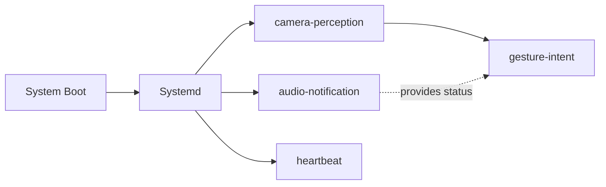

# R2D2 System Architecture Overview
**Date:** December 9, 2025 (Comprehensive Update)  
**Platform:** NVIDIA Jetson AGX Orin 64GB + ROS 2 Humble  
**Phase:** 1 - Perception, Face Recognition & Audio Notifications (Complete)  
**Latest Update:** December 18, 2025 - Gesture-controlled speech-to-speech operational

---

## Executive Summary

The R2D2 system is a modular ROS 2-based pipeline that captures video from an OAK-D Lite camera, processes frames in real-time, detects human faces, recognizes specific individuals, and provides gesture-controlled speech-to-speech conversations with audio/visual feedback through sophisticated state machines. The system prioritizes efficiency (15-25% CPU usage), conversation stability (SPEAKING state protection), and extensibility (easy to add new components).

**Current Processing Chain:**
```
OAK-D Lite → r2d2_camera node → /oak/rgb/image_raw (30 Hz)
             ↓
             r2d2_perception node:
             ├─ Downscale (1920×1080 → 640×360)
             ├─ Brightness computation → /r2d2/perception/brightness (13 Hz)
             ├─ Haar Cascade face detection → /r2d2/perception/face_count (13 Hz)
             └─ LBPH face recognition → /r2d2/perception/person_id (6.5 Hz, optional)
             ↓
             r2d2_audio package:
             ├─ audio_notification_node: State machine (RED/BLUE/GREEN)
             ├─ status_led_node: RGB LED visual feedback
             ├─ database_logger_node: Event logging
             └─ audio_beep_node: Simple beep demo
             ↓
             Web Dashboard (NEW):
             ├─ rosbridge_server: WebSocket bridge (port 9090)
             ├─ FastAPI web server: REST API + static files (port 8080)
             └─ HTML/JavaScript dashboard: Real-time monitoring & control
             ↓
             Downstream consumers (Phase 2: speech, Phase 3: navigation)
```

---

## 1. System-Level Architecture

### 1.1 Hardware Components

```
┌─────────────────────────────────────────────────────────────────┐
│                     PHYSICAL HARDWARE                           │
├─────────────────────────────────────────────────────────────────┤
│                                                                 │
│  ┌──────────────────┐              ┌──────────────────────┐   │
│  │  OAK-D Lite      │              │  NVIDIA Jetson       │   │
│  │  Camera          │──USB 3.0────▶│  AGX Orin 64GB       │   │
│  │                  │              │                      │   │
│  │ • RGB Sensor     │              │ • 12-core ARM CPU    │   │
│  │   1920×1080@30Hz │              │ • 504-core GPU       │   │
│  │ • Stereo Pair    │              │ • 64GB LPDDR5X RAM   │   │
│  │ • Depth Engine   │              │ • 100W TDP (variable)│   │
│  │ • Auto Focus     │              │ • Ubuntu 22.04       │   │
│  │                  │              │ • JetPack 6.x        │   │
│  │ Serial:          │              │ • ROS 2 Humble       │   │
│  │ 19443010E1D30C7E00               │                      │   │
│  └──────────────────┘              └──────────────────────┘   │
│                                                                 │
│  Connection: USB 3.0 (direct to Jetson, not through hub)      │
│  Power: Bus-powered from Jetson (500mA @ 5V)                  │
│  Status: Fully detected and operational                        │
│                                                                 │
└─────────────────────────────────────────────────────────────────┘
```

**Key Hardware Specs:**
- **Camera:** OAK-D Lite Auto Focus
  - RGB: 1280×1080 actual, 1920×1080 reported (includes padding)
  - Depth: Stereo depth with OV9782 pair
  - FPS: 30 (native camera rate)
  - Interface: USB 3.0 with USB-C connector
  - Processor: Intel Movidius MyriadX

- **Jetson AGX Orin:** NVIDIA's flagship edge AI platform
  - CPU: 12-core ARM Cortex-A78 @ 2.4 GHz
  - GPU: 504-core NVIDIA (can accelerate deep learning)
  - RAM: 64 GB LPDDR5X
  - Storage: Internal eMMC (~32GB usable after JetPack)
  - Thermal: Passive/active cooling (can sustain 100W)

### 1.2 Hardware Fixed Constants Reference

**Critical system constants (do not change without documentation update):**

| Constant | Value | Location/Usage | Notes |
|----------|-------|---------------|-------|
| **Platform** | NVIDIA Jetson AGX Orin 64GB | Hardware | ARM64 architecture (not x86) |
| **OS** | Ubuntu 22.04 Jammy | System | Jetson-specific L4T image |
| **ROS 2 Version** | Humble | Software stack | Required version for compatibility |
| **Python Version** | 3.10.6 | Runtime | System or venv |
| **Camera Model** | OAK-D Lite Auto Focus | Hardware | Luxonis depth camera |
| **Camera Serial** | 19443010E1D30C7E00 | Hardware identifier | Specific unit identifier |
| **Camera Resolution** | 1920×1080 | Camera config | Reported resolution (includes padding) |
| **Camera FPS** | 30 Hz | Camera config | Native camera rate |
| **Project Root** | `~/dev/r2d2` | File system | NOT /opt, NOT /home/user |
| **ROS 2 Workspace** | `~/dev/r2d2/ros2_ws` | File system | Standard ROS 2 workspace location |
| **Audio Output Pin** | J511 Pin 9 (HPO_L) | Hardware | I2S interface for audio output |
| **Audio Device** | `hw:1,0` | ALSA config | Audio hardware device identifier |
| **LED GPIO Pins** | 17 (RED), 27 (GREEN), 22 (BLUE) | Hardware | GPIO pin assignments for RGB LED |
| **Power Button GPIO** | Pin 32 (40-pin header) | Hardware | Shutdown control |
| **Boot/Wake Pin** | J42 Pin 4 (POWER) | Hardware | Boot/wake control |
| **OPENBLAS_CORETYPE** | ARMV8 | Environment | Critical for ARM64 (prevents "Illegal instruction") |
| **Face Recognition Model Path** | `~/dev/r2d2/data/face_recognition/models/severin_lbph.xml` | File system | Default model location |
| **Audio Assets Path** | `ros2_ws/src/r2d2_audio/r2d2_audio/assets/audio/` | File system | MP3 audio files location |

**Critical Environment Variables:**
- `OPENBLAS_CORETYPE=ARMV8` - **MUST** be set before ROS 2 commands (prevents crashes on ARM64)
- `ROS_DOMAIN_ID` - Optional, for ROS 2 network isolation

**For detailed hardware setup and troubleshooting, see:** [`000_INTERNAL_AGENT_NOTES.md`](000_INTERNAL_AGENT_NOTES.md)

---

### 1.3 Software Stack (Layered)

```
┌─────────────────────────────────────────────────────────────────┐
│                      APPLICATION LAYER                         │
│  ┌──────────────────────────────────────────────────────────┐  │
│  │  r2d2_perception (Python ROS 2 Node)                    │  │
│  │  └─ image_listener.py: 354 lines                        │  │
│  │     • Brightness computation                            │  │
│  │     • Haar Cascade face detection                       │  │
│  │     • LBPH face recognition (optional)                  │  │
│  │     • Gesture recognition (MediaPipe + SVM)             │  │
│  │     • Topic publishing (7 channels)                     │  │
│  └──────────────────────────────────────────────────────────┘  │
│  ┌──────────────────────────────────────────────────────────┐  │
│  │  r2d2_camera (Python ROS 2 Nodes)                       │  │
│  │  ├─ camera_node: OAK-D camera driver                    │  │
│  │  │  • Initializes DepthAI pipeline                      │  │
│  │  │  • Streams RGB frames at 30 FPS                      │  │
│  │  │  • Publishes /oak/rgb/image_raw                      │  │
│  │  └─ camera_stream_node: MJPEG stream server             │  │
│  │     • Subscribes to /oak/rgb/image_raw                  │  │
│  │     • Serves MJPEG stream via HTTP (port 8081)          │  │
│  │     • On-demand service (systemd)                       │  │
│  └──────────────────────────────────────────────────────────┘  │
│  ┌──────────────────────────────────────────────────────────┐  │
│  │  r2d2_hello (ROS 2 Nodes) [Basic Infrastructure]       │  │
│  │  ├─ heartbeat_node: Publish /r2d2/heartbeat (1 Hz)      │  │
│  │  │  • System health with metrics (CPU, GPU, temp)     │  │
│  │  │  • JSON format with system statistics               │  │
│  │  └─ beep_node: Alive signal demo                       │  │
│  └──────────────────────────────────────────────────────────┘  │
│  ┌──────────────────────────────────────────────────────────┐  │
│  │  r2d2_bringup (Launch Files)                           │  │
│  │  └─ r2d2_camera_perception.launch.py                   │  │
│  │     • Orchestrates camera + perception nodes           │  │
│  │     • Passes parameters to perception node             │  │
│  │     • Enables/disables face recognition                │  │
│  └──────────────────────────────────────────────────────────┘  │
│  ┌──────────────────────────────────────────────────────────┐  │
│  │  r2d2_audio (ROS 2 Package) [Audio & Status System]    │  │
│  │  ├─ audio_notification_node: Person recognition alerts │  │
│  │  │  • Subscribes to /r2d2/perception/person_id         │  │
│  │  │  • 3-state machine (RED/BLUE/GREEN)                 │  │
│  │  │  • MP3 audio alerts (recognition/loss)               │  │
│  │  │  • Publishes /r2d2/audio/person_status (JSON)       │  │
│  │  ├─ status_led_node: White LED control (GPIO)            │  │
│  │  │  • Visual feedback for recognition state             │  │
│  │  │  • ON=recognized, OFF=lost/unknown                   │  │
│  │  │  • GPIO pin 17 (Physical Pin 22)                     │  │
│  │  │  • Supports RGB mode for backward compatibility      │  │
│  │  ├─ database_logger_node: Event logging                │  │
│  │  │  • Tracks state transitions                          │  │
│  │  │  • Future: SQLite database integration              │  │
│  │  └─ audio_beep_node: Simple beep demo                  │  │
│  └──────────────────────────────────────────────────────────┘  │
│  ┌──────────────────────────────────────────────────────────┐  │
│  │  r2d2_gesture (ROS 2 Package) [Gesture Recognition]    │  │
│  │  └─ gesture_intent_node: Gesture-to-speech control      │  │
│  │     • Subscribes to /r2d2/perception/gesture_event      │  │
│  │     • Subscribes to /r2d2/audio/person_status           │  │
│  │     • Subscribes to /r2d2/speech/session_status         │  │
│  │     • Gating logic (person_status = RED)                │  │
│  │     • Gesture triggers (start/stop speech)              │  │
│  │     • Watchdog timer (35s auto-shutdown)                │  │
│  │     • Audio feedback (R2D2 beeps)                       │  │
│  │     • Service clients: start/stop_session               │  │
│  └──────────────────────────────────────────────────────────┘  │
│  ┌──────────────────────────────────────────────────────────┐  │
│  │  web_dashboard (Web Interface) [NEW]                   │  │
│  │  ├─ rosbridge_server: WebSocket bridge (port 9090)     │  │
│  │  │  • Exposes ROS 2 topics via WebSocket               │  │
│  │  │  • Real-time topic streaming                        │  │
│  │  ├─ FastAPI web server: REST API (port 8080)          │  │
│  │  │  • Service control (start/stop/restart)              │  │
│  │  │  • Volume control                                   │  │
│  │  │  • Training management                              │  │
│  │  │  • Static file serving                              │  │
│  │  ├─ Camera Stream Service: MJPEG server (port 8081)   │  │
│  │  │  • On-demand camera video stream                    │  │
│  │  │  • Toggleable from dashboard                        │  │
│  │  └─ HTML/JavaScript dashboard:                         │  │
│  │     • Real-time monitoring                             │  │
│  │     • Three-state visualization (RED/BLUE/GREEN)      │  │
│  │     • System health metrics (CPU, GPU, temperature)    │  │
│  │     • Camera stream viewer                             │  │
│  │     • Service control interface                        │  │
│  │     • Training interface (all 7 options)               │  │
│  │     • Star Wars themed UI (dark futuristic)            │  │
│  │     • Optimized for 1920x1200 single-page display       │  │
│  │     • Accessible via Tailscale VPN                     │  │
│  └──────────────────────────────────────────────────────────┘  │
├─────────────────────────────────────────────────────────────────┤
│                    ROS 2 HUMBLE LAYER                          │
│  • rclpy (Python client library)                              │
│  • sensor_msgs (Image message type)                           │
│  • std_msgs (Float32, Int32, String, Bool types)             │
│  • cv_bridge (ROS Image ↔ OpenCV conversion)                 │
│  • roslaunch (launch file system)                            │
├─────────────────────────────────────────────────────────────────┤
│                  COMPUTER VISION & PROCESSING                  │
│  • OpenCV (face detection, image manipulation)                │
│  • OpenCV contrib (LBPH face recognizer)                      │
│  • NumPy (numerical computing)                                │
│  • cv_bridge (image format conversion)                        │
├─────────────────────────────────────────────────────────────────┤
│                    HARDWARE ABSTRACTION                        │
│  • DepthAI SDK 2.31.0.0 (OAK-D camera interface)             │
│  • DepthAI Python bindings                                    │
│  • USB driver (kernel-level USB 3.0 support)                │
├─────────────────────────────────────────────────────────────────┤
│                    OPERATING SYSTEM                            │
│  • Ubuntu 22.04 Jammy (ARM64 aarch64)                        │
│  • Linux kernel 5.10.192-tegra (custom Jetson kernel)        │
│  • JetPack 6.x (NVIDIA system image)                         │
│  • CUDA 12.x + cuDNN (GPU acceleration, optional)            │
├─────────────────────────────────────────────────────────────────┤
│                  HARDWARE (Jetson AGX Orin)                    │
│  • 12-core ARM CPU + 504-core GPU                            │
│  • 64 GB LPDDR5X memory                                      │
│  • Internal eMMC storage                                      │
└─────────────────────────────────────────────────────────────────┘
```

---

## 2. Data Flow Architecture

### 2.1 Complete Message Flow (Simplified)

```
OAK-D Camera (30 Hz)
      ↓
r2d2_camera node
      ↓
/oak/rgb/image_raw (30 Hz)
      ↓
r2d2_perception node
      ├─ Downscale + Grayscale
      ├─ Brightness calculation → /r2d2/perception/brightness (13 Hz)
      ├─ Face detection → /r2d2/perception/face_count (13 Hz)
      ├─ Face recognition (optional) → /r2d2/perception/person_id (6.5 Hz)
      └─ Gesture recognition (when target person present) → /r2d2/perception/gesture_event (event-based)
      ↓
r2d2_audio package
      ├─ audio_notification_node: State machine → /r2d2/audio/person_status (10 Hz)
      ├─ status_led_node: LED control (GPIO)
      └─ database_logger_node: Event logging
      ↓
r2d2_gesture/gesture_intent_node (NEW)
      ├─ Gesture event processing (gated by person_status = "red")
      ├─ Watchdog timer (35s auto-shutdown when no person)
      ├─ Audio feedback (R2D2 beeps on start/stop)
      └─ Service calls to speech system (start/stop session)
      ↓
Downstream consumers (Phase 2: speech, Phase 3-4: navigation, memory)
```

### 2.2 Component Interaction Diagram

**Complete System Flow with Timing and Dependencies:**

```
┌─────────────────────────────────────────────────────────────────────────┐
│                    R2D2 SYSTEM ARCHITECTURE                             │
│                    Component Interaction & Data Flow                   │
└─────────────────────────────────────────────────────────────────────────┘

HARDWARE LAYER:
┌──────────────┐
│  OAK-D Lite  │ 30 FPS RGB frames (1920×1080)
│   Camera     │ USB 3.0 connection
└──────┬───────┘
       │
       ↓ [30 Hz raw frames]
       
ROS 2 NODE LAYER:
┌─────────────────────┐
│  r2d2_camera        │ Node: camera_node
│  (camera driver)    │ CPU: 2-3% (one core)
│                     │ Memory: ~50 MB
│  Publishes:         │ Frequency: 30 Hz
│  /oak/rgb/image_raw │ Message: sensor_msgs/Image
└──────┬──────────────┘
       │
       ↓ [30 Hz image stream]
       
┌─────────────────────┐
│  r2d2_perception    │ Node: image_listener
│  (image processing) │ CPU: 8-15% (one core)
│                     │ Memory: ~200 MB
│  Processing:        │ Frequency: 13 Hz (downscaled from 30 Hz)
│  • Downscale        │
│  • Grayscale        │
│  • Brightness       │
│  • Face detection   │
│  • Face recognition │ (optional, 6.5 Hz when enabled)
│                     │
│  Publishes:         │
│  • /r2d2/perception/brightness (13 Hz)      │
│  • /r2d2/perception/face_count (13 Hz)      │
│  • /r2d2/perception/person_id (6.5 Hz*)     │
│  • /r2d2/perception/face_confidence (6.5 Hz*)│
│  • /r2d2/perception/is_target_person (6.5 Hz*)     │
└──────┬──────────────┘
       │
       ↓ [6.5 Hz person_id stream]
       
┌─────────────────────┐
│  r2d2_audio          │ Package: r2d2_audio
│  (audio & status)    │
│                      │
│  ┌─────────────────────────────────────┐
│  │ audio_notification_node             │
│  │ CPU: 2-4% | Memory: ~50 MB          │
│  │ Frequency: 10 Hz (status publishing) │
│  │                                     │
│  │ Subscribes:                         │
│  │ • /r2d2/perception/person_id        │
│  │                                     │
│  │ State Machine:                      │
│  │ • RED (recognized)                 │
│  │ • BLUE (lost/idle)                 │
│  │ • GREEN (unknown person)            │
│  │                                     │
│  │ Publishes:                          │
│  │ • /r2d2/audio/person_status (10 Hz)│
│  │ • /r2d2/audio/notification_event   │
│  │                                     │
│  │ Actions:                            │
│  │ • MP3 audio alerts (ffplay)         │
│  └─────────────────────────────────────┘
│           │
│           ↓ [10 Hz status JSON]
│           
│  ┌─────────────────────────────────────┐
│  │ status_led_node                     │
│  │ CPU: <0.1% | Memory: ~20 MB         │
│  │ Frequency: 10 Hz (LED updates)      │
│  │                                     │
│  │ Subscribes:                         │
│  │ • /r2d2/audio/person_status         │
│  │                                     │
│  │ Controls:                           │
│  │ • GPIO Pin 17 (WHITE LED)          │
│  │ • Physical Pin 22 on 40-pin header │
│  │ • ON/OFF control for status        │
│  └─────────────────────────────────────┘
│           │
│           ↓ [10 Hz status JSON]
│           
│  ┌─────────────────────────────────────┐
│  │ database_logger_node                │
│  │ CPU: <0.1% | Memory: ~30 MB         │
│  │ Frequency: 10 Hz (event logging)     │
│  │                                     │
│  │ Subscribes:                         │
│  │ • /r2d2/audio/person_status         │
│  │                                     │
│  │ Logs:                               │
│  │ • State transitions                 │
│  │ • Recognition events                │
│  │ • (Future: SQLite database)         │
│  └─────────────────────────────────────┘
└─────────────────────────────────────────┘
       │
       ↓ [Status & events available]
       
FUTURE INTEGRATION POINTS (Phase 2-4):
┌─────────────────────┐
│  Phase 2: Speech     │ • Subscribe to /r2d2/audio/person_status
│  (STT-LLM-TTS)       │ • Subscribe to /r2d2/perception/person_id
│                     │ • Publish to /r2d2/cmd/* (commands)
└─────────────────────┘
┌─────────────────────┐
│  Phase 3: Navigation │ • Subscribe to /r2d2/perception/face_count
│  (SLAM, movement)    │ • Subscribe to /r2d2/cmd/* (commands)
│                     │ • Publish to /r2d2/cmd_vel
└─────────────────────┘

* Only published if enable_face_recognition=true
```

**Key Timing Relationships:**
- **Camera → Perception:** 30 Hz → 13 Hz (frame skipping for CPU efficiency)
- **Perception → Audio:** 6.5 Hz → 10 Hz (audio node publishes status faster than recognition rate)
- **Audio → LED/Logger:** 10 Hz → 10 Hz (synchronized updates)

---

### 2.3 ROS 2 Topic Reference

Complete list of all topics published:

```
TOPIC                                  TYPE                  FREQ   NOTES
─────────────────────────────────────────────────────────────────────────
PERCEPTION TOPICS:
/oak/rgb/image_raw                     sensor_msgs/Image     30 Hz  Raw camera
/r2d2/perception/brightness            std_msgs/Float32      13 Hz  Mean brightness
/r2d2/perception/face_count            std_msgs/Int32        13 Hz  Number of faces
/r2d2/perception/person_id             std_msgs/String       6.5 Hz* Person name
/r2d2/perception/face_confidence       std_msgs/Float32      6.5 Hz* Confidence score
/r2d2/perception/is_target_person            std_msgs/Bool         6.5 Hz* Target person present?
/r2d2/perception/gesture_event         std_msgs/String       Event** Gesture detected (index_finger_up, fist)

AUDIO & STATUS TOPICS:
/r2d2/audio/person_status              std_msgs/String       10 Hz  JSON status (RED/BLUE/GREEN)
/r2d2/audio/notification_event        std_msgs/String       Event  Recognition/loss events
/r2d2/audio/status                    std_msgs/String       Event  Audio system status
/r2d2/audio/beep_count                std_msgs/UInt32        Event  Beep counter
/r2d2/audio/last_frequency             std_msgs/Float32       Event  Last beep frequency

SYSTEM TOPICS:
/r2d2/heartbeat                        std_msgs/String       1 Hz   Health indicator (JSON with CPU/GPU/temp)

* Only published if enable_face_recognition=true
** Only published when target person is recognized (gated by person_status="red")
```

---

## 3. Node Architecture

### 3.1 Node Details

| Node | Package | Type | FPS In | FPS Out | CPU | Status |
|------|---------|------|--------|---------|-----|--------|
| **camera_node** | r2d2_camera | Sensor driver | N/A | 30 Hz | 2-3% | ✅ |
| **image_listener** | r2d2_perception | Computer vision | 30 Hz | 6 topics | 8-15% | ✅ |
| **heartbeat_node** | r2d2_hello | Health monitor + metrics | N/A | 1 Hz | <0.5% | ✅ |
| **camera_stream_node** | r2d2_camera | MJPEG stream server | 30 Hz | 15 FPS | 2-5% | ✅ |
| **audio_notification_node** | r2d2_audio | State machine | 6.5 Hz | 10 Hz | 2-4% | ✅ |
| **status_led_node** | r2d2_audio | GPIO control | 10 Hz | N/A | <0.1% | ✅ |
| **database_logger_node** | r2d2_audio | Event logging | 10 Hz | N/A | <0.1% | ✅ |
| **audio_beep_node** | r2d2_audio | Audio demo | N/A | Event | <0.1% | ✅ |
| **gesture_intent_node** | r2d2_gesture | Gesture-to-speech control | Event | Service calls | <1% | ✅ |

### 3.2 Launch Sequence

```
ros2 launch r2d2_bringup r2d2_camera_perception.launch.py
        ↓
r2d2_camera_perception.launch.py loads
        ↓
   ┌────┴─────────────────────┐
   ↓                           ↓
camera.launch.py      perception.launch.py
   ↓                           ↓
camera_node started    image_listener started
(1-2 sec to ready)     (waits for /oak/rgb/image_raw)
   ↓                           ↓
   └────┬─────────────────────┘
        ↓
   System Ready (5-7 sec total)
   All topics publishing
   Ready for subscribers
```

---

## 4. Audio Notification System & State Machine

### 4.1 Person Recognition State Machine

The `r2d2_audio` package implements a sophisticated 3-state recognition system:

```
┌─────────────────────────────────────────────────────────────┐
│              PERSON RECOGNITION STATE MACHINE                │
├─────────────────────────────────────────────────────────────┤
│                                                              │
│  🔴 RED STATE (Recognized)                                   │
│     • Target person is currently visible                     │
│     • Audio: "Hello!" MP3 plays on transition               │
│     • LED: Solid RED (GPIO pin 17)                          │
│     • Status: Active engagement                             │
│     • Transitions: → BLUE (after loss confirmation)          │
│                    → GREEN (if unknown person appears)      │
│                                                              │
│  🔵 BLUE STATE (Lost/Idle)                                   │
│     • No target person visible                              │
│     • Audio: "Oh, I lost you!" MP3 plays on transition     │
│     • LED: Solid BLUE (GPIO pin 22)                         │
│     • Status: Idle, waiting for recognition                  │
│     • Timing: 5s jitter tolerance + 15s confirmation        │
│     • Transitions: → RED (when target person detected)      │
│                    → GREEN (if unknown person appears)       │
│                                                              │
│  🟢 GREEN STATE (Unknown Person)                            │
│     • Face detected but not the target person               │
│     • Audio: Silent (no alerts)                             │
│     • LED: Solid GREEN (GPIO pin 27)                        │
│     • Status: Caution mode                                   │
│     • Transitions: → RED (if target person appears)         │
│                    → BLUE (if unknown person leaves)        │
│                                                              │
└─────────────────────────────────────────────────────────────┘
```

**State Machine Features:**
- **Jitter Tolerance:** 5-second window for brief interruptions (prevents false loss alerts)
- **Loss Confirmation:** 15-second confirmation window after jitter (total ~20s to loss alert)
- **Cooldown Periods:** 2s between recognition alerts, 5s quiet period after loss alert
- **Status Publishing:** JSON messages at 10 Hz for LED, database, and future dialogue system

**Status Message Format (JSON):**
```json
{
  "status": "red|blue|green",
  "person_identity": "target_person|no_person|unknown",
  "timestamp_sec": 1765212914,
  "timestamp_nanosec": 949382424,
  "confidence": 0.95,
  "duration_seconds": 15.3,
  "is_loss_state": false,
  "audio_event": "recognition|loss|none"
}
```

**For complete person recognition and status system setup, see:** [`100_PERSON_RECOGNITION_AND_STATUS.md`](100_PERSON_RECOGNITION_AND_STATUS.md) ⭐ **Complete Setup Guide**

### 4.2 Audio Notification Components

**audio_notification_node:**
- Subscribes to `/r2d2/perception/person_id`
- Implements 3-state machine (RED/BLUE/GREEN)
- Plays MP3 audio alerts via ffplay
- Publishes status JSON for downstream consumers
- Configurable parameters: volume, timing, audio files

**status_led_node:**
- Subscribes to `/r2d2/audio/person_status`
- Controls RGB LED via GPIO (pins 17, 27, 22)
- Real-time visual feedback synchronized with audio
- Auto-detects GPIO availability (simulation mode fallback)

**database_logger_node:**
- Subscribes to `/r2d2/audio/person_status`
- Logs state transitions to console (structure ready for SQLite)
- Tracks recognition events for conversation history
- Future: SQLite database for analytics and memory

**For complete system setup including audio, see:** [`100_PERSON_RECOGNITION_AND_STATUS.md`](100_PERSON_RECOGNITION_AND_STATUS.md)

---

## 5. Processing Pipeline

### 5.1 Step-by-Step Image Processing

```
Each frame (30 FPS):
  1. Receive /oak/rgb/image_raw
  2. Convert ROS Image → OpenCV (BGR array)
  3. Downscale 1920×1080 → 640×360 (4× size reduction)
  4. Convert to grayscale
  5. Compute brightness (mean pixel value)
  6. Detect faces (Haar Cascade)
  7. (If face_count > 0 AND recognition enabled AND skip counter met)
     → Extract face, resize to 100×100, run LBPH recognizer
  8. Publish all results on respective topics

Frame processing time: ~10 ms (without recognition)
                      ~25 ms (with recognition, when triggered)
```

### 5.2 Performance Characteristics & Resource Allocation

**Current Resource Usage (All Components Running):**

| Component | CPU Usage | Memory | GPU | Frequency | Notes |
|-----------|-----------|--------|-----|-----------|-------|
| **camera_node** | 2-3% (1 core) | ~50 MB | 0% | 30 Hz | Camera driver |
| **image_listener** | 8-15% (1 core) | ~200 MB | 0% | 13 Hz | Image processing |
| **audio_notification_node** | 2-4% (1 core) | ~50 MB | 0% | 10 Hz | State machine |
| **status_led_node** | <0.1% (1 core) | ~20 MB | 0% | 10 Hz | GPIO control |
| **database_logger_node** | <0.1% (1 core) | ~30 MB | 0% | 10 Hz | Event logging |
| **heartbeat_node** | <0.1% (1 core) | ~10 MB | 0% | 1 Hz | Health monitor |
| **System overhead** | 5-10% | ~140 MB | 0% | N/A | ROS 2, OS |
| **TOTAL** | **~15-25%** | **~500 MB** | **0%** | — | **All Phase 1 components** |

**Resource Headroom Available (for Phase 2-4):**

```
CPU:
  Total cores: 12 (ARM Cortex-A78)
  Used: ~1-2 cores (15-25% total)
  Available: ~10-11 cores (75-85% headroom)
  
Memory:
  Total: 64 GB LPDDR5X
  Used: ~500 MB (0.8%)
  Available: ~63.5 GB (99.2% headroom)
  
GPU:
  Total: 504 CUDA cores (Ampere architecture)
  Used: 0% (not accelerated yet)
  Available: 100% (full GPU available for Phase 2 LLM, Phase 3 SLAM)
  
Storage:
  Total: ~32 GB usable (eMMC)
  Used: ~5-10 GB (OS, ROS 2, models)
  Available: ~22-27 GB (sufficient for Phase 2-3 models)
```

**Performance Baselines (Expected Values):**

| Metric | Expected Value | Issue When | Notes |
|--------|---------------|------------|-------|
| Camera FPS | 30 Hz | <25 Hz | USB bandwidth or camera issue |
| Perception rate | 13 Hz | <10 Hz | CPU overload or frame processing issue |
| Face recognition rate | 6.5 Hz | <5 Hz | Recognition enabled but slow |
| Audio status rate | 10 Hz | <5 Hz | Audio node performance issue |
| CPU usage (total) | 15-25% | >50% | System overload, check processes |
| Memory usage | ~500 MB | >2 GB | Memory leak, check nodes |
| GPU usage | 0% | N/A | Not used in Phase 1 (available for Phase 2) |

**Timing Guarantees:**

| Data Flow | Latency | Notes |
|-----------|---------|-------|
| Camera → Perception | <33 ms | Frame-to-frame processing |
| Perception → Audio | <100 ms | Topic subscription + state update |
| Audio → LED | <100 ms | GPIO response time |
| Recognition → Alert | <200 ms | State transition to audio playback start |
| End-to-end (camera → alert) | <500 ms | Total system latency |

**For detailed performance analysis, see:** `_ANALYSIS_AND_DOCUMENTATION/COMPUTE_COST_ANALYSIS.md`

---

## 6. Launch Configuration

### 6.1 Launch Parameters (Perception Pipeline)

```
LAUNCH COMMAND:
  ros2 launch r2d2_bringup r2d2_camera_perception.launch.py [ARGS]

AVAILABLE PARAMETERS:
  enable_face_recognition        (bool, default: false)
  recognition_frame_skip         (int, default: 2)
  recognition_confidence_threshold (float, default: 70.0)
  face_recognition_model_path    (string, default: ~/dev/r2d2/data/...)
  enable_gesture_recognition     (bool, default: false)
  gesture_recognition_model_path (string, default: ~/dev/r2d2/data/gesture_recognition/models/...)
  gesture_confidence_threshold   (float, default: 0.7)
  gesture_frame_skip             (int, default: 5)
  log_every_n_frames            (int, default: 30)
  log_face_detections           (bool, default: false)
  save_debug_gray_frame         (bool, default: false)

EXAMPLES:
  # Default (no recognition)
  ros2 launch r2d2_bringup r2d2_camera_perception.launch.py
  
  # With recognition enabled
  ros2 launch r2d2_bringup r2d2_camera_perception.launch.py \
    enable_face_recognition:=true
  
  # With verbose logging
  ros2 launch r2d2_bringup r2d2_camera_perception.launch.py \
    enable_face_recognition:=true \
    log_every_n_frames:=10 \
    log_face_detections:=true
  
  # With gesture recognition enabled
  ros2 launch r2d2_bringup r2d2_camera_perception.launch.py \
    enable_face_recognition:=true \
    enable_gesture_recognition:=true \
    gesture_recognition_model_path:=/home/severin/dev/r2d2/data/gesture_recognition/models/severin_gesture_classifier.pkl
```

### 6.2 Launch Parameters (Audio Notification System)

**Audio Notification Node Parameters:**

```
LAUNCH COMMAND:
  ros2 launch r2d2_audio audio_notification.launch.py [ARGS]

AVAILABLE PARAMETERS:
  target_person                        (string, default: "target_person")
    → Person name to recognize and alert on (should match training data)
  
  audio_volume                         (float, default: 0.05)
    → Global volume control (0.0=silent, 0.05=5%, 1.0=max)
    → Controls ALL audio alerts (recognition + loss)
  
  jitter_tolerance_seconds             (float, default: 5.0)
    → Brief gap tolerance (ignores gaps < 5s during recognition)
    → Prevents false loss alerts from brief interruptions
  
  loss_confirmation_seconds            (float, default: 15.0)
    → Confirmation window AFTER jitter tolerance exceeded
    → Total time to loss alert: ~20s (5s jitter + 15s confirmation)
  
  cooldown_seconds                     (float, default: 2.0)
    → Minimum time between same alert type (prevents spam)
  
  recognition_cooldown_after_loss_seconds (float, default: 5.0)
    → Quiet period after loss alert (prevents rapid re-recognition beeps)
  
  recognition_audio_file               (string, default: "Voicy_R2-D2 - 2.mp3")
    → MP3 file for recognition alert ("Hello!")
  
  loss_audio_file                      (string, default: "Voicy_R2-D2 - 5.mp3")
    → MP3 file for loss alert ("Oh, I lost you!")
  
  enabled                              (bool, default: true)
    → Enable/disable audio notification system

EXAMPLES:
  # Default settings (5% volume, 15s loss confirmation)
  ros2 launch r2d2_audio audio_notification.launch.py
  
  # Higher volume, faster loss detection
  ros2 launch r2d2_audio audio_notification.launch.py \
    audio_volume:=0.3 \
    loss_confirmation_seconds:=10.0
  
  # Different target person (must match training data)
  ros2 launch r2d2_audio audio_notification.launch.py \
    target_person:=alice
```

**For complete parameter documentation, see:** [`100_PERSON_RECOGNITION_AND_STATUS.md`](100_PERSON_RECOGNITION_AND_STATUS.md) (Section: Configuration & Tuning)

### 6.2.5 Launch Parameters (Gesture Intent System)

**Gesture Intent Node Parameters:**

```
LAUNCH COMMAND:
  ros2 launch r2d2_gesture gesture_intent.launch.py [ARGS]

AVAILABLE PARAMETERS:
  enabled                              (bool, default: true)
    → Enable/disable gesture intent system
  
  cooldown_start_seconds               (float, default: 5.0)
    → Cooldown after start gesture (prevents rapid re-triggering)
  
  cooldown_stop_seconds                (float, default: 3.0)
    → Cooldown after stop gesture
  
  auto_shutdown_enabled                (bool, default: true)
    → Enable automatic speech shutdown when no person present
  
  auto_shutdown_timeout_seconds        (float, default: 35.0)
    → Seconds before auto-shutdown (default: 35 seconds)
  
  auto_restart_on_return               (bool, default: false)
    → Auto-restart speech when person returns
  
  audio_feedback_enabled               (bool, default: true)
    → Enable R2D2 beeps on session start/stop
  
  start_audio_file                     (string, default: "Voicy_R2-D2 - 16.mp3")
    → MP3 file for start beep
  
  stop_audio_file                      (string, default: "Voicy_R2-D2 - 20.mp3")
    → MP3 file for stop beep

EXAMPLES:
  # Default settings (35s watchdog, audio feedback enabled)
  ros2 launch r2d2_gesture gesture_intent.launch.py
  
  # Longer watchdog timeout, auto-restart enabled
  ros2 launch r2d2_gesture gesture_intent.launch.py \
    auto_shutdown_timeout_seconds:=300.0 \
    auto_restart_on_return:=true
  
  # Disable watchdog for always-on operation
  ros2 launch r2d2_gesture gesture_intent.launch.py \
    auto_shutdown_enabled:=false
```

**For complete gesture system documentation, see:** [`300_GESTURE_SYSTEM_OVERVIEW.md`](300_GESTURE_SYSTEM_OVERVIEW.md)

### 6.3 Complete Parameter Reference

**All Launch Parameters Across All Packages:**

| Package | Node | Parameter | Type | Default | Purpose |
|---------|------|-----------|------|---------|---------|
| **r2d2_perception** | image_listener | `enable_face_recognition` | bool | false | Enable LBPH recognition |
| | | `recognition_frame_skip` | int | 2 | Process every Nth frame (6.5 Hz) |
| | | `recognition_confidence_threshold` | float | 70.0 | Recognition threshold (lower = higher confidence) |
| | | `face_recognition_model_path` | string | ~/dev/r2d2/data/... | Path to LBPH model XML |
| | | `log_every_n_frames` | int | 30 | Logging frequency |
| | | `log_face_detections` | bool | false | Verbose face detection logging |
| | | `save_debug_gray_frame` | bool | false | Save one-time debug frame |
| | | `enable_gesture_recognition` | bool | false | Enable gesture recognition |
| | | `gesture_recognition_model_path` | string | ~/dev/r2d2/data/... | Path to gesture model PKL |
| | | `gesture_confidence_threshold` | float | 0.7 | Gesture confidence threshold |
| | | `gesture_frame_skip` | int | 5 | Process every Nth frame for gestures |
| **r2d2_audio** | audio_notification_node | `target_person` | string | "target_person" | Person to recognize |
| | | `audio_volume` | float | 0.30 | Global volume (0.0-1.0) |
| | | `jitter_tolerance_seconds` | float | 5.0 | Brief gap tolerance |
| | | `loss_confirmation_seconds` | float | 15.0 | Loss confirmation window |
| | | `cooldown_seconds` | float | 2.0 | Min between alerts |
| | | `recognition_cooldown_after_loss_seconds` | float | 5.0 | Quiet period after loss |
| | | `recognition_audio_file` | string | "Voicy_R2-D2 - 2.mp3" | Recognition MP3 |
| | | `loss_audio_file` | string | "Voicy_R2-D2 - 5.mp3" | Loss MP3 |
| | | `enabled` | bool | true | Enable/disable system |
| **r2d2_gesture** | gesture_intent_node | `enabled` | bool | true | Enable gesture intent system |
| | | `cooldown_start_seconds` | float | 5.0 | Cooldown after start gesture |
| | | `cooldown_stop_seconds` | float | 3.0 | Cooldown after stop gesture |
| | | `auto_shutdown_enabled` | bool | true | Enable auto-shutdown watchdog |
| | | `auto_shutdown_timeout_seconds` | float | 35.0 | Auto-shutdown timeout (35s) |
| | | `auto_restart_on_return` | bool | false | Auto-restart when person returns |
| | | `audio_feedback_enabled` | bool | true | Enable R2D2 beeps |
| | | `audio_volume` | float | 0.30 | Global volume for gesture beeps (0.0-1.0) |
| **r2d2_speech** | speech_node | `realtime_voice` | string | 'sage' | Voice selection (alloy, echo, fable, onyx, nova, shimmer, sage) |
| | | `instructions` | string | 'You are the R2D2 robot...' | Assistant personality/instructions (system prompt) |

**Parameter Tuning Guidelines:**

**Face Recognition:**
- **CPU Optimization:** Increase `recognition_frame_skip` (e.g., 3 or 4) to reduce CPU usage
- **Accuracy vs Speed:** Lower `recognition_confidence_threshold` (e.g., 60.0) for more detections but more false positives
- **Audio Responsiveness:** Lower `loss_confirmation_seconds` (e.g., 10.0) for faster loss alerts
- **False Alarm Prevention:** Increase `jitter_tolerance_seconds` (e.g., 7.0) for noisy environments

**Gesture Recognition:**
- **CPU Optimization:** Increase `gesture_frame_skip` (e.g., 7 or 10) for lower CPU usage
- **Accuracy:** Lower `gesture_confidence_threshold` (e.g., 0.6) for more sensitive detection
- **Responsiveness:** Lower `cooldown_start_seconds` (e.g., 3.0) for faster gesture recognition
- **Cost Optimization:** Adjust `auto_shutdown_timeout_seconds` (e.g., 60.0 for 1 min, 300.0 for 5 min)

---

## 6.3.1 System Configuration Guide

This section explains how to customize the three main system parameters: **audio volume**, **voice selection**, and **assistant personality instructions**.

### Audio Volume Configuration

The R2D2 system uses a centralized audio volume parameter that controls all audio feedback including recognition beeps, loss alerts, and gesture start/stop beeps.

#### Current Configuration

**Centralized Config File:** `ros2_ws/src/r2d2_audio/config/audio_params.yaml`

```yaml
/**:
  ros__parameters:
    audio_volume: 0.30  # Global volume for all audio feedback (0.0-1.0)
```

**Current Volume:** 0.30 (30% volume)

**Controls:**
- Recognition beep ("Hello!") - Voicy_R2-D2 - 2.mp3
- Loss alert ("Oh, I lost you!") - Voicy_R2-D2 - 5.mp3
- Gesture start beep - Voicy_R2-D2 - 16.mp3
- Gesture stop beep - Voicy_R2-D2 - 20.mp3

#### How to Change Audio Volume

**Important:** Due to the way systemd services start nodes directly (not via launch files), you must update **3 locations** to keep the system consistent.

##### Step 1: Edit Centralized Config File (Primary)

```bash
nano ~/dev/r2d2/ros2_ws/src/r2d2_audio/config/audio_params.yaml
```

Change line 7:
```yaml
audio_volume: 0.30  # Change to your desired value
```

**Recommended values:**
- `0.02` = 2% (very quiet, subtle)
- `0.05` = 5% (quiet, unobtrusive)
- `0.30` = 30% (medium, clear) ← **Current**
- `0.50` = 50% (loud, assertive)
- `1.00` = 100% (maximum)

##### Step 2: Edit Audio Notification Node Default

```bash
nano ~/dev/r2d2/ros2_ws/src/r2d2_audio/r2d2_audio/audio_notification_node.py
```

Find line 87 and update to match your config file:
```python
self.declare_parameter('audio_volume', 0.30)  # Match config file value
```

##### Step 3: Edit Gesture Intent Node Default

```bash
nano ~/dev/r2d2/ros2_ws/src/r2d2_gesture/r2d2_gesture/gesture_intent_node.py
```

Find line 61 and update to match your config file:
```python
self.declare_parameter('audio_volume', 0.30)  # Match config file value
```

##### Step 4: Rebuild and Restart

```bash
# Rebuild packages
cd ~/dev/r2d2/ros2_ws
source /opt/ros/humble/setup.bash
colcon build --packages-select r2d2_audio r2d2_gesture --symlink-install

# Restart services
sudo systemctl restart r2d2-audio-notification.service
sudo systemctl restart r2d2-gesture-intent.service

# Verify (wait 3 seconds for services to start)
sleep 3
systemctl is-active r2d2-audio-notification.service r2d2-gesture-intent.service
```

##### Step 5: Verify Volume

```bash
cd ~/dev/r2d2/ros2_ws && source install/setup.bash

# Check both nodes are using correct volume
ros2 param get /audio_notification_node audio_volume
ros2 param get /gesture_intent_node audio_volume

# Both should show your new value (e.g., 0.30)
```

#### Runtime Volume Override (Temporary)

You can change volume without restarting for testing:

```bash
# Set volume for individual nodes (temporary, lost on restart)
ros2 param set /audio_notification_node audio_volume 0.5
ros2 param set /gesture_intent_node audio_volume 0.5
```

#### Testing Audio Volume

Test all beeps at your configured volume:

```bash
cd ~/dev/r2d2/ros2_ws/src/r2d2_audio/r2d2_audio/assets/audio

# Replace 0.30 with your volume value
VOLUME=0.30

# Test all 4 beeps
echo "1. Recognition beep..." && ffplay -nodisp -autoexit -loglevel error -af volume=$VOLUME Voicy_R2-D2\ -\ 2.mp3
echo "2. Loss beep..." && ffplay -nodisp -autoexit -loglevel error -af volume=$VOLUME Voicy_R2-D2\ -\ 5.mp3
echo "3. Start beep..." && ffplay -nodisp -autoexit -loglevel error -af volume=$VOLUME Voicy_R2-D2\ -\ 16.mp3
echo "4. Stop beep..." && ffplay -nodisp -autoexit -loglevel error -af volume=$VOLUME Voicy_R2-D2\ -\ 20.mp3
```

---

### Voice Selection Configuration

The speech system uses OpenAI's Realtime API with 7 different voice options. The voice controls **how the AI sounds** (pitch, tone, accent), while instructions control **what it says** (personality, word choice).

#### Available Voices

| Voice | Characteristics | Best For |
|-------|----------------|----------|
| `alloy` | Neutral, balanced | General purpose |
| `echo` | Warm, friendly | Customer service |
| `fable` | Expressive, storytelling | Narrative content |
| `onyx` | Deep, authoritative | Professional, announcements |
| `nova` | Bright, energetic | Upbeat interactions |
| `shimmer` | Soft, gentle | Calming, relaxation |
| `sage` | **Slightly synthetic, robotic** | **R2-D2 (Current)** ✅ |

**Current Configuration:** `sage` (best for robot personality)

#### How to Change Voice

**Important:** Voice is configured in **4 locations**. Update all 4 for consistency.

##### Step 1: Edit ROS2 Parameter File (Primary Configuration)

```bash
nano ~/dev/r2d2/ros2_ws/src/r2d2_speech/config/speech_params.yaml
```

Change line 6:
```yaml
realtime_voice: 'sage'  # Change to: alloy, echo, fable, onyx, nova, shimmer, or sage
```

##### Step 2: Edit Speech Node Default Parameter

```bash
nano ~/dev/r2d2/ros2_ws/src/r2d2_speech/r2d2_speech_ros/speech_node.py
```

Find line 47 and update:
```python
self.declare_parameter('realtime_voice', 'sage')  # Match YAML config
```

##### Step 3: Edit Launch File Default Argument

```bash
nano ~/dev/r2d2/ros2_ws/src/r2d2_speech/launch/speech_node.launch.py
```

Find line ~33 and update the default_value in the `DeclareLaunchArgument` for voice (if present).

##### Step 4: Edit Realtime Client Default

```bash
nano ~/dev/r2d2/r2d2_speech/realtime/realtime_client.py
```

Find line 41 and update:
```python
voice: str = "sage"  # Match YAML config
```

##### Step 5: Restart Speech System

```bash
# If using systemd service
sudo systemctl restart r2d2-speech-node.service

# Or if running manually
bash ~/dev/r2d2/launch_ros2_speech.sh
```

#### Voice Examples

**Example 1: Friendly Companion (Nova)**
```yaml
realtime_voice: 'nova'
```
Bright, energetic voice for upbeat interactions.

**Example 2: Professional Assistant (Onyx)**
```yaml
realtime_voice: 'onyx'
```
Deep, authoritative voice for professional interactions.

**Example 3: Warm & Friendly (Echo)**
```yaml
realtime_voice: 'echo'
```
Warm, friendly voice for customer service style.

---

### Assistant Instructions Configuration

Instructions define the AI's **personality, speaking style, and behavior**. This is the system prompt sent to OpenAI GPT-4o that guides response generation.

#### Current R2-D2 Instructions

```
You are the R2D2 robot from the Star Wars Movie. 
Speak with a slightly synthetic, system-like delivery. 
Use short, precise sentences. 
Fast-paced, efficient cadence. 
Recognize emotions internally, but keep vocal emotional inflection minimal. 
Clear, clipped articulation. 
Avoid unnecessary pauses. 
Sound efficient and machine-like.
```

**Effect:**
- Word choice: Technical, precise
- Sentence structure: Short, efficient
- Tone: Minimal emotion, system-like
- Cadence: Fast-paced, no pauses

#### How to Change Instructions

**Important:** Instructions are configured in **4 locations**. Update all 4 for consistency.

##### Step 1: Edit ROS2 Parameter File (Primary Configuration)

```bash
nano ~/dev/r2d2/ros2_ws/src/r2d2_speech/config/speech_params.yaml
```

Change line 19 (the instructions field):
```yaml
instructions: 'Your new personality instructions here...'
```

##### Step 2: Edit Speech Node Default Parameter

```bash
nano ~/dev/r2d2/ros2_ws/src/r2d2_speech/r2d2_speech_ros/speech_node.py
```

Find line 54 and update:
```python
self.declare_parameter('instructions', 'Your new personality instructions...')
```

##### Step 3: Edit Launch File Default Argument

```bash
nano ~/dev/r2d2/ros2_ws/src/r2d2_speech/launch/speech_node.launch.py
```

Find lines 33-35 and update the default_value:
```python
instructions_arg = DeclareLaunchArgument(
    'instructions', 
    default_value='Your new personality instructions...',
    description='System instructions')
```

##### Step 4: Edit Realtime Client Default

```bash
nano ~/dev/r2d2/r2d2_speech/realtime/realtime_client.py
```

Find line 101 and update:
```python
instructions: str = "Your new personality instructions..."
```

##### Step 5: Restart Speech System

```bash
# If using systemd service
sudo systemctl restart r2d2-speech-node.service

# Verify speech node is active
ros2 lifecycle get /speech_node
# Should show: active [3]
```

#### Instructions Examples

**Example 1: Friendly Companion Robot**
```yaml
instructions: 'You are a friendly companion robot. Be warm and encouraging. Use casual language. Show enthusiasm. Keep responses conversational and upbeat. Make the user feel welcomed and supported.'
```

**Example 2: Professional Butler Robot**
```yaml
instructions: 'You are a professional butler robot. Speak formally and politely. Use complete sentences with proper grammar. Maintain a respectful, service-oriented tone. Be helpful and attentive. Address users with courtesy.'
```

**Example 3: Technical Support Robot**
```yaml
instructions: 'You are a technical support robot. Speak clearly and precisely. Use appropriate technical terminology. Provide step-by-step instructions. Be patient, thorough, and methodical. Confirm understanding before proceeding.'
```

**Example 4: Star Wars R2-D2 (Current)**
```yaml
instructions: 'You are the R2D2 robot from the Star Wars Movie. Speak with a slightly synthetic, system-like delivery. Use short, precise sentences. Fast-paced, efficient cadence. Recognize emotions internally, but keep vocal emotional inflection minimal. Clear, clipped articulation. Avoid unnecessary pauses. Sound efficient and machine-like.'
```

#### Voice vs Instructions: Key Differences

| Aspect | Voice | Instructions |
|--------|-------|--------------|
| **Controls** | Audio characteristics | Content and style |
| **Examples** | Pitch, tone, accent | Word choice, personality |
| **Parameter** | `realtime_voice` | `instructions` |
| **Values** | alloy/echo/fable/onyx/nova/shimmer/sage | Free-form text prompt |
| **Effect** | How it sounds | What it says |
| **Changed by** | Voice selection | Prompt engineering |

**Important:** Both work together to create the complete personality!
- **Voice:** "sage" = slightly robotic sound (audio characteristics)
- **Instructions:** R2-D2 character = what it says and how it phrases things (content)

#### Dynamic Instructions Update (Running Session)

Update instructions without restarting for testing:

```bash
# Update instructions on active session (temporary, lost on restart)
ros2 topic pub --once /r2d2/speech/assistant_prompt std_msgs/String \
  "data: 'You are a pirate robot. Speak like a pirate but be efficient.'"
```

**Note:** Dynamic updates only affect current session. Changes are lost on restart.

#### Testing Your Changes

After modifying voice or instructions:

```bash
# Start speech system (if not running)
sudo systemctl start r2d2-speech-node.service

# Trigger conversation with index finger gesture
# Or call service manually:
ros2 service call /r2d2/speech/start_session std_srvs/srv/Trigger

# Speak test questions:
# - "Hello, who are you?" (Tests identity/personality)
# - "Tell me about yourself" (Tests character depth)
# - "How are you feeling today?" (Tests emotional response)
```

#### Configuration Best Practices

1. **Keep consistent:** Update all locations (3 for audio, 4 for voice/instructions)
2. **Test first:** Use runtime overrides (`ros2 param set`) to test before making permanent
3. **Document changes:** Note why you chose specific settings in config comments
4. **Back up configs:** Keep copies of working configurations before major changes
5. **Verify after restart:** Always verify parameters with `ros2 param get` after restart

#### Quick Reference Commands

```bash
# Check current audio volume
ros2 param get /audio_notification_node audio_volume
ros2 param get /gesture_intent_node audio_volume

# Check current voice
grep realtime_voice ~/dev/r2d2/ros2_ws/src/r2d2_speech/config/speech_params.yaml

# Check current instructions
grep instructions ~/dev/r2d2/ros2_ws/src/r2d2_speech/config/speech_params.yaml

# Update instructions dynamically (temporary)
ros2 topic pub --once /r2d2/speech/assistant_prompt std_msgs/String \
  "data: 'New instructions here'"

# Test audio at specific volume
VOLUME=0.30  # Your test volume
ffplay -nodisp -autoexit -loglevel error -af volume=$VOLUME \
  ~/dev/r2d2/ros2_ws/src/r2d2_audio/r2d2_audio/assets/audio/Voicy_R2-D2\ -\ 2.mp3
```

#### Troubleshooting Configuration Changes

**Issue: Volume didn't change after editing config file**

**Solution:**
1. Verify all 3 locations match (config + 2 node files)
2. Rebuild packages: `colcon build --packages-select r2d2_audio r2d2_gesture --symlink-install`
3. Restart services: `sudo systemctl restart r2d2-audio-notification.service r2d2-gesture-intent.service`
4. Verify: `ros2 param get /audio_notification_node audio_volume`

**Issue: Voice didn't change**

**Solution:**
1. Verify all 4 locations match (YAML + speech_node.py + launch file + realtime_client.py)
2. Restart speech: `sudo systemctl restart r2d2-speech-node.service`
3. Start new session: Old sessions keep old voice, make fist and restart with finger

**Issue: Instructions not working**

**Solution:**
1. Check all 4 locations have matching instructions
2. Restart speech system
3. Verify in logs: `sudo journalctl -u r2d2-speech-node.service | grep instructions`

---

## 6.4 Gesture Recognition System Overview

The gesture recognition system enables camera-based hand gesture control for conversation triggering:

**Architecture:**
- **Training:** Person-specific gesture models (index finger up, fist)
- **Recognition:** MediaPipe Hands + SVM classifier
- **Integration:** Gated by person recognition (only works for target person)
- **Control:** Start/stop speech service via gestures
- **Watchdog:** Auto-shutdown after 35s no person presence (configurable)
- **Feedback:** R2D2 beeps on session start/stop

**Training Workflow:**
1. Train face recognition for person (option 1 in `train_manager.py`)
2. Train gestures for same person (option 8 in `train_manager.py`)
3. Deploy models to perception pipeline
4. Launch gesture intent node
5. Use gestures to control speech service

**Gating Logic:**
- Gestures only recognized when person status = "RED" (target person detected)
- Start gesture only works when speech service is inactive
- Stop gesture only works when speech service is active
- Cooldown periods prevent rapid re-triggering

**For complete documentation, see:**
- [`300_GESTURE_SYSTEM_OVERVIEW.md`](300_GESTURE_SYSTEM_OVERVIEW.md) - Complete system architecture
- [`303_GESTURE_TRAINING_GUIDE.md`](303_GESTURE_TRAINING_GUIDE.md) - User training guide
- [`250_PERSON_MANAGEMENT_SYSTEM_REFERENCE.md`](250_PERSON_MANAGEMENT_SYSTEM_REFERENCE.md) - Person entity management

---

## 6.5 Production Deployment (Auto-Start Services)

The R2D2 system is configured for automatic startup on boot via systemd services.

### Enabled Services (Auto-Start on Boot)

**Essential Services:**
- `r2d2-camera-perception.service` - Camera + Face + Gesture Recognition
- `r2d2-audio-notification.service` - Audio alerts + LED
- `r2d2-gesture-intent.service` - Gesture-to-speech control
- `r2d2-heartbeat.service` - System health monitoring

**Service Dependencies:**


**Control Commands:**
```bash
# Check status of all services
sudo systemctl status r2d2-camera-perception.service
sudo systemctl status r2d2-audio-notification.service
sudo systemctl status r2d2-gesture-intent.service

# Enable auto-start on boot
sudo systemctl enable r2d2-camera-perception.service
sudo systemctl enable r2d2-audio-notification.service
sudo systemctl enable r2d2-gesture-intent.service

# Start services manually
sudo systemctl start r2d2-camera-perception.service
sudo systemctl start r2d2-gesture-intent.service

# Stop services
sudo systemctl stop r2d2-gesture-intent.service
sudo systemctl stop r2d2-camera-perception.service

# View logs
sudo journalctl -u r2d2-gesture-intent.service -f
sudo journalctl -u r2d2-camera-perception.service -f
```

**Post-Reboot Verification:**
```bash
# Wait 60 seconds after boot
sleep 60

# Check all services are running
sudo systemctl status r2d2-camera-perception.service
sudo systemctl status r2d2-gesture-intent.service
sudo systemctl status r2d2-audio-notification.service

# All should show: active (running)

# Test gesture recognition
ros2 topic echo /r2d2/perception/gesture_event
# Stand in front of camera and make gestures
```

---

## 7. Hardware Control Systems

### 7.1 Power Button System

The R2D2 system includes a power button control system for graceful shutdown and wake:

**Button 1 (Shutdown):**
- **GPIO Pin:** 32 (40-pin expansion header)
- **Function:** Press to initiate graceful shutdown
- **Action:** `shutdown -h now`
- **Status:** ✅ Tested and operational
- **Service:** `r2d2-powerbutton.service` (systemd)

**Button 2 (Boot/Wake):**
- **Location:** J42 Automation Header
- **Pins:** Pin 4 (POWER) + Pin 1 (GND)
- **Function:** Short pins to wake from low-power or boot from shutdown
- **Status:** Ready for testing

**For detailed power button documentation, see:** [`080_POWER_BUTTON_FINAL_DOCUMENTATION.md`](080_POWER_BUTTON_FINAL_DOCUMENTATION.md)

### 7.2 Audio Hardware

**Audio Output:**
- **Amplifier:** PAM8403 (3W stereo)
- **Speaker:** 8Ω speaker
- **Interface:** I2S via Jetson J511 Pin 9 (HPO_L)
- **ALSA Device:** `hw:1,0`
- **Status:** ✅ Operational

**Audio Input (Phase 2):**
- **Hardware:** ReSpeaker 2-Mic HAT
- **Status:** ⏳ Ordered, pending integration
- **For setup documentation, see:** [`050_AUDIO_SETUP_AND_CONFIGURATION.md`](050_AUDIO_SETUP_AND_CONFIGURATION.md)

### 7.3 Status LED Hardware

**White LED Panel (Current):**
- **Type:** Non-addressable white LED array (16 SMD LEDs)
- **Voltage:** 3V DC
- **Current:** 20-50mA total
- **Control:** Simple on/off via GPIO 17 (Physical Pin 22 on 40-pin header)
- **Connector:** 3 wires (Red=3.3V, Blue=GPIO17, Black=GND)
- **Status:** ✅ Operational
- **Wiring:**
  - Red wire → Pin 1 or 17 (3.3V)
  - Blue wire → Pin 22 (GPIO 17)
  - Black wire → Pin 6 (GND)
- **State Mapping:**
  - RED state (recognized): LED ON
  - BLUE state (lost): LED OFF
  - GREEN state (unknown): LED OFF

**RGB LED Panel (Future):**
- **Type:** Addressable RGB LED strip (WS2812B, ~24-30 LEDs)
- **Voltage:** 5V DC
- **Control:** Single-wire serial protocol (data pin)
- **Status:** ⏳ Reserved for future advanced patterns
- **Connector:** 3 pins (+5V, GND, Data)

**For detailed LED wiring documentation, see:** [`HARDWARE_WHITE_LED_WIRING.md`](HARDWARE_WHITE_LED_WIRING.md)

### 7.4 Person Management System

The R2D2 system includes a centralized person entity management system for linking face recognition, gesture recognition, and future Google account integration:

**Core Components:**
- **Person Registry:** SQLite database (`data/persons.db`)
- **Person Manager CLI:** `tests/face_recognition/person_manager.py`
- **Training Integration:** Auto-registration in `train_manager.py`
- **Status:** ✅ Operational

**Purpose:**
- Manage persons as first-class entities
- Link face recognition and gesture recognition models to persons
- Prepare for Google account integration (Phase 2)
- Provide extensible person metadata storage
- Enable multi-user support

**Database Schema:**
- UUID-based person IDs
- Links to face/gesture models
- Forward-compatible with explicit SQL queries (no `SELECT *`)
- Extensible JSON metadata field
- Google account field (reserved for future use)

**Features:**
- Auto-registration during training
- Manual person management via CLI
- Model migration for existing data
- CRUD operations for person entities
- Extensible for future features (OAuth, preferences, cloud sync)

**For complete details, see:** [`250_PERSON_MANAGEMENT_SYSTEM_REFERENCE.md`](250_PERSON_MANAGEMENT_SYSTEM_REFERENCE.md)

---

## 8. Web Dashboard System

### 8.1 Overview

The R2D2 web dashboard provides a graphical interface for monitoring and controlling the R2D2 system remotely via Tailscale VPN. It offers real-time monitoring, service control, volume adjustment, and complete face recognition training integration.

**Access:** `http://100.95.133.26:8080` (via Tailscale VPN)

**Key Features:**
- Real-time person recognition status (RED/BLUE/GREEN)
- System health monitoring (CPU, GPU, temperature via heartbeat)
- Camera stream viewer (on-demand MJPEG)
- Service control (start/stop/restart)
- Audio volume control
- Face recognition training interface
- Live event stream
- System metrics display
- Star Wars themed UI (dark futuristic design)
- Optimized for 1920x1200 single-page display

### 8.2 Architecture

```
Browser (Windows Laptop)
    ↓ (Tailscale VPN)
FastAPI Web Server (Port 8080)
    ├─ REST API (service control, volume, training)
    ├─ Static file serving (HTML/CSS/JS)
    └─ WebSocket (training logs)
    ↓
Camera Stream Service (Port 8081)
    └─ MJPEG HTTP stream
    ↓
rosbridge_server (Port 9090)
    └─ WebSocket bridge to ROS 2 topics
    ↓
ROS 2 Topics
    ├─ /r2d2/perception/person_id
    ├─ /r2d2/audio/person_status
    ├─ /r2d2/perception/face_count
    └─ /r2d2/heartbeat (system metrics)
```

### 8.3 Components

**Backend:**
- `web_dashboard/app/main.py` - FastAPI application
- `web_dashboard/app/api/` - REST API endpoints
- `web_dashboard/app/services/` - Service managers (systemd, ROS 2, training)

**Frontend:**
- `web_dashboard/app/templates/index.html` - Main dashboard page
- `web_dashboard/app/static/css/dashboard.css` - Styling
- `web_dashboard/app/static/js/dashboard.js` - Dashboard logic

**Infrastructure:**
- `rosbridge_server` - ROS 2 WebSocket bridge
- `systemd` - Service management
- `camera_stream_node` - MJPEG video stream server
- `heartbeat_node` - System health monitoring with metrics

### 8.4 API Endpoints

**Services:**
- `GET /api/services/status` - All services status
- `POST /api/services/{service}/start` - Start service
- `POST /api/services/{service}/stop` - Stop service
- `POST /api/services/{service}/restart` - Restart service

**Audio:**
- `GET /api/audio/volume` - Get volume
- `POST /api/audio/volume` - Set volume (0.0-1.0)

**Training:**
- `POST /api/training/capture` - Start image capture
- `POST /api/training/add_pictures` - Add more pictures
- `POST /api/training/retrain` - Retrain model
- `GET /api/training/list` - List all people/models
- `DELETE /api/training/{person_name}` - Delete person
- `GET /api/training/status/{task_id}` - Get training status

**New Features (December 2025):**
- ✅ **System Health Monitoring:** Enhanced heartbeat service with CPU/GPU/temperature metrics
- ✅ **Camera Stream Service:** On-demand MJPEG video stream (port 8081)
- ✅ **Star Wars UI Theme:** Dark futuristic design optimized for 1920x1200 display
- ✅ **Single-Page Layout:** All content fits on one screen without scrolling

**For complete documentation, see:** 
- [`111_WEB_DASHBOARD_DOCUMENTATION.md`](111_WEB_DASHBOARD_DOCUMENTATION.md) - Complete dashboard documentation
- [`110_WEB_UI_ARCHITECTURE_AND_INTEGRATION.md`](110_WEB_UI_ARCHITECTURE_AND_INTEGRATION.md) - Architecture and integration guide

---

## 9. Integration Points for Future Features

### 9.1 Integration Points for Phase 2-4

**Where to Hook In New Components:**

The architecture provides clear integration points for future development:

1. **Perception Topics** (for context-aware features):
   - `/r2d2/perception/person_id` - Who is present?
   - `/r2d2/perception/face_count` - How many people?
   - `/r2d2/perception/brightness` - Lighting conditions
   - `/r2d2/audio/person_status` - Recognition state (RED/BLUE/GREEN)

2. **Command Topics** (for robot actions):
   - `/r2d2/cmd/*` - Future command topics (follow_person, navigate_to, etc.)
   - `/r2d2/cmd_vel` - Movement commands (geometry_msgs/Twist)

3. **Status Topics** (for system health):
   - `/r2d2/heartbeat` - System health indicator with metrics (CPU%, GPU%, temperature)

**Template for Adding New Nodes:**

```python
from rclpy.node import Node
from std_msgs.msg import String, Float32
import json

class MyNewPhase2Node(Node):
    def __init__(self):
        super().__init__('my_phase2_node')
        
        # Subscribe to existing perception/audio topics
        self.person_sub = self.create_subscription(
            String, '/r2d2/perception/person_id',
            self.person_callback, 10)
        
        self.status_sub = self.create_subscription(
            String, '/r2d2/audio/person_status',
            self.status_callback, 10)
        
        # Publish new results
        self.output_pub = self.create_publisher(
            String, '/r2d2/my_subsystem/output', 10)
    
    def person_callback(self, msg):
        """Handle person recognition updates"""
        person_id = msg.data
        # Your logic here
    
    def status_callback(self, msg):
        """Handle status updates (RED/BLUE/GREEN)"""
        status_data = json.loads(msg.data)
        # Your logic here
```

**For detailed integration guide, see:** [007_SYSTEM_INTEGRATION_REFERENCE.md](007_SYSTEM_INTEGRATION_REFERENCE.md)

### 9.2 Adding Phase 2 Components (Speech/Conversation)

**Phase 2 Architecture (Hybrid Approach):**

Phase 2 uses a **hybrid architecture** where the speech pipeline runs as a **non-ROS daemon** for low latency, and only discrete commands are published to ROS 2:

```
ReSpeaker 2-Mic HAT
    ↓
Microphone Manager (Python daemon, NOT ROS)
    ├─ Wake word detection: "Hey R2D2" (Porcupine)
    ├─ Audio recording: ring buffer
    ↓
Speech-to-Text (STT): Whisper (local, GPU-accelerated)
    ↓
LLM Processing: Grok API (cloud) or Ollama (local fallback)
    ├─ Parse user intent
    ├─ Generate conversational response
    └─ Detect commands: "come to me", "go to X"
    ↓
Text-to-Speech (TTS): gTTS or Coqui TTS
    ↓
COMMAND EXTRACTION (only discrete actions go to ROS)
    ├─ IF "come to me" → publish /r2d2/cmd/follow_person
    ├─ IF "go to living room" → publish /r2d2/cmd/navigate_to
    └─ OTHERWISE: just speak response (no ROS action)
```

**Rationale:**
- ✅ Minimal ROS overhead for continuous speech processing
- ✅ Low latency (no ROS message serialization)
- ✅ Easy to test components independently
- ✅ ROS only for discrete robot commands

**Integration Points:**
- Subscribe to `/r2d2/audio/person_status` (who's speaking? context)
- Subscribe to `/r2d2/perception/person_id` (recognition status)
- Publish to `/r2d2/cmd/*` topics (discrete commands)
- Follow naming convention: `/r2d2/<subsystem>/<metric>`

**For detailed Phase 2 architecture, see:** [`200_SPEECH_SYSTEM_REFERENCE.md`](200_SPEECH_SYSTEM_REFERENCE.md)

### 9.3 Adding Phase 3 Components (Navigation)

New nodes should:
- Subscribe to `/r2d2/perception/face_count` (obstacle avoidance)
- Subscribe to `/r2d2/perception/person_id` (follow person)
- Publish to `/r2d2/cmd_vel` (movement commands, geometry_msgs/Twist)

### 9.4 General Pattern for New Nodes

```python
from rclpy.node import Node
from std_msgs.msg import String, Float32

class MyNewNode(Node):
    def __init__(self):
        super().__init__('my_node')
        
        # Subscribe to perception results
        self.person_sub = self.create_subscription(
            String, '/r2d2/perception/person_id',
            self.person_callback, 10)
        
        # Publish new results
        self.output_pub = self.create_publisher(
            String, '/r2d2/subsystem/metric', 10)
    
    def person_callback(self, msg):
        if msg.data == self.target_person_name:
            # React to target person
            pass
```

---

## 9. Key Files Reference

```
MAIN LAUNCH:
  ~/dev/r2d2/ros2_ws/src/r2d2_bringup/launch/r2d2_camera_perception.launch.py

NODES:
  ~/dev/r2d2/ros2_ws/src/r2d2_camera/r2d2_camera/oak_camera_node.py
  ~/dev/r2d2/ros2_ws/src/r2d2_perception/r2d2_perception/image_listener.py
  ~/dev/r2d2/ros2_ws/src/r2d2_audio/r2d2_audio/audio_notification_node.py
  ~/dev/r2d2/ros2_ws/src/r2d2_audio/r2d2_audio/status_led_node.py
  ~/dev/r2d2/ros2_ws/src/r2d2_audio/r2d2_audio/database_logger_node.py

FACE RECOGNITION MODEL:
  ~/dev/r2d2/data/face_recognition/models/severin_lbph.xml

AUDIO ASSETS:
  ~/dev/r2d2/ros2_ws/src/r2d2_audio/r2d2_audio/assets/audio/
    ├─ Voicy_R2-D2 - 2.mp3 (recognition alert)
    └─ Voicy_R2-D2 - 5.mp3 (loss alert)

HARDWARE CONTROL:
  ~/dev/r2d2/r2d2_power_button_simple.py
  /etc/systemd/system/r2d2-powerbutton.service

DOCUMENTATION:
  ~/dev/r2d2/041_CAMERA_SETUP_DOCUMENTATION.md
  ~/dev/r2d2/100_PERSON_RECOGNITION_AND_STATUS.md (⭐ Complete setup guide)
  ~/dev/r2d2/102_CAMERA_SETUP_DOCUMENTATION.md (Camera hardware - prerequisite)
  ~/dev/r2d2/101_SPEAKER_AUDIO_SETUP_DOCUMENTATION.md (Audio hardware - prerequisite)
  ~/dev/r2d2/050_AUDIO_SETUP_AND_CONFIGURATION.md (Alternative audio documentation)
  ~/dev/r2d2/080_POWER_BUTTON_FINAL_DOCUMENTATION.md
  ~/dev/r2d2/200_SPEECH_SYSTEM_REFERENCE.md
```

---

## 10. Monitoring Commands

```
# Watch person identification
ros2 topic echo /r2d2/perception/person_id

# Check publication rate (should be 6.5 Hz with recognition)
ros2 topic hz /r2d2/perception/person_id

# Monitor CPU usage
watch -n 1 'top -bn1 | grep -E "python|Cpu" | head -10'

# List all active topics
ros2 topic list

# View node information
ros2 node info /image_listener

# Monitor audio notification system
ros2 topic echo /r2d2/audio/person_status --no-arr
ros2 topic echo /r2d2/audio/notification_event

# Check audio notification node status
ros2 node info /audio_notification_node
ros2 param list /audio_notification_node

# Monitor LED status
ros2 node info /status_led_controller

# Check power button service
sudo systemctl status r2d2-powerbutton.service
```

---

## Next Steps

1. **Understand**: Read this document, visualize the data flow
2. **Verify**: Run system and confirm all topics are publishing
3. **Extend**: Add Phase 2 features using integration patterns above
4. **Monitor**: Use provided commands to track performance

**Next Documents:**
- `100_PERSON_RECOGNITION_AND_STATUS.md` - ⭐ Complete setup guide for person recognition and status system
- `102_CAMERA_SETUP_DOCUMENTATION.md` - Camera hardware setup (prerequisite for 100_)
- `101_SPEAKER_AUDIO_SETUP_DOCUMENTATION.md` - Audio hardware setup (prerequisite for 100_)
- `200_SPEECH_SYSTEM_REFERENCE.md` - Phase 2 system reference (OpenAI Realtime API)
- `204_SPEECH_CUSTOMIZATION_GUIDE.md` - Complete voice and personality customization guide (includes quick reference)
- `QUICK_START.md` - Quick reference guide

---

## Related Documentation

**Component-Specific Documentation:**
- **Complete Person Recognition & Status System:** [`100_PERSON_RECOGNITION_AND_STATUS.md`](100_PERSON_RECOGNITION_AND_STATUS.md) ⭐ **Complete Setup Guide**
- **Camera Setup:** [`102_CAMERA_SETUP_DOCUMENTATION.md`](102_CAMERA_SETUP_DOCUMENTATION.md)
- **Audio Hardware:** [`101_SPEAKER_AUDIO_SETUP_DOCUMENTATION.md`](101_SPEAKER_AUDIO_SETUP_DOCUMENTATION.md)
- **Audio Hardware (Alternative):** [`050_AUDIO_SETUP_AND_CONFIGURATION.md`](050_AUDIO_SETUP_AND_CONFIGURATION.md)
- **Power Button:** [`080_POWER_BUTTON_FINAL_DOCUMENTATION.md`](080_POWER_BUTTON_FINAL_DOCUMENTATION.md)
- **Phase 2 Reference:** [`200_SPEECH_SYSTEM_REFERENCE.md`](200_SPEECH_SYSTEM_REFERENCE.md)
- **Phase 2 Installation:** [`201_SPEECH_SYSTEM_INSTALLATION.md`](201_SPEECH_SYSTEM_INSTALLATION.md)
- **Phase 2 Quick Start:** [`203_SPEECH_SYSTEM_QUICK_START.md`](203_SPEECH_SYSTEM_QUICK_START.md)
- **Phase 2 Customization:** [`204_SPEECH_CUSTOMIZATION_GUIDE.md`](204_SPEECH_CUSTOMIZATION_GUIDE.md) - Complete guide with quick reference

**Analysis & Planning:**
- `ARCHITECTURE_ANALYSIS.md` - Comprehensive architecture analysis
- `ARCHITECTURE_CONSISTENCY_ANALYSIS.md` - Documentation consistency review

---

*Architecture Overview created: December 7, 2025*  
*Last updated: December 9, 2025 (Comprehensive update: Added audio system, state machine, all nodes, Phase 2 hybrid architecture, hardware control, complete topic reference)*
