# R2D2 Overall System Map
## Complete Architecture Documentation

**Document ID:** 007_SYSTEM_INTEGRATION_REFERENCE.md  
**Date:** December 19, 2025  
**Version:** 2.1 (Consolidated service/node inventory, enhanced monitoring)  
**Status:** Authoritative system reference - all service/node info consolidated here  
**Purpose:** Complete system map for developers, operators, and debugging

---

## Executive Summary

This document describes the complete R2D2 gesture-controlled speech-to-speech system architecture. The system provides seamless user experience through:

1. **Recognition**: Camera detects user → Face recognition → RED status (15s timer) → LED ON → "Hello!" beep
2. **Gesture Understanding**: User raises finger → Gesture detected (only when RED) → System responds
3. **Action**: Index finger up → Enters SPEAKING state → Speech activates → "Start" beep
4. **Stable Conversations**: SPEAKING state with 35s consecutive non-RED protection
5. **Status Feedback**: LED shows recognition (ON/OFF), beeps confirm all actions
6. **Automatic Shutdown**: User walks away → BLUE after 15s → Conversation auto-stops after 35s consecutive absence

---

## Complete System Architecture Diagram


---

## State Machines

### 1. Person Recognition State Machine (audio_notification_node)

**RED is the PRIMARY state.** While in RED, all other face detections are IGNORED.
After RED ends, GREEN/BLUE transitions use smoothing (hysteresis) to prevent flicker.

**MULTI-USER AUTHORIZATION:** Any trained person automatically gets RED status. The LBPH face
recognition model only returns a name if the person was trained - the training itself is the
authorization. No hardcoded names are required. When switching users, only the face model path
needs to change; no code changes are needed.


**Key Design Principles:**
1. **RED is primary:** While target person is recognized, nothing else matters
2. **Smoothing after RED:** GREEN/BLUE use hysteresis delays (2s/3s) to prevent flicker
3. **Post-RED decision:** When RED times out, system checks if face is visible (GREEN) or not (BLUE)

### 2. Speech Session State Machine (speech_node)

**IMPORTANT:** Speech node has TWO separate states:
- **Lifecycle State:** "active"/"inactive" (node ready/not ready)
- **Session State:** "connected"/"disconnected" (conversation active/not active)

For gesture control, only "connected" means conversation is active.


### 3. Conversation State Machine (gesture_intent_node)

**IDLE/SPEAKING State with VAD-Based Protection (Option 2)**


---

## VAD-Only Approach (Option 2) - Current Implementation

**Problem Solved:** Camera-based timeout was causing premature session termination during active conversations due to brief face recognition misidentifications.

**Solution:** Use OpenAI's built-in Voice Activity Detection (VAD) instead of camera status for session timeout.

### How It Works

**During Active Conversation (SPEAKING state):**
1. **Speech Detected** (`input_audio_buffer.speech_started` from OpenAI)
   - **Pauses** the silence timer (no timeout while speaking)
   - User can talk for any duration without being cut off
   - Immune to face recognition flickers (RED ↔ GREEN transitions)

2. **Silence Detected** (`input_audio_buffer.speech_stopped` from OpenAI)
   - **Starts** the 60-second silence timer from NOW
   - If silence exceeds 60 seconds → Stop session
   - If speech resumes → Reset timer

3. **User Override**
   - Fist gesture → Immediate stop (always works)
   - Camera still used for initial gesture gating (must be RED to start)

### Key Benefits

✅ **Reliable:** No false timeouts from camera flickers  
✅ **Natural:** Stops only after extended silence (60s)  
✅ **Accurate:** Uses microphone activity (what user actually says)  
✅ **Cost-Effective:** Still stops forgotten sessions  

### Topic Flow

```
OpenAI Realtime API
    ↓ (WebSocket events)
speech_node
    ↓ publishes
/r2d2/speech/voice_activity (JSON: "speaking" or "silent")
    ↓ subscribes
gesture_intent_node
    ↓ (timeout logic)
Stop session after 60s silence
```

### Configuration

**VAD Silence Timeout:** `vad_silence_timeout_seconds` (default: 60.0)
- Adjustable via launch parameter
- Recommended: 60s for natural conversations
- Can increase for longer pauses (e.g., 120s for thoughtful discussions)

**Speaking Start Grace Period:** `speaking_start_grace_seconds` (default: 5.0)
- Prevents false positive fist detections immediately after starting conversation
- Ignores fist gestures for N seconds after index_finger_up
- Protects against hand transitional movements being misclassified as "fist"
- Recommended: 5s (allows natural hand lowering after start gesture)

---

## UX Flow: Complete User Journey

### Scenario 1: User Starts Conversation


### Scenario 2: User Stops Conversation

```mermaid
sequenceDiagram
    actor User
    participant Camera as OAK-D Camera
    participant Perception as image_listener
    participant Gesture as gesture_intent_node
    participant Speech as speech_node
    participant Speaker as PAM8403 Speaker
    
    Note over User,Speaker: Speech session active
    
    User->>Camera: Makes fist gesture
    Camera->>Perception: Frame with hand gesture
    Perception->>Perception: MediaPipe + SVM detection
    Perception->>Gesture: /r2d2/perception/gesture_event = "fist"
    Gesture->>Gesture: Check: person_status = "red" ✓
    Gesture->>Gesture: Check: session_active = true ✓
    Gesture->>Gesture: Check: cooldown elapsed ✓
    Gesture->>Speech: call stop_session service
    Speech->>Speech: Stop audio streaming
    Speech->>Speech: Disconnect from API
    Speech->>Speech: Lifecycle: Deactivate
    Speech->>Gesture: /r2d2/speech/session_status = {"status": "disconnected"}
    Gesture->>Gesture: Update: session_active = false
    Gesture->>Speaker: Play "Stop" beep (20.mp3)
    
    Note over User,Speaker: User hears "Stop" beep, speech ended
```



### Scenario 3: User Walks Away (Watchdog Auto-Shutdown)


---

## System Layers and Dependencies

### Layer 1: Hardware (Physical Layer)

| Component | Connection | Purpose | Status Output |
|-----------|------------|---------|---------------|
| **OAK-D Lite Camera** | USB 3.0 | Capture RGB frames (30 FPS) | RGB video stream |
| **HyperX QuadCast S** | USB | Capture audio (48kHz) | Audio input to speech_node |
| **PAM8403 + Speaker** | J511 I2S (Pin 9) | Play audio output | AI responses + beeps |
| **White LED (GPIO 17)** | 40-pin header Pin 22 | Visual status (ON/OFF) | Recognition state |

**Key Hardware Constraint:** Camera has exclusive access - only one node can use it at a time.

### Layer 2: Systemd Services (Boot & Lifecycle)

| Service | Depends On | Nodes Launched | Auto-Start | Purpose |
|---------|------------|----------------|------------|---------|
| **r2d2-audio-notification** | network.target | audio_notification_node<br/>status_led_node<br/>database_logger_node | ✅ Yes | Person status state machine |
| **r2d2-camera-perception** | network.target<br/>audio-notification.service | camera_node<br/>image_listener | ✅ Yes | Camera + face + gesture recognition |
| **r2d2-gesture-intent** | network.target<br/>**Requires:** camera-perception | gesture_intent_node | ✅ Yes | Gesture-to-speech control |
| **r2d2-speech-node** | network.target | speech_node | ✅ (optional) | OpenAI Realtime API integration |

**Boot Sequence:**
1. network.target ready
2. r2d2-audio-notification starts (no dependencies)
3. r2d2-camera-perception starts (After audio-notification)
4. r2d2-gesture-intent starts (After + Requires camera-perception)
5. r2d2-speech-node starts independently (After network) **if enabled** (recommended configuration is: service can run, but `auto_start=false` so the *session* stays disconnected until gesture)

**Critical Dependencies:**
- gesture-intent **Requires** camera-perception (hard dependency)
- camera-perception **After** audio-notification (soft dependency for ordering)
- All services **After** network.target (network must be available)

### Layer 3: ROS2 Nodes (Runtime Layer)

| Node | Package | Publishes | Subscribes | Services | State |
|------|---------|-----------|------------|----------|-------|
| **camera_node** | r2d2_camera | /oak/rgb/image_raw (30 Hz) | — | — | Stateless |
| **image_listener** | r2d2_perception | /r2d2/perception/brightness (13 Hz)<br/>/r2d2/perception/face_count (13 Hz, smoothed)<br/>/r2d2/perception/person_id (6.5 Hz)<br/>/r2d2/perception/gesture_event (Event) | /oak/rgb/image_raw | — | Hysteresis Filter (2s/5s) |
| **audio_notification_node** | r2d2_audio | /r2d2/audio/person_status (10 Hz JSON)<br/>/r2d2/audio/notification_event (Event) | /r2d2/perception/person_id<br/>/r2d2/perception/face_count | — | State Machine (RED/BLUE/GREEN) |
| **status_led_node** | r2d2_audio | — | /r2d2/audio/person_status | — | Stateless |
| **database_logger_node** | r2d2_audio | — | /r2d2/audio/person_status | — | Stateless |
| **gesture_intent_node** | r2d2_gesture | — | /r2d2/perception/gesture_event<br/>/r2d2/audio/person_status<br/>/r2d2/speech/session_status | Client: start_session<br/>Client: stop_session | State Machine (Gating + Watchdog) |
| **speech_node** | r2d2_speech | /r2d2/speech/user_transcript (Event)<br/>/r2d2/speech/assistant_transcript (Event)<br/>/r2d2/speech/session_status (On-change JSON) | /r2d2/speech/commands<br/>/r2d2/speech/assistant_prompt | Provider: start_session<br/>Provider: stop_session | Lifecycle Node (Unconfigured → Inactive → Active) |

### Layer 3B: Full Service/Node Inventory + "How to Observe It" (Operational View)

This section provides a practical operational view of all services and nodes, showing what runs continuously, how things are started, and **how to monitor them in real-time**.

#### What runs continuously vs on-demand

**Always running (core production, boot-time):**
- **`r2d2-camera-perception.service`**: starts `camera_node` + `image_listener`
- **`r2d2-audio-notification.service`**: starts `audio_notification_node` + `status_led_node` + `database_logger_node`
- **`r2d2-gesture-intent.service`**: starts `gesture_intent_node`
- **`r2d2-heartbeat.service`**: starts `heartbeat_node` (system health topic `/r2d2/heartbeat`)
- **`tailscaled.service`**: VPN connectivity (remote access)

**Optional / configuration-dependent (can be enabled or disabled):**
- **`r2d2-speech-node.service`**: can run at boot, but **conversation/session must remain off** (`auto_start=false`) until started by gesture intent.
- **`r2d2-powerbutton.service`**: only meaningful if the hardware button is installed.

**On-demand (started manually or via web dashboard):**
- **`r2d2-camera-stream.service`**: starts `camera_stream_node` (MJPEG on port **8081**)  
  **Important:** mutually exclusive with `r2d2-camera-perception.service` (OAK-D camera device exclusivity).
- **`r2d2-rosbridge.service`**: starts `rosbridge_server` (WebSocket on port **9090**)
- **`r2d2-web-dashboard.service`**: FastAPI dashboard (HTTP on port **8080**)

#### How things are started (mechanisms + “where to look”)

**Primary mechanism: systemd services**
- Service files live in `/etc/systemd/system/*.service`
- Many services call startup scripts under `/home/severin/dev/r2d2/` (for example: `start_camera_perception.sh`, `start_audio_service.sh`, `start_gesture_intent.sh`)
- ROS 2 nodes are typically launched via launch files under `~/dev/r2d2/ros2_ws/src/*/launch/`

**Triggered starts**
- “On-demand” services are typically triggered by an operator (CLI `systemctl start ...`) or by the web dashboard (REST API calls controlling systemd).
- Speech “start” is **not** a systemd start: it is a **ROS 2 service call** (`/r2d2/speech/start_session`) issued by `gesture_intent_node` on an `index_finger_up` event.

#### How to make system state visible (live terminal streams)

**Prerequisite (ROS2 environment):**

```bash
cd ~/dev/r2d2/ros2_ws
export OPENBLAS_CORETYPE=ARMV8
source /opt/ros/humble/setup.bash
source install/setup.bash
```

##### 1) Live service status (systemd)

```bash
systemctl is-active r2d2-camera-perception r2d2-audio-notification \
  r2d2-gesture-intent r2d2-heartbeat r2d2-speech-node

systemctl is-enabled r2d2-speech-node r2d2-powerbutton r2d2-web-dashboard r2d2-rosbridge r2d2-camera-stream
```

**Follow logs (stream):**

```bash
sudo journalctl -u r2d2-camera-perception -f
sudo journalctl -u r2d2-audio-notification -f
sudo journalctl -u r2d2-gesture-intent -f
sudo journalctl -u r2d2-speech-node -f
```

##### 2) Live topic state streams (what the robot "thinks")

**A) Person Recognition Stream (who is present):**

```bash
# Raw output (6.5 Hz when face detected)
ros2 topic echo /r2d2/perception/person_id
# Output: data: 'severin' or data: 'unknown' or data: 'no_person'

# Human-readable with color coding:
ros2 topic echo /r2d2/perception/person_id --no-arr | grep -oP "data: '\K[^']+" --line-buffered | while read id; do
  case $id in
    severin)   echo -e "\033[1;32m✅ severin recognized\033[0m" ;;
    unknown)   echo -e "\033[1;33m❓ Unknown person detected\033[0m" ;;
    no_person) echo -e "\033[1;90m👤 No person visible\033[0m" ;;
    *)         echo "? $id" ;;
  esac
done
```

**B) Person Status Stream (RED/BLUE/GREEN state machine):**

```bash
# Raw JSON output (10 Hz, shows gating + LED + watchdog state)
ros2 topic echo /r2d2/audio/person_status | grep --line-buffered -E '"status"|person_identity|audio_event'

# Color-coded status monitor (recommended):
ros2 topic echo /r2d2/audio/person_status --no-arr | grep -oP '"status":\s*"\K\w+' --line-buffered | while read status; do
  case $status in
    red)   echo -e "\033[1;31m🔴 RED - Target person detected (LED ON)\033[0m" ;;
    blue)  echo -e "\033[1;34m🔵 BLUE - No person detected (LED OFF)\033[0m" ;;
    green) echo -e "\033[1;32m🟢 GREEN - Unknown person detected (LED OFF)\033[0m" ;;
    *)     echo "⚪ $status" ;;
  esac
done
```

**C) Gesture Events Stream (hand gestures):**

```bash
# Raw output (event-based, only when gesture detected)
ros2 topic echo /r2d2/perception/gesture_event
# Output: data: 'index_finger_up' or data: 'fist'

# Human-readable with gesture icons:
ros2 topic echo /r2d2/perception/gesture_event --no-arr | grep -oP "data: '\K[^']+" --line-buffered | while read gesture; do
  case $gesture in
    index_finger_up) echo -e "\033[1;36m☝️  INDEX FINGER UP - Start conversation\033[0m" ;;
    fist)            echo -e "\033[1;35m✊ FIST - Stop conversation\033[0m" ;;
    *)               echo "👋 $gesture" ;;
  esac
done
```

**D) Speech Session Status Stream (conversation state):**

```bash
# Raw JSON output (on-change only)
ros2 topic echo /r2d2/speech/session_status
# Output: {"status": "connected"} or {"status": "disconnected"}

# Human-readable with color coding:
ros2 topic echo /r2d2/speech/session_status --no-arr | grep -oP '"status":\s*"\K\w+' --line-buffered | while read status; do
  case $status in
    connected)    echo -e "\033[1;32m🎤 CONNECTED - Conversation active\033[0m" ;;
    disconnected) echo -e "\033[1;31m🔇 DISCONNECTED - Conversation ended\033[0m" ;;
    *)            echo "? $status" ;;
  esac
done
```

**E) System Health (heartbeat):**

```bash
# Shows CPU%, memory, temperature every second
ros2 topic echo /r2d2/heartbeat
```

##### 3) Combined Multi-Topic Monitors

**Quick triage (all streams in one terminal):**

```bash
ros2 topic echo /r2d2/audio/person_status &
ros2 topic echo /r2d2/perception/person_id &
ros2 topic echo /r2d2/perception/gesture_event &
ros2 topic echo /r2d2/speech/session_status &
wait
```

**Full system dashboard (requires multiple terminals or tmux):**

```bash
# Terminal 1: Person status (color-coded)
ros2 topic echo /r2d2/audio/person_status --no-arr | grep -oP '"status":\s*"\K\w+' --line-buffered | while read s; do case $s in red) echo -e "\033[31m🔴 RED\033[0m";; blue) echo -e "\033[34m🔵 BLUE\033[0m";; green) echo -e "\033[32m🟢 GREEN\033[0m";; esac; done

# Terminal 2: Gesture events
ros2 topic echo /r2d2/perception/gesture_event

# Terminal 3: Speech session
ros2 topic echo /r2d2/speech/session_status

# Terminal 4: Service logs
sudo journalctl -u r2d2-gesture-intent -u r2d2-audio-notification -f | grep --line-buffered -E "recognized|SPEAKING|Session|gesture"
```

##### 4) Resource monitoring

```bash
# Quick CPU/memory snapshot
top -bn1 | grep -E "python|Cpu|MiB Mem" | head -25

# Watch node processes specifically
watch -n 2 'ps aux | grep -E "ros2|python.*r2d2" | grep -v grep'

# Check topic publication rates
ros2 topic hz /r2d2/perception/person_id      # Should be ~6.5 Hz
ros2 topic hz /r2d2/audio/person_status       # Should be ~10 Hz
```

#### Resource usage summary (quick reference)

| Category | CPU | RAM | Notes |
|----------|-----|-----|-------|
| **Core (always running)** | 16-26% | ~410 MB | 7 nodes via systemd |
| **+ Speech active** | +10-15% | +150 MB | OpenAI Realtime API |
| **+ Web dashboard** | +5-10% | +200 MB | FastAPI + rosbridge |
| **Total (all active)** | ~26-40% | ~610 MB | Plenty of headroom |

**For complete node-by-node breakdown, see [Appendix A.5](#a5-resource-usage-summary).**

### Layer 4: Topic Data Flow

```
Camera Output (30 Hz):
  /oak/rgb/image_raw (sensor_msgs/Image)
      ↓
Perception Output (13 Hz, 6.5 Hz):
  /r2d2/perception/brightness (Float32, 13 Hz)
  /r2d2/perception/face_count (Int32, 13 Hz)
  /r2d2/perception/person_id (String, 6.5 Hz) — CRITICAL for state machine
  /r2d2/perception/gesture_event (String, Event-driven) — CRITICAL for gesture control
      ↓
Audio Status Output (10 Hz):
  /r2d2/audio/person_status (String JSON, 10 Hz) — CRITICAL for gating + watchdog + LED
  /r2d2/audio/notification_event (String, Event)
      ↓
Speech Status Output (On-change):
  /r2d2/speech/session_status (String JSON, On-change) — CRITICAL for gesture gating
  /r2d2/speech/user_transcript (String, Event)
  /r2d2/speech/assistant_transcript (String, Event)
```

**Key Topic Dependencies:**
1. `/r2d2/perception/person_id` → `/r2d2/audio/person_status` (audio_notification_node transforms person_id into status JSON)
2. `/r2d2/audio/person_status` → gesture_intent_node (gating: must be "red" for gestures)
3. `/r2d2/audio/person_status` → gesture_intent_node (watchdog: tracks absence time)
4. `/r2d2/perception/gesture_event` → gesture_intent_node (gesture commands)
5. `/r2d2/speech/session_status` → gesture_intent_node (gating: prevents duplicate start/stop)

### Layer 5: Service Control Flow


---

## Critical Timing and Synchronization

### Timing Table

| Event | Expected Latency | Tolerance | Notes |
|-------|------------------|-----------|-------|
| **Camera → Perception** | 33ms | ±10ms | Frame time |
| **Face detected → person_id published** | 50-100ms | ±50ms | Recognition processing |
| **person_id → person_status published** | 10-50ms | ±20ms | State machine update |
| **person_status → LED update** | 10-50ms | ±20ms | GPIO update |
| **Gesture detected → gesture_event published** | 33-100ms | ±50ms | Frame time + MediaPipe |
| **gesture_event → service call** | 10-50ms | ±20ms | ROS2 service call |
| **Service call → session_status published** | 500-2000ms | ±1000ms | OpenAI connection time |
| **session_status → beep played** | 50-200ms | ±100ms | Audio playback start |
| **Person absence → BLUE status** | 20 seconds | exact | 5s jitter + 15s confirmation |
| **BLUE status → watchdog auto-stop** | 35 seconds | exact | Configurable timeout |

### Synchronization Requirements

**Topic Subscription Order (Critical):**
1. audio_notification_node MUST subscribe to `/r2d2/perception/person_id` BEFORE image_listener starts publishing
2. gesture_intent_node MUST subscribe to `/r2d2/audio/person_status` BEFORE audio_notification_node starts publishing
3. gesture_intent_node MUST subscribe to `/r2d2/speech/session_status` BEFORE speech_node starts publishing

**Service Availability (Critical):**
- gesture_intent_node MUST wait for `/r2d2/speech/start_session` to be available before calling
- speech_node MUST be in Active lifecycle state to accept service calls

**Status Publishing Requirements:**
- audio_notification_node MUST publish person_status at 10 Hz continuously (even if person_id stops)
- speech_node MUST publish session_status on EVERY state change (including "Already running")
- Status updates MUST be published BEFORE returning from service calls

---

## Gating Logic (Strict Mode)

### Gesture Detection Gating (image_listener)

```
FOR EACH frame:
  IF enable_gesture_recognition = true:
    IF frame_counter % gesture_frame_skip == 0:
      IF last_person_id == target_person_gesture_name:
        gesture_name, confidence = detect_gesture()
        IF confidence > gesture_confidence_threshold:
          IF gesture_name != last_gesture:
            PUBLISH /r2d2/perception/gesture_event = gesture_name
            last_gesture = gesture_name
```

**Gating Rule 1:** Gestures only detected when `last_person_id == target_person_gesture_name`

### Gesture Intent Gating (gesture_intent_node)

```
ON gesture_event received:
  IF enabled = false: RETURN
  
  IF gesture_name == "index_finger_up":
    # Gate 1: Person status
    IF person_status != "red": 
      LOG "Gesture ignored: wrong person"
      RETURN
    
    # Gate 2: Session state
    IF session_active = true:
      LOG "Gesture ignored: session already active"
      RETURN
    
    # Gate 3: Cooldown
    IF time_since_last_trigger < cooldown_start_seconds:
      LOG "Gesture ignored: cooldown"
      RETURN
    
    # All gates passed
    CALL start_session service
    last_trigger_time = now()
    
  ELSE IF gesture_name == "fist":
    # Similar gating for stop gesture
    IF person_status != "red": RETURN
    IF session_active = false: RETURN
    IF time_since_last_trigger < cooldown_stop_seconds: RETURN
    CALL stop_session service
    last_trigger_time = now()
```

**Gating Rule 2:** Gestures only trigger when person_status = "red"  
**Gating Rule 3:** Start only works when session_active = false  
**Gating Rule 4:** Stop only works when session_active = true  
**Gating Rule 5:** Cooldowns prevent rapid re-triggering (5s start, 3s stop)

### Watchdog Gating

```
ON watchdog_timer (every 10 seconds):
  IF auto_shutdown_enabled = false: RETURN
  
  IF person_status != "red":
    # Person absent
    IF last_red_status_time == None:
      last_red_status_time = now()
      LOG "Person absent, starting timer"
    
    time_since_red = now() - last_red_status_time
    
    IF time_since_red > auto_shutdown_timeout_seconds:
      IF session_active = true AND auto_shutdown_triggered = false:
        LOG "Auto-stopping speech service (35s absence)"
        CALL stop_session service
        auto_shutdown_triggered = true
  
  ELSE:
    # Person present (RED)
    IF last_red_status_time != None:
      LOG "Person returned, timer reset"
    last_red_status_time = None
    auto_shutdown_triggered = false
```

---

## Expected System Behavior

### Normal Operation Flow

1. **Boot Sequence (0-10 seconds)**
   - All systemd services start in order
   - ROS2 nodes initialize and subscribe to topics
   - Services wait for dependencies to be available

2. **Idle State (waiting for user)**
   - camera_node publishing at 30 Hz
   - image_listener processing at 13 Hz
   - audio_notification_node in BLUE state (publishing at 10 Hz)
   - LED OFF
   - speech_node in Inactive lifecycle state

3. **User Appears**
   - Face detected → Face recognition → person_id = "target_person"
   - audio_notification_node transitions to RED state
   - LED turns ON
   - "Hello!" beep plays
   - person_status = "red" published at 10 Hz

4. **User Raises Index Finger**
   - Gesture detected → gesture_event = "index_finger_up"
   - gesture_intent_node checks gates (all pass)
   - start_session service called
   - speech_node activates (connects to OpenAI)
   - session_status = "connected" published
   - gesture_intent_node receives status, updates session_active = true
   - "Start" beep (16.mp3) plays
   - User can now speak

5. **Conversation Active**
   - Audio streams from mic to OpenAI
   - AI responses stream from OpenAI to speaker
   - Transcripts published to ROS2 topics
   - person_status = "red" continues at 10 Hz
   - LED stays ON

6. **User Makes Fist**
   - Gesture detected → gesture_event = "fist"
   - gesture_intent_node checks gates (all pass)
   - stop_session service called
   - speech_node deactivates (disconnects from OpenAI)
   - session_status = "disconnected" published
   - gesture_intent_node receives status, updates session_active = false
   - "Stop" beep (20.mp3) plays

7. **User Walks Away**
   - Face lost → person_id = "unknown" or stops publishing
   - audio_notification_node starts jitter tolerance (5s)
   - If absence continues: loss confirmation (15s more)
   - After 20s total: Transition to BLUE state
   - LED turns OFF
   - "Lost you!" beep plays
   - gesture_intent_node watchdog starts 35s timer
   - After 35s absence: auto-stops speech service (if still active)

### Expected State Synchronization

**Critical State Variables:**

| Node | Variable | Source | Update Timing | Purpose |
|------|----------|--------|---------------|---------|
| audio_notification_node | `current_status` | Internal state machine | Immediate on state change | RED/BLUE/GREEN state |
| audio_notification_node | `is_currently_recognized` | person_id topic | On person_callback | Boolean recognition flag |
| gesture_intent_node | `person_status` | /r2d2/audio/person_status topic | On person_status_callback | Gating for gestures |
| gesture_intent_node | `session_active` | /r2d2/speech/session_status topic | On session_status_callback | Gating for start/stop |
| gesture_intent_node | `last_trigger_time` | Internal | On gesture trigger | Cooldown tracking |
| gesture_intent_node | `last_red_status_time` | /r2d2/audio/person_status topic | On person_status_callback | Watchdog timer |
| speech_node | `current_status` | Internal lifecycle state | On lifecycle transitions | Lifecycle tracking |
| image_listener | `last_person_id` | Internal face recognition | On recognition | Gesture gating |

**Expected Synchronization:**
- All state variables should update within 100ms of triggering event
- Status topics should publish immediately after internal state changes
- Service responses should include updated status
- Late-subscribing nodes should receive current status within 100ms (via periodic publishing)

---

## Configuration and Parameters

### Per-Node Configuration

**image_listener:**
- `enable_face_recognition`: true (required)
- `enable_gesture_recognition`: true (required)
- `target_person_name`: "severin" (must match training)
- `face_presence_threshold`: 2.0 (seconds to confirm presence)
- `face_absence_threshold`: 5.0 (seconds to confirm absence)
- `target_person_gesture_name`: "severin" (must match gesture training)
- `gesture_frame_skip`: 5 (balance between latency and CPU)

**audio_notification_node:**
- `target_person`: "severin" (must match perception target)
- `audio_volume`: 0.3 (30% volume for alerts)
- `red_status_timeout_seconds`: 15.0 (RED timer, resets on recognition)
- `green_entry_delay`: 2.0 (seconds of face before BLUE→GREEN)
- `blue_entry_delay`: 3.0 (seconds of no face before GREEN→BLUE)
- RED is primary state (ignores non-target while active)

**gesture_intent_node:**
- `cooldown_start_seconds`: 5.0 (prevent rapid start triggers)
- `cooldown_stop_seconds`: 3.0 (prevent rapid stop triggers)
- `speaking_protection_seconds`: 35.0 (consecutive non-RED during SPEAKING)
- `auto_shutdown_enabled`: true (enables protection)
- `audio_feedback_enabled`: true (beeps on start/stop)

**speech_node:**
- `auto_start`: false (waits for gesture trigger, NOT auto-start)
- `realtime_voice`: "sage" (R2D2 personality)
- `mic_device`: "" (auto-detect HyperX)
- `sink_device`: "default" (auto-detect speaker, resamples 24kHz→44.1kHz)

---

## Expected User Experience (UX)

### UX Goal: Seamless Gesture-Controlled Conversation

**User Actions → System Response:**

1. **I stand in front of camera**
   - EXPECT: LED turns ON within 1 second
   - EXPECT: "Hello!" beep within 1 second
   - FEEDBACK: System recognizes me

2. **I raise my index finger**
   - EXPECT: "Start" beep within 1 second
   - EXPECT: Can immediately speak (audio streams to API)
   - FEEDBACK: Speech session started

3. **I speak into microphone**
   - EXPECT: AI responds within 2 seconds
   - EXPECT: AI response plays through speaker
   - FEEDBACK: Conversation active

4. **I make a fist**
   - EXPECT: "Stop" beep within 1 second
   - EXPECT: Speech session ends immediately
   - FEEDBACK: Conversation ended

5. **I walk away during conversation**
   - EXPECT: LED turns OFF after 20 seconds (camera detects absence)
   - EXPECT: "Lost you!" beep after 20 seconds
   - EXPECT: **Conversation continues until 60s silence** (VAD-only mode)
   - EXPECT: If I keep talking, session stays active regardless of camera
   - FEEDBACK: VAD protects conversation from camera flickers

6. **I return to camera**
   - EXPECT: LED turns ON within 1 second
   - EXPECT: "Hello!" beep within 1 second
   - EXPECT: Can raise finger to start new conversation
   - FEEDBACK: System recognizes me again

7. **I stop talking for 60 seconds (VAD-only)**
   - EXPECT: Conversation auto-stops after 60s of complete silence
   - EXPECT: "Stop" beep plays
   - EXPECT: No early termination from camera flickers
   - FEEDBACK: Natural conversation flow, stops only on real silence

### UX Failure Scenarios (Should Never Happen)

**Recognition Failures:**
- ❌ LED doesn't turn ON when I appear → Face recognition not working
- ❌ "Hello!" beep doesn't play → Audio notification not working
- ❌ LED turns OFF while I'm standing there → False loss detection (jitter too short)

**Gesture Failures:**
- ❌ I raise finger but no "Start" beep → Gesture not detected OR gating failed
- ❌ I raise finger but speech doesn't start → Service call failed OR speech_node not Active
- ❌ Speech starts but no beep → Beep not triggered on session_status update
- ❌ I make fist but no "Stop" beep → Gesture not detected OR gating failed

**Status Failures:**
- ❌ LED doesn't match actual state → Status not publishing OR LED node not subscribed
- ❌ Beeps play at wrong times → Status publishing incorrect data
- ❌ Gestures work when I'm not recognized → Gating not working
- ❌ Watchdog doesn't auto-stop → Watchdog not tracking absence correctly

---

## Key Design Principles

### 1. Event-Driven Architecture
- Gesture events published only on state change (not continuous)
- Status updates published on state transitions
- Service calls triggered by events

### 2. Strict Gating
- Multiple gates prevent false triggers
- Person must be RED for gestures to work
- Session state must match gesture intent
- Cooldowns prevent rapid re-triggering

### 3. State Synchronization
- All nodes have current view of system state
- Status published at regular intervals (10 Hz)
- Status published on every service call
- Late subscribers receive current status quickly

### 4. Fail-Safe Defaults
- Speech session does **not** auto-start (`auto_start = false`); session activation is controlled by gesture intent (cost and UX control)
- Watchdog enabled by default (prevents API waste)
- Audio feedback enabled by default (UX clarity)
- Cooldowns prevent accidental triggers

### 5. Cost Optimization
- Watchdog auto-stops speech when absent (35s default)
- Frame skipping reduces CPU usage
- Gesture detection only when target person present
- Lifecycle management for resource control

---

## Success Criteria

**System is working correctly when:**

✅ LED reflects actual recognition state (ON = recognized, OFF = not recognized)  
✅ "Hello!" beep plays exactly once when user first appears  
✅ "Lost you!" beep plays exactly once after 20s absence  
✅ Index finger gesture starts speech (plays "Start" beep)  
✅ Fist gesture stops speech (plays "Stop" beep)  
✅ Gestures only work when LED is ON (RED state)  
✅ Speech auto-stops after 35s of user absence  
✅ System recovers correctly when user returns  
✅ No duplicate beeps, no missed beeps  
✅ No false gesture triggers  

---

## Appendix A: Complete Service and Node Inventory

This appendix provides the authoritative reference for all ROS 2 nodes, systemd services, web services, and system daemons. For quick operational commands, see **Layer 3B** above.

**Total Components:**
- **9 ROS 2 Nodes** (8 production + 1 demo)
- **8 Systemd Services** (6 R2D2 + 2 supporting)
- **3 Web Services** (on-demand dashboard)
- **1 System Service** (Tailscale VPN)

---

### A.1 ROS 2 Nodes Inventory

#### Node 1: camera_node

**Name:** `camera_node`  
**Type:** ROS 2 Node (Python)  
**Package:** `r2d2_camera`  
**Purpose:** OAK-D Lite camera driver - captures RGB frames and publishes to ROS 2

**Dependencies:**
- Hardware: OAK-D Lite camera (USB 3.0)
- Software: DepthAI SDK 2.31.0.0, depthai Python bindings
- Environment: `~/depthai_env` virtual environment

**Storage Location:**
- Source: `~/dev/r2d2/ros2_ws/src/r2d2_camera/r2d2_camera/oak_camera_node.py`
- Launch: `~/dev/r2d2/ros2_ws/src/r2d2_camera/launch/camera.launch.py`

**Active Status:** ✅ Always running (auto-start via systemd)  
**Auto-Start:** Yes (via `r2d2-camera-perception.service`)

**Resource Usage:**
- CPU: 2-3% (single core)
- RAM: ~50 MB
- GPU: 0%
- Frequency: 30 Hz (continuous)

**Topics Published:**
- `/oak/rgb/image_raw` (sensor_msgs/Image, 30 Hz) - Raw camera frames

**Documentation References:**
- `001_ARCHITECTURE_OVERVIEW.md` - Section 1.1, 2.1, 3.1
- `102_CAMERA_SETUP_DOCUMENTATION.md` - Complete camera setup
- `100_PERSON_RECOGNITION_AND_STATUS.md` - Integration with perception

---

#### Node 2: image_listener

**Name:** `image_listener`  
**Type:** ROS 2 Node (Python)  
**Package:** `r2d2_perception`  
**Purpose:** Image processing pipeline - face detection, recognition, brightness computation

**Dependencies:**
- Topics: `/oak/rgb/image_raw` (from camera_node)
- Software: OpenCV, OpenCV contrib (LBPH), NumPy, cv_bridge
- Model: `~/dev/r2d2/data/face_recognition/models/severin_lbph.xml` (if recognition enabled)
- Environment: `OPENBLAS_CORETYPE=ARMV8` (critical on ARM64)

**Storage Location:**
- Source: `~/dev/r2d2/ros2_ws/src/r2d2_perception/r2d2_perception/image_listener.py` (354 lines)
- Launch: `~/dev/r2d2/ros2_ws/src/r2d2_perception/launch/perception.launch.py`

**Active Status:** ✅ Always running (auto-start via systemd)  
**Auto-Start:** Yes (via `r2d2-camera-perception.service`)

**Resource Usage:**
- CPU: 8-15% (single core) - without recognition: 8-10%, with recognition: 10-15%
- RAM: ~200 MB
- GPU: 0% (not accelerated)
- Frequency: 13 Hz (face detection), 6.5 Hz (recognition when enabled)

**Topics Subscribed:**
- `/oak/rgb/image_raw` (sensor_msgs/Image, 30 Hz)

**Topics Published:**
- `/r2d2/perception/brightness` (std_msgs/Float32, 13 Hz) - Mean brightness
- `/r2d2/perception/face_count` (std_msgs/Int32, 13 Hz) - Number of faces detected
- `/r2d2/perception/person_id` (std_msgs/String, 6.5 Hz*) - Person name ("target_person", "unknown", "no_person")
- `/r2d2/perception/face_confidence` (std_msgs/Float32, 6.5 Hz*) - Recognition confidence (lower is better)
- `/r2d2/perception/is_target_person` (std_msgs/Bool, 6.5 Hz*) - Boolean convenience topic

*Only published if `enable_face_recognition:=true`

**Configuration Parameters:**
- `enable_face_recognition` (bool, default: false)
- `recognition_frame_skip` (int, default: 2) - Process every Nth frame
- `recognition_confidence_threshold` (float, default: 70.0)
- `face_recognition_model_path` (string)

**Documentation References:**
- `001_ARCHITECTURE_OVERVIEW.md` - Section 2.1, 2.2, 3.1, 5.1
- `100_PERSON_RECOGNITION_AND_STATUS.md` - Complete setup guide
- `FACE_RECOGNITION_ANALYSIS_SUMMARY.md` - Performance analysis

---

#### Node 3: heartbeat_node

**Name:** `heartbeat_node`  
**Type:** ROS 2 Node (Python)  
**Package:** `r2d2_hello`  
**Purpose:** System health monitoring - publishes CPU, GPU, temperature metrics

**Dependencies:**
- Software: psutil (system metrics), rclpy
- Hardware: Jetson AGX Orin system sensors

**Storage Location:**
- Source: `~/dev/r2d2/ros2_ws/src/r2d2_hello/r2d2_hello/heartbeat_node.py`
- Launch: `~/dev/r2d2/ros2_ws/src/r2d2_hello/launch/heartbeat.launch.py`

**Active Status:** ✅ Always running (auto-start via systemd)  
**Auto-Start:** Yes (via `r2d2-heartbeat.service`)

**Resource Usage:**
- CPU: <0.5% (negligible)
- RAM: ~10 MB
- GPU: 0%
- Frequency: 1 Hz (continuous)

**Topics Published:**
- `/r2d2/heartbeat` (std_msgs/String, JSON, 1 Hz) - System health with metrics

**Message Format (JSON):**
```json
{
  "status": "alive",
  "timestamp": 1734451200,
  "cpu_percent": 23.5,
  "gpu_percent": 0.0,
  "temperature_celsius": 45.2,
  "memory_percent": 15.3
}
```

**Documentation References:**
- `001_ARCHITECTURE_OVERVIEW.md` - Section 2.3, 3.1
- `111_WEB_DASHBOARD_DOCUMENTATION.md` - Web dashboard integration

---

#### Node 4: camera_stream_node

**Name:** `camera_stream_node`  
**Type:** ROS 2 Node (Python)  
**Package:** `r2d2_camera`  
**Purpose:** MJPEG HTTP stream server - provides on-demand video stream for web dashboard

**Dependencies:**
- Topics: `/oak/rgb/image_raw` (from camera_node)
- Software: OpenCV, HTTP server (built-in)
- Hardware: OAK-D camera (EXCLUSIVE ACCESS - cannot run with camera_node simultaneously)

**Storage Location:**
- Source: `~/dev/r2d2/ros2_ws/src/r2d2_camera/r2d2_camera/camera_stream_node.py`
- Launch: `~/dev/r2d2/ros2_ws/src/r2d2_camera/launch/camera_stream.launch.py`

**Active Status:** ❌ On-demand only (NOT auto-start)  
**Auto-Start:** No (started manually or via web dashboard)

**Resource Usage:**
- CPU: 2-5% (single core)
- RAM: ~50 MB
- GPU: 0%
- Frequency: 15 FPS (MJPEG stream)
- Network: HTTP server on port 8081

**Topics Subscribed:**
- `/oak/rgb/image_raw` (sensor_msgs/Image, 30 Hz)

**HTTP Endpoints:**
- `http://100.95.133.26:8081/stream` - MJPEG video stream

**Special Notes:**
- **DEVICE EXCLUSIVITY:** Cannot run simultaneously with `camera_node` (both access OAK-D camera)
- Web dashboard enforces mutual exclusivity with 3-second delay when switching
- Use for video preview only; disable for face recognition

**Documentation References:**
- `001_ARCHITECTURE_OVERVIEW.md` - Section 1.3, 3.1
- `111_WEB_DASHBOARD_DOCUMENTATION.md` - Camera stream integration

---

#### Node 5: audio_notification_node

**Name:** `audio_notification_node`  
**Type:** ROS 2 Node (Python)  
**Package:** `r2d2_audio`  
**Purpose:** Person recognition state machine - tracks recognition status and plays audio alerts

**Dependencies:**
- Topics: `/r2d2/perception/person_id` (from image_listener)
- Software: ffplay (audio playback), rclpy
- Audio Files: `Voicy_R2-D2 - 2.mp3` (recognition), `Voicy_R2-D2 - 5.mp3` (loss)
- Hardware: PAM8403 amplifier + speaker (ALSA device `hw:1,0`)

**Storage Location:**
- Source: `~/dev/r2d2/ros2_ws/src/r2d2_audio/r2d2_audio/audio_notification_node.py`
- Launch: `~/dev/r2d2/ros2_ws/src/r2d2_audio/launch/audio_notification.launch.py`
- Audio Assets: `~/dev/r2d2/ros2_ws/src/r2d2_audio/r2d2_audio/assets/audio/`

**Active Status:** ✅ Always running (auto-start via systemd)  
**Auto-Start:** Yes (via `r2d2-audio-notification.service`)

**Resource Usage:**
- CPU: 2-4% (single core)
- RAM: ~50 MB
- GPU: 0%
- Frequency: 10 Hz (status publishing)

**Topics Subscribed:**
- `/r2d2/perception/person_id` (std_msgs/String, 6.5 Hz)

**Topics Published:**
- `/r2d2/audio/person_status` (std_msgs/String, JSON, 10 Hz) - Status (RED/BLUE/GREEN)
- `/r2d2/audio/notification_event` (std_msgs/String, Event) - Recognition/loss events
- `/r2d2/audio/status` (std_msgs/String, Event) - Audio system status

**State Machine:**
- 🔴 **RED**: Target person recognized (plays "Hello!")
- 🔵 **BLUE**: No person detected (plays "Oh, I lost you!" after 20s)
- 🟢 **GREEN**: Unknown person detected (silent)

**Configuration Parameters:**
- `target_person` (string, default: "target_person")
- `audio_volume` (float, default: 0.05) - Range 0.0-1.0
- `jitter_tolerance_seconds` (float, default: 5.0)
- `loss_confirmation_seconds` (float, default: 15.0)
- `cooldown_seconds` (float, default: 2.0)
- `recognition_cooldown_after_loss_seconds` (float, default: 5.0)

**Documentation References:**
- `001_ARCHITECTURE_OVERVIEW.md` - Section 4, 6.2
- `100_PERSON_RECOGNITION_AND_STATUS.md` - Complete setup and tuning guide
- `AUDIO_STATUS_SYSTEM_ARCHITECTURE.md` - State machine details

---

#### Node 6: status_led_node

**Name:** `status_led_node`  
**Type:** ROS 2 Node (Python)  
**Package:** `r2d2_audio`  
**Purpose:** GPIO LED control - visual feedback for recognition status

**Dependencies:**
- Topics: `/r2d2/audio/person_status` (from audio_notification_node)
- Hardware: RGB LED on GPIO pins 17 (RED), 27 (GREEN), 22 (BLUE)
- Software: RPi.GPIO or Jetson.GPIO, rclpy

**Storage Location:**
- Source: `~/dev/r2d2/ros2_ws/src/r2d2_audio/r2d2_audio/status_led_node.py`
- Launch: Included in `audio_notification.launch.py`

**Active Status:** ✅ Always running (auto-start via systemd)  
**Auto-Start:** Yes (via `r2d2-audio-notification.service`)

**Resource Usage:**
- CPU: <0.1% (negligible)
- RAM: ~20 MB
- GPU: 0%
- Frequency: 10 Hz (LED updates)

**Topics Subscribed:**
- `/r2d2/audio/person_status` (std_msgs/String, JSON, 10 Hz)

**GPIO Pins:**
- Pin 17: RED LED (target person recognized)
- Pin 27: GREEN LED (unknown person)
- Pin 22: BLUE LED (no person / idle)

**Special Notes:**
- Falls back to simulation mode if GPIO not available
- Synchronized with audio_notification_node status

**Documentation References:**
- `001_ARCHITECTURE_OVERVIEW.md` - Section 4.2
- `100_PERSON_RECOGNITION_AND_STATUS.md` - LED setup

---

#### Node 7: database_logger_node

**Name:** `database_logger_node`  
**Type:** ROS 2 Node (Python)  
**Package:** `r2d2_audio`  
**Purpose:** Event logging - tracks state transitions and recognition events

**Dependencies:**
- Topics: `/r2d2/audio/person_status` (from audio_notification_node)
- Software: rclpy
- Future: SQLite database integration

**Storage Location:**
- Source: `~/dev/r2d2/ros2_ws/src/r2d2_audio/r2d2_audio/database_logger_node.py`
- Launch: Included in `audio_notification.launch.py`

**Active Status:** ✅ Always running (auto-start via systemd)  
**Auto-Start:** Yes (via `r2d2-audio-notification.service`)

**Resource Usage:**
- CPU: <0.1% (negligible)
- RAM: ~30 MB
- GPU: 0%
- Frequency: 10 Hz (event logging)

**Topics Subscribed:**
- `/r2d2/audio/person_status` (std_msgs/String, JSON, 10 Hz)

**Current Implementation:**
- Logs state transitions to console
- Structure ready for SQLite integration

**Future Enhancements:**
- SQLite database for persistent storage
- Analytics and conversation history
- Integration with Phase 2 speech system

**Documentation References:**
- `001_ARCHITECTURE_OVERVIEW.md` - Section 4.2
- `100_PERSON_RECOGNITION_AND_STATUS.md` - Logger setup

---

#### Node 8: audio_beep_node

**Name:** `audio_beep_node`  
**Type:** ROS 2 Node (Python)  
**Package:** `r2d2_audio`  
**Purpose:** Demo node - simple beep generation for testing audio hardware

**Dependencies:**
- Software: PyAudio or similar, rclpy
- Hardware: PAM8403 amplifier + speaker

**Storage Location:**
- Source: `~/dev/r2d2/ros2_ws/src/r2d2_audio/r2d2_audio/audio_beep_node.py`
- Launch: Manual execution only

**Active Status:** ❌ Demo only (NOT auto-start)  
**Auto-Start:** No (manual testing only)

**Resource Usage:**
- CPU: <0.1% (negligible)
- RAM: ~10 MB
- GPU: 0%
- Frequency: Event-driven

**Topics Published:**
- `/r2d2/audio/beep_count` (std_msgs/UInt32, Event)
- `/r2d2/audio/last_frequency` (std_msgs/Float32, Event)

**Purpose:** Testing and demonstration only - NOT used in production

**Documentation References:**
- `001_ARCHITECTURE_OVERVIEW.md` - Section 1.3, 3.1

---

#### Node 9: speech_node

**Name:** `speech_node`  
**Type:** ROS 2 Lifecycle Node (Python)  
**Package:** `r2d2_speech`  
**Purpose:** Phase 2 speech system - OpenAI Realtime API integration for STT/TTS/LLM

**Dependencies:**
- Software: OpenAI Realtime API, asyncio, rclpy, lifecycle_msgs
- Hardware: HyperX QuadCast S USB microphone, PAM8403 speaker
- Environment: `OPENAI_API_KEY` in `~/.r2d2/.env`
- Database: SQLite (`~/dev/r2d2/r2d2_speech/chat_history.db`)

**Storage Location:**
- Source: `~/dev/r2d2/ros2_ws/src/r2d2_speech/r2d2_speech/speech_node.py`
- Launch: `~/dev/r2d2/ros2_ws/src/r2d2_speech/launch/speech_node.launch.py`
- Config: `~/dev/r2d2/ros2_ws/src/r2d2_speech/config/speech_params.yaml`

**Active Status:** ⚠️ Optional / configuration-dependent (Phase 2)  
**Auto-Start:** ⚠️ Configurable (can be enabled via systemd; session should still remain off via `auto_start=false`)

**Resource Usage:**
- CPU: 10-15% (single core) - audio processing and API communication
- RAM: ~150 MB
- GPU: 0%
- Network: WebSocket to OpenAI Realtime API

**Topics Published:**
- `/r2d2/speech/user_transcript` (std_msgs/String) - User speech transcribed
- `/r2d2/speech/assistant_transcript` (std_msgs/String) - Assistant responses
- `/r2d2/speech/session_status` (std_msgs/String, JSON) - Session state

**Topics Subscribed:**
- `/r2d2/speech/commands` (std_msgs/String) - External commands
- `/r2d2/speech/assistant_prompt` (std_msgs/String) - Inject prompts

**Services Provided:**
- `/r2d2/speech/start_session` (std_srvs/Trigger) - Start speech session
- `/r2d2/speech/stop_session` (std_srvs/Trigger) - Stop speech session

**Lifecycle States:**
- Unconfigured → Configured → Active → (Inactive) → Cleanup

**Configuration Parameters:**
- `openai_api_key` (string)
- `model` (string, default: "gpt-4o-realtime-preview-2024-12-17")
- `voice` (string, default: "echo")
- `input_audio_device` (int, default: -1)
- `output_audio_device` (int, default: -1)
- `db_path` (string, default: "~/dev/r2d2/r2d2_speech/chat_history.db")

**Special Notes:**
- Phase 2 system
- Uses asyncio event loop in background thread
- Integrates with existing ROS 2 perception and audio systems
- Persistent chat history in SQLite database

**Documentation References:**
- `200_SPEECH_SYSTEM_REFERENCE.md` - System architecture and reference
- `201_SPEECH_SYSTEM_INSTALLATION.md` - Installation instructions
- `203_SPEECH_SYSTEM_QUICK_START.md` - Quick reference
- `ROS2_SPEECH_TESTING.md` - Integration testing

---

### A.2 Systemd Services Inventory

#### Service 1: r2d2-camera-perception.service

**Name:** `r2d2-camera-perception.service`  
**Type:** Systemd service (oneshot + forking)  
**Purpose:** Launch camera + perception pipeline with face recognition

**Dependencies:**
- Nodes: camera_node, image_listener
- Environment: `~/depthai_env` virtual environment
- Hardware: OAK-D Lite camera

**Storage Location:**
- Service file: `/etc/systemd/system/r2d2-camera-perception.service`
- Startup script: `/home/severin/dev/r2d2/start_camera_perception.sh`
- Launch file: `~/dev/r2d2/ros2_ws/src/r2d2_bringup/launch/r2d2_camera_perception.launch.py`

**Active Status:** ✅ Enabled and running (auto-start on boot)  
**When Active:** Always (from boot)

**Resource Usage:**
- Total CPU: 10-18% (combined camera + perception)
- Total RAM: ~250 MB
- Boot time: 5-7 seconds to ready

**Nodes Launched:**
- camera_node (2-3% CPU, ~50 MB RAM)
- image_listener (8-15% CPU, ~200 MB RAM)

**Parameters:**
- `enable_face_recognition:=true` (configured in service)
- `target_person_name:=severin` (configured in service)

**Documentation References:**
- `001_ARCHITECTURE_OVERVIEW.md` - Section 3.2, 6.1
- `100_PERSON_RECOGNITION_AND_STATUS.md` - Service setup

---

#### Service 2: r2d2-audio-notification.service

**Name:** `r2d2-audio-notification.service`  
**Type:** Systemd service (oneshot + forking)  
**Purpose:** Launch audio notification system (state machine + LED + logger)

**Dependencies:**
- Nodes: audio_notification_node, status_led_node, database_logger_node
- Topics: `/r2d2/perception/person_id` (from image_listener)
- Hardware: PAM8403 amplifier, speaker, RGB LED

**Storage Location:**
- Service file: `/etc/systemd/system/r2d2-audio-notification.service`
- Startup script: `/home/severin/dev/r2d2/start_audio_service.sh`
- Launch file: `~/dev/r2d2/ros2_ws/src/r2d2_audio/launch/audio_notification.launch.py`

**Active Status:** ✅ Enabled and running (auto-start on boot)  
**When Active:** Always (from boot)

**Resource Usage:**
- Total CPU: 2-4%
- Total RAM: ~100 MB

**Nodes Launched:**
- audio_notification_node (2-4% CPU, ~50 MB RAM)
- status_led_node (<0.1% CPU, ~20 MB RAM)
- database_logger_node (<0.1% CPU, ~30 MB RAM)

**Parameters:**
- `target_person:=severin`
- `audio_volume:=0.05`
- `jitter_tolerance_seconds:=5.0`
- `loss_confirmation_seconds:=15.0`

**Auto-Restart:** Yes (on failure, max 3 restarts, 5s delay)

**Documentation References:**
- `001_ARCHITECTURE_OVERVIEW.md` - Section 4, 7.1
- `100_PERSON_RECOGNITION_AND_STATUS.md` - Audio service setup

---

#### Service 3: r2d2-heartbeat.service

**Name:** `r2d2-heartbeat.service`  
**Type:** Systemd service (oneshot + forking)  
**Purpose:** System health monitoring - publishes CPU/GPU/temperature metrics

**Dependencies:**
- Node: heartbeat_node
- Software: psutil

**Storage Location:**
- Service file: `/etc/systemd/system/r2d2-heartbeat.service`
- Launch file: `~/dev/r2d2/ros2_ws/src/r2d2_hello/launch/heartbeat.launch.py`

**Active Status:** ✅ Enabled and running (auto-start on boot)  
**When Active:** Always (from boot)

**Resource Usage:**
- CPU: <0.5%
- RAM: ~10 MB

**Nodes Launched:**
- heartbeat_node (<0.5% CPU, ~10 MB RAM)

**Documentation References:**
- `001_ARCHITECTURE_OVERVIEW.md` - Section 2.3, 3.1
- `111_WEB_DASHBOARD_DOCUMENTATION.md` - Heartbeat integration

---

#### Service 4: r2d2-camera-stream.service

**Name:** `r2d2-camera-stream.service`  
**Type:** Systemd service (oneshot + forking)  
**Purpose:** On-demand MJPEG video stream for web dashboard

**Dependencies:**
- Node: camera_stream_node
- Hardware: OAK-D camera (EXCLUSIVE ACCESS)

**Storage Location:**
- Service file: `/etc/systemd/system/r2d2-camera-stream.service`
- Launch file: `~/dev/r2d2/ros2_ws/src/r2d2_camera/launch/camera_stream.launch.py`

**Active Status:** ❌ Disabled (NOT auto-start, on-demand only)  
**When Active:** Manual start or via web dashboard

**Resource Usage:**
- CPU: 2-5%
- RAM: ~50 MB
- Network: HTTP server on port 8081

**Nodes Launched:**
- camera_stream_node (2-5% CPU, ~50 MB RAM)

**Special Notes:**
- **MUTUAL EXCLUSIVITY:** Cannot run with camera-perception service (device conflict)
- Web dashboard enforces 3-second delay when switching services
- Use for video preview only

**Documentation References:**
- `001_ARCHITECTURE_OVERVIEW.md` - Section 1.3, 3.1
- `111_WEB_DASHBOARD_DOCUMENTATION.md` - Camera stream integration

---

#### Service 5: r2d2-powerbutton.service

**Name:** `r2d2-powerbutton.service`  
**Type:** Systemd service (simple)  
**Purpose:** Power button control - graceful shutdown via GPIO button

**Dependencies:**
- Hardware: GPIO button on Pin 32 (40-pin header)
- Software: RPi.GPIO or Jetson.GPIO

**Storage Location:**
- Service file: `/etc/systemd/system/r2d2-powerbutton.service`
- Script: `/home/severin/dev/r2d2/r2d2_power_button_simple.py`

**Active Status:** ⚠️ Optional (can be enabled/disabled)  
**When Active:** If enabled (boot-time optional)

**Resource Usage:**
- CPU: <0.1%
- RAM: ~10 MB

**Function:**
- Monitors GPIO Pin 32 for button press
- Triggers `shutdown -h now` on press
- Provides graceful shutdown mechanism

**Documentation References:**
- `001_ARCHITECTURE_OVERVIEW.md` - Section 7.1
- `020_POWER_BUTTON_FINAL_DOCUMENTATION.md` - Complete power button guide

---

#### Service 6: r2d2-rosbridge.service

**Name:** `r2d2-rosbridge.service`  
**Type:** Systemd service (oneshot + forking)  
**Purpose:** rosbridge WebSocket server for web dashboard integration

**Dependencies:**
- Software: ros-humble-rosbridge-suite
- ROS 2: Running ROS 2 system with topics

**Storage Location:**
- Service file: `/etc/systemd/system/r2d2-rosbridge.service`
- Launch: Uses rosbridge_suite package

**Active Status:** ❌ Disabled (NOT auto-start, on-demand for web dashboard)  
**When Active:** When web dashboard is in use

**Resource Usage:**
- CPU: 2-3%
- RAM: ~50 MB
- Network: WebSocket server on port 9090

**Purpose:**
- Exposes ROS 2 topics via WebSocket
- Provides real-time topic streaming to browser
- Required for dashboard real-time updates

**Topics Exposed:**
- `/r2d2/perception/person_id`
- `/r2d2/audio/person_status`
- `/r2d2/perception/face_count`
- `/r2d2/heartbeat`

**Documentation References:**
- `111_WEB_DASHBOARD_DOCUMENTATION.md` - rosbridge setup
- `110_WEB_UI_ARCHITECTURE_AND_INTEGRATION.md` - Integration details

---

#### Service 7: r2d2-web-dashboard.service

**Name:** `r2d2-web-dashboard.service`  
**Type:** Systemd service (oneshot + forking)  
**Purpose:** FastAPI web server for remote monitoring and control

**Dependencies:**
- Software: FastAPI, uvicorn, Python virtual environment
- Services: rosbridge_server (for real-time updates)
- Network: Tailscale VPN for remote access

**Storage Location:**
- Service file: `/etc/systemd/system/r2d2-web-dashboard.service`
- Application: `~/dev/r2d2/web_dashboard/app/main.py`
- Virtual env: `~/dev/r2d2/web_dashboard/web_dashboard_env/`

**Active Status:** ❌ Disabled (NOT auto-start, on-demand only)  
**When Active:** When remote monitoring/control needed

**Resource Usage:**
- CPU: 3-5%
- RAM: ~100 MB
- Network: HTTP server on port 8080

**Features:**
- REST API for service control (start/stop/restart)
- Volume control
- Face recognition training interface
- Real-time status monitoring
- System metrics display

**API Endpoints:**
- `GET /api/services/status` - Service status
- `POST /api/services/{service}/start` - Start service
- `POST /api/services/{service}/stop` - Stop service
- `GET /api/audio/volume` - Get volume
- `POST /api/audio/volume` - Set volume
- `POST /api/training/*` - Training operations

**Access:**
- URL: `http://100.95.133.26:8080` (via Tailscale VPN)
- VPN: Tailscale (must be connected)

**Documentation References:**
- `111_WEB_DASHBOARD_DOCUMENTATION.md` - Complete documentation
- `110_WEB_UI_ARCHITECTURE_AND_INTEGRATION.md` - Architecture
- `012_VPN_SETUP_AND_REMOTE_ACCESS.md` - VPN setup

---

#### Service 8: r2d2-gesture-intent.service

**Name:** `r2d2-gesture-intent.service`  
**Type:** Systemd service (exec)  
**Purpose:** Gesture-to-speech control with watchdog and audio feedback

**Dependencies:**
- Services: r2d2-camera-perception.service (required)
- Topics: /r2d2/perception/gesture_event, /r2d2/audio/person_status, /r2d2/speech/session_status
- Services: /r2d2/speech/start_session, /r2d2/speech/stop_session

**Storage Location:**
- Service file: `/etc/systemd/system/r2d2-gesture-intent.service`
- Startup script: `/home/severin/dev/r2d2/start_gesture_intent.sh`
- Template: `/home/severin/dev/r2d2/r2d2-gesture-intent.service`
- Launch file: `~/dev/r2d2/ros2_ws/src/r2d2_gesture/launch/gesture_intent.launch.py`

**Active Status:** ✅ Enabled and running (auto-start on boot)  
**When Active:** Always (from boot, after camera-perception)

**Resource Usage:**
- Total CPU: <1%
- Total RAM: ~50 MB

**Nodes Launched:**
- gesture_intent_node (<1% CPU, ~50 MB RAM)

**Parameters:**
- `enabled:=true`
- `cooldown_start_seconds:=5.0`
- `cooldown_stop_seconds:=3.0`
- `auto_shutdown_enabled:=true`
- `auto_shutdown_timeout_seconds:=35.0`
- `audio_feedback_enabled:=true`

**Auto-Restart:** Yes (on failure, max 3 restarts, 5s delay)

**Data Flow:**
```
image_listener (camera-perception service)
    └─ Publishes: /r2d2/perception/gesture_event
           ↓
gesture_intent_node (gesture-intent service)
    ├─ Subscribes to gesture events
    ├─ Gating logic (person must be RED)
    ├─ Calls speech start/stop services
    ├─ Watchdog timer (35s auto-shutdown)
    └─ Audio feedback (R2D2 beeps)
```

**Documentation References:**
- `300_GESTURE_SYSTEM_OVERVIEW.md` - System architecture
- `310_GESTURE_ROS2_INTEGRATION_COMPLETE.md` - Integration details
- `303_GESTURE_TRAINING_GUIDE.md` - Training guide

---

### A.3 Web Services Inventory

#### Web Service 1: FastAPI Web Server

**Name:** FastAPI Web Server  
**Type:** Python web application (FastAPI)  
**Purpose:** REST API + dashboard UI for remote monitoring and control

**Dependencies:**
- Service: r2d2-web-dashboard.service (systemd)
- Python: FastAPI, uvicorn, rclpy
- Network: Tailscale VPN

**Storage Location:**
- Application: `~/dev/r2d2/web_dashboard/app/main.py`
- Frontend: `~/dev/r2d2/web_dashboard/app/templates/` and `~/dev/r2d2/web_dashboard/app/static/`

**Active Status:** ❌ On-demand only  
**When Active:** When web dashboard in use

**Resource Usage:**
- CPU: 3-5%
- RAM: ~100 MB
- Port: 8080 (HTTP)

**Features:**
- Service management (systemd control)
- Volume control
- Training interface
- Real-time status display
- System metrics

**Access:** `http://100.95.133.26:8080`

**Documentation References:**
- `111_WEB_DASHBOARD_DOCUMENTATION.md`
- `110_WEB_UI_QUICK_START.md`

---

#### Web Service 2: rosbridge_server

**Name:** rosbridge WebSocket Server  
**Type:** ROS 2 package (rosbridge_suite)  
**Purpose:** WebSocket bridge to ROS 2 topics

**Dependencies:**
- Service: r2d2-rosbridge.service (systemd)
- Package: ros-humble-rosbridge-suite
- ROS 2: Active ROS 2 system

**Storage Location:**
- System package: `/opt/ros/humble/share/rosbridge_server/`

**Active Status:** ❌ On-demand only  
**When Active:** When web dashboard in use

**Resource Usage:**
- CPU: 2-3%
- RAM: ~50 MB
- Port: 9090 (WebSocket)

**Purpose:**
- Exposes ROS 2 topics via WebSocket
- Enables browser-based ROS 2 integration
- Required for dashboard real-time updates

**Documentation References:**
- `111_WEB_DASHBOARD_DOCUMENTATION.md`
- `110_WEB_UI_ARCHITECTURE_AND_INTEGRATION.md`

---

#### Web Service 3: Camera Stream Service

**Name:** Camera MJPEG Stream  
**Type:** ROS 2 node with HTTP server  
**Purpose:** On-demand MJPEG video stream

**Dependencies:**
- Service: r2d2-camera-stream.service (systemd)
- Node: camera_stream_node
- Hardware: OAK-D camera (exclusive)

**Storage Location:**
- Node: `~/dev/r2d2/ros2_ws/src/r2d2_camera/r2d2_camera/camera_stream_node.py`

**Active Status:** ❌ On-demand only  
**When Active:** When video preview needed

**Resource Usage:**
- CPU: 2-5%
- RAM: ~50 MB
- Port: 8081 (HTTP)

**Access:** `http://100.95.133.26:8081/stream`

**Special Notes:**
- **EXCLUSIVE ACCESS:** Cannot run with camera-perception service
- Managed via web dashboard

**Documentation References:**
- `111_WEB_DASHBOARD_DOCUMENTATION.md`

---

### A.4 System Services Inventory

#### System Service 1: tailscaled

**Name:** `tailscaled`  
**Type:** System daemon  
**Purpose:** Tailscale VPN - secure remote access to Jetson

**Dependencies:**
- Network: Internet connection
- Software: Tailscale client

**Storage Location:**
- System service: `/etc/systemd/system/tailscaled.service`
- Config: `/var/lib/tailscale/`

**Active Status:** ✅ Enabled and running (auto-start on boot)  
**When Active:** Always (from boot)

**Resource Usage:**
- CPU: <1%
- RAM: ~30 MB
- Network: Minimal (keepalive traffic)

**Purpose:**
- Provides secure VPN access to Jetson from anywhere
- Assigns Jetson IP: `100.95.133.26`
- Zero-configuration mesh VPN
- Enables remote SSH and web dashboard access

**Access:**
- SSH: `ssh severin@100.95.133.26`
- Web Dashboard: `http://100.95.133.26:8080`

**Documentation References:**
- `012_VPN_SETUP_AND_REMOTE_ACCESS.md` - Complete VPN guide
- `vpn_config/TAILSCALE_SUCCESS.md` - Setup verification

---

### A.5 Summary Tables {#a5-resource-usage-summary}

#### A.5.1 Resource Usage Summary

| Component | CPU | RAM | Auto-Start | Always Running? |
|-----------|-----|-----|-----------|----------------|
| **Core Nodes (Always Running)** | | | | |
| camera_node | 2-3% | 50 MB | ✅ Yes | ✅ Yes |
| image_listener | 8-15% | 200 MB | ✅ Yes | ✅ Yes |
| audio_notification_node | 2-4% | 50 MB | ✅ Yes | ✅ Yes |
| status_led_node | <0.1% | 20 MB | ✅ Yes | ✅ Yes |
| database_logger_node | <0.1% | 30 MB | ✅ Yes | ✅ Yes |
| heartbeat_node | <0.5% | 10 MB | ✅ Yes | ✅ Yes |
| gesture_intent_node | <1% | 50 MB | ✅ Yes | ✅ Yes |
| **Core Subtotal** | **16-26%** | **~410 MB** | | |
| | | | | |
| **On-Demand Nodes** | | | | |
| camera_stream_node | 2-5% | 50 MB | ❌ No | ❌ On-demand |
| speech_node (Phase 2) | 10-15% | 150 MB | ❌ No | ❌ Optional |
| audio_beep_node (demo) | <0.1% | 10 MB | ❌ No | ❌ Demo only |
| | | | | |
| **Web Services (On-Demand)** | | | | |
| FastAPI server | 3-5% | 100 MB | ❌ No | ❌ On-demand |
| rosbridge_server | 2-3% | 50 MB | ❌ No | ❌ On-demand |
| | | | | |
| **System Services** | | | | |
| tailscaled (VPN) | <1% | 30 MB | ✅ Yes | ✅ Yes |
| r2d2-powerbutton | <0.1% | 10 MB | ⚠️ Optional | ⚠️ Optional |
| | | | | |
| **Total (Core Only)** | **~16-27%** | **~410 MB** | | |
| **Total (All Active)** | **~26-40%** | **~610 MB** | | |

#### A.5.2 Service Categorization

#### Always Running (Essential)
- r2d2-camera-perception.service ✅
- r2d2-audio-notification.service ✅
- r2d2-gesture-intent.service ✅
- r2d2-heartbeat.service ✅
- tailscaled.service ✅

**Total:** 16-27% CPU, ~410 MB RAM

#### On-Demand (Start When Needed)
- r2d2-rosbridge.service ❌
- r2d2-web-dashboard.service ❌
- r2d2-camera-stream.service ❌

**Additional:** +5-10% CPU, +200 MB RAM when active

#### Optional (User Choice)
- r2d2-powerbutton.service ⚠️

**Additional:** <0.5% CPU, ~10 MB RAM

---

### A.6 Documentation Cross-Reference

#### By Document

| Document | Services/Nodes Documented |
|----------|--------------------------|
| `001_ARCHITECTURE_OVERVIEW.md` | All 9 nodes, system architecture |
| `100_PERSON_RECOGNITION_AND_STATUS.md` | Perception, audio notification, LED, logger |
| `111_WEB_DASHBOARD_DOCUMENTATION.md` | Web dashboard, rosbridge, camera stream |
| `200_SPEECH_SYSTEM_REFERENCE.md` | Phase 2 speech system reference (OpenAI Realtime API) |
| `012_VPN_SETUP_AND_REMOTE_ACCESS.md` | Tailscale VPN service |
| `020_POWER_BUTTON_FINAL_DOCUMENTATION.md` | Power button service |
| `102_CAMERA_SETUP_DOCUMENTATION.md` | Camera hardware and camera_node |
| `101_SPEAKER_AUDIO_SETUP_DOCUMENTATION.md` | Audio hardware setup |

#### By Service/Node

| Service/Node | Primary Documentation |
|--------------|----------------------|
| camera_node | `102_CAMERA_SETUP_DOCUMENTATION.md` |
| image_listener | `100_PERSON_RECOGNITION_AND_STATUS.md` |
| heartbeat_node | `001_ARCHITECTURE_OVERVIEW.md` |
| camera_stream_node | `111_WEB_DASHBOARD_DOCUMENTATION.md` |
| audio_notification_node | `100_PERSON_RECOGNITION_AND_STATUS.md` |
| status_led_node | `100_PERSON_RECOGNITION_AND_STATUS.md` |
| database_logger_node | `100_PERSON_RECOGNITION_AND_STATUS.md` |
| audio_beep_node | `001_ARCHITECTURE_OVERVIEW.md` |
| speech_node | `200_SPEECH_SYSTEM_REFERENCE.md` |
| Web dashboard | `111_WEB_DASHBOARD_DOCUMENTATION.md` |
| Tailscale VPN | `012_VPN_SETUP_AND_REMOTE_ACCESS.md` |

---

### A.7 Next Steps

This inventory document serves as the foundation for:

1. **Optimization Analysis** - Identify which services can be consolidated or disabled
2. **Resource Planning** - Understand resource allocation for Phase 2/3 features
3. **Dependency Mapping** - Clarify which services depend on others
4. **Startup Sequence** - Optimize boot time and service startup order
5. **Cost-Benefit Analysis** - Determine which on-demand services should become always-running

**Recommended Actions:**
- Review with user to identify optimization opportunities
- Analyze which services provide the most value
- Determine which on-demand services should be promoted to always-running
- Identify services that can be eliminated or consolidated

---

**Document Version:** 2.1  
**Last Updated:** December 19, 2025  
**Purpose:** Authoritative system reference for R2D2 gesture-controlled speech-to-speech system  
**Change Log:**
- v2.1 (Dec 19, 2025): Consolidated service/node inventory, enhanced monitoring commands with color-coded streams
- v2.0 (Dec 18, 2025): Added simplified RED status and SPEAKING state concepts
- v1.0 (Dec 17, 2025): Initial system map with complete inventory
