# R2D2 Perception and Status System - Complete Reference
## Face Recognition, Gesture Recognition, and Status Management

**Date:** December 21, 2025  
**Status:** ✅ PRODUCTION READY - RED-First Architecture  
**Platform:** NVIDIA Jetson AGX Orin 64GB + ROS 2 Humble  
**Hardware:** OAK-D Lite Camera + PAM8403 Speaker + White LED

---

## Executive Summary

The R2D2 Perception and Status System provides comprehensive person recognition, gesture detection, and status management capabilities. The system integrates face recognition (LBPH), gesture recognition (MediaPipe + SVM), and a sophisticated state machine (RED/GREEN/BLUE) to enable intelligent human-robot interaction with multi-modal feedback.

**Key Capabilities:**
- Real-time face recognition at 6.5 Hz with RED-first architecture (~460ms response time)
- Person-specific gesture recognition for conversation triggering
- Smart 3-state status machine with audio/visual feedback
- Production-ready auto-start services
- Multi-user support via Person Registry

**System Components:**
- **Face Recognition:** LBPH algorithm, person-specific models, training pipeline
- **Gesture Recognition:** MediaPipe Hands, SVM classifiers, person-specific training
- **Status Machine:** RED/GREEN/BLUE states, rolling window logic, 15s timer
- **Audio Feedback:** MP3 alerts on state transitions (2% volume)
- **Visual Feedback:** White LED (GPIO 17), ON=recognized, OFF=lost/unknown
- **ROS 2 Integration:** Complete perception pipeline with topics/services

---

## Complete System Flow

The following sequence diagram shows the complete end-to-end flow from camera input through recognition, gestures, speech, and back to idle state:

```mermaid
sequenceDiagram
    participant OAK as OAK_D_Camera
    participant ImgList as image_listener
    participant AudioNot as audio_notification_node
    participant StatusLED as status_led_node
    participant GestInt as gesture_intent_node
    participant Speech as speech_node
    participant OpenAI as OpenAI_API

    Note over OAK,OpenAI: PHASE 1 - Recognition is PRIMARY - Runs on ANY Face

    OAK->>ImgList: Raw frame 30Hz
    ImgList->>ImgList: Downscale 640x360 Haar Cascade
    ImgList->>ImgList: Face detected raw NO HYSTERESIS WAIT

    rect rgb(255, 200, 200)
        Note over ImgList,AudioNot: IMMEDIATE Recognition - No 0.3s gate
        ImgList->>ImgList: LBPH recognition 6.5Hz starts IMMEDIATELY
        ImgList->>ImgList: Confidence check against 150 threshold
        ImgList->>AudioNot: person_id target_person or unknown
    end

    Note over OAK,OpenAI: PHASE 2 - Rolling Window Filter - RED Entry Decision

    rect rgb(255, 230, 200)
        Note over AudioNot: Rolling 1s window - Need 3 matches for RED
        AudioNot->>AudioNot: Buffer add person_id target_person
        AudioNot->>AudioNot: Count matches in 1s window
        
        alt Match count >= 3 in 1s
            AudioNot->>AudioNot: THRESHOLD MET - Transition to RED
            AudioNot->>StatusLED: person_status RED
            StatusLED->>StatusLED: GPIO 17 HIGH LED ON
            AudioNot->>AudioNot: Play Hello beep 2mp3
            AudioNot->>GestInt: person_status RED - Gestures enabled
            Note over AudioNot: RED timer 15s starts - resets on each match
        else Match count < 3 - RED NOT achieved
            Note over AudioNot: Stay in current state - Check face detection
        end
    end

    Note over OAK,OpenAI: PHASE 3 - ONLY IF NOT RED - Face Detection for GREEN or BLUE

    rect rgb(200, 255, 200)
        Note over AudioNot: Secondary check - Only when RED threshold not met
        
        alt face_count > 0 for 2s AND status != RED
            AudioNot->>AudioNot: Transition to GREEN unknown person
            AudioNot->>StatusLED: person_status GREEN
            StatusLED->>StatusLED: GPIO 17 LOW LED OFF
        else face_count == 0 for 3s AND status != RED
            AudioNot->>AudioNot: Transition to BLUE no person
            AudioNot->>StatusLED: person_status BLUE
            StatusLED->>StatusLED: GPIO 17 LOW LED OFF
        end
    end

    Note over OAK,OpenAI: PHASE 4 - RED State Active - Gestures Authorized

    rect rgb(255, 200, 200)
        Note over GestInt: person_status RED - Gestures now work
        ImgList->>ImgList: MediaPipe Hands detect index_finger_up
        ImgList->>GestInt: gesture_event index_finger_up
        GestInt->>GestInt: Gate check - person_status RED PASS
        GestInt->>Speech: start_session service call
    end

    Note over OAK,OpenAI: PHASE 5 - Speech Session Active

    rect rgb(220, 255, 220)
        Speech->>OpenAI: WebSocket connect
        OpenAI-->>Speech: Connection established
        Speech->>GestInt: session_status connected
        GestInt->>GestInt: session_active true SPEAKING state
        GestInt->>GestInt: Play Start beep 16mp3
        Note over GestInt: Grace period 5s - VAD monitoring starts
    end

    Note over OAK,OpenAI: PHASE 6 - Conversation with VAD Protection

    rect rgb(230, 230, 255)
        Speech->>OpenAI: Audio stream user speaking
        OpenAI-->>Speech: Audio response GPT4o
        Speech->>GestInt: voice_activity speaking or silent
        Note over GestInt: VAD speaking pauses 60s timer
        Note over GestInt: VAD silent starts 60s timer
    end

    Note over OAK,OpenAI: PHASE 7 - Manual Stop or Auto Timeout

    rect rgb(255, 220, 255)
        alt Fist gesture detected
            ImgList->>GestInt: gesture_event fist
            GestInt->>Speech: stop_session manual
        else VAD 60s silence timeout
            GestInt->>Speech: stop_session vad_timeout
        else Watchdog 35s no person
            GestInt->>Speech: stop_session watchdog
        end
        
        Speech->>OpenAI: WebSocket disconnect
        Speech->>GestInt: session_status disconnected
        GestInt->>GestInt: Play Stop beep 20mp3
    end

    Note over OAK,OpenAI: PHASE 8 - RED Timeout and Exit

    rect rgb(200, 220, 255)
        Note over AudioNot: RED timer 15s expires - no recognition matches
        AudioNot->>AudioNot: Check rolling buffer FIRST
        
        alt Rolling buffer still has matches
            AudioNot->>AudioNot: Stay RED reset timer
        else Rolling buffer empty AND face_count > 0
            AudioNot->>AudioNot: Transition to GREEN
            AudioNot->>AudioNot: Play Lost beep 5mp3
        else Rolling buffer empty AND face_count == 0
            AudioNot->>AudioNot: Transition to BLUE
            AudioNot->>AudioNot: Play Lost beep 5mp3
        end
        
        AudioNot->>StatusLED: person_status BLUE or GREEN
        StatusLED->>StatusLED: GPIO 17 LOW LED OFF
    end

    Note over OAK,OpenAI: System returns to Phase 1 - Recognition continues
```



**Key Flow:**
1. **Recognition First:** Runs immediately on any face detection (no hysteresis wait)
2. **Rolling Window:** 3 matches in 1.0s required for RED status
3. **Gestures Enabled:** Only when person_status = RED
4. **Speech Session:** Triggered by index finger gesture
5. **VAD Protection:** 60s silence timeout prevents premature stops
6. **Automatic Exit:** Fist gesture, VAD timeout, or 35s watchdog

---

## Architecture Overview

### Complete Data Flow

```
OAK-D Camera (30 FPS)
    ↓
r2d2_camera node
    ↓
/oak/rgb/image_raw (30 Hz)
    ↓
r2d2_perception/image_listener
    ├─ Downscale (1920×1080 → 640×360)
    ├─ Grayscale conversion
    ├─ Face Detection (Haar Cascade)
    │  ├─ Hysteresis Filter (2s presence, 5s absence)
    │  └─ /r2d2/perception/face_count (13 Hz, smoothed)
    ├─ Face Recognition (LBPH, gated)
    │  ├─ NO hysteresis gate (RED-first architecture)
    │  ├─ Runs on ANY face detection
    │  └─ /r2d2/perception/person_id (6.5 Hz)
    └─ Gesture Recognition (MediaPipe + SVM, gated)
       ├─ Only when person_status = RED
       ├─ Hand landmark detection
       ├─ SVM classification
       └─ /r2d2/perception/gesture_event (event-driven)
    ↓
r2d2_audio/audio_notification_node
    ├─ Rolling Window Filter (3 matches in 1.0s)
    ├─ State Machine (RED/GREEN/BLUE)
    ├─ RED Timer (15s, resets on match)
    ├─ Audio Alerts (ffplay, 2% volume)
    └─ /r2d2/audio/person_status (JSON, 10 Hz)
    ↓
├── r2d2_audio/status_led_node
│   └─ GPIO 17 control (ON=RED, OFF=BLUE/GREEN)
├── r2d2_audio/database_logger_node
│   └─ Event logging
└── r2d2_gesture/gesture_intent_node
    ├─ Gesture gating (only when RED)
    ├─ Watchdog timer (35s auto-shutdown)
    └─ Service calls to speech system
```

---

## Face Recognition System

### LBPH Face Recognition

**Algorithm:** Local Binary Pattern Histograms (LBPH)

**How It Works:**
1. Camera captures RGB frames at 30 FPS
2. Image downscaled to 640×360 for efficiency
3. Haar Cascade detects faces in grayscale image
4. Face region extracted and resized to 100×100
5. LBPH algorithm computes face descriptor
6. Descriptor compared against trained model
7. Person ID and confidence returned

**Confidence Interpretation:**
- Lower scores = better match (distance-based metric)
- Threshold: 150.0 (configurable via audio_params.yaml)
- Typical range: 35-50 for target person, 80-120 for unknown

**Performance:**
- Recognition rate: 6.5 Hz (every 2nd frame with skip=2)
- Latency: ~20ms per recognition
- Accuracy: 90-95% with good training data

### RED-First Architecture (December 2025 Update)

**Key Change:** Recognition now runs IMMEDIATELY on any face detection, without waiting for hysteresis gate.

**Before (Wrong):**
```
Face Detection → Hysteresis (0.3s wait) → Recognition
```

**After (Correct):**
```
Face Detection → Recognition IMMEDIATELY → Rolling Window Filter
```

**Benefits:**
- ✅ ~0.3s faster recognition response time
- ✅ Total time to RED: ~460ms (down from ~800ms)
- ✅ Recognition is PRIMARY, not gated by face detection
- ❌ Higher CPU usage (recognition runs on unstable faces too)

**Rolling Window Logic:**
- Buffer stores recent recognitions with timestamps
- Requires 3 matches within 1.0s window for RED status
- At 6.5Hz recognition rate, 1.0s = ~6 frames available
- 3 matches in 1.0s = ~460ms to trigger RED
- Configuration: `red_entry_match_threshold: 3`, `red_entry_window_seconds: 1.0`

### Training System

**Training Requirements:**
- 80+ diverse images of target person
- Different lighting conditions
- Different angles and distances
- Varied expressions

**Training Workflow:**
```bash
cd ~/dev/r2d2/tests/face_recognition
source ~/depthai_env/bin/activate
export OPENBLAS_CORETYPE=ARMV8
python3 train_manager.py
# Select [1] Train new person
# Follow prompts to capture images
# Model saved to: data/face_recognition/models/{person}_lbph.xml
```

**Model Storage:**
- Location: `~/dev/r2d2/data/face_recognition/models/{person}_lbph.xml`
- Format: OpenCV XML (LBPH recognizer)
- Size: 50-200 KB depending on training images
- Auto-resolved via PersonRegistry

---

## Gesture Recognition System

### MediaPipe Hands + SVM Classification

**Architecture:**
- **Detection:** MediaPipe Hands (21 landmarks per hand)
- **Classification:** SVM with RBF kernel (person-specific models)
- **Gating:** Only active when person_status = RED

**Supported Gestures:**
1. **Index Finger Up** (pointing upward)
   - Triggers: Conversation start
   - Detection: Index tip above MCP, others down
   
2. **Fist** (all fingers closed)
   - Triggers: Conversation stop
   - Detection: All tips below MCPs

**Feature Extraction:**
- 21 hand landmarks × 3D coordinates = 63 features
- Normalization: Translate to wrist origin, scale by hand size
- Makes recognition position/scale invariant

**Performance:**
- Recognition rate: Variable (controlled by gesture_frame_skip parameter)
- Default skip: 5 frames (process every 5th frame = ~6 FPS at 30 FPS input)
- Latency: 100-200ms (detection → event → action)
- Accuracy: 70-90% with good training data
- CPU usage: 5-8% (MediaPipe Hands + SVM inference)

### Training Workflow

**Complete Training:**
```bash
cd ~/dev/r2d2/tests/face_recognition
source ~/depthai_env/bin/activate
export OPENBLAS_CORETYPE=ARMV8
python3 train_manager.py
# Select [8] Train gestures for person
# Capture index finger up (15 seconds)
# Capture fist (15 seconds)
# Train model (2-3 minutes)
# Test model (30 seconds)
```

**Capture Process:**
- 15 seconds per gesture
- ~30-40 validated images per gesture
- MediaPipe validates gestures in real-time
- Only saves validated gesture images

**Model Storage:**
- Location: `~/dev/r2d2/data/gesture_recognition/models/{person}_gesture_classifier.pkl`
- Format: Python pickle (SVM + scaler + metadata)
- Size: 10-15 KB
- Auto-resolved via PersonRegistry

---

## Status State Machine

### Three-State Recognition Model

**🔴 RED - Target Person Recognized (Active Engagement)**

**Entry Conditions:**
- Rolling window filter: 3+ recognition matches within 1.0s window
- Any trained person triggers RED (multi-user support)

**Behavior:**
- LED: ON (GPIO 17 HIGH)
- Audio: "Hello!" beep on entry (2% volume, cooldown: 2s)
- Status: Active engagement
- Timer: 15s, resets on EACH recognition match
- Immunity: Ignores face detection flicker

**Exit Conditions:**
- 15s timer expires without recognition matches
- Rolling buffer empty after timeout
- Transitions to GREEN (face visible) or BLUE (no face)

**🔵 BLUE - No Person (Idle/Waiting)**

**Entry Conditions:**
- No target person visible
- 5s face absence (hysteresis) + 15s RED timer expired

**Behavior:**
- LED: OFF (GPIO 17 LOW)
- Audio: "Lost you!" beep on entry from RED (2% volume, cooldown: 5s after loss)
- Status: Idle, waiting

**Exit Conditions:**
- Target person detected → RED (instant)
- Unknown face for 2s → GREEN

**🟢 GREEN - Unknown Person (Caution)**

**Entry Conditions:**
- Face detected for 2s (hysteresis)
- Face not recognized as trained person

**Behavior:**
- LED: OFF (GPIO 17 LOW)
- Audio: Silent (no beeps)
- Status: Caution mode

**Exit Conditions:**
- Target person appears → RED (instant, takes priority)
- No face for 3s (hysteresis) → BLUE

### State Machine Timing

**Critical Timing Parameters:**

| Parameter | Default | Purpose | Config Location |
|-----------|---------|---------|-----------------|
| `red_entry_match_threshold` | 3 | Matches required in rolling window | audio_params.yaml |
| `red_entry_window_seconds` | 1.0s | Rolling window duration | audio_params.yaml |
| `red_status_timeout_seconds` | 15.0s | RED timer (resets on match) | audio_params.yaml |
| `green_entry_delay` | 2.0s | BLUE→GREEN smoothing | audio_params.yaml |
| `blue_entry_delay` | 3.0s | GREEN→BLUE smoothing | audio_params.yaml |
| `cooldown_seconds` | 2.0s | Min between same alert type | audio_params.yaml |
| `recognition_cooldown_after_loss_seconds` | 5.0s | Quiet period after loss | audio_params.yaml |

**State Timeline Example:**
```
t=0s    User appears → Face detected → Recognition starts
t=0.46s 3 matches in rolling window → RED state → LED ON → "Hello!" beep
t=0-15s RED timer counting (resets each time user recognized)
t=15s   User not recognized for 15s → Timer expires → Check buffer
        Buffer empty AND face visible? → GREEN (unknown person)
        Buffer empty AND no face? → BLUE → LED OFF → "Lost you!" beep
```

### Rolling Window Implementation

**Core Logic:**
```python
def person_callback(self, msg):
    person_id = msg.data
    current_time = time.time()
    
    if person_id and person_id != "unknown":
        # Add to rolling buffer
        self.recognition_buffer.append((current_time, person_id))
        
        # Clean buffer: remove old entries
        cutoff_time = current_time - self.red_entry_window_seconds
        self.recognition_buffer = [
            (t, p) for t, p in self.recognition_buffer 
            if t >= cutoff_time
        ]
        
        # Count matches in window
        match_count = sum(1 for t, p in self.recognition_buffer if p == person_id)
        
        if match_count >= self.red_entry_match_threshold:
            # THRESHOLD MET → RED
            self.transition_to_red(person_id)
```

**Buffer Behavior:**
- Stores (timestamp, person_id) tuples
- Automatically cleans old entries (> 1.0s old)
- Checked before RED exit (stay RED if buffer still has matches)
- Cleared on RED exit

---

## Audio Notification System

### Audio Alerts

**Sound Files:**
- Recognition: `Voicy_R2-D2 - 2.mp3` (~2 seconds, "Hello!")
- Loss: `Voicy_R2-D2 - 5.mp3` (~5 seconds, "Lost you!")
- Gesture start: `Voicy_R2-D2 - 16.mp3` (from gesture_intent_node)
- Gesture stop: `Voicy_R2-D2 - 20.mp3` (from gesture_intent_node)

**Location:**
```
~/dev/r2d2/ros2_ws/src/r2d2_audio/r2d2_audio/assets/audio/
```

**Playback:**
- Tool: `ffplay` (ffmpeg command-line player)
- Volume: 0.02 (2%) - Very quiet, as configured
- Device: `hw:1,0` (APE Card 1, ALSA)
- Cooldowns prevent spam

**Volume Configuration:**
```yaml
# File: ros2_ws/src/r2d2_audio/config/audio_params.yaml
audio_volume: 0.02  # 2% volume (very quiet)
```

**To adjust volume:**
```bash
# Edit config file
nano ~/dev/r2d2/ros2_ws/src/r2d2_audio/config/audio_params.yaml
# Change audio_volume: 0.02 to desired value (0.0-1.0)

# Rebuild package
cd ~/dev/r2d2/ros2_ws
colcon build --packages-select r2d2_audio

# Restart service
sudo systemctl restart r2d2-audio-notification.service
```

### Status Publishing

**Topic:** `/r2d2/audio/person_status`  
**Type:** `std_msgs/String` (JSON)  
**Rate:** 10 Hz

**Message Format:**
```json
{
  "status": "red|blue|green",
  "person_identity": "person_name|no_person|unknown",
  "timestamp_sec": 1766321260,
  "timestamp_nanosec": 164201088,
  "confidence": 0.95,
  "duration_seconds": 15.3,
  "is_loss_state": false,
  "audio_event": "recognition|loss|none"
}
```

**Consumers:**
- `status_led_node`: Visual feedback (GPIO)
- `database_logger_node`: Event logging
- `gesture_intent_node`: Gesture gating + watchdog

---

## Status LED System

### White LED Panel (Current)

**Hardware:**
- Type: Non-addressable white LED array (16 SMD LEDs)
- Voltage: 3V DC
- Current: 20-50mA total
- GPIO Control: GPIO 17 (Physical Pin 22 on 40-pin header)

**Wiring:**
```
Jetson 40-pin header:
  Red wire   → Pin 1 or 17 (3.3V power)
  Blue wire  → Pin 22 (GPIO 17 signal)
  Black wire → Pin 6 (GND)
```

**State Mapping:**
| Status | GPIO 17 | Visual | Meaning |
|--------|---------|--------|---------|
| RED (recognized) | HIGH (ON) | 💡 LED ON | Person recognized |
| BLUE (lost) | LOW (OFF) | ⚫ LED OFF | Person lost/idle |
| GREEN (unknown) | LOW (OFF) | ⚫ LED OFF | Unknown person |

**For detailed wiring, see:** `HARDWARE_WHITE_LED_WIRING.md`

### RGB LED Mode (Legacy, Optional)

**GPIO Pins:** RED=17, GREEN=27, BLUE=22  
**Control:** Separate color control  
**Enable:** Set `led_mode:=rgb` in launch parameters

---

## ROS 2 Integration

### Nodes

**Perception Node: `image_listener`**
- Package: `r2d2_perception`
- Purpose: Image processing, face detection, face recognition, gesture recognition
- CPU: 10-15% (with recognition enabled)
- Memory: ~200 MB

**Audio Notification Node: `audio_notification_node`**
- Package: `r2d2_audio`
- Purpose: State machine, audio alerts, status publishing
- CPU: 2-4%
- Memory: ~50 MB

**Status LED Node: `status_led_node`**
- Package: `r2d2_audio`
- Purpose: GPIO LED control
- CPU: <0.1%
- Memory: ~20 MB

**Database Logger Node: `database_logger_node`**
- Package: `r2d2_audio`
- Purpose: Event logging
- CPU: <0.1%
- Memory: ~30 MB

**Gesture Intent Node: `gesture_intent_node`**
- Package: `r2d2_gesture`
- Purpose: Gesture gating, watchdog, service calls
- CPU: <1%
- Memory: ~50 MB

### Topics

**Published by Perception:**
- `/r2d2/perception/brightness` (Float32, 13 Hz) - Mean brightness
- `/r2d2/perception/face_count` (Int32, 13 Hz) - Face count (smoothed)
- `/r2d2/perception/person_id` (String, 6.5 Hz) - Person name
- `/r2d2/perception/face_confidence` (Float32, 6.5 Hz) - Confidence score
- `/r2d2/perception/is_target_person` (Bool, 6.5 Hz) - Boolean convenience
- `/r2d2/perception/gesture_event` (String, event) - Gesture events (gated by RED)

**Published by Audio:**
- `/r2d2/audio/person_status` (String JSON, 10 Hz) - Status (RED/GREEN/BLUE)
- `/r2d2/audio/notification_event` (String, event) - Alert events

### Services

**Speech Control (provided by speech_node, called by gesture_intent_node):**
- `/r2d2/speech/start_session` (Trigger) - Start conversation
- `/r2d2/speech/stop_session` (Trigger) - Stop conversation

### Parameters

**Face Recognition:**
```yaml
enable_face_recognition: true
recognition_frame_skip: 2
recognition_confidence_threshold: 150.0
face_recognition_model_path: "auto"  # Auto-resolved from PersonRegistry
```

**Gesture Recognition:**
```yaml
enable_gesture_recognition: true
gesture_frame_skip: 5
gesture_confidence_threshold: 0.7
gesture_recognition_model_path: "auto"  # Auto-resolved from PersonRegistry
target_person_gesture_name: "target_person"
```

**Audio Notification:**
```yaml
# RED-first architecture
red_entry_match_threshold: 3
red_entry_window_seconds: 1.0

# Timers
red_status_timeout_seconds: 15.0
green_entry_delay: 2.0
blue_entry_delay: 3.0

# Audio
audio_volume: 0.02
cooldown_seconds: 2.0
recognition_cooldown_after_loss_seconds: 5.0
```

**Gesture Intent:**
```yaml
enabled: true
cooldown_start_seconds: 5.0
cooldown_stop_seconds: 3.0
auto_shutdown_enabled: true
auto_shutdown_timeout_seconds: 35.0
audio_feedback_enabled: true
audio_volume: 0.02
```

---

## Performance Metrics

### System Performance

| Metric | Value | Notes |
|--------|-------|-------|
| Camera FPS | 30 Hz | Native camera rate |
| Perception rate | 13 Hz | Downscaled processing |
| Face recognition rate | 6.5 Hz | With frame_skip=2 |
| Gesture recognition rate | ~6 Hz | With frame_skip=5 |
| Audio status rate | 10 Hz | Status publishing |
| Total CPU usage | 15-25% | All components |
| Memory usage | ~500 MB | All components |
| RED response time | ~460ms | With rolling window (3 in 1.0s) |

### Latency Breakdown

| Component | Latency | Notes |
|-----------|---------|-------|
| Camera → Perception | <33ms | Frame-to-frame |
| Face detection | ~40ms | Haar Cascade |
| Face recognition | ~20ms | LBPH |
| Gesture detection | ~50ms | MediaPipe Hands |
| Gesture classification | ~10ms | SVM inference |
| Status update | <100ms | State machine |
| LED response | <100ms | GPIO |
| End-to-end (camera → RED) | ~460ms | Complete pipeline |

---

## Hardware Configuration

### OAK-D Lite Camera

**Specifications:**
- Product: OAK-D Lite Auto Focus
- RGB Sensor: 1920×1080 @ 30 FPS
- Depth Sensor: Stereo depth (OV9782)
- Interface: USB 3.0 (USB-C)
- Power: 500mA @ 5V (bus-powered)
- Processor: Intel Movidius MyriadX

**Connection:**
- Direct USB to Jetson (not through hub)
- Detection: `lsusb | grep Movidius`

### PAM8403 Speaker Amplifier

**Audio Output:**
- Amplifier: PAM8403 (3W stereo)
- Speaker: 8Ω speaker
- Interface: I2S via Jetson J511 Pin 9 (HPO_L)
- ALSA Device: `hw:1,0` (APE Card 1)
- Sample Rate: 44100 Hz

**Wiring:**
```
Jetson 40-pin header (J30):
  Pin 2  (5V)   → PAM8403 +5V
  Pin 6  (GND)  → PAM8403 GND

Jetson audio panel header (J511):
  Pin 9  (HPO_L) → PAM8403 LIN
  Pin 2  (AGND)  → PAM8403 GND

PAM8403 output:
  L+ → speaker +
  L− → speaker −
```

---

## Person Registry Integration

### Dynamic Multi-User Support

The system uses PersonRegistry for centralized person management:

**Database:** `~/dev/r2d2/data/persons.db` (SQLite)

**Features:**
- Auto-registration during training
- Links face models + gesture models to person entities
- No hardcoded person names in code
- Multi-user support (any trained person triggers RED)
- Forward-compatible (UUID-based, extensible schema)

**How It Works:**
```
Training System → PersonRegistry Database
                       ↓
                  PersonConfig (r2d2_common)
                       ↓
    ┌──────────────────┼──────────────────┐
    ↓                  ↓                  ↓
image_listener    audio_notification  Launch Files
(face + gesture)  (target person)     (auto-resolve)
```

**Benefits:**
- Adding new users: Just train, no code changes
- Model paths: Auto-resolved at runtime
- Authorization: Training IS authorization

**For complete details, see:** `250_PERSON_MANAGEMENT_SYSTEM_REFERENCE.md`

---

## Production Deployment

### Auto-Start Services

**Systemd Services:**
- `r2d2-camera-perception.service` - Camera + perception
- `r2d2-audio-notification.service` - Audio + LED + logging
- `r2d2-gesture-intent.service` - Gesture control

**Enable Auto-Start:**
```bash
sudo systemctl enable r2d2-camera-perception.service
sudo systemctl enable r2d2-audio-notification.service
sudo systemctl enable r2d2-gesture-intent.service
```

**Verify Status:**
```bash
sudo systemctl status r2d2-camera-perception.service
sudo systemctl status r2d2-audio-notification.service
sudo systemctl status r2d2-gesture-intent.service
```

**View Logs:**
```bash
sudo journalctl -u r2d2-audio-notification.service -f
sudo journalctl -u r2d2-gesture-intent.service -f
```

### Boot Sequence

```
System Boot
    ↓
network.target ready
    ↓
r2d2-audio-notification starts (no dependencies)
    ↓ (2 seconds)
r2d2-camera-perception starts (After audio)
    ↓ (3 seconds)
r2d2-gesture-intent starts (After + Requires camera)
    ↓
System Ready (~5-7 seconds total)
```

---

## Configuration Files

**Primary Config:** `ros2_ws/src/r2d2_audio/config/audio_params.yaml`
```yaml
# RED-first architecture parameters
red_entry_match_threshold: 3
red_entry_window_seconds: 1.0

# Status timers
red_status_timeout_seconds: 15.0
green_entry_delay: 2.0
blue_entry_delay: 3.0

# Audio
audio_volume: 0.02
cooldown_seconds: 2.0
recognition_cooldown_after_loss_seconds: 5.0

# Audio files
recognition_audio_file: "Voicy_R2-D2 - 2.mp3"
loss_audio_file: "Voicy_R2-D2 - 5.mp3"
```

**Gesture Config:** `ros2_ws/src/r2d2_gesture/config/gesture_params.yaml`
```yaml
enabled: true
cooldown_start_seconds: 5.0
cooldown_stop_seconds: 3.0
auto_shutdown_enabled: true
auto_shutdown_timeout_seconds: 35.0
audio_feedback_enabled: true
audio_volume: 0.02
```

**To modify config:**
```bash
# Edit config file
nano ~/dev/r2d2/ros2_ws/src/r2d2_audio/config/audio_params.yaml

# Rebuild package
cd ~/dev/r2d2/ros2_ws
colcon build --packages-select r2d2_audio

# Restart service
sudo systemctl restart r2d2-audio-notification.service
```

---

## Monitoring Commands

### Real-Time Monitoring

**Person Recognition:**
```bash
# Raw output
ros2 topic echo /r2d2/perception/person_id

# Color-coded
ros2 topic echo /r2d2/perception/person_id --no-arr | grep -oP "data: '\K[^']+" --line-buffered | while read id; do
  case $id in
    severin)   echo -e "\033[1;32m✅ severin recognized\033[0m" ;;
    unknown)   echo -e "\033[1;33m❓ Unknown person\033[0m" ;;
    no_person) echo -e "\033[1;90m👤 No person\033[0m" ;;
  esac
done
```

**Person Status:**
```bash
# Raw JSON
ros2 topic echo /r2d2/audio/person_status

# Color-coded
ros2 topic echo /r2d2/audio/person_status --no-arr | grep -oP '"status":\s*"\K\w+' --line-buffered | while read status; do
  case $status in
    red)   echo -e "\033[1;31m🔴 RED - Recognized\033[0m" ;;
    blue)  echo -e "\033[1;34m🔵 BLUE - No person\033[0m" ;;
    green) echo -e "\033[1;32m🟢 GREEN - Unknown\033[0m" ;;
  esac
done
```

**Gesture Events:**
```bash
ros2 topic echo /r2d2/perception/gesture_event --no-arr | grep -oP "data: '\K[^']+" --line-buffered | while read gesture; do
  case $gesture in
    index_finger_up) echo -e "\033[1;36m☝️  INDEX FINGER UP\033[0m" ;;
    fist)            echo -e "\033[1;35m✊ FIST\033[0m" ;;
  esac
done
```

### Performance Monitoring

```bash
# Check topic rates
ros2 topic hz /r2d2/perception/person_id      # Should be ~6.5 Hz
ros2 topic hz /r2d2/audio/person_status       # Should be ~10 Hz

# Check CPU usage
top -bn1 | grep -E "python|Cpu" | head -10

# Check service logs
sudo journalctl -u r2d2-audio-notification -f | grep --line-buffered -E "recognized|RED-FIRST|Buffer"
```

---

## Related Documentation

**Installation:**
- `101_PERCEPTION_STATUS_INSTALLATION.md` - Complete setup guide

**Quick Start:**
- `102_PERCEPTION_STATUS_QUICK_START.md` - Quick reference

**Troubleshooting:**
- `103_PERCEPTION_STATUS_TROUBLESHOOTING.md` - Debug procedures

**System:**
- `001_ARCHITECTURE_OVERVIEW.md` - Overall system
- `250_PERSON_MANAGEMENT_SYSTEM_REFERENCE.md` - Person Registry

**Hardware:**
- `102_CAMERA_SETUP_DOCUMENTATION.md` - Camera hardware
- `101_SPEAKER_AUDIO_SETUP_DOCUMENTATION.md` - Audio hardware
- `HARDWARE_WHITE_LED_WIRING.md` - LED wiring

---

**Document Version:** 1.0  
**Last Updated:** December 21, 2025  
**Status:** Production ready - RED-first architecture  
**Hardware:** OAK-D Lite + PAM8403 + White LED  
**Platform:** NVIDIA Jetson AGX Orin 64GB + ROS 2 Humble

