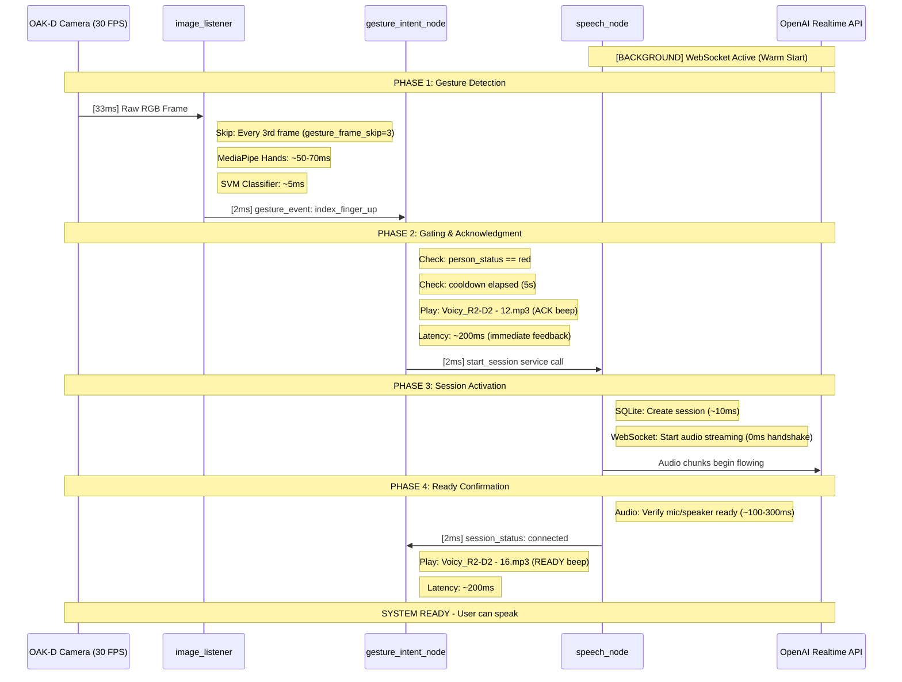

# R2D2 Speech System - Reference Documentation
## OpenAI Realtime API Integration

**Date:** December 17, 2025  
**Status:** ✅ COMPLETE AND OPERATIONAL  
**Platform:** NVIDIA Jetson AGX Orin 64GB + ROS 2 Humble  
**Hardware:** HyperX QuadCast S USB Microphone + PAM8403 Speaker

---

## Executive Summary

The R2D2 speech system provides real-time speech-to-speech conversations using OpenAI's Realtime API. The system captures audio from a USB microphone, streams it to OpenAI for transcription and processing, receives AI-generated responses, and plays them through local speakers. All conversations are persisted to a SQLite database, and the system is fully integrated as a ROS2 lifecycle node.

**Key Capabilities:**
- Real-time speech-to-speech conversations (700-1200ms latency)
- High-quality transcription (OpenAI Whisper-1)
- Intelligent responses (GPT-4o)
- Persistent conversation history (SQLite)
- Full ROS2 lifecycle integration
- Auto-detection of HyperX QuadCast S USB microphone

**Historical Note:** Original planning documents (200-206, archived) specified a ReSpeaker 2-Mic HAT with local Whisper+Grok+Piper architecture. The actual implementation uses HyperX QuadCast S USB microphone with OpenAI Realtime API for superior quality and lower latency.

---

## Architecture Overview

### System Diagram

```
User Speech
    ↓
HyperX QuadCast S USB Microphone (48kHz stereo)
    ↓
AudioStreamManager (Python)
    ├─ Audio capture at native rate
    ├─ Resampling to 24kHz (OpenAI requirement)
    └─ Base64 PCM16 encoding
    ↓
RealtimeClient (WebSocket)
    ├─ Connection: wss://api.openai.com/v1/realtime
    ├─ Audio streaming (chunked)
    └─ Event handling (bidirectional)
    ↓
OpenAI Realtime API
    ├─ Whisper-1: Speech-to-text transcription
    ├─ GPT-4o: Intelligent response generation
    └─ TTS: Audio synthesis (24kHz PCM16)
    ↓
RealtimeClient (WebSocket)
    ├─ Receive audio delta events
    ├─ Receive transcript events
    └─ Session management
    ↓
AudioStreamManager (Python)
    ├─ Audio playback at 24kHz
    ├─ PyAudio output to speaker
    └─ Buffer management
    ↓
PAM8403 Speaker Amplifier
    ↓
User hears AI response

Parallel Paths:
TranscriptHandler → SQLiteStore → conversations.db
TranscriptHandler → ROS2Bridge → ROS2 Topics
```

### Data Flow

1. **Audio Capture:** HyperX QuadCast S captures at 48kHz stereo → Resampled to 24kHz mono
2. **Streaming Upload:** Audio chunks sent to OpenAI via WebSocket (base64 PCM16)
3. **Transcription:** OpenAI Whisper-1 transcribes in real-time
4. **Response Generation:** GPT-4o generates intelligent responses
5. **Audio Synthesis:** OpenAI TTS synthesizes response audio
6. **Playback:** Response audio played through PAM8403 speaker
7. **Persistence:** All transcripts saved to SQLite database
8. **ROS2 Publishing:** Transcripts published to ROS2 topics

---

## Core Components

### 1. RealtimeClient (WebSocket Client)

**Location:** `r2d2_speech/realtime/realtime_client.py`

**Purpose:** WebSocket client for OpenAI Realtime API communication

**Key Responsibilities:**
- Establish WebSocket connection to OpenAI
- Session configuration (model, voice, modalities)
- Send audio chunks to API
- Receive server events (audio, transcripts, errors)
- Connection management and error handling

**API Endpoint:**
```
wss://api.openai.com/v1/realtime?model=gpt-4o-realtime-preview-2024-12-17
```

**Key Methods:**
- `connect()`: Establish WebSocket connection
- `create_session()`: Configure session parameters
- `send_audio_chunk()`: Stream audio to API
- `send_event()`: Send client events
- `receive_event()`: Receive server events
- `close()`: Graceful shutdown

**Event Types Handled:**
- `session.created`: Session initialization
- `conversation.item.created`: New conversation items
- `response.audio.delta`: Streaming audio response
- `response.audio_transcript.delta`: Streaming transcription
- `response.done`: Response completion
- `error`: API errors

### 2. AudioStreamManager

**Location:** `r2d2_speech/utils/audio_stream.py`

**Purpose:** Complete audio pipeline for microphone capture and speaker playback

**Key Responsibilities:**
- **HyperX microphone detection:** Auto-detect via device name matching
- **Audio capture:** Continuous capture at native sample rate (48kHz)
- **Resampling:** Stream-safe resampling to 24kHz (OpenAI requirement)
- **Audio encoding:** Base64-encoded PCM16 format
- **Audio playback:** Decode and play API responses
- **Buffer management:** Ring buffers and chunk processing

**Components:**
- `find_hyperx_device()`: Auto-detect HyperX QuadCast S by name
- `get_device_from_config()`: Device selection with fallback
- `AudioCapture`: Continuous microphone input
- `AudioResampler`: Streaming resampling (scipy.signal.resample_poly)
- `AudioPlayback`: Speaker output
- `AudioStreamManager`: Orchestrates complete pipeline

**HyperX Detection:**
```python
def find_hyperx_device() -> Optional[Tuple[int, dict]]:
    """
    Auto-detect HyperX QuadCast S microphone by name.
    Searches PyAudio devices for 'hyperx' or 'quadcast' in name.
    Returns: (device_index, device_info) or (None, None)
    """
```

**Audio Specifications:**
- **Input:** 48000 Hz stereo (HyperX native) → 24000 Hz mono (API requirement)
- **Output:** 24000 Hz mono (API) → 44100 Hz playback (speaker, auto-resampled)
- **Format:** PCM16 (16-bit signed integers)
- **Encoding:** Base64 for transmission
- **Resampling:** Automatic device rate detection + streaming resampling (24kHz → 44.1kHz)

### 3. EventRouter

**Location:** `r2d2_speech/realtime/event_router.py`

**Purpose:** Route OpenAI Realtime API server events to appropriate handlers

**Key Responsibilities:**
- Parse incoming server events
- Route to specialized handlers (transcripts, audio, errors)
- Coordinate between RealtimeClient and handlers
- Event type dispatch

**Event Routing:**
- `response.audio.delta` → AudioStreamManager.play_audio_delta()
- `response.audio_transcript.delta` → TranscriptHandler.handle_audio_transcript_delta()
- `conversation.item.created` → TranscriptHandler.handle_conversation_item_created()
- `error` → Error logging

### 4. TranscriptHandler

**Location:** `r2d2_speech/realtime/transcript_handler.py`

**Purpose:** Extract and persist user/assistant transcripts from API events

**Key Responsibilities:**
- Parse transcript events from API
- Distinguish user vs assistant messages
- Persist to SQLite database
- Publish to ROS2 topics (via ROS2Bridge)
- Accumulate streaming transcript deltas

**Event Types Handled:**
- `conversation.item.created`: New conversation items
- `response.audio_transcript.delta`: Streaming assistant transcripts
- `response.audio_transcript.done`: Complete assistant transcripts

### 5. SQLiteStore

**Location:** `r2d2_speech/storage/sqlite_store.py`

**Purpose:** Persistent storage for sessions and messages

**Database Schema:**

**sessions table:**
```sql
CREATE TABLE sessions (
    id INTEGER PRIMARY KEY AUTOINCREMENT,
    session_id TEXT UNIQUE NOT NULL,
    started_at TEXT NOT NULL,
    ended_at TEXT,
    metadata TEXT  -- JSON: model, voice, source
);
```

**messages table:**
```sql
CREATE TABLE messages (
    id INTEGER PRIMARY KEY AUTOINCREMENT,
    session_id TEXT NOT NULL,
    role TEXT NOT NULL,  -- 'user' or 'assistant'
    text TEXT NOT NULL,
    created_at TEXT NOT NULL,
    FOREIGN KEY (session_id) REFERENCES sessions(session_id)
);
```

**Key Methods:**
- `create_session()`: Start new conversation session
- `save_message()`: Persist user/assistant message
- `end_session()`: Mark session complete
- `get_recent_messages()`: Query conversation history
- `get_sessions()`: List all sessions

**Database Location:**
```
/home/severin/dev/r2d2/r2d2_speech/data/conversations.db
```

### 6. ROS2Bridge (Adapter Layer)

**Location:** `ros2_ws/src/r2d2_speech/r2d2_speech_ros/ros2_bridge.py`

**Purpose:** Wrap existing handlers to publish to ROS2 topics

**Design Pattern:** Wrapper/Decorator - delegates to original, adds ROS2 publishing

**Key Responsibilities:**
- Wrap TranscriptHandler for ROS2 topic publishing
- Convert config format (ROS2 parameters → native config dict)
- Publish session status updates
- Thread-safe ROS2 publishing

**ROS2 Publishers:**
- `/r2d2/speech/user_transcript`: User speech text
- `/r2d2/speech/assistant_transcript`: AI response text
- `/r2d2/speech/session_status`: Session state (JSON)

### 7. SpeechNode (ROS2 Lifecycle Node)

**Location:** `ros2_ws/src/r2d2_speech/r2d2_speech_ros/speech_node.py`

**Purpose:** ROS2 lifecycle node integrating the complete speech system

**Lifecycle States:**
- **Unconfigured:** Node created, no resources allocated
- **Inactive:** Configured (parameters loaded), not running
- **Active:** Speech system running, audio streaming
- **Finalized:** Cleanup complete, ready for destruction

**Key Responsibilities:**
- Manage ROS2 lifecycle transitions
- Initialize speech system components
- Bridge asyncio (speech system) and ROS2 (synchronous)
- Publish transcripts to ROS2 topics
- Provide ROS2 services for control
- Auto-configure and auto-activate on launch

**Asyncio/ROS2 Integration:**
- Background thread running asyncio event loop
- `asyncio.run_coroutine_threadsafe()` for cross-thread communication
- Thread-safe message publishing
- `MultiThreadedExecutor` for concurrent operations

---

## ROS2 Integration

### Package Structure

**Location:** `/home/severin/dev/r2d2/ros2_ws/src/r2d2_speech/`

```
r2d2_speech/
├── package.xml              # ROS2 package manifest
├── setup.py                 # Python package setup
├── setup.cfg                # Package configuration
├── resource/r2d2_speech     # Package marker
├── r2d2_speech_ros/         # Python module
│   ├── __init__.py
│   ├── speech_node.py       # Main lifecycle node (460 lines)
│   └── ros2_bridge.py       # ROS2 adapter layer (230 lines)
├── launch/
│   └── speech_node.launch.py  # Launch file with lifecycle
└── config/
    └── speech_params.yaml   # ROS2 parameters
```

**Note:** Python module named `r2d2_speech_ros` to avoid conflict with existing `r2d2_speech` package.

### Published Topics

| Topic | Type | Description | Frequency |
|-------|------|-------------|-----------|
| `/r2d2/speech/user_transcript` | std_msgs/String | User speech text | Event-driven |
| `/r2d2/speech/assistant_transcript` | std_msgs/String | Assistant response text | Event-driven |
| `/r2d2/speech/session_status` | std_msgs/String | Session status (JSON) | On state change |

### Subscribed Topics

| Topic | Type | Description |
|-------|------|-------------|
| `/r2d2/speech/commands` | std_msgs/String | Control commands (mute/unmute/pause/resume) |
| `/r2d2/speech/assistant_prompt` | std_msgs/String | Update system instructions |

### Services

| Service | Type | Description |
|---------|------|-------------|
| `/r2d2/speech/start_session` | std_srvs/Trigger | Start new session |
| `/r2d2/speech/stop_session` | std_srvs/Trigger | Stop current session |

### Gesture-Based Speech Control (Auto-Start)

The speech system can be controlled via gestures when the gesture intent service is running.

**Auto-Start Configuration:**
- Gesture intent node auto-starts on boot via systemd
- Watches for gesture events from camera-perception
- Automatically calls speech service start/stop
- Plays audio feedback (R2D2 beeps) on transitions

**Service Status:**
```bash
# Check if gesture intent is running
sudo systemctl status r2d2-gesture-intent.service

# View gesture logs
sudo journalctl -u r2d2-gesture-intent.service -f
```

**Gesture Triggers:**
- 👆 Index finger up → Start speech session (instant)
- ✊ Fist → Stop speech session (two-stage confirmation)
- 🚶 Walk away >35s → Auto-shutdown (watchdog)

#### Two-Stage Fist Stop Confirmation

**Purpose:** Prevents accidental conversation termination and solves stop beep timing issues.

**How It Works:**

**Stage 1: Warning Phase (~1.5 seconds)**
1. User makes and holds fist gesture
2. System detects sustained hold (10 detections in 1.5s window at ~10Hz)
3. Warning beep plays (`Voicy_R2-D2 - 7.mp3`)
4. User has chance to release fist and cancel

**Stage 2: Confirmation Phase (~1.5 seconds)**
5. If user continues holding fist
6. System detects second sustained hold (another 10 detections in 1.5s)
7. Stop beep plays (`Voicy_R2-D2 - 20.mp3`)
8. Session terminates immediately

**Cancellation:**
- Release fist at any time → System resets to idle
- No stop occurs, conversation continues
- Timeout: 0.5s without fist detection = considered "released"

**Technical Implementation:**
```python
# Rolling window detection in gesture_intent_node.py
fist_window_seconds: 1.5      # Rolling window duration
fist_threshold: 10             # Detections required (~67% of 15 max at 10Hz)
```

**Problem Solved:**

The original issue was a race condition where the stop beep wouldn't be heard:
- **Old behavior:** Stop beep played when session disconnected → Audio system busy closing TTS stream → Race condition → Beep not heard
- **New behavior:** Stop beep plays on gesture confirmation → Before session disconnect → No race condition → Always audible

**Benefits:**
1. Stop beep timing completely solved (plays before audio system transitions)
2. Prevents accidental stops (requires ~3 seconds of deliberate hold)
3. User has two chances to cancel
4. Clear audio feedback at each stage

**For complete gesture system documentation, see:**
- [300_GESTURE_SYSTEM_OVERVIEW.md](300_GESTURE_SYSTEM_OVERVIEW.md) - Complete system
- [303_GESTURE_TRAINING_GUIDE.md](303_GESTURE_TRAINING_GUIDE.md) - Training guide

### Parameters

| Parameter | Type | Default | Description |
|-----------|------|---------|-------------|
| `openai_api_key` | string | (from ~/.r2d2/.env) | OpenAI API key |
| `realtime_model` | string | gpt-4o-realtime-preview-2024-12-17 | Model name |
| `realtime_voice` | string | sage | Voice (alloy, echo, fable, onyx, nova, shimmer, sage) |
| `mic_device` | string | "" | Microphone device (empty = auto-detect HyperX) |
| `mic_native_sample_rate` | int | 48000 | Native sample rate (HyperX) |
| `mic_sample_rate` | int | 24000 | Target sample rate (API requirement) |
| `sink_device` | string | "pulse" | Audio output: 'pulse' (Bluetooth/PulseAudio) or 'default' (PAM8403) |
| `db_path` | string | ~/dev/r2d2/r2d2_speech/data/conversations.db | Database path |
| `auto_start` | bool | true | Auto-start session on activation |
| `instructions` | string | (system prompt) | Assistant personality |

### Lifecycle Commands

```bash
# Check current state
ros2 lifecycle get /speech_node

# Transition commands
ros2 lifecycle set /speech_node configure
ros2 lifecycle set /speech_node activate
ros2 lifecycle set /speech_node deactivate
ros2 lifecycle set /speech_node cleanup
```

---

## Hardware Configuration

### HyperX QuadCast S USB Microphone

**Connection:** USB (plug-and-play)

**Specifications:**
- **Sample Rate:** 48000 Hz (native)
- **Channels:** 2 (stereo)
- **Format:** PCM16 (16-bit signed integers)
- **USB Audio Class:** 2.0
- **Polar Patterns:** Stereo, Omnidirectional, Cardioid, Bidirectional

**Auto-Detection:**
The system automatically detects HyperX QuadCast S by searching PyAudio devices for "hyperx" or "quadcast" in the device name. No manual configuration required if left as default.

**Manual Configuration:**
If auto-detection fails, manually specify device index in `~/.r2d2/.env`:
```bash
MIC_DEVICE=2  # PyAudio device index
```

**Verification:**
```bash
# List all audio devices
python3 -c "import pyaudio; p = pyaudio.PyAudio(); [print(f'{i}: {p.get_device_info_by_index(i)[\"name\"]}') for i in range(p.get_device_count())]"

# Check USB connection
lsusb | grep -i hyperx
```

### PAM8403 Speaker Amplifier

**Connection:** J511 Audio Header (from Phase 1 setup)

**Specifications:**
- **Amplifier:** PAM8403 (3W per channel)
- **Connection:** I2S audio output
- **Sample Rate:** 44100 Hz (device native, API audio auto-resampled from 24kHz)
- **Channels:** Mono (API output is mono)
- **Resampling:** Automatic (24kHz API → 44.1kHz device via AudioResampler)

**Configuration:**
Configured in Phase 1 audio setup. No additional configuration needed for speech system.

### Bluetooth Audio (Alternative)

**Status:** Supported as alternative to PAM8403

Bluetooth headphones, earbuds, or speakers can be used instead of the built-in PAM8403 speaker. Audio is routed through PulseAudio.

**Configuration:**
```yaml
# In speech_params.yaml
sink_device: 'pulse'   # Routes through PulseAudio to default sink (Bluetooth)
# sink_device: 'default'  # Direct ALSA to PAM8403
```

**Requirements:**
- Bluetooth device paired and connected
- PulseAudio environment variables set in systemd services
- `pulseaudio-module-bluetooth` package installed

**Quick Test:**
```bash
# Check Bluetooth is default sink
pactl get-default-sink

# Test audio
paplay /usr/share/sounds/alsa/Front_Center.wav
```

**For complete Bluetooth setup, see:** [261_BLUETOOTH_AUDIO_REFERENCE.md](261_BLUETOOTH_AUDIO_REFERENCE.md)

### Historical Note: ReSpeaker HAT

Original planning documents specified a ReSpeaker 2-Mic HAT with GPIO/I2S connection. This was replaced with HyperX QuadCast S USB for:
- **Simplicity:** USB plug-and-play vs GPIO wiring
- **Quality:** Professional USB microphone vs HAT
- **Compatibility:** Better driver support on Jetson
- **Flexibility:** Can be repositioned/replaced easily

---

## OpenAI Realtime API Integration

### API Overview

**Endpoint:**
```
wss://api.openai.com/v1/realtime?model=gpt-4o-realtime-preview-2024-12-17
```

**Authentication:**
```
Authorization: Bearer <OPENAI_API_KEY>
OpenAI-Beta: realtime=v1
```

**Protocol:** WebSocket (bidirectional, full-duplex)

**Capabilities:**
- Speech-to-text (Whisper-1)
- Text generation (GPT-4o)
- Text-to-speech (OpenAI TTS)
- Real-time streaming (low latency)

### Session Configuration

When connecting, the client sends a session configuration:

```json
{
  "type": "session.update",
  "session": {
    "modalities": ["text", "audio"],
    "instructions": "You are R2D2, a helpful assistant...",
    "voice": "sage",
    "input_audio_format": "pcm16",
    "output_audio_format": "pcm16",
    "input_audio_transcription": {
      "model": "whisper-1"
    },
    "turn_detection": {
      "type": "server_vad",
      "threshold": 0.5,
      "prefix_padding_ms": 300,
      "silence_duration_ms": 500
    }
  }
}
```

**Key Settings:**
- **modalities:** Both text and audio
- **voice:** AI voice selection (sage is warm and friendly)
- **audio_format:** PCM16 (16-bit signed integers, 24kHz)
- **turn_detection:** Server-side VAD (Voice Activity Detection)
- **vad_threshold:** 0.5 (balanced sensitivity)
- **silence_duration:** 500ms (pause before processing)

### Event Types

**Client → Server Events:**
- `session.update`: Configure session parameters
- `input_audio_buffer.append`: Stream audio chunks
- `input_audio_buffer.commit`: Finalize audio buffer
- `response.create`: Request AI response
- `response.cancel`: Cancel ongoing response

**Server → Client Events:**
- `session.created`: Session initialized
- `session.updated`: Configuration confirmed
- `conversation.item.created`: New conversation item
- `response.audio.delta`: Streaming audio response
- `response.audio_transcript.delta`: Streaming transcription
- `response.done`: Response complete
- `error`: API errors

### Audio Streaming

**Upload (Microphone → API):**
1. Capture audio at 48kHz stereo (HyperX)
2. Resample to 24kHz mono (API requirement)
3. Encode as base64 PCM16
4. Send in chunks (~100ms per chunk)
5. Commit buffer when silence detected

**Download (API → Speaker):**
1. Receive `response.audio.delta` events
2. Decode base64 PCM16 (24kHz mono)
3. Resample to device rate (44.1kHz) if needed
4. Buffer audio chunks
5. Play through speaker at device rate (44.1kHz)

### Error Handling

Common errors and handling:
- `invalid_api_key`: Check OPENAI_API_KEY in ~/.r2d2/.env
- `rate_limit_exceeded`: Back off and retry
- `model_not_available`: Check model name in config
- `connection_error`: Reconnect with exponential backoff

---

## Performance Metrics

### Latency Breakdown

**Total End-to-End:** 700-1200ms (speech → response)

**Component Breakdown:**
1. **Audio Capture:** ~20ms (chunk buffering)
2. **Resampling:** ~10ms (scipy resampling)
3. **Network Upload:** ~50-100ms (WebSocket to OpenAI)
4. **Transcription:** ~200-400ms (Whisper-1)
5. **Response Generation:** ~200-400ms (GPT-4o)
6. **Audio Synthesis:** ~100-200ms (OpenAI TTS)
7. **Network Download:** ~50-100ms (WebSocket from OpenAI)
8. **Audio Playback:** ~50ms (buffer setup)

**Variability Factors:**
- Network latency (50-200ms depending on connection)
- Response complexity (longer responses take more time)
- API load (may vary with OpenAI service load)

### Resource Usage

**Idle (Node Running, Not Speaking):**
- CPU: ~5% (background event loop)
- Memory: ~100MB (base process + loaded libraries)
- GPU: 0% (no local processing)
- Network: Minimal (WebSocket keepalive)

**Active (Streaming Conversation):**
- CPU: ~10-15% (audio capture, resampling, playback)
- Memory: ~150MB (audio buffers, WebSocket buffers)
- GPU: 0% (all processing on OpenAI servers)
- Network: ~200-500 Kbps upload, ~200-500 Kbps download

**Peak (Simultaneous Upload/Download):**
- CPU: ~20% (concurrent audio I/O)
- Memory: ~180MB (dual audio buffers)

**ROS2 Overhead:**
- Additional CPU: ~2-3% (topic publishing, lifecycle management)
- Additional Memory: ~10-20MB (ROS2 node infrastructure)

### Comparison to Original Plan

| Metric | Original Plan (Whisper+Grok+Piper) | Actual (OpenAI Realtime) |
|--------|-------------------------------------|--------------------------|
| **Total Latency** | 6-8 seconds | **0.7-1.2 seconds** ✅ |
| **STT Latency** | 4-6 seconds (local Whisper) | 0.2-0.4 seconds (cloud) |
| **TTS Latency** | 0.8-1.5 seconds (local Piper) | 0.1-0.2 seconds (cloud) |
| **GPU Usage** | 40-50% (Whisper large) | **0%** ✅ |
| **Setup Complexity** | High (models, voices) | **Low** (API key only) ✅ |
| **Offline Capable** | Yes | No |
| **Quality** | 97% STT, professional TTS | **99%+ STT, natural TTS** ✅ |

**Trade-offs:**
- ✅ Much lower latency (6x faster)
- ✅ No GPU usage (frees GPU for other tasks)
- ✅ Simpler setup (no model downloads)
- ✅ Higher quality (latest models)
- ❌ Requires internet connection
- ❌ API costs (though free tier is generous)

---

## Session Start Timing Analysis

This section details the complete timing breakdown for starting a speech session via gesture.

### Warm Start Architecture

The system uses a **"Warm Start"** approach where the persistent WebSocket connection to OpenAI is established during node activation, removing the handshake delay from the time-critical gesture trigger path.

**Background State:**
- OpenAI WebSocket connection established and maintained
- Audio hardware (HyperX mic + speaker) initialized
- Ready to stream audio on demand

### Complete Start Sequence



### Timing Breakdown

| Component | Dependency | Delay (Typical) | Delay (Worst) |
|-----------|------------|-----------------|---------------|
| **Camera** | 30 Hz hardware clock | 33ms | 33ms |
| **Perception** | gesture_frame_skip=3 | 33ms | 99ms |
| **MediaPipe Hands** | CPU (Jetson Orin) | 50ms | 80ms |
| **SVM Classification** | CPU inference | 5ms | 10ms |
| **Gating** | ROS 2 check | <1ms | <1ms |
| **Acknowledgment Beep** | ffplay immediate | ~200ms | ~400ms |
| **WebSocket** | Warm start (pre-connected) | **0ms** | **0ms** |
| **Session Init** | OpenAI config | 50ms | 200ms |
| **Audio Hardware** | PyAudio init | 150ms | 400ms |
| **Ready Beep** | ffplay on status | ~200ms | ~400ms |

**Total Path Latency:**
- **Minimum (Warm Start):** ~0.5 seconds (gesture → ready)
- **Typical:** ~0.75-1.0 seconds
- **Maximum:** ~1.2 seconds
- **Cold Start (first boot):** ~2.5 seconds (includes WebSocket handshake)

### Key Performance Features

**1. Warm Start Connection**
- WebSocket established during node activation
- Eliminates ~1.5s TCP/TLS/auth handshake from critical path
- Session ready immediately when gesture detected

**2. High-Frequency Gesture Detection**
- `gesture_frame_skip=3` allows ~10 Hz gesture recognition
- Gesture detected within 99ms of appearing in frame
- Optimized from original skip=5 (6 Hz)

**3. Dual-Beep Feedback**
- **Acknowledgment beep** (~200ms): "I saw your gesture"
- **Ready beep** (~750ms): "I'm listening now"
- Minimizes perceived latency through immediate feedback

**4. Efficient Gating**
- Sub-millisecond checks (person_status, cooldown)
- No wasted cycles on invalid triggers

### Expected User Experience

| Milestone | Timing | User Perception |
|-----------|--------|-----------------|
| Gesture raised | 0ms | User raises index finger |
| Gesture detected | ~150ms | System recognizes gesture |
| Acknowledgment beep | ~350ms | "Command received" |
| System ready | ~750ms | "Listening now" |
| Can speak | ~1000ms | Full conversation ready |

---

## Dependencies

### ROS2 Packages
- `rclpy`: ROS2 Python client library
- `lifecycle_msgs`: Lifecycle node messages
- `std_msgs`: Standard message types
- `std_srvs`: Standard service types
- `rclpy_lifecycle`: Lifecycle node support

### Python Packages (from virtualenv)
- `openai`: OpenAI API client library
- `websockets`: WebSocket protocol implementation
- `pyaudio`: Python audio I/O
- `numpy`: Numerical arrays (audio buffers)
- `scipy`: Signal processing (resampling)
- `python-dotenv`: Environment variable loading

### System Dependencies
- `python3.10`: Python runtime
- `libasound2-dev`: ALSA audio development
- `portaudio19-dev`: PortAudio development
- `sqlite3`: SQLite database

---

## File Locations

### Core Speech System
```
/home/severin/dev/r2d2/r2d2_speech/
├── __init__.py
├── config/
│   └── config_manager.py      # Configuration management
├── realtime/
│   ├── __init__.py
│   ├── realtime_client.py     # WebSocket client
│   ├── event_router.py        # Event routing
│   └── transcript_handler.py  # Transcript extraction
├── storage/
│   └── sqlite_store.py        # Database persistence
└── utils/
    └── audio_stream.py        # Audio pipeline (HyperX detection)
```

### ROS2 Package
```
/home/severin/dev/r2d2/ros2_ws/src/r2d2_speech/
├── package.xml
├── setup.py
├── r2d2_speech_ros/
│   ├── speech_node.py         # Lifecycle node
│   └── ros2_bridge.py         # ROS2 adapter
├── launch/
│   └── speech_node.launch.py
└── config/
    └── speech_params.yaml
```

### Scripts
```
/home/severin/dev/r2d2/
├── launch_ros2_speech.sh      # Launch script (virtualenv + ROS2)
├── test_ros2_speech.sh        # Testing script
└── view_conversations.sh      # Database viewer
```

### Configuration
```
/home/severin/.r2d2/
└── .env                       # API keys, settings
```

### Database
```
/home/severin/dev/r2d2/r2d2_speech/data/
└── conversations.db           # SQLite database
```

---

## Customization Guide

For comprehensive voice and personality configuration, see:

**[204_SPEECH_SYSTEM_VOICE_CONFIGURATION.md](204_SPEECH_SYSTEM_VOICE_CONFIGURATION.md)**

This dedicated guide covers:
- Available voices (alloy, echo, fable, onyx, nova, shimmer, sage)
- Personality instruction examples
- Step-by-step configuration procedure
- Configuration flow diagram (why rebuild is required)
- Troubleshooting configuration changes

---

## Security Considerations

### API Key Storage

**Location:** `~/.r2d2/.env` (file permissions: 600)

**Format:**
```bash
OPENAI_API_KEY=sk-...
REALTIME_MODEL=gpt-4o-realtime-preview-2024-12-17
REALTIME_VOICE=sage
```

**Best Practices:**
- Never commit `.env` to git (add to `.gitignore`)
- Use file permissions 600 (owner read/write only)
- Rotate keys periodically
- Use separate keys for development/production

### Network Security

**WebSocket Connection:**
- TLS encryption (wss://)
- Certificate validation enabled
- OpenAI API key in Authorization header

**Data Privacy:**
- Audio streams encrypted in transit
- No audio stored on OpenAI servers (per API terms)
- Local database for conversation history

### Database Security

**SQLite Database:**
- Local file storage (no network exposure)
- File permissions: 644 (owner write, all read)
- Contains conversation history (consider encryption for sensitive deployments)

---

## Troubleshooting Guide

### Common Issues

**1. Node won't start**
```bash
# Check API key
cat ~/.r2d2/.env | grep OPENAI_API_KEY

# Should show: OPENAI_API_KEY=sk-...
# If missing or placeholder, set actual key
```

**2. HyperX not detected**
```bash
# List audio devices
python3 -c "import pyaudio; p = pyaudio.PyAudio(); [print(f'{i}: {p.get_device_info_by_index(i)[\"name\"]}') for i in range(p.get_device_count())]"

# Check USB connection
lsusb | grep -i hyperx

# If not found:
# - Check USB cable
# - Try different USB port
# - Check dmesg for USB errors
```

**3. No audio output / "Invalid sample rate" error**
```bash
# Check service logs for sample rate errors
journalctl -u r2d2-speech-node --since "10 minutes ago" | grep -i "sample rate\|Invalid"

# Expected: "Device supports 44100 Hz, using that instead of 24kHz"
# Expected: "Created resampler: 24000 Hz → 44100 Hz"

# If you see "Invalid sample rate" errors:
# - The fix is already implemented (auto-detection + resampling)
# - Check that audio_stream.py has the resampling code
# - Restart service: sudo systemctl restart r2d2-speech-node

# Test speaker directly
speaker-test -t wav -c 2

# Check ALSA configuration
cat /etc/asound.conf

# Check PAM8403 setup (Phase 1 docs)
```

**Issue: "Failed to start audio playback: [Errno -9997] Invalid sample rate"**

**Root Cause:** The default audio device (PAM8403 via ALSA) supports 44100 Hz, but the OpenAI Realtime API outputs audio at 24000 Hz. The original code attempted to open the playback stream at 24kHz, which the device doesn't support.

**Solution (Implemented):** The `AudioPlayback` class now:
1. Detects the device's supported sample rate (44100 Hz)
2. Automatically resamples 24kHz API audio to 44.1kHz for playback
3. Uses `AudioResampler` (scipy.signal.resample_poly) for streaming-safe resampling

**Verification:**
```bash
# Check logs show resampling is working
journalctl -u r2d2-speech-node | grep -E "resampler|Device supports|Audio playback started"

# Should see:
# "Device supports 44100 Hz, using that instead of 24kHz"
# "Created resampler: 24000 Hz → 44100 Hz"
# "✓ Audio playback started"
```

**4. WebSocket connection fails**
```bash
# Check internet connection
ping api.openai.com

# Check API key format (should start with sk-)
cat ~/.r2d2/.env | grep OPENAI_API_KEY

# Check firewall (WebSocket needs outbound HTTPS)
```

**5. Transcripts not publishing**
```bash
# Check topics exist
ros2 topic list | grep speech

# Check topic is publishing
ros2 topic hz /r2d2/speech/user_transcript

# Speak into microphone - should show ~1-2 Hz when speaking
```

---

## References

### Documentation
- [OpenAI Realtime API Guide](https://platform.openai.com/docs/guides/realtime)
- [ROS2 Lifecycle Nodes](https://design.ros2.org/articles/node_lifecycle.html)
- [PyAudio Documentation](https://people.csail.mit.edu/hubert/pyaudio/docs/)

### Related R2D2 Documentation
- `001_ARCHITECTURE_OVERVIEW.md`: Overall system architecture
- `007_SYSTEM_INTEGRATION_REFERENCE.md`: System integration reference (includes full service/node inventory in **Appendix A**)
- `201_SPEECH_SYSTEM_INSTALLATION.md`: Installation guide
- `203_SPEECH_SYSTEM_QUICK_START.md`: Quick reference
- `ROS2_SPEECH_TESTING.md`: Testing procedures

### Implementation History
- **Subtask 1:** Database persistence (SQLiteStore)
- **Subtask 2:** Audio pipeline (AudioStreamManager, HyperX support)
- **Subtask 3:** ROS2 integration (SpeechNode, ROS2Bridge)
- **Completion Date:** December 17, 2025

---

**Document Version:** 1.2  
**Last Updated:** January 2, 2026 (Added two-stage fist stop & timing analysis)  
**Status:** Complete and operational  
**Hardware:** HyperX QuadCast S USB + PAM8403 Speaker  
**API:** OpenAI Realtime API (GPT-4o + Whisper-1)  
**Voice:** Sage (Star Wars R2-D2 personality)

