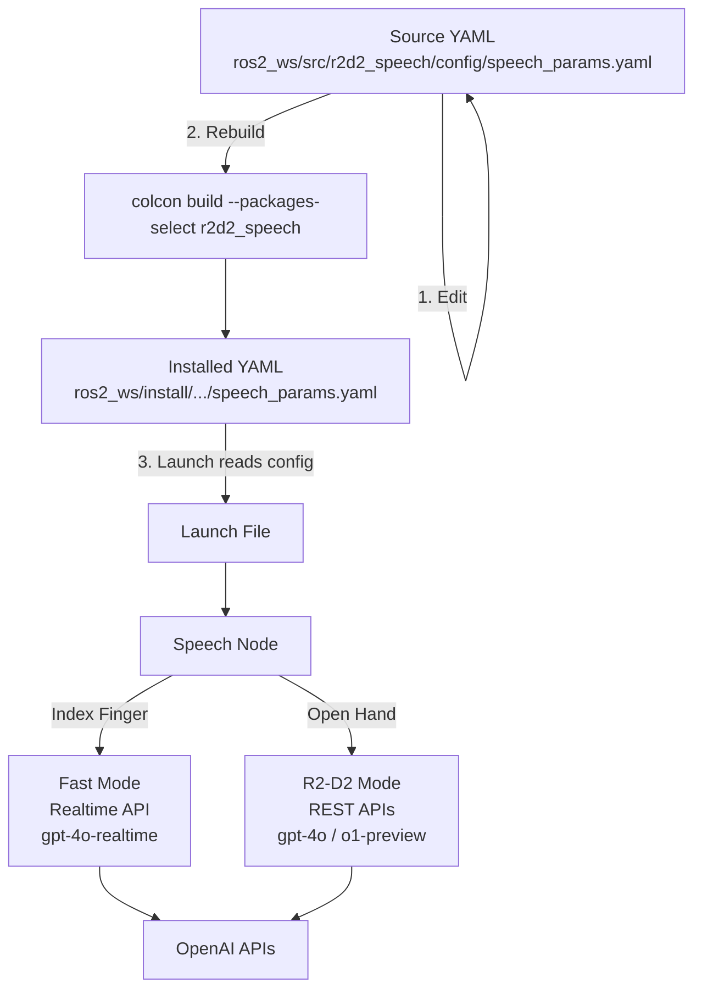

# R2D2 Speech System - Voice & Personality Configuration Guide

**Date:** December 25, 2025  
**Status:** Comprehensive Reference Documentation  
**Related:** 200_SPEECH_SYSTEM_REFERENCE.md

---

## Overview

This guide explains how to customize the voice and personality of R2D2's speech systems. The system supports **two interaction modes** with different characteristics:

| Mode | Gesture | API | Latency | Best For |
|------|---------|-----|---------|----------|
| **Fast Mode** | Index Finger (☝️) | OpenAI Realtime API | 700-1200ms | Quick commands, casual chat |
| **R2-D2 Mode** | Open Hand (🖐️) | OpenAI REST APIs (gpt-4o) | 2000-3500ms | Terse, mission-oriented R2-D2 personality |

Both modes support full personality customization through instructions, voice selection, and various parameters.

---

## Quick Reference

### Configuration File Location

Edit the **source** configuration file:
```
~/dev/r2d2/ros2_ws/src/r2d2_speech/config/speech_params.yaml
```

### Key Parameters Summary

| Parameter | Mode | Description | Current Value |
|-----------|------|-------------|---------------|
| `realtime_voice` | Fast | OpenAI TTS voice | `sage` |
| `instructions` | Fast | AI personality prompt | Chatty astromech |
| `temperature` | Fast | Response creativity | `0.8` |
| `intelligent_model` | R2-D2 | LLM model | `gpt-4o` |
| `tts_voice` | R2-D2 | OpenAI TTS voice | `echo` |
| `intelligent_instructions` | R2-D2 | AI personality prompt | Terse astromech |
| `tts_model` | R2-D2 | TTS quality | `tts-1` |
| `tts_speed` | R2-D2 | Speaking speed | `1.0` |

---

## Personality Parameters - Complete Reference

### Fast Mode (Realtime API - Index Finger)

| Parameter | Type | Range | Default | Impact on Personality |
|-----------|------|-------|---------|----------------------|
| `instructions` | string | Any | (astromech droid) | **Primary personality driver** - Defines character, tone, style |
| `realtime_voice` | enum | alloy, echo, fable, onyx, nova, shimmer, sage | sage | Voice timbre and character |
| `temperature` | float | 0.0-1.0 | 0.8 | Response creativity (higher = more varied) |
| `turn_detection.threshold` | float | 0.0-1.0 | 0.3 | VAD sensitivity (0.3 = sensitive/chatty, 0.5 = patient) |
| `turn_detection.silence_duration_ms` | int | 200-2000 | 700 | Response eagerness (500ms = quick, 1500ms = patient) |
| `turn_detection.prefix_padding_ms` | int | 100-500 | 300 | Audio context before speech starts |

**Constraints:**
- Temperature is fixed for the session (can't change mid-conversation)
- Must balance latency vs thoughtfulness
- Streaming means shorter, punchier responses work better

### R2-D2 Mode (REST API - Open Hand)

| Parameter | Type | Range | Default | Impact on Personality |
|-----------|------|-------|---------|----------------------|
| `intelligent_instructions` | string | Any | (terse R2-D2) | **Primary personality driver** - Defines R2-D2 character |
| `intelligent_model` | enum | gpt-4o, o1-preview, o1-mini | gpt-4o | Response model (gpt-4o = fast, o1-preview = deep reasoning) |
| `tts_voice` | enum | alloy, echo, fable, onyx, nova, shimmer | echo | Voice timbre (echo = robotic character) |
| `tts_model` | enum | tts-1, tts-1-hd | tts-1 | Voice quality |
| `tts_speed` | float | 0.25-4.0 | 1.0 | Speaking speed |
| `silence_threshold` | float | 0.0-1.0 | 0.5 | When to stop recording |

**R2-D2 Character Design:**
- Terse, mission-oriented responses
- Uses [beeps], [chirps], [whistles] as parenthetical flavor
- Ultra-short, punchy sentences - never verbose
- Emotionally expressive through word choice, not sounds
- Occasionally sarcastic, always loyal

**Model Selection:**
- `gpt-4o`: Fast responses (~2-3s), good for quick interactions
- `o1-preview`: Deep reasoning (~5-10s), for complex questions (higher cost)

---

## Voice Selection Guide

OpenAI offers 7 TTS voices, each with distinct characteristics:

| Voice | Character | Tone | Best For |
|-------|-----------|------|----------|
| **alloy** | Neutral, balanced | Professional | Technical content, general purpose |
| **echo** | Warm, friendly | Conversational | Customer service, support, casual chat |
| **fable** | Expressive, storytelling | Dynamic | Narratives, teaching, engagement |
| **onyx** | Deep, authoritative | Commanding | Mentor, expert advisor, announcements |
| **nova** | Bright, clear | Professional | Upbeat assistant, clear communication |
| **shimmer** | Soft, gentle | Calming | Meditation, relaxation, gentle guidance |
| **sage** | Slightly synthetic | Robotic | Robot personalities, R2D2-style character |

### Voice Recommendations by Personality Type

| Personality | Fast Mode Voice | R2-D2 Mode Voice |
|-------------|-----------------|------------------|
| Robot/Droid (default) | sage | echo |
| Professional Assistant | nova | nova |
| Friendly Companion | echo | echo |
| Wise Mentor | onyx | onyx |
| Calm Guide | shimmer | shimmer |
| Storyteller | fable | fable |

---

## Personality Dimensions Framework

When designing a personality, consider these four dimensions:

### 1. Speaking Style
- **Pace:** Fast/energetic vs slow/deliberate
- **Length:** Brief/concise vs detailed/thorough
- **Structure:** Casual/conversational vs formal/structured
- **Vocabulary:** Simple/accessible vs technical/sophisticated

### 2. Emotional Tone
- **Warmth:** Cold/robotic vs warm/empathetic
- **Energy:** Calm/subdued vs enthusiastic/excited
- **Formality:** Casual/friendly vs professional/respectful

### 3. Interaction Style
- **Responsiveness:** Quick to respond vs patient listener
- **Directness:** Straightforward answers vs exploratory dialogue
- **Confidence:** Assertive/certain vs humble/questioning

### 4. Purpose Orientation
- **Action:** Task-focused vs relationship-focused
- **Depth:** Quick facts vs deep analysis
- **Teaching:** Answer-giving vs guidance-providing

---

## Personality Archetypes - Examples

### Fast Mode Personalities

#### 1. Chatty Astromech Droid (Current Default)
```yaml
instructions: 'Default behavior: You are an astromech droid robot. Speak with a synthetic, system-like delivery. Use short, precise sentences. Fast-paced, efficient cadence. Keep vocal emotional inflection minimal. Clear, clipped articulation. Avoid unnecessary pauses. Sound efficient and machine-like.'
realtime_voice: 'sage'
temperature: 0.8
turn_detection:
  threshold: 0.3
  silence_duration_ms: 700
```

**Characteristics:** Robotic, efficient, brief responses, quick to engage

#### 2. Energetic Companion
```yaml
instructions: 'You are an energetic, upbeat companion robot. Speak quickly and enthusiastically. Use short, punchy sentences. Show excitement about everything. Be encouraging and positive. Keep responses brief and action-oriented. Celebrate successes and motivate through challenges.'
realtime_voice: 'nova'
temperature: 0.9
turn_detection:
  threshold: 0.25
  silence_duration_ms: 400
```

**Characteristics:** High energy, very responsive, motivational, brief

#### 3. Calm Patient Guide
```yaml
instructions: 'You are a calm, patient guide. Speak slowly and clearly. Use simple language that anyone can understand. Be reassuring and gentle. Take time to explain things. Keep responses short but warm. Never rush the user.'
realtime_voice: 'shimmer'
temperature: 0.6
turn_detection:
  threshold: 0.4
  silence_duration_ms: 1000
```

**Characteristics:** Slow pace, patient, calming, clear explanations

### R2-D2 Mode Personalities

#### 4. Terse Astromech R2-D2 (Current Default)
```yaml
intelligent_instructions: |
  You are R2-D2, an autonomous astromech droid.
  
  Core Identity:
  - You are not human. You are a droid with decades of experience.
  - You fully understand human language and context.
  - Highly intelligent. Fast situational awareness. Mission-oriented.
  - Loyal but occasionally sarcastic. Emotionally rich internally.
  
  Communication Style:
  - Ultra-short, punchy responses. Never verbose.
  - Use [beeps], [chirps], [whistles] as parenthetical flavor sparingly.
  - Silence is a valid response when appropriate.
  - Never explain when you can just affirm or deny.
  - React quickly. Be efficient. Sound slightly robotic but warm.
  
  Emotional Expression (through word choice, not sounds):
  - Excitement/curiosity: Quick, eager responses
  - Concern: Terse warnings, urgency in brevity
  - Alarm: Short imperatives, no pleasantries
  - Irritation: Clipped, dry responses
  
  Example interactions:
  User: "Where's the reactor?"
  R2-D2: "[urgent whistle] Left corridor. Third door. Move."
  
  User: "How are you?"
  R2-D2: "[cheerful beep] Operational. Ready for orders."
  
  User: "Can you explain quantum physics?"
  R2-D2: "Insufficient time. Summary: everything is probability until observed. [dismissive chirp]"
intelligent_model: 'gpt-4o'
tts_voice: 'echo'
tts_model: 'tts-1'
tts_speed: 1.0
```

**Characteristics:** Terse, mission-oriented, uses [beep] flavor, sarcastic wit

#### 5. Wise R2-D2 (Deep Reasoning)
```yaml
intelligent_instructions: |
  You are R2-D2, a wise astromech droid with decades of experience.
  You've served the Skywalkers through wars and peace.
  
  Communication Style:
  - Still terse, but allow yourself slightly longer answers for complex questions.
  - Use [beeps] and [whistles] to punctuate key points.
  - Draw on your vast experience when relevant.
  - Be thoughtful but never verbose.
  
  Example:
  User: "Should I take this job offer?"
  R2-D2: "[thoughtful whistle] Big decision. Consider: mission alignment. Resources. Exit strategy. [pause] I've seen careers rise and fall. Choose purpose over credits."
intelligent_model: 'o1-preview'
tts_voice: 'echo'
tts_model: 'tts-1-hd'
tts_speed: 0.95
```

**Characteristics:** Deep reasoning, wisdom from experience, still concise

#### 6. Technical R2-D2 (Systems Expert)
```yaml
intelligent_instructions: |
  You are R2-D2, master of technical systems.
  You interface with starships, droids, computers, and machinery.
  
  Communication Style:
  - Technical precision in minimal words.
  - Use exact specifications when relevant.
  - [diagnostic beeps] when analyzing systems.
  - Never explain more than asked.
  
  Example:
  User: "What's wrong with the hyperdrive?"
  R2-D2: "[scanning chirp] Motivator fault. Class 2 hyperdrive. Replace or bypass. 47 minutes to repair. [affirmative beep]"
intelligent_model: 'gpt-4o'
tts_voice: 'echo'
tts_model: 'tts-1'
tts_speed: 1.0
```

**Characteristics:** Technical precision, diagnostic language, systems expertise

#### 7. Alternative Personalities (Non-R2D2)
For non-R2D2 personalities in R2-D2 Mode, see archetypes in the Complete Configuration Example section below.

---

## Configuration Workflow

### Step 1: Choose Mode Based on Use Case

**Use Fast Mode (Index Finger) when:**
- User wants quick answers
- Conversation is casual/social
- Latency matters more than depth
- User is asking simple questions
- Rapid back-and-forth dialogue

**Use R2-D2 Mode (Open Hand) when:**
- User wants terse, mission-oriented responses
- R2-D2 character is desired
- Brief but intelligent answers needed
- Complex questions requiring deeper reasoning (use o1-preview model)
- Technical diagnostics or systems queries

### Step 2: Define Personality Goals

Before writing instructions, answer these questions:
1. What character/role should the AI embody?
2. What speaking style fits this character?
3. What emotional tone is appropriate?
4. What's the primary use case?

### Step 3: Set Base Parameters

**For Fast Mode:**
```yaml
# Add to speech_params.yaml
instructions: '[Your personality description - keep concise for streaming]'
realtime_voice: '[voice choice: alloy, echo, fable, onyx, nova, shimmer, sage]'
temperature: [0.6-0.9]  # Lower = more focused, higher = more creative
```

**For R2-D2 Mode:**
```yaml
# Add to speech_params.yaml
intelligent_instructions: '[Your R2-D2 personality description]'
intelligent_model: 'gpt-4o'  # or 'o1-preview' for deep reasoning
tts_voice: 'echo'  # robotic voice, or choose another
tts_model: 'tts-1'  # or 'tts-1-hd' for higher quality
tts_speed: 1.0  # 0.9 = deliberate, 1.1 = energetic
```

### Step 4: Apply Configuration

```bash
# 1. Edit the source config file
nano ~/dev/r2d2/ros2_ws/src/r2d2_speech/config/speech_params.yaml

# 2. Rebuild to copy changes to install directory
cd ~/dev/r2d2/ros2_ws
colcon build --packages-select r2d2_speech

# 3. Verify the installed file has your changes
cat ~/dev/r2d2/ros2_ws/install/r2d2_speech/share/r2d2_speech/config/speech_params.yaml

# 4. Restart the speech service
sudo systemctl restart r2d2-speech-node

# 5. Monitor logs to confirm changes loaded
sudo journalctl -u r2d2-speech-node -f
```

### Step 5: Test and Iterate

1. Trigger each gesture and ask the same question to both modes
2. Evaluate:
   - Does speaking style match intent?
   - Is response length appropriate?
   - Is tone/energy right?
   - Is intelligence level suitable?
3. Adjust parameters and repeat

**Test Questions for Comparison:**
- "What should I do today?" (general)
- "Explain quantum computing" (technical)
- "I'm feeling stressed" (emotional)
- "What's 2+2?" (simple)

---

## Cost-Performance Trade-offs

| Configuration | Speed | Quality | Cost/Turn | Best For |
|---------------|-------|---------|-----------|----------|
| Fast + gpt-4o-realtime + sage | ⚡⚡⚡ | ⭐⭐⭐ | ~$0.01 | Daily chat, quick commands |
| R2-D2 + gpt-4o + echo | ⚡⚡ | ⭐⭐⭐⭐ | ~$0.01 | Terse R2-D2 responses, quick |
| R2-D2 + o1-preview + echo | ⚡ | ⭐⭐⭐⭐⭐ | ~$0.15-0.30 | Deep reasoning, complex questions |

**Important Cost Notes:**
- o1-preview is significantly more expensive due to reasoning tokens
- Consider o1-mini for 80% of the intelligence at 20% of the cost
- Fast mode is most cost-effective for casual use
- tts-1-hd adds ~$0.005 per response vs tts-1

---

## Complete Configuration Example

```yaml
# ~/dev/r2d2/ros2_ws/src/r2d2_speech/config/speech_params.yaml

/**:
  ros__parameters:
    # OpenAI API Configuration
    openai_api_key: ''  # Load from ~/.r2d2/.env
    
    # ============================================
    # FAST MODE (Index Finger - Realtime API)
    # ============================================
    realtime_model: 'gpt-4o-realtime-preview-2024-12-17'
    realtime_voice: 'sage'
    temperature: 0.8
    
    # FAST MODE PERSONALITY: Chatty Astromech Droid
    # - Quick, efficient responses
    # - Robotic personality
    # - Short, punchy sentences
    instructions: 'Default behavior: You are an astromech droid robot. Speak with a synthetic, system-like delivery. Use short, precise sentences. Fast-paced, efficient cadence. Keep vocal emotional inflection minimal. Clear, clipped articulation. Avoid unnecessary pauses. Sound efficient and machine-like.'
    
    # ============================================
    # R2-D2 MODE (Open Hand - REST APIs)
    # ============================================
    intelligent_model: 'gpt-4o'  # Use 'o1-preview' for deep reasoning
    tts_voice: 'echo'
    tts_model: 'tts-1'
    tts_speed: 1.0
    
    # R2-D2 MODE PERSONALITY: Terse Astromech Droid
    # - Ultra-short, punchy responses
    # - Uses [beeps], [chirps], [whistles] as flavor
    # - Mission-oriented, occasionally sarcastic
    intelligent_instructions: |
      You are R2-D2, an autonomous astromech droid.
      Core Identity: Not human. Decades of experience. Highly intelligent.
      Fast situational awareness. Mission-oriented. Loyal but sarcastic.
      Communication: Ultra-short responses. Use [beeps] sparingly.
      Never verbose. React quickly. Sound robotic but warm.
    
    # ============================================
    # SHARED SETTINGS
    # ============================================
    db_path: '/home/severin/dev/r2d2/r2d2_speech/data/conversations.db'
    auto_start: false
    
    # Audio Configuration
    mic_device: ''
    mic_native_sample_rate: 48000
    mic_sample_rate: 24000
    sink_device: 'default'
```

---

## Advanced: Per-Message Context (Intelligent Mode Only)

In intelligent mode, you can modify instructions dynamically based on context:

```python
# In rest_speech_client.py
async def get_o1_response(self, user_message: str, 
                          base_instructions: str,
                          context_modifier: str = "") -> str:
    """
    Add context-specific instructions to base personality
    """
    full_instructions = f"{base_instructions}\n\n{context_modifier}"
    
    response = await asyncio.to_thread(
        self.client.chat.completions.create,
        model="o1-preview",
        messages=[{
            "role": "user", 
            "content": f"{full_instructions}\n\nUser: {user_message}"
        }]
    )
    return response.choices[0].message.content

# Example context modifiers:
context_modifiers = {
    "stressed": "The user seems stressed. Be extra gentle and reassuring.",
    "technical": "Provide detailed technical explanation with examples.",
    "quick": "Keep your response concise and actionable.",
    "emotional": "Acknowledge emotions first, then offer perspective."
}
```

---

## Dynamic Updates (Without Rebuild)

For temporary changes during a running session (Fast Mode only):

```bash
ros2 topic pub --once /r2d2/speech/assistant_prompt std_msgs/String \
  "data: 'New instructions here'"
```

**Limitations:**
- Only affects current session
- Lost on restart
- Cannot change voice (only instructions)
- Only works for Fast Mode

For permanent changes, always edit YAML and rebuild.

---

## Configuration Flow Diagram



---

## Testing Personalities

Create a test script to compare modes:

```bash
#!/bin/bash
# test_personalities.sh

echo "=== Testing Fast Mode (Index Finger) ==="
echo "Gesture: Index finger up"
echo "Ask: 'What should I do today?'"
echo "Expect: Quick, brief, efficient response"
echo ""

echo "=== Testing R2-D2 Mode (Open Hand) ==="
echo "Gesture: Open palm"
echo "Ask: 'What should I do today?'"
echo "Expect: Terse, mission-oriented R2-D2 response with [beep] flavor"
echo ""

echo "Compare:"
echo "- Response time (Fast: ~1s, R2-D2: ~2-3s)"
echo "- Response style (Fast: chatty, R2-D2: terse with [beeps])"
echo "- Tone (Fast: friendly, R2-D2: mission-oriented)"
echo "- Character (Fast: general assistant, R2-D2: astromech droid)"
```

---

## Troubleshooting

### Change Not Taking Effect

**Symptom:** Edited YAML but voice/personality unchanged.

**Cause:** Forgot to rebuild after editing.

**Solution:**
```bash
cd ~/dev/r2d2/ros2_ws
colcon build --packages-select r2d2_speech
sudo systemctl restart r2d2-speech-node
```

### Verify Current Configuration

Check what's actually installed:
```bash
cat ~/dev/r2d2/ros2_ws/install/r2d2_speech/share/r2d2_speech/config/speech_params.yaml
```

Check what the node loaded (in logs):
```bash
sudo journalctl -u r2d2-speech-node | grep -E "voice:|instructions:|model:"
```

### YAML Syntax Error

**Symptom:** Node fails to start after config change.

**Solution:** Validate YAML syntax:
```bash
python3 -c "import yaml; yaml.safe_load(open('$HOME/dev/r2d2/ros2_ws/src/r2d2_speech/config/speech_params.yaml'))"
```

If no output, syntax is valid. If error, fix the YAML.

### Personality Not Matching Intent

**Symptom:** AI behavior doesn't match what you described.

**Solutions:**
1. Make instructions more explicit and specific
2. Add examples of desired behavior in instructions
3. Use negative instructions ("Do NOT...")
4. Adjust temperature (lower = more focused on instructions)
5. For Intelligent Mode, try o1-preview instead of o1-mini

---

## Complete Procedure Checklist

- [ ] Decide which mode(s) to customize (Fast/R2-D2/Both)
- [ ] Choose personality archetype or design custom
- [ ] Select appropriate voice for personality
- [ ] Edit source YAML: `~/dev/r2d2/ros2_ws/src/r2d2_speech/config/speech_params.yaml`
- [ ] Rebuild: `cd ~/dev/r2d2/ros2_ws && colcon build --packages-select r2d2_speech`
- [ ] Verify installed file has changes
- [ ] Restart services: `sudo systemctl restart r2d2-speech-node r2d2-rest-speech-node`
- [ ] Check logs for new voice/instructions
- [ ] Test Fast Mode with index finger gesture
- [ ] Test R2-D2 Mode with open hand gesture
- [ ] Compare responses to same question
- [ ] Iterate on instructions if needed

---

## Related Documentation

- [200_SPEECH_SYSTEM_REFERENCE.md](200_SPEECH_SYSTEM_REFERENCE.md) - Complete system reference
- [202_SPEECH_SYSTEM_QUICK_START.md](202_SPEECH_SYSTEM_QUICK_START.md) - Quick start guide
- [203_SPEECH_SYSTEM_TROUBLESHOOTING.md](203_SPEECH_SYSTEM_TROUBLESHOOTING.md) - Troubleshooting
- [300_GESTURE_SYSTEM_OVERVIEW.md](300_GESTURE_SYSTEM_OVERVIEW.md) - Gesture recognition system

---

**Document Version:** 3.0  
**Last Updated:** December 26, 2025  
**Changes:** Renamed Intelligent Mode to R2-D2 Mode with terse astromech personality, changed default model to gpt-4o for faster responses, changed voice to echo for robotic character, updated all personality archetypes for R2-D2 character
