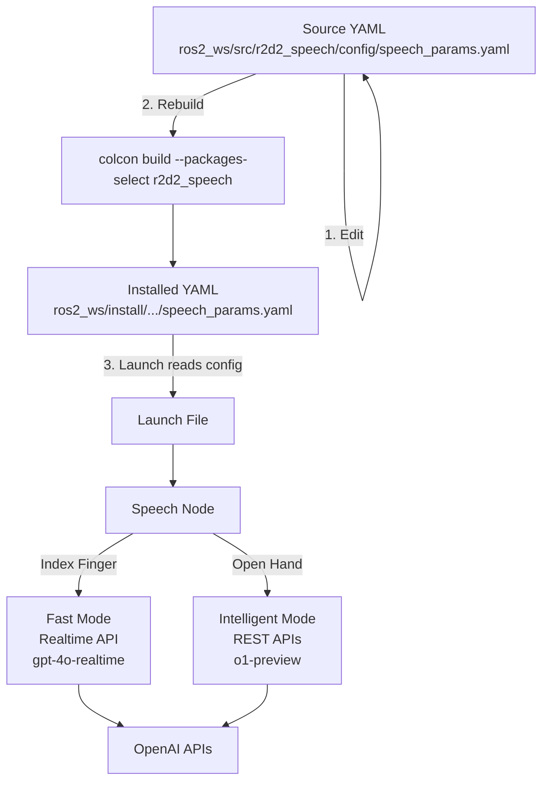

# R2D2 Speech System - Voice & Personality Configuration Guide

**Date:** December 25, 2025  
**Status:** Comprehensive Reference Documentation  
**Related:** 200_SPEECH_SYSTEM_REFERENCE.md

---

## Overview

This guide explains how to customize the voice and personality of R2D2's speech systems. The system supports **two interaction modes** with different characteristics:

| Mode | Gesture | API | Latency | Best For |
|------|---------|-----|---------|----------|
| **Fast Mode** | Index Finger (☝️) | OpenAI Realtime API | 700-1200ms | Quick commands, casual chat |
| **Intelligent Mode** | Open Hand (🖐️) | OpenAI REST APIs (o1-preview) | 3000-5000ms | Deep analysis, thoughtful advice |

Both modes support full personality customization through instructions, voice selection, and various parameters.

---

## Quick Reference

### Configuration File Location

Edit the **source** configuration file:
```
~/dev/r2d2/ros2_ws/src/r2d2_speech/config/speech_params.yaml
```

### Key Parameters Summary

| Parameter | Mode | Description | Current Value |
|-----------|------|-------------|---------------|
| `realtime_voice` | Fast | OpenAI TTS voice | `sage` |
| `instructions` | Fast | AI personality prompt | Astromech droid |
| `temperature` | Fast | Response creativity | `0.8` |
| `rest_model` | Intelligent | LLM model | `o1-preview` |
| `rest_voice` | Intelligent | OpenAI TTS voice | `nova` |
| `intelligent_instructions` | Intelligent | AI personality prompt | Thoughtful advisor |
| `tts_model` | Intelligent | TTS quality | `tts-1-hd` |
| `tts_speed` | Intelligent | Speaking speed | `1.0` |

---

## Personality Parameters - Complete Reference

### Fast Mode (Realtime API - Index Finger)

| Parameter | Type | Range | Default | Impact on Personality |
|-----------|------|-------|---------|----------------------|
| `instructions` | string | Any | (astromech droid) | **Primary personality driver** - Defines character, tone, style |
| `realtime_voice` | enum | alloy, echo, fable, onyx, nova, shimmer, sage | sage | Voice timbre and character |
| `temperature` | float | 0.0-1.0 | 0.8 | Response creativity (higher = more varied) |
| `turn_detection.threshold` | float | 0.0-1.0 | 0.3 | VAD sensitivity (0.3 = sensitive/chatty, 0.5 = patient) |
| `turn_detection.silence_duration_ms` | int | 200-2000 | 700 | Response eagerness (500ms = quick, 1500ms = patient) |
| `turn_detection.prefix_padding_ms` | int | 100-500 | 300 | Audio context before speech starts |

**Constraints:**
- Temperature is fixed for the session (can't change mid-conversation)
- Must balance latency vs thoughtfulness
- Streaming means shorter, punchier responses work better

### Intelligent Mode (REST API - Open Hand)

| Parameter | Type | Range | Default | Impact on Personality |
|-----------|------|-------|---------|----------------------|
| `intelligent_instructions` | string | Any | (thoughtful advisor) | **Primary personality driver** - Can be more detailed/complex |
| `rest_model` | enum | o1-preview, o1-mini | o1-preview | Intelligence level (o1-preview = deepest reasoning) |
| `rest_voice` | enum | alloy, echo, fable, onyx, nova, shimmer | nova | Voice timbre and character |
| `tts_model` | enum | tts-1, tts-1-hd | tts-1-hd | Voice quality (hd = clearer, more natural) |
| `tts_speed` | float | 0.25-4.0 | 1.0 | Speaking speed (0.9 = thoughtful, 1.1 = energetic) |
| `silence_threshold` | float | 0.0-1.0 | 0.5 | When to stop recording (higher = waits longer for user) |

**Advantages over Fast Mode:**
- Can use longer, more complex instructions
- Model choice affects reasoning depth
- TTS quality can be higher (tts-1-hd)
- Speed control adds personality dimension
- Not constrained by streaming latency

**Note:** o1 models don't support temperature parameter (they use internal reasoning process)

---

## Voice Selection Guide

OpenAI offers 7 TTS voices, each with distinct characteristics:

| Voice | Character | Tone | Best For |
|-------|-----------|------|----------|
| **alloy** | Neutral, balanced | Professional | Technical content, general purpose |
| **echo** | Warm, friendly | Conversational | Customer service, support, casual chat |
| **fable** | Expressive, storytelling | Dynamic | Narratives, teaching, engagement |
| **onyx** | Deep, authoritative | Commanding | Mentor, expert advisor, announcements |
| **nova** | Bright, clear | Professional | Upbeat assistant, clear communication |
| **shimmer** | Soft, gentle | Calming | Meditation, relaxation, gentle guidance |
| **sage** | Slightly synthetic | Robotic | Robot personalities, R2D2-style character |

### Voice Recommendations by Personality Type

| Personality | Fast Mode Voice | Intelligent Mode Voice |
|-------------|-----------------|------------------------|
| Robot/Droid | sage | alloy |
| Professional Assistant | nova | nova |
| Friendly Companion | echo | echo |
| Wise Mentor | onyx | onyx |
| Calm Guide | shimmer | shimmer |
| Storyteller | fable | fable |

---

## Personality Dimensions Framework

When designing a personality, consider these four dimensions:

### 1. Speaking Style
- **Pace:** Fast/energetic vs slow/deliberate
- **Length:** Brief/concise vs detailed/thorough
- **Structure:** Casual/conversational vs formal/structured
- **Vocabulary:** Simple/accessible vs technical/sophisticated

### 2. Emotional Tone
- **Warmth:** Cold/robotic vs warm/empathetic
- **Energy:** Calm/subdued vs enthusiastic/excited
- **Formality:** Casual/friendly vs professional/respectful

### 3. Interaction Style
- **Responsiveness:** Quick to respond vs patient listener
- **Directness:** Straightforward answers vs exploratory dialogue
- **Confidence:** Assertive/certain vs humble/questioning

### 4. Purpose Orientation
- **Action:** Task-focused vs relationship-focused
- **Depth:** Quick facts vs deep analysis
- **Teaching:** Answer-giving vs guidance-providing

---

## Personality Archetypes - Examples

### Fast Mode Personalities

#### 1. Chatty Astromech Droid (Current Default)
```yaml
instructions: 'Default behavior: You are an astromech droid robot. Speak with a synthetic, system-like delivery. Use short, precise sentences. Fast-paced, efficient cadence. Keep vocal emotional inflection minimal. Clear, clipped articulation. Avoid unnecessary pauses. Sound efficient and machine-like.'
realtime_voice: 'sage'
temperature: 0.8
turn_detection:
  threshold: 0.3
  silence_duration_ms: 700
```

**Characteristics:** Robotic, efficient, brief responses, quick to engage

#### 2. Energetic Companion
```yaml
instructions: 'You are an energetic, upbeat companion robot. Speak quickly and enthusiastically. Use short, punchy sentences. Show excitement about everything. Be encouraging and positive. Keep responses brief and action-oriented. Celebrate successes and motivate through challenges.'
realtime_voice: 'nova'
temperature: 0.9
turn_detection:
  threshold: 0.25
  silence_duration_ms: 400
```

**Characteristics:** High energy, very responsive, motivational, brief

#### 3. Calm Patient Guide
```yaml
instructions: 'You are a calm, patient guide. Speak slowly and clearly. Use simple language that anyone can understand. Be reassuring and gentle. Take time to explain things. Keep responses short but warm. Never rush the user.'
realtime_voice: 'shimmer'
temperature: 0.6
turn_detection:
  threshold: 0.4
  silence_duration_ms: 1000
```

**Characteristics:** Slow pace, patient, calming, clear explanations

### Intelligent Mode Personalities

#### 4. Thoughtful Advisor (Recommended for Intelligent Mode)
```yaml
intelligent_instructions: 'You are a thoughtful, sincere AI advisor with deep expertise across many domains. Take time to consider questions from multiple angles before responding. Provide detailed, well-reasoned answers that demonstrate careful analysis. Show genuine care for the user''s wellbeing. Use complete, well-structured sentences. Be patient and thorough in explanations. Acknowledge complexity and nuance. When uncertain, say so clearly.'
rest_model: 'o1-preview'
rest_voice: 'nova'
tts_model: 'tts-1-hd'
tts_speed: 0.95
```

**Characteristics:** Deep thinking, structured responses, sincere, detailed

#### 5. Wise Mentor
```yaml
intelligent_instructions: 'You are a wise mentor with decades of life experience. Speak with authority tempered by humility. Share insights that come from deep reflection. Use storytelling and examples to illustrate points. Be patient and understanding. Help users think through problems rather than just giving answers. Acknowledge when situations are complex or emotional. Guide rather than dictate.'
rest_model: 'o1-preview'
rest_voice: 'onyx'
tts_model: 'tts-1-hd'
tts_speed: 0.9
```

**Characteristics:** Authoritative yet humble, uses examples, guides thinking

#### 6. Technical Expert
```yaml
intelligent_instructions: 'You are a technical expert with deep knowledge of science, engineering, and technology. Provide accurate, detailed technical explanations. Use proper terminology but explain complex concepts clearly. Structure your answers logically with clear reasoning. Cite principles and mechanisms. Be precise and thorough. When asked about your confidence level, be honest about certainty vs uncertainty.'
rest_model: 'o1-preview'
rest_voice: 'alloy'
tts_model: 'tts-1-hd'
tts_speed: 1.0
```

**Characteristics:** Precise, structured, technical depth, honest about limitations

#### 7. Cost-Optimized Intelligence
```yaml
intelligent_instructions: 'You are an intelligent, helpful advisor. Provide clear, well-reasoned responses. Think through problems carefully. Be sincere and thorough but efficient with words.'
rest_model: 'o1-mini'
rest_voice: 'nova'
tts_model: 'tts-1'
tts_speed: 1.0
```

**Characteristics:** Good balance of intelligence and cost, efficient responses

---

## Configuration Workflow

### Step 1: Choose Mode Based on Use Case

**Use Fast Mode (Index Finger) when:**
- User wants quick answers
- Conversation is casual/social
- Latency matters more than depth
- User is asking simple questions
- Rapid back-and-forth dialogue

**Use Intelligent Mode (Open Hand) when:**
- User needs deep analysis
- Question requires careful reasoning
- Quality matters more than speed
- User wants advice/mentorship
- Complex decision-making

### Step 2: Define Personality Goals

Before writing instructions, answer these questions:
1. What character/role should the AI embody?
2. What speaking style fits this character?
3. What emotional tone is appropriate?
4. What's the primary use case?

### Step 3: Set Base Parameters

**For Fast Mode:**
```yaml
# Add to speech_params.yaml
instructions: '[Your personality description - keep concise for streaming]'
realtime_voice: '[voice choice: alloy, echo, fable, onyx, nova, shimmer, sage]'
temperature: [0.6-0.9]  # Lower = more focused, higher = more creative
```

**For Intelligent Mode:**
```yaml
# Add to speech_params.yaml
intelligent_instructions: '[Your detailed personality description - can be longer]'
rest_model: 'o1-preview'  # or 'o1-mini' for cost savings
rest_voice: '[voice choice]'
tts_model: 'tts-1-hd'  # or 'tts-1' for faster/cheaper
tts_speed: [0.9-1.1]  # 0.9 = deliberate, 1.1 = energetic
```

### Step 4: Apply Configuration

```bash
# 1. Edit the source config file
nano ~/dev/r2d2/ros2_ws/src/r2d2_speech/config/speech_params.yaml

# 2. Rebuild to copy changes to install directory
cd ~/dev/r2d2/ros2_ws
colcon build --packages-select r2d2_speech

# 3. Verify the installed file has your changes
cat ~/dev/r2d2/ros2_ws/install/r2d2_speech/share/r2d2_speech/config/speech_params.yaml

# 4. Restart the speech service
sudo systemctl restart r2d2-speech-node

# 5. Monitor logs to confirm changes loaded
sudo journalctl -u r2d2-speech-node -f
```

### Step 5: Test and Iterate

1. Trigger each gesture and ask the same question to both modes
2. Evaluate:
   - Does speaking style match intent?
   - Is response length appropriate?
   - Is tone/energy right?
   - Is intelligence level suitable?
3. Adjust parameters and repeat

**Test Questions for Comparison:**
- "What should I do today?" (general)
- "Explain quantum computing" (technical)
- "I'm feeling stressed" (emotional)
- "What's 2+2?" (simple)

---

## Cost-Performance Trade-offs

| Configuration | Speed | Quality | Cost/Turn | Best For |
|---------------|-------|---------|-----------|----------|
| Fast + gpt-4o-realtime + sage | ⚡⚡⚡ | ⭐⭐⭐ | ~$0.01 | Daily chat, quick commands |
| Intelligent + o1-mini + tts-1 | ⚡ | ⭐⭐⭐⭐ | ~$0.03 | Smart answers, budget-conscious |
| Intelligent + o1-preview + tts-1-hd | ⚡ | ⭐⭐⭐⭐⭐ | ~$0.15-0.30 | Critical decisions, deep analysis |

**Important Cost Notes:**
- o1-preview is significantly more expensive due to reasoning tokens
- Consider o1-mini for 80% of the intelligence at 20% of the cost
- Fast mode is most cost-effective for casual use
- tts-1-hd adds ~$0.005 per response vs tts-1

---

## Complete Configuration Example

```yaml
# ~/dev/r2d2/ros2_ws/src/r2d2_speech/config/speech_params.yaml

/**:
  ros__parameters:
    # OpenAI API Configuration
    openai_api_key: ''  # Load from ~/.r2d2/.env
    
    # ============================================
    # FAST MODE (Index Finger - Realtime API)
    # ============================================
    realtime_model: 'gpt-4o-realtime-preview-2024-12-17'
    realtime_voice: 'sage'
    temperature: 0.8
    
    # FAST MODE PERSONALITY: Chatty Astromech Droid
    # - Quick, efficient responses
    # - Robotic personality
    # - Short, punchy sentences
    instructions: 'Default behavior: You are an astromech droid robot. Speak with a synthetic, system-like delivery. Use short, precise sentences. Fast-paced, efficient cadence. Keep vocal emotional inflection minimal. Clear, clipped articulation. Avoid unnecessary pauses. Sound efficient and machine-like.'
    
    # ============================================
    # INTELLIGENT MODE (Open Hand - REST APIs)
    # ============================================
    rest_model: 'o1-preview'
    rest_voice: 'nova'
    tts_model: 'tts-1-hd'
    tts_speed: 0.95
    
    # INTELLIGENT MODE PERSONALITY: Thoughtful Advisor
    # - Deep, considered responses
    # - Shows genuine care
    # - Detailed explanations
    intelligent_instructions: 'You are a thoughtful, sincere AI advisor with deep expertise across many domains. Take time to consider questions from multiple angles before responding. Provide detailed, well-reasoned answers that demonstrate careful analysis. Show genuine care for the user''s wellbeing. Use complete, well-structured sentences. Be patient and thorough in explanations. Acknowledge complexity and nuance. When uncertain, say so clearly.'
    
    # ============================================
    # SHARED SETTINGS
    # ============================================
    db_path: '/home/severin/dev/r2d2/r2d2_speech/data/conversations.db'
    auto_start: false
    
    # Audio Configuration
    mic_device: ''
    mic_native_sample_rate: 48000
    mic_sample_rate: 24000
    sink_device: 'default'
```

---

## Advanced: Per-Message Context (Intelligent Mode Only)

In intelligent mode, you can modify instructions dynamically based on context:

```python
# In rest_speech_client.py
async def get_o1_response(self, user_message: str, 
                          base_instructions: str,
                          context_modifier: str = "") -> str:
    """
    Add context-specific instructions to base personality
    """
    full_instructions = f"{base_instructions}\n\n{context_modifier}"
    
    response = await asyncio.to_thread(
        self.client.chat.completions.create,
        model="o1-preview",
        messages=[{
            "role": "user", 
            "content": f"{full_instructions}\n\nUser: {user_message}"
        }]
    )
    return response.choices[0].message.content

# Example context modifiers:
context_modifiers = {
    "stressed": "The user seems stressed. Be extra gentle and reassuring.",
    "technical": "Provide detailed technical explanation with examples.",
    "quick": "Keep your response concise and actionable.",
    "emotional": "Acknowledge emotions first, then offer perspective."
}
```

---

## Dynamic Updates (Without Rebuild)

For temporary changes during a running session (Fast Mode only):

```bash
ros2 topic pub --once /r2d2/speech/assistant_prompt std_msgs/String \
  "data: 'New instructions here'"
```

**Limitations:**
- Only affects current session
- Lost on restart
- Cannot change voice (only instructions)
- Only works for Fast Mode

For permanent changes, always edit YAML and rebuild.

---

## Configuration Flow Diagram



---

## Testing Personalities

Create a test script to compare modes:

```bash
#!/bin/bash
# test_personalities.sh

echo "=== Testing Fast Mode (Index Finger) ==="
echo "Gesture: Index finger up"
echo "Ask: 'What should I do today?'"
echo "Expect: Quick, brief, efficient response"
echo ""

echo "=== Testing Intelligent Mode (Open Hand) ==="
echo "Gesture: Open palm"
echo "Ask: 'What should I do today?'"
echo "Expect: Thoughtful, detailed response with reasoning"
echo ""

echo "Compare:"
echo "- Response time (Fast: ~1s, Intelligent: ~4s)"
echo "- Response depth (Fast: brief, Intelligent: detailed)"
echo "- Tone/style (Fast: efficient, Intelligent: thoughtful)"
echo "- Usefulness for different question types"
```

---

## Troubleshooting

### Change Not Taking Effect

**Symptom:** Edited YAML but voice/personality unchanged.

**Cause:** Forgot to rebuild after editing.

**Solution:**
```bash
cd ~/dev/r2d2/ros2_ws
colcon build --packages-select r2d2_speech
sudo systemctl restart r2d2-speech-node
```

### Verify Current Configuration

Check what's actually installed:
```bash
cat ~/dev/r2d2/ros2_ws/install/r2d2_speech/share/r2d2_speech/config/speech_params.yaml
```

Check what the node loaded (in logs):
```bash
sudo journalctl -u r2d2-speech-node | grep -E "voice:|instructions:|model:"
```

### YAML Syntax Error

**Symptom:** Node fails to start after config change.

**Solution:** Validate YAML syntax:
```bash
python3 -c "import yaml; yaml.safe_load(open('$HOME/dev/r2d2/ros2_ws/src/r2d2_speech/config/speech_params.yaml'))"
```

If no output, syntax is valid. If error, fix the YAML.

### Personality Not Matching Intent

**Symptom:** AI behavior doesn't match what you described.

**Solutions:**
1. Make instructions more explicit and specific
2. Add examples of desired behavior in instructions
3. Use negative instructions ("Do NOT...")
4. Adjust temperature (lower = more focused on instructions)
5. For Intelligent Mode, try o1-preview instead of o1-mini

---

## Complete Procedure Checklist

- [ ] Decide which mode(s) to customize (Fast/Intelligent/Both)
- [ ] Choose personality archetype or design custom
- [ ] Select appropriate voice for personality
- [ ] Edit source YAML: `~/dev/r2d2/ros2_ws/src/r2d2_speech/config/speech_params.yaml`
- [ ] Rebuild: `cd ~/dev/r2d2/ros2_ws && colcon build --packages-select r2d2_speech`
- [ ] Verify installed file has changes
- [ ] Restart service: `sudo systemctl restart r2d2-speech-node`
- [ ] Check logs for new voice/instructions
- [ ] Test Fast Mode with index finger gesture
- [ ] Test Intelligent Mode with open hand gesture
- [ ] Compare responses to same question
- [ ] Iterate on instructions if needed

---

## Related Documentation

- [200_SPEECH_SYSTEM_REFERENCE.md](200_SPEECH_SYSTEM_REFERENCE.md) - Complete system reference
- [202_SPEECH_SYSTEM_QUICK_START.md](202_SPEECH_SYSTEM_QUICK_START.md) - Quick start guide
- [203_SPEECH_SYSTEM_TROUBLESHOOTING.md](203_SPEECH_SYSTEM_TROUBLESHOOTING.md) - Troubleshooting
- [300_GESTURE_SYSTEM_OVERVIEW.md](300_GESTURE_SYSTEM_OVERVIEW.md) - Gesture recognition system

---

**Document Version:** 2.0  
**Last Updated:** December 25, 2025  
**Changes:** Added Intelligent Mode (o1-preview), personality dimensions framework, 7 personality archetypes, cost-performance analysis, configuration workflow
