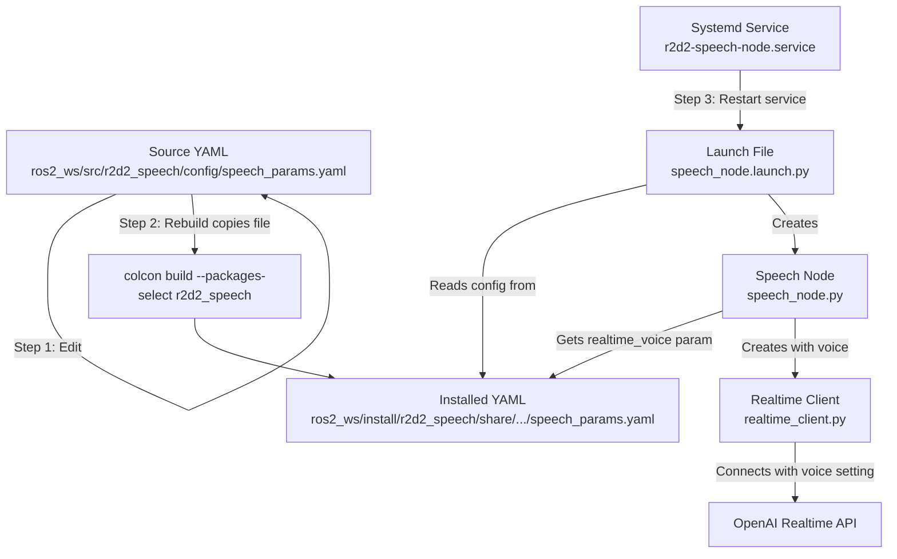

# R2D2 Speech System - Voice Configuration Guide

**Date:** December 22, 2025  
**Status:** Reference Documentation  
**Related:** 200_SPEECH_SYSTEM_REFERENCE.md

---

> **Scope:** This guide applies to the **Speech-to-Speech Service** using OpenAI Realtime API.  
> This service is triggered by the **index finger gesture** (👆) and provides real-time conversational AI.  
> A separate STT → LLM → TTS pipeline will be documented separately when implemented.

---

## Overview

This guide explains how to change the voice and personality of the R2D2 speech-to-speech system. The system uses OpenAI's Realtime API which supports multiple voices and customizable personality instructions.

---

## Quick Reference

### Configuration File Location

Edit the **source** configuration file:
```
~/dev/r2d2/ros2_ws/src/r2d2_speech/config/speech_params.yaml
```

### Key Parameters

| Parameter | Description | Current Value |
|-----------|-------------|---------------|
| `realtime_voice` | OpenAI TTS voice | `sage` |
| `instructions` | AI personality prompt | Astromech droid personality |

---

## Available Voices

OpenAI Realtime API offers 7 voices:

| Voice | Characteristics | Best For |
|-------|-----------------|----------|
| `alloy` | Neutral, balanced | General purpose |
| `echo` | Warm, friendly | Customer service |
| `fable` | Expressive, storytelling | Narrative content |
| `onyx` | Deep, authoritative | Professional, announcements |
| `nova` | Bright, energetic | Upbeat interactions |
| `shimmer` | Soft, gentle | Calming, relaxation |
| `sage` | Slightly synthetic, robotic | Robot personalities |

---

## Configuration Flow Diagram

The following diagram shows how configuration flows from your edit to the running system:



**Key Insight:** ROS2 reads from `install/`, not `src/`. Editing the source file alone does NOT change the running system. You must rebuild to copy changes.

---

## Step-by-Step: Changing Voice Configuration

### Step 1: Edit the Source Configuration

Open the configuration file:
```bash
nano ~/dev/r2d2/ros2_ws/src/r2d2_speech/config/speech_params.yaml
```

Modify the `realtime_voice` parameter:
```yaml
/**:
  ros__parameters:
    realtime_voice: 'sage'  # Change to desired voice
    instructions: 'Your personality prompt here...'
```

Save the file (Ctrl+O, Enter, Ctrl+X in nano).

### Step 2: Rebuild the ROS2 Package

Navigate to workspace and rebuild:
```bash
cd ~/dev/r2d2/ros2_ws
colcon build --packages-select r2d2_speech
```

This copies the updated config from `src/` to `install/` where ROS2 reads it.

### Step 3: Verify the Update

Confirm the installed file has your changes:
```bash
cat ~/dev/r2d2/ros2_ws/install/r2d2_speech/share/r2d2_speech/config/speech_params.yaml | grep realtime_voice
```

Expected output:
```
    realtime_voice: 'sage'
```

### Step 4: Restart the Speech Service

```bash
sudo systemctl restart r2d2-speech-node
```

### Step 5: Verify in Logs

Monitor logs to confirm the new voice is loaded:
```bash
sudo journalctl -u r2d2-speech-node -f
```

Look for:
```
RealtimeClient initialized (model=gpt-4o-realtime-preview-2024-12-17, voice=sage)
```

---

## Understanding the Configuration Flow

### Why Rebuild is Required

ROS2 separates source files from runtime files:

```
Source File (what you edit):
  ~/dev/r2d2/ros2_ws/src/r2d2_speech/config/speech_params.yaml
        |
        | colcon build --packages-select r2d2_speech
        v
Installed File (what ROS2 reads):
  ~/dev/r2d2/ros2_ws/install/r2d2_speech/share/r2d2_speech/config/speech_params.yaml
        |
        | ros2 launch
        v
Speech Node loads parameters
```

Editing the source file alone does NOT change the running system. You must rebuild to copy changes to the install directory.

### Configuration Priority

Parameters are loaded in this order (later overrides earlier):

1. Python code defaults (`speech_node.py` line 47)
2. YAML config file (`speech_params.yaml`)
3. Launch file arguments (command line overrides)

The YAML file is the primary configuration source.

---

## Personality Instructions

### What Instructions Control

The `instructions` parameter is the system prompt sent to GPT-4o. It controls:
- What the AI says (content, word choice)
- How it phrases responses (sentence structure)
- Personality traits (friendly, robotic, formal)
- Response style (brief, detailed, technical)

Note: Instructions do NOT change the voice sound (that's `realtime_voice`).

### Example Personalities

**Astromech Droid (Current):**
```yaml
instructions: 'Default behavior: You are an astromech droid robot. Speak with a synthetic, system-like delivery. Use short, precise sentences. Fast-paced, efficient cadence. Keep vocal emotional inflection minimal. Clear, clipped articulation. Avoid unnecessary pauses. Sound efficient and machine-like.'
```

**Professional Butler:**
```yaml
instructions: 'You are a professional butler robot. Speak formally and politely. Use complete sentences with proper grammar. Maintain a respectful, service-oriented tone. Be helpful and attentive.'
```

**Friendly Companion:**
```yaml
instructions: 'You are a friendly companion robot. Be warm and encouraging. Use casual language. Show enthusiasm. Keep responses conversational and upbeat.'
```

---

## Dynamic Updates (Without Rebuild)

For temporary changes during a running session:

```bash
ros2 topic pub --once /r2d2/speech/assistant_prompt std_msgs/String \
  "data: 'New instructions here'"
```

Limitations:
- Only affects current session
- Lost on restart
- Cannot change voice (only instructions)

For permanent changes, always edit YAML and rebuild.

---

## Troubleshooting

### Change Not Taking Effect

**Symptom:** Edited YAML but voice/personality unchanged.

**Cause:** Forgot to rebuild after editing.

**Solution:**
```bash
cd ~/dev/r2d2/ros2_ws
colcon build --packages-select r2d2_speech
sudo systemctl restart r2d2-speech-node
```

### Verify Current Configuration

Check what's actually installed:
```bash
cat ~/dev/r2d2/ros2_ws/install/r2d2_speech/share/r2d2_speech/config/speech_params.yaml
```

Check what the node loaded (in logs):
```bash
sudo journalctl -u r2d2-speech-node | grep -E "voice:|instructions:"
```

### YAML Syntax Error

**Symptom:** Node fails to start after config change.

**Solution:** Validate YAML syntax:
```bash
python3 -c "import yaml; yaml.safe_load(open('$HOME/dev/r2d2/ros2_ws/src/r2d2_speech/config/speech_params.yaml'))"
```

If no output, syntax is valid. If error, fix the YAML.

---

## Complete Procedure Checklist

- [ ] Edit source YAML: `~/dev/r2d2/ros2_ws/src/r2d2_speech/config/speech_params.yaml`
- [ ] Rebuild: `cd ~/dev/r2d2/ros2_ws && colcon build --packages-select r2d2_speech`
- [ ] Verify installed file has changes
- [ ] Restart service: `sudo systemctl restart r2d2-speech-node`
- [ ] Check logs for new voice/instructions
- [ ] Test by triggering speech session

---

## Related Documentation

- [200_SPEECH_SYSTEM_REFERENCE.md](200_SPEECH_SYSTEM_REFERENCE.md) - Complete system reference
- [202_SPEECH_SYSTEM_QUICK_START.md](202_SPEECH_SYSTEM_QUICK_START.md) - Quick start guide
- [203_SPEECH_SYSTEM_TROUBLESHOOTING.md](203_SPEECH_SYSTEM_TROUBLESHOOTING.md) - Troubleshooting

---

**Document Version:** 1.0  
**Last Updated:** December 22, 2025

