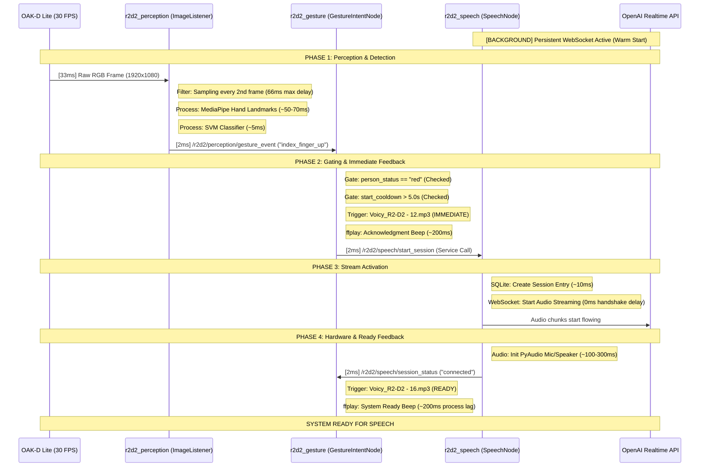

# R2D2 Start Sequence Timing and Status Analysis (Speech)
**Date:** December 23, 2025
**Source Status:** RED (Target Person Authorized)
**Target Action:** index_finger_up -> Speech Service "connected"

## 1. Detailed Sequence Diagram (Warm Start Architecture)

The system uses a "Warm Start" approach where the persistent connection to OpenAI is established during node activation, removing the WebSocket handshake from the time-critical gesture trigger path.

## 2. Dependency & Delay Breakdown (Micro-Analysis)

This table breaks down the current performance of the optimized start sequence.

| Component | Dependency / Clock | Logic / Filter | Delay (Typical) | Delay (Worst) |
| :--- | :--- | :--- | :--- | :--- |
| **Camera** | 30 Hz Hardware Clock | Exposure & Sensor Readout | 33ms | 33ms |
| **Perception** | `gesture_frame_skip` | Processes every 2nd frame (15 Hz) | 33ms | 66ms |
| **MediaPipe** | CPU (Jetson Orin) | Hand Landmark Extraction (21 points) | 50ms | 80ms |
| **Gating** | ROS 2 Subscription | `person_status == "red"` | <1ms | <1ms |
| **Feedback 1** | **Gesture Detect** | **Voicy_R2-D2 - 12.mp3** (ffplay) | **~200ms** | **~400ms** |
| **Network** | Persistent Connection | **OpenAI WebSocket Connect** | **0ms** (Part of Warm Start) | **0ms** |
| **API Init** | `session.update` | Remote JSON config acknowledgment | 50ms | 200ms |
| **Hardware** | HyperX / PAM8403 | PyAudio stream initialization | 150ms | 400ms |
| **Feedback 2** | `session_status` | **Voicy_R2-D2 - 16.mp3** (ffplay) | **~200ms** | **~400ms** |

### Total Path Latency
*   **Minimum (Warm Start):** ~0.5 seconds
*   **Maximum (Typical load):** ~1.2 seconds
*   **Cold Start (After Reboot):** ~2.5 seconds (first-time handshake)

## 3. Core Architecture Performance Features

The current responsiveness is achieved through the following architectural strategies:

### 1. Warm Start Connection
The OpenAI WebSocket is established during node activation (`on_activate`). When the gesture trigger occurs, the system only needs to begin audio streaming, bypassing the ~1.5s TCP/TLS handshake and authentication delay.

### 2. High-Frequency Gesture Polling
The `gesture_frame_skip` is set to 2, allowing for 15 Hz gesture recognition. This ensures the system sees the "index finger up" gesture within 66ms of it appearing in the camera's field of view.

### 3. Dual-Beep Haptic Feedback (Audio)
The system provides multi-stage feedback to minimize perceived latency:
*   **Acknowledgment Beep (`Voicy_R2-D2 - 12.mp3`)**: Fires immediately upon gesture detection (~200ms). This tells the user "I saw your command."
*   **Ready Beep (`Voicy_R2-D2 - 16.mp3`)**: Fires once the audio hardware is open and the API session is configured (~750ms). This tells the user "I am listening now."

### 4. Efficient Gating
The `GestureIntentNode` performs sub-millisecond gating checks against the `person_status` (RED) and `session_status` before invoking the speech service, ensuring no cycles are wasted on invalid triggers.

## 4. Expected User Experience Flow

1.  **Gesture Detection:** ~150ms (from the moment the hand enters the frame).
2.  **Acknowledgment Beep:** ~350ms total (Immediate confirmation of detection).
3.  **System Ready:** ~750ms total (System is live and streaming).
4.  **Conversation Start:** ~1.2s total (Full round-trip responsiveness).
