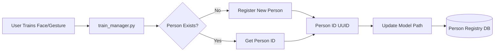

# Person Management System Reference

**Date:** December 17, 2025  
**Status:** Phase 1 Complete, Phase 2-4 Planned  
**Platform:** NVIDIA Jetson AGX Orin 64GB + ROS 2 Humble

---

## Executive Summary

The Person Management System provides a centralized SQLite-based registry for managing person entities in R2D2. Each person is a first-class entity that links face recognition models, gesture recognition models, and (future) Google account credentials. The system uses explicit SQL column queries to ensure forward compatibility as the schema evolves.

**Key Features:**
- Centralized person entity management
- Links face and gesture recognition models
- Extensible for Google account integration
- Forward-compatible database schema
- CLI and programmatic API access
- Auto-migration for existing models

---

## System Architecture

### Current Implementation (Phase 1)

```
Person Registry Architecture:

┌─────────────────────────────────────────────────────────┐
│                  Person Entity                          │
│  ┌─────────────────────────────────────────────────┐   │
│  │ UUID-based ID                                   │   │
│  │ Name (normalized + display)                     │   │
│  │ Timestamps (created/updated)                    │   │
│  │ Face Model Link (.xml)                          │   │
│  │ Gesture Model Link (.pkl)                       │   │
│  │ Google Account (future)                         │   │
│  │ Extensible Metadata (JSON)                      │   │
│  └─────────────────────────────────────────────────┘   │
└─────────────────────────────────────────────────────────┘
                          ↕
┌─────────────────────────────────────────────────────────┐
│              SQLite Database (persons.db)                │
│  - Forward-compatible explicit column queries            │
│  - No SELECT * (future-proof)                            │
│  - Extensible schema design                              │
└─────────────────────────────────────────────────────────┘
                          ↕
┌──────────────────┬──────────────────┬──────────────────┐
│  Training System │  ROS 2 Nodes     │  Web Dashboard   │
│  (train_manager) │  (query person)  │  (UI management) │
└──────────────────┴──────────────────┴──────────────────┘
```

**Core Components:**
- **Database:** `tests/face_recognition/data/persons.db`
- **Registry API:** `tests/face_recognition/person_registry.py`
- **CLI Manager:** `tests/face_recognition/person_manager.py`
- **Integration:** Automatic registration in `train_manager.py`

---

## Database Schema

### Current Schema (Phase 1)

```sql
CREATE TABLE persons (
    id TEXT PRIMARY KEY,           -- UUID (e.g., "a3f2b1c4-...")
    name TEXT UNIQUE NOT NULL,     -- Normalized name (lowercase)
    display_name TEXT,             -- Original case name
    created_at TEXT NOT NULL,      -- ISO timestamp
    updated_at TEXT NOT NULL,      -- ISO timestamp
    face_model_path TEXT,          -- Path to .xml LBPH model
    gesture_model_path TEXT,       -- Path to .pkl SVM model
    google_account TEXT,           -- Email (NULL for now)
    metadata TEXT                  -- JSON for extensibility
);
```

**Design Principles:**
- **UUID-based IDs:** Globally unique, no collisions
- **Normalized names:** Lowercase for case-insensitive lookup
- **Display names:** Preserve original capitalization for UI
- **Explicit columns:** All queries specify columns (no `SELECT *`)
- **Forward compatibility:** New columns can be added without breaking existing code
- **Extensible metadata:** JSON field for future attributes

### Future Schema Extensions (Phase 2-4)

**Phase 2: Google Account Integration**
```sql
-- New columns to be added:
ALTER TABLE persons ADD COLUMN google_account_refresh_token TEXT;
ALTER TABLE persons ADD COLUMN google_account_expires_at TEXT;
ALTER TABLE persons ADD COLUMN profile_picture_path TEXT;
ALTER TABLE persons ADD COLUMN email_verified BOOLEAN DEFAULT 0;
```

**Phase 3: User Preferences**
```sql
-- Additional columns:
ALTER TABLE persons ADD COLUMN voice_preference TEXT;  -- TTS voice ID
ALTER TABLE persons ADD COLUMN speech_speed REAL DEFAULT 1.0;
ALTER TABLE persons ADD COLUMN preferred_language TEXT DEFAULT 'en';
ALTER TABLE persons ADD COLUMN conversation_style TEXT DEFAULT 'casual';
```

**Phase 4: Advanced Features**
```sql
-- Future enhancements:
ALTER TABLE persons ADD COLUMN calendar_sync_enabled BOOLEAN DEFAULT 0;
ALTER TABLE persons ADD COLUMN activity_log_enabled BOOLEAN DEFAULT 1;
ALTER TABLE persons ADD COLUMN relationship_tags TEXT;  -- JSON array
ALTER TABLE persons ADD COLUMN privacy_level INTEGER DEFAULT 1;
```

---

## Data Flow

### Training Integration



### Model Linkage

```
Person Entity (UUID)
    ├─→ Face Recognition Model
    │   └─ data/face_recognition/models/{name}_lbph.xml
    ├─→ Gesture Recognition Model
    │   └─ data/gesture_recognition/models/{name}_gesture_classifier.pkl
    └─→ Google Account (future)
        └─ OAuth tokens, profile data
```

### Query Patterns

```
Training System:
  register_person(name) → person_id
  update_face_model(person_id, model_path)
  update_gesture_model(person_id, model_path)

ROS 2 Nodes (future):
  get_person(name) → person_data
  query models, preferences, account links

Web Dashboard (future):
  list_persons() → person list
  CRUD operations for person management
```

---

## API Reference

### PersonRegistry Class

**Location:** `tests/face_recognition/person_registry.py`

#### Initialization

```python
from person_registry import PersonRegistry

# Default database location (data/persons.db)
registry = PersonRegistry()

# Custom database location
registry = PersonRegistry(db_path='/custom/path/persons.db')
```

#### Core Methods

##### `register_person(name: str) -> str`

Register a new person in the registry.

```python
person_id = registry.register_person("Alice")
# Returns: UUID string (e.g., "a3f2b1c4-5d6e-7f8g-9h0i-1j2k3l4m5n6o")

# Raises ValueError if person already exists
```

**Behavior:**
- Normalizes name to lowercase for storage
- Preserves display_name with original capitalization
- Generates UUID v4 for person ID
- Sets created_at and updated_at timestamps

---

##### `get_person(name: str) -> Optional[Dict]`

Retrieve person by name.

```python
person = registry.get_person("alice")  # Case-insensitive

if person:
    print(f"Person ID: {person['id']}")
    print(f"Display Name: {person['display_name']}")
    print(f"Face Model: {person['face_model_path']}")
    print(f"Gesture Model: {person['gesture_model_path']}")
    print(f"Google Account: {person['google_account']}")
    print(f"Metadata: {person['metadata']}")
```

**Returns:**
```python
{
    'id': 'uuid-string',
    'name': 'alice',
    'display_name': 'Alice',
    'created_at': '2025-12-17T10:30:00.123456',
    'updated_at': '2025-12-17T11:45:00.654321',
    'face_model_path': '/path/to/alice_lbph.xml',
    'gesture_model_path': '/path/to/alice_gesture_classifier.pkl',
    'google_account': None,
    'metadata': {}
}
```

---

##### `get_person_by_id(person_id: str) -> Optional[Dict]`

Retrieve person by UUID.

```python
person = registry.get_person_by_id("a3f2b1c4-5d6e-7f8g-9h0i-1j2k3l4m5n6o")
```

---

##### `list_persons() -> List[Dict]`

List all registered persons.

```python
persons = registry.list_persons()

for person in persons:
    print(f"{person['display_name']}: "
          f"face={'✓' if person['face_model_path'] else '✗'}, "
          f"gesture={'✓' if person['gesture_model_path'] else '✗'}")
```

**Returns:** Simplified list with subset of fields
```python
[
    {
        'id': 'uuid',
        'name': 'alice',
        'display_name': 'Alice',
        'created_at': '2025-12-17T10:30:00',
        'face_model_path': '/path/to/model.xml',
        'gesture_model_path': '/path/to/model.pkl'
    },
    ...
]
```

---

##### `update_face_model(person_id: str, model_path: str)`

Link face recognition model to person.

```python
registry.update_face_model(person_id, 
    "/home/severin/dev/r2d2/data/face_recognition/models/alice_lbph.xml")
```

**Updates:**
- Sets `face_model_path` to provided path
- Updates `updated_at` timestamp

---

##### `update_gesture_model(person_id: str, model_path: str)`

Link gesture recognition model to person.

```python
registry.update_gesture_model(person_id,
    "/home/severin/dev/r2d2/data/gesture_recognition/models/alice_gesture_classifier.pkl")
```

**Updates:**
- Sets `gesture_model_path` to provided path
- Updates `updated_at` timestamp

---

##### `delete_person(person_id: str)`

Remove person from registry.

```python
registry.delete_person(person_id)
```

**Note:** Does NOT delete model files - only removes registry entry.

---

##### `auto_migrate() -> Dict[str, int]`

Scan existing models and auto-register persons.

```python
results = registry.auto_migrate()
print(f"Migrated: {results['migrated']}")
print(f"Skipped: {results['skipped']}")
print(f"Errors: {results['errors']}")
```

**Scans:**
- `data/face_recognition/models/*.yml`
- `data/gesture_recognition/models/*_gesture_classifier.pkl`

---

## Integration Guide

### For Training Systems

**Automatic Registration (Recommended):**

Already integrated in `train_manager.py`:

```python
# After successful face training
person = self.person_registry.get_person(person_name)
if not person:
    person_id = self.person_registry.register_person(person_name)
else:
    person_id = person['id']
self.person_registry.update_face_model(person_id, str(model_file))

# After successful gesture training
person = self.person_registry.get_person(person_name)
if not person:
    person_id = self.person_registry.register_person(person_name)
else:
    person_id = person['id']
self.person_registry.update_gesture_model(person_id, str(model_file))
```

---

### For ROS 2 Nodes (Future)

**Query Person Information:**

```python
from person_registry import PersonRegistry

class MyNode(Node):
    def __init__(self):
        super().__init__('my_node')
        self.person_registry = PersonRegistry()
    
    def on_person_recognized(self, person_name):
        # Get person details
        person = self.person_registry.get_person(person_name)
        
        if person:
            # Load preferences, check account links, etc.
            voice_preference = person['metadata'].get('voice', 'default')
            # Use person-specific settings
```

---

### For Web Dashboard (Future)

**Person Management UI:**

```python
from person_registry import PersonRegistry
from fastapi import FastAPI, HTTPException

app = FastAPI()
registry = PersonRegistry()

@app.get("/api/persons")
async def list_persons():
    return registry.list_persons()

@app.get("/api/persons/{person_name}")
async def get_person(person_name: str):
    person = registry.get_person(person_name)
    if not person:
        raise HTTPException(status_code=404, detail="Person not found")
    return person

@app.post("/api/persons")
async def create_person(name: str):
    try:
        person_id = registry.register_person(name)
        return {"person_id": person_id}
    except ValueError as e:
        raise HTTPException(status_code=400, detail=str(e))
```

---

## Current Features

### Person Registration

**Automatic:**
- Triggered during face/gesture training
- No manual intervention required
- Idempotent (safe to call multiple times)

**Manual:**
- Via CLI: `python3 person_manager.py`
- Via API: `registry.register_person(name)`

### Model Linking

**Face Recognition:**
- LBPH models (.xml format)
- Path stored in `face_model_path`
- Updated automatically after training

**Gesture Recognition:**
- SVM classifier models (.pkl format)
- Path stored in `gesture_model_path`
- Updated automatically after training

### Person Management

**Via CLI (person_manager.py):**
1. List all persons
2. View person details
3. Create new person
4. Delete person (registry only)
5. Migrate existing models
6. Exit

**Via Training Manager:**
- Option [14]: Manage persons (launches person_manager.py)

---

## Planned Features (Roadmap)

### Phase 2: Google Account Integration (Q1 2026)

**OAuth 2.0 Flow:**
```
User → Web Dashboard → OAuth Consent → Google
Google → Authorization Code → Exchange for Tokens
Store: refresh_token (encrypted), access_token (temp), expires_at
```

**Features:**
- Link Google account to person entity
- Profile picture sync from Google
- Email-based person lookup
- Secure token storage (encryption at rest)
- Auto-refresh expired tokens

**Schema Extensions:**
```sql
ALTER TABLE persons ADD COLUMN google_account TEXT;  -- email@gmail.com
ALTER TABLE persons ADD COLUMN google_account_refresh_token TEXT;  -- encrypted
ALTER TABLE persons ADD COLUMN google_account_expires_at TEXT;
ALTER TABLE persons ADD COLUMN profile_picture_path TEXT;
ALTER TABLE persons ADD COLUMN email_verified BOOLEAN DEFAULT 0;
```

**New Methods:**
```python
def link_google_account(person_id, google_email, oauth_tokens):
    """Link Google account with OAuth credentials"""
    
def unlink_google_account(person_id):
    """Remove Google account link"""
    
def get_person_by_email(email):
    """Lookup person by Google account email"""
    
def refresh_google_token(person_id):
    """Refresh expired OAuth token"""
```

---

### Phase 3: Database Writeback & Sync (Q2 2026)

**Cloud Synchronization:**
- Firebase Realtime Database or Supabase
- Offline-first architecture
- Conflict resolution (last-write-wins or manual)
- Backup to cloud storage

**Multi-Device Support:**
- Sync person registry across multiple R2D2 units
- Centralized person management
- Device-specific preferences override

**Features:**
- Automatic backup to cloud
- Manual export/import
- Version history
- Rollback capability

---

### Phase 4: Advanced Features (Q3 2026+)

**Multi-User Conversation History:**
- Per-person conversation logs
- Context retention across sessions
- Searchable conversation archive

**Per-Person Preferences:**
- Voice selection (TTS voice ID)
- Speech speed adjustment
- Preferred language
- Conversation style (formal/casual/friendly)
- Topic interests

**Activity Logging:**
- Interaction timestamps
- Session duration tracking
- Gesture usage statistics
- Speech service utilization

**Relationship Graphs:**
- Family relationships
- Friend groups
- Work colleagues
- Custom tags

**Calendar Integration:**
- Sync with Google Calendar
- Event reminders
- Schedule-aware interactions
- Birthday tracking

---

## Database Design

### Forward Compatibility Strategy

**Problem:** Adding new columns breaks code using `SELECT *`

**Solution:** Explicit column queries everywhere

**Example:**
```python
# ✓ GOOD - Forward compatible
QUERY_GET_PERSON = """
    SELECT id, name, display_name, created_at, updated_at,
           face_model_path, gesture_model_path, google_account, metadata
    FROM persons WHERE name = ?
"""

# ✗ BAD - Breaks when schema changes
cursor.execute("SELECT * FROM persons WHERE name = ?", (name,))
```

**Benefits:**
- New columns don't break existing code
- Clear documentation of required fields
- Better performance (only fetches needed columns)
- Explicit mapping in `_row_to_dict()` method

---

### Extensible Metadata Field

**Purpose:** Store arbitrary data without schema changes

**Format:** JSON string

**Usage:**
```python
person = registry.get_person("alice")

# Add custom metadata
metadata = person['metadata']
metadata['voice_preference'] = 'en-US-Female-1'
metadata['favorite_color'] = 'blue'
metadata['nickname'] = 'Ali'

# Update in database
conn = registry._get_connection()
cursor = conn.cursor()
cursor.execute("""
    UPDATE persons 
    SET metadata = ?, updated_at = ?
    WHERE id = ?
""", (json.dumps(metadata), datetime.now().isoformat(), person['id']))
conn.commit()
conn.close()
```

---

### Security Considerations

**Current (Phase 1):**
- No sensitive data stored
- Database file permissions: 644 (owner write, all read)
- Local access only

**Future (Phase 2+):**
- **OAuth tokens:** Encrypt at rest (AES-256)
- **Google account:** Email only (public info)
- **Refresh tokens:** Never log or expose
- **GDPR compliance:** Data export, right to deletion
- **Data retention:** Configurable retention policies

**Encryption Strategy:**
```python
from cryptography.fernet import Fernet

class EncryptedPersonRegistry(PersonRegistry):
    def __init__(self, encryption_key):
        super().__init__()
        self.cipher = Fernet(encryption_key)
    
    def store_refresh_token(self, person_id, token):
        encrypted = self.cipher.encrypt(token.encode())
        # Store encrypted token in database
    
    def get_refresh_token(self, person_id):
        encrypted = # fetch from database
        return self.cipher.decrypt(encrypted).decode()
```

---

## Usage Examples

### Complete Workflow

```python
from person_registry import PersonRegistry

# Initialize
registry = PersonRegistry()

# Register new person
person_id = registry.register_person("Alice")

# Link face model (after training)
registry.update_face_model(
    person_id, 
    "/home/severin/dev/r2d2/data/face_recognition/models/alice_lbph.xml"
)

# Link gesture model (after training)
registry.update_gesture_model(
    person_id,
    "/home/severin/dev/r2d2/data/gesture_recognition/models/alice_gesture_classifier.pkl"
)

# Retrieve person
person = registry.get_person("alice")
print(f"Person: {person['display_name']}")
print(f"Face Model: {person['face_model_path']}")
print(f"Gesture Model: {person['gesture_model_path']}")

# List all persons
persons = registry.list_persons()
for p in persons:
    face_status = "✓" if p['face_model_path'] else "✗"
    gesture_status = "✓" if p['gesture_model_path'] else "✗"
    print(f"{p['display_name']}: face={face_status}, gesture={gesture_status}")

# Delete person
registry.delete_person(person_id)
```

---

### Migration Script

```python
from person_registry import PersonRegistry

registry = PersonRegistry()

# Auto-migrate existing models
results = registry.auto_migrate()

print(f"Migration Results:")
print(f"  Migrated: {results['migrated']}")
print(f"  Skipped: {results['skipped']}")
print(f"  Errors: {results['errors']}")
```

---

## Testing & Validation

### Current Test Coverage

**Test Script:** `tests/face_recognition/test_person_registry.py`

**Tests:**
1. ✅ PersonRegistry import and initialization
2. ✅ Database creation
3. ✅ Auto-migration (with no existing models)
4. ✅ PersonManager import
5. ✅ TrainManager integration

**Manual Testing:**
- Register person → verify in database
- Update models → verify paths stored
- List persons → verify all returned
- Delete person → verify removed
- Auto-migrate → verify existing models linked

---

### Future Test Suite

**Unit Tests:**
- [ ] Register person (success/duplicate)
- [ ] Get person (found/not found)
- [ ] Update models (valid/invalid paths)
- [ ] Delete person (existing/non-existing)
- [ ] List persons (empty/populated)
- [ ] Auto-migrate (various scenarios)

**Integration Tests:**
- [ ] Training workflow end-to-end
- [ ] ROS 2 node queries
- [ ] Web dashboard CRUD operations
- [ ] Multi-threading safety
- [ ] Database corruption recovery

**Security Tests:**
- [ ] SQL injection prevention
- [ ] Token encryption/decryption
- [ ] Access control
- [ ] Data export compliance

---

## File Reference

### Source Files

```
tests/face_recognition/
├── person_registry.py          (350 lines) - Core registry class
├── person_manager.py            (180 lines) - CLI manager
├── train_manager.py             (MODIFIED) - Training integration
├── test_person_registry.py      (50 lines) - Test script
└── data/
    └── persons.db               (SQLite database)
```

### Related Files

```
data/
├── face_recognition/
│   └── models/
│       └── {name}_lbph.xml      (Linked via face_model_path)
└── gesture_recognition/
    └── models/
        └── {name}_gesture_classifier.pkl  (Linked via gesture_model_path)
```

---

## Related Documentation

### Primary Documentation
- [001_ARCHITECTURE_OVERVIEW.md](001_ARCHITECTURE_OVERVIEW.md) - System architecture
- [300_GESTURE_SYSTEM_OVERVIEW.md](300_GESTURE_SYSTEM_OVERVIEW.md) - Gesture system
- [303_GESTURE_TRAINING_GUIDE.md](303_GESTURE_TRAINING_GUIDE.md) - Training guide
- [README.md](README.md) - Project overview

### Implementation Details
- `_ANALYSIS_AND_DOCUMENTATION/PERSON_ENTITY_MANAGEMENT_COMPLETE.md` - Implementation summary
- `_ANALYSIS_AND_DOCUMENTATION/GESTURE_IMPLEMENTATION_INDEX.md` - Full documentation index

---

## FAQ

**Q: Can I have multiple persons in the system?**  
A: Yes! The system supports unlimited persons, each with their own face and gesture models.

**Q: What happens if I delete a person from the registry?**  
A: Only the registry entry is removed. Model files remain on disk.

**Q: How do I add a new person?**  
A: Use the training workflow (option 1 for face, option 8 for gestures). The person is automatically registered.

**Q: Can I manually manage persons without training?**  
A: Yes, use `python3 person_manager.py` or option [14] in train_manager.py.

**Q: Is the person registry synced across devices?**  
A: Not yet. Cloud sync is planned for Phase 3 (Q2 2026).

**Q: How do I link a Google account?**  
A: This feature is planned for Phase 2 (Q1 2026). OAuth integration will be added.

**Q: What's the metadata field for?**  
A: It's a JSON field for storing arbitrary data without schema changes. Use it for custom attributes.

---

**Document Version:** 1.0  
**Last Updated:** December 17, 2025  
**Status:** Phase 1 Complete  
**Next Phase:** Google Account Integration (Q1 2026)

