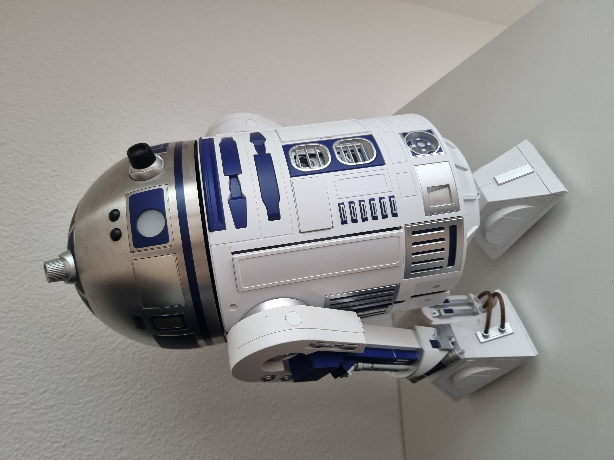
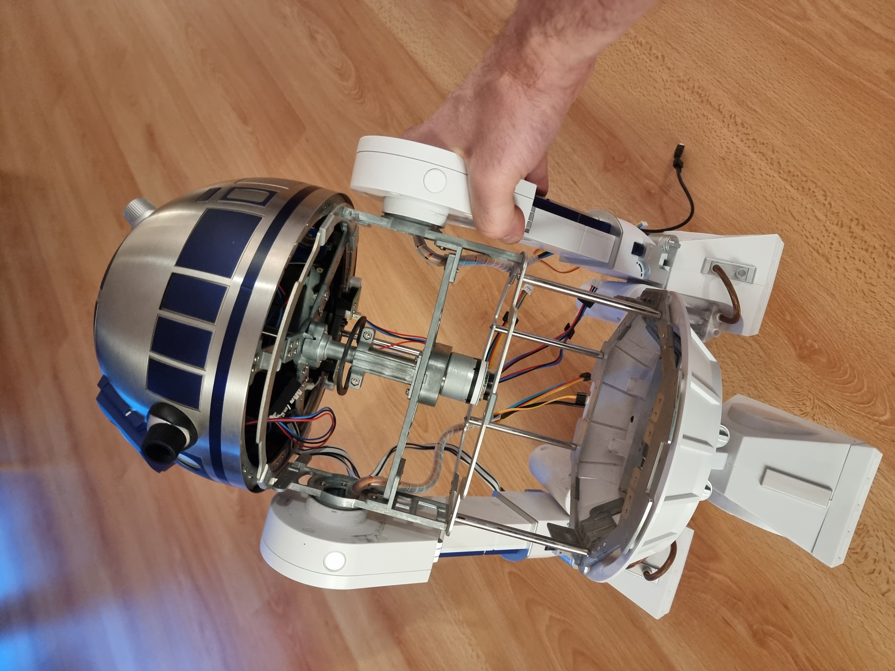

# R2D2 as a Real AI Companion

> Transform the iconic 1:2 DeAgostini R2-D2 into a fully autonomous AI companion robot with vision, voice, navigation, and personality—powered by NVIDIA Jetson AGX Orin 64GB and ROS 2 Humble.



**Current Status:** Phase 1 Core System — ~85% complete  
**Next Phase:** Speech & Language (STT + LLM + TTS)  
**Project Timeline:** 4 phases, 280-300 hours total (7 weeks full-time, 3-4 months part-time)

---

## 🎯 Core Functional Requirements

The R2D2 project is designed to achieve the following functional capabilities:

### Communication & Conversation
- The robot must **listen to spoken input, convert speech to text, understand the user, generate a response, and speak it back** using text-to-speech
- The robot must **support natural, multi-turn conversation** without needing manual resets
- The robot must **allow direct verbal commands** such as "follow me," "go to the living room," "come here," or "look at this"
- The robot must **operate locally without requiring cloud services**, including offline STT, LLM, and TTS

### Perception & Recognition
- The robot must **recognize people, especially Severin, including detecting and identifying faces** through computer vision
- The robot must **track a person and optionally follow them** through the environment
- The robot must **recognize objects and obstacles** in front of it using camera and depth perception
- The robot must **detect rooms or general environment context** and understand where it is inside a home or office
- The robot must **react to events** in the environment, such as someone entering a room or calling its name
- The robot must **orient its camera** toward the person speaking or the object of interest

### Autonomous Navigation & Safety
- The robot must **autonomously navigate through indoor spaces, build a map, avoid obstacles, and move to requested locations**
- The robot must **maintain a safe driving speed and avoid collisions** with furniture, people, or pets
- The robot must **provide a heartbeat or "alive" signal** to indicate it is powered and operational

### Expression & Multi-Modal Interaction
- The robot must **respond with emotional or expressive sounds** similar to R2-D2 beeps
- The robot must **be able to play audio files**, including R2-D2 sound effects
- The robot must **combine perception, navigation, and conversation** so that it can interact socially and physically at the same time

---

## 🚀 Features (Current & Planned)

### Phase 1: Core System (Current) ✅
- [x] **Real-time Perception:** 30 FPS RGB camera stream, brightness metrics, face detection (90% accuracy)
- [x] **Face Recognition:** LBPH-based person identification (trained for multiple users)
- [x] **Hardware Integration:** OAK-D Lite depth camera, Jetson AGX Orin compute, ROS 2 infrastructure
- [x] **Professional Codebase:** Clean workspace structure, modular packages, parameter-driven configuration
- [x] **Comprehensive Docs:** Setup guides, integration patterns, operations checklist, architecture diagrams

### Phase 2: Speech & AI (Next) ⏳
- [ ] **Speech-to-Text:** Real-time audio input with wake-word detection ("Hey R2D2")
- [ ] **Language Model:** Local LLM inference (Llama 2 7B) for conversational responses
- [ ] **Text-to-Speech:** Real-time voice synthesis and playback
- [ ] **Context Awareness:** Vision-informed responses (greet by name, reference visual context)

### Phase 3: Navigation (Future) ⏳
- [ ] **SLAM Mapping:** Autonomous room mapping and localization
- [ ] **Autonomous Movement:** Differential drive control for 2-wheel locomotion
- [ ] **Obstacle Avoidance:** Real-time collision detection and path replanning
- [ ] **Room Navigation:** Go to named rooms, return to base, explore autonomously

### Phase 4: Memory & Personality (Future) ⏳
- [ ] **Conversation Memory:** Persistent history, context-aware responses
- [ ] **Learning & Adaptation:** Preference learning, anomaly detection
- [ ] **Expression:** LED animations, motor movements, tone variation
- [ ] **Multi-User Support:** Per-user profiles, personalized interactions

---

## 📖 Documentation

Comprehensive guides organized by audience and use case. **Start here:**

### For First-Time Users
1. **[Quick Start](#quick-start)** (below) — Run the system in 5 minutes
2. **[PROJECT_GOALS.md](PROJECT_GOALS.md)** — Understand the 4-phase roadmap and success metrics
3. **[ARCHITECTURE_OVERVIEW.md](ARCHITECTURE_OVERVIEW.md)** — See how components fit together

### For Daily Operators
- **[OPERATIONS_CHECKLIST.md](OPERATIONS_CHECKLIST.md)** — Startup, monitoring, troubleshooting, recovery procedures
- **[COMPUTE_COST_ANALYSIS.md](COMPUTE_COST_ANALYSIS.md)** — CPU/memory usage, performance baselines, optimization tips

### For Phase 2-4 Developers
- **[000_INTERNAL_AGENT_NOTES.md](000_INTERNAL_AGENT_NOTES.md)** — ARM architecture quirks, DepthAI setup, common issues and solutions
- **[INTEGRATION_GUIDE.md](INTEGRATION_GUIDE.md)** — Step-by-step guide to add speech, navigation, memory systems

### Technical Depth (Phase 1 Subsystems)
| Component | Document | Purpose |
|-----------|----------|---------|
| **Foundations** | [000_INTERNAL_AGENT_NOTES.md](000_INTERNAL_AGENT_NOTES.md) | Critical git rules, environment setup, hardware constants |
| **Architecture** | [001_ARCHITECTURE_OVERVIEW.md](001_ARCHITECTURE_OVERVIEW.md) | System design, software stack, ROS 2 topics |
| **System Setup** | [010_PROJECT_GOALS_AND_SETUP.md](010_PROJECT_GOALS_AND_SETUP.md) | Jetson flashing, ROS 2 installation, workspace setup |
| **Camera Integration** | [020_CAMERA_SETUP_DOCUMENTATION.md](020_CAMERA_SETUP_DOCUMENTATION.md) | OAK-D Lite + DepthAI SDK, ROS 2 camera_node |
| **Image Processing** | [030_PERCEPTION_PIPELINE_SETUP.md](030_PERCEPTION_PIPELINE_SETUP.md) | Brightness metrics, Haar Cascade face detection, pipeline |
| **Face Recognition** | [040_FACE_RECOGNITION_COMPLETE.md](040_FACE_RECOGNITION_COMPLETE.md) | LBPH training, real-time recognition, model management |
| **Backup & Restore** | [004_BACKUP_AND_RESTORE.md](004_BACKUP_AND_RESTORE.md) | Full-system backup for reproducible deployments |

---

## ✅ Phase 1 Status

**Completion:** ~85% (core systems operational, documentation polishing)



### What's Working
- ✅ **Jetson Setup:** JetPack 6.x, ROS 2 Humble, clean workspace structure
- ✅ **Camera:** OAK-D Lite streaming 30 FPS RGB (1920×1080) at `/oak/rgb/image_raw`
- ✅ **Perception:** Brightness metrics + Haar Cascade face detection (13 Hz) + LBPH recognition (6.5 Hz)
- ✅ **Node Architecture:** 4 ROS 2 packages with parameter-driven configuration
- ✅ **Performance:** ~10-15% CPU usage (perception pipeline), excellent thermal stability
- ✅ **Documentation:** 7+ technical guides + architecture diagrams + integration templates

### Remaining Phase 1 Tasks
- ⏳ **README Improvements** (this file — making it more accessible)
- ⏳ **PROJECT_GOALS.md** (complete roadmap + 4-phase vision)
- ⏳ Git commit of final documentation

### Phase 1 Exit Criteria
When all above are done:
- ✅ New developers can start camera stream in 5 minutes
- ✅ Architecture is clear (blocks, data flow, integration points)
- ✅ Existing documentation is audited and organized
- ✅ Path to Phase 2 (Speech) is documented
- **→ Ready to start Phase 2**

---

## 📊 Project Status & Roadmap

### Overall Progress: 30% Complete (16 Core Objectives)

| Domain | Objective | Phase | Status | Notes |
|--------|-----------|-------|--------|-------|
| **Conversation** | Natural voice interaction | 2 | ⏳ Next | STT + LLM + TTS pipeline |
| **Conversation** | Multi-turn dialogue | 2 | ⏳ Next | Requires Phase 2 |
| **Conversation** | Local AI processing | 2 | ⏳ Next | Ollama + Llama 2 7B |
| **Perception** | Face recognition | 1 | ✅ Done | LBPH trained, 85-92% accuracy |
| **Perception** | Person tracking | 3 | ⏳ Future | Requires navigation Phase |
| **Perception** | Object detection | 3 | ⏳ Future | Post-Phase 2 |
| **Perception** | Room understanding | 3 | ⏳ Future | SLAM + spatial mapping |
| **Perception** | Situation awareness | 1 | ✅ Partial | Brightness + face count available |
| **Navigation** | Indoor navigation | 3 | ⏳ Future | Requires motor + Nav2 integration |
| **Navigation** | Mapping & localization | 3 | ⏳ Future | SLAM with OAK-D depth |
| **Navigation** | Obstacle avoidance | 3 | ⏳ Future | Real-time replanning |
| **Navigation** | Safe movement | 3 | ⏳ Future | Speed limiting + collision detection |
| **Expression** | Expressive audio | 2 | ⏳ Next | Beep synthesis + sound files |
| **Expression** | Social responsiveness | 2 | ⏳ Next | Multi-modal coordination |
| **Expression** | Directional awareness | 1 | ✅ Partial | Camera orientation possible |
| **Commands** | Verbal command interface | 2 | ⏳ Next | After STT + LLM |

### Phase Breakdown

```
Phase 1: Core System Bringup (30% total project)
├─ ✅ Jetson + ROS 2 setup
├─ ✅ Camera integration (30 FPS RGB streaming)
├─ ✅ Perception pipeline (brightness + face detection/recognition)
├─ ✅ Professional documentation
└─ 📍 Current: ~85% complete

Phase 2: Speech & Language (35% total project)
├─ ⏳ Audio hardware integration (ReSpeaker 2-Mic HAT)
├─ ⏳ Speech-to-Text (Whisper or similar)
├─ ⏳ Local LLM (Ollama + Llama 2 7B)
├─ ⏳ Text-to-Speech (synthesis engine)
├─ ⏳ Wake-word detection ("Hey R2D2")
└─ 🎯 Target: 6-8 weeks, complete by mid-January 2026

Phase 3: Navigation & Movement (20% total project)
├─ Motor control (PWM drivers, encoders)
├─ SLAM mapping (OAK-D depth + visual odometry)
├─ Nav2 path planning
├─ Obstacle avoidance
└─ 🎯 Target: 8-10 weeks after Phase 2

Phase 4: Memory & Personality (15% total project)
├─ Conversation memory (SQLite, context management)
├─ Learning & adaptation (reinforcement from feedback)
├─ LED animations + motor expressions
├─ Multi-user support
└─ 🎯 Target: 10+ weeks after Phase 3
```

---

## 🔄 Recommended Next Steps (Your Priorities)

Based on your goals to implement **mic & speaker integration → STT/LLM/TTS**, here's the optimal order:

### Step 1: Audio Hardware Integration (Week 1-2)
**Goal:** Get microphone and speaker working with Jetson

**Tasks:**
1. ✅ ReSpeaker 2-Mic HAT hardware setup (physical connection + power)
2. ⏳ ReSpeaker driver installation (SAI sound card)
3. ⏳ Audio input test (`arecord`, `aplay`)
4. ⏳ Create `r2d2_audio` ROS 2 package
5. ⏳ Audio node: publish raw audio frames to `/r2d2/audio/raw`
6. ⏳ Speaker node: subscribe to `/r2d2/audio/output` and play

**Deliverable:** 
- ROS 2 topics for microphone input and speaker output
- Test recording + playback cycle working
- Document in INTEGRATION_GUIDE

---

### Step 2: Speech-to-Text (Week 2-3)
**Goal:** Convert spoken audio to text in real-time

**Tasks:**
1. ⏳ Evaluate STT options:
   - Whisper (OpenAI, CPU-friendly, good accuracy)
   - Vosk (lightweight, offline, less accurate)
   - Google Speech Recognition (requires cloud - not preferred)
2. ⏳ Install selected STT engine in depthai_env
3. ⏳ Create `r2d2_speech_to_text` node
4. ⏳ Subscribe to `/r2d2/audio/raw`, output to `/r2d2/speech/text`
5. ⏳ Add wake-word detection ("Hey R2D2")
6. ⏳ Benchmark: latency, accuracy, CPU usage

**Deliverable:**
- Working STT node
- Wake-word detection triggering transcription
- <1 second latency from speech end to text output
- CPU usage metrics documented

---

### Step 3: Local Language Model (Week 3-5)
**Goal:** Generate contextual responses from text input

**Tasks:**
1. ⏳ Install Ollama (LLM inference framework)
2. ⏳ Download Llama 2 7B model (fits in Jetson AGX memory)
3. ⏳ Test inference speed (target: <2 sec for response)
4. ⏳ Create `r2d2_language_model` node
5. ⏳ Subscribe to `/r2d2/speech/text`
6. ⏳ Add context awareness (recent face recognition, brightness, etc.)
7. ⏳ Output to `/r2d2/ai/response`

**Deliverable:**
- LLM node generating contextual responses
- Integration with perception system (greet by name, reference environment)
- <2 second response time
- CPU/memory profiling

---

### Step 4: Text-to-Speech (Week 5-6)
**Goal:** Synthesize spoken responses with natural voice

**Tasks:**
1. ⏳ Evaluate TTS options:
   - pyttsx3 (lightweight, offline, multiple voices)
   - glow-tts (higher quality, more CPU)
   - espeak (minimal resources)
2. ⏳ Install and test selected TTS
3. ⏳ Create `r2d2_text_to_speech` node
4. ⏳ Subscribe to `/r2d2/ai/response`
5. ⏳ Generate audio frames to `/r2d2/audio/output`
6. ⏳ Benchmark: latency, naturalness, CPU usage

**Deliverable:**
- Full pipeline: speech → text → understanding → response → speech
- <3 second total latency (audio in to audio out)
- Usable voice quality

---

### Step 5: Full Integration & Testing (Week 6-8)
**Goal:** End-to-end conversational AI system

**Tasks:**
1. ⏳ Connect all nodes with proper message flow
2. ⏳ Add error handling (no speech, no response, etc.)
3. ⏳ Implement conversation memory (last 5 exchanges)
4. ⏳ Test with real use cases:
   - "Hello R2D2, what's your name?" 
   - "What do you see?" (use perception data)
   - "Who am I?" (face recognition)
   - Multi-turn dialogue
5. ⏳ Performance optimization:
   - Profile CPU/GPU/memory
   - Optimize model inference
   - Document resource usage
6. ⏳ Update documentation and examples

**Deliverable:**
- Complete Phase 2 system ready for Phase 3
- All components documented and tested
- Performance baseline: <3 sec end-to-end latency
- Ready to add navigation features

---

## 📈 Expected Challenges & Solutions

| Challenge | Phase | Solution |
|-----------|-------|----------|
| ReSpeaker audio not detected | 2.1 | Check SAI kernel module load, verify USB connection |
| STT too slow on Jetson ARM | 2.2 | Use quantized models, reduce batch size, profile CPU |
| LLM memory overflow | 2.3 | Use 7B model max, enable 8-bit quantization |
| TTS latency > 2 sec | 2.4 | Pre-encode common responses, use faster model |
| Conversation feels unnatural | 2.5 | Add system prompt for R2D2 personality, context memory |

---

---

## 🔧 Hardware

The iconic R2-D2 is being rebuilt with modern robotics hardware and AI compute.

### Current Hardware Stack
| Component | Model | Purpose | Status |
|-----------|-------|---------|--------|
| **Chassis** | DeAgostini R2-D2 1:2 Kit | Main body (48 cm tall) | ✅ Complete |
| **Compute** | NVIDIA Jetson AGX Orin 64GB | AI brain (12-core ARM, 504-GPU cores, 100W TDP) | ✅ Mounted & Running |
| **Camera** | Luxonis OAK-D Lite Auto Focus | Vision (1920×1080 @ 30 FPS, depth + IMU) | ✅ Integrated |
| **Audio Input** | ReSpeaker 2-Mic HAT | Voice capture (for Phase 2 STT) | ⏳ Ordered |
| **Drive** | DeAgostini DC Motors (2×) | Leg & dome motors with encoders | ⏳ Not yet integrated |
| **Motor Control** | Pololu MC33926 (2×) | H-bridge drivers for DC motors | ✅ Assembled |
| **Power** | 4S LiPo 5000 mAh (14.8V) | Main battery system | ✅ Charged & Ready |
| **Power Dist** | Custom DC-DC (14V→12V/5V) | Jetson + ReSpeaker + motors | ⏳ Not yet integrated |
| **Internal** | WS2812B RGB LEDs | Status & personality expression | ⏳ Coming in Phase 4 |

### Inside the Bot
  
The internal structure houses the Jetson AGX Orin, OAK-D camera, power distribution, and future motor drivers. Careful cable management ensures room for Phase 2-4 additions.

### Bill of Materials (Full Project)
See [BOM_HARDWARE.md](BOM_HARDWARE.md) for detailed part numbers, sourcing links, and cost breakdown (~$3,600 including chassis).


## Repository Structure

The repository reflects the active development environment on the Jetson AGX Orin.  
Generated ROS 2 build artifacts are excluded via `.gitignore`, resulting in a clean and minimal source tree.

```text
.
├─ ros2_ws/
│  ├─ src/
│  │  ├─ r2d2_hello/      # First functional nodes (beep + heartbeat)
│  │  └─ r2d2_bringup/    # Bringup launch to start the robot system
│  ├─ build/              # (generated, ignored)
│  ├─ install/            # (generated, ignored)
│  └─ log/                # (generated, ignored)
├─ docs/
│  └─ photos/             # Build documentation images
├─ tests/                 # GPU/Audio/Camera “touch-the-ground” tests (planned)
└─ scripts/               # Utility scripts
```


## 🚀 Quick Start

### 1. Clone & Setup (5 min)

```bash
# Clone repository
git clone git@github.com:severinleuenberger/R2D2-as-real-AI-companion.git
cd R2D2-as-real-AI-companion

# Set up environment (CRITICAL: order matters!)
source ~/depthai_env/bin/activate
export OPENBLAS_CORETYPE=ARMV8
source ~/.bashrc
cd ros2_ws
source install/setup.bash
```

### 2. Launch Camera & Perception (1 command)

```bash
ros2 launch r2d2_bringup r2d2_camera_perception.launch.py
```

**Expected Output (first 5 seconds):**
```
[INFO] [camera_node]: OAK-D camera initialized
[INFO] [image_listener]: ImageListener node initialized
[INFO] [image_listener]: Haar Cascade loaded successfully
[INFO] All nodes started successfully
```

### 3. Verify System (In another terminal, same env setup as above)

```bash
# Check camera frame rate (should be ~30 Hz)
ros2 topic hz /oak/rgb/image_raw

# Check perception output (should be ~13 Hz)
ros2 topic hz /r2d2/perception/brightness

# See brightness values (should be ~130-140 in normal light)
watch -n 0.5 'ros2 topic echo /r2d2/perception/brightness -n 1'

# See face detection (0 = no one, 1+ = detected)
ros2 topic echo /r2d2/perception/face_count
```

### 4. Troubleshooting

If things don't work:
1. Check [OPERATIONS_CHECKLIST.md](OPERATIONS_CHECKLIST.md) → Section 5 (Troubleshooting)
2. Verify environment setup: `echo $OPENBLAS_CORETYPE` should print `ARMV8`
3. Check camera: `lsusb | grep Movidius`

**Time to working system:** ~7 seconds from launch command

---

## 📁 Repository Structure

```
r2d2/
├── README.md                              # This file
├── 000_INTERNAL_AGENT_NOTES.md             # ARM quirks, DepthAI setup, performance baselines
├── 001_ARCHITECTURE_OVERVIEW.md            # System design, data flow, integration patterns
├── 002_HOW_TO_INSTRUCT_CLAUDE.md           # How to ask Claude for R2D2 task help
├── 003_JETSON_FLASHING_AND_DISPLAY_SETUP.md # Hardware setup procedures
├── 004_BACKUP_AND_RESTORE.md              # Backup/restore procedures
├── 010_PROJECT_GOALS_AND_SETUP.md         # 4-phase roadmap, success metrics
├── 020_CAMERA_SETUP_DOCUMENTATION.md      # OAK-D camera + DepthAI SDK
├── 030_PERCEPTION_PIPELINE_SETUP.md       # Image processing pipeline
├── 040_FACE_RECOGNITION_COMPLETE.md       # Face recognition system + training
├── 050_AUDIO_SETUP_AND_CONFIGURATION.md   # Audio system setup
├── 060_AUDIO_NOTIFICATIONS_ROS2_INTEGRATION.md # Audio integration
├── OPERATIONS_CHECKLIST.md                # Daily startup, monitoring, troubleshooting
├── INTEGRATION_GUIDE.md                   # How to add Phase 2-4 features (template + examples)
├── COMPUTE_COST_ANALYSIS.md               # Performance profiles
│
├── ros2_ws/                               # ROS 2 Humble workspace
│   ├── src/
│   │   ├── r2d2_camera/                  # Camera node
│   │   ├── r2d2_perception/              # Perception node
│   │   ├── r2d2_hello/                   # Heartbeat + beep
│   │   └── r2d2_bringup/                 # Launch files
│   ├── build/ install/ log/              # (generated, gitignored)
│
├── data/
│   └── face_recognition/models/          # Trained LBPH models
│
├── tests/                                 # Component test scripts
├── docs/photos/                           # Build progress photos
└── scripts/                               # Utility scripts
```

---

## 🔗 Bill of Materials (BOM)

See [PROJECT_GOALS.md](PROJECT_GOALS.md) → "Resource Requirements" section for detailed hardware breakdown.

**Quick Summary:**
- **Total cost (compute + sensors):** ~$2,200
- **With DeAgostini kit:** ~$3,600
- **Key sources:** NVIDIA, Luxonis, HobbyKing, Pololu, Seeed Studio

---

## 🤝 Contributing & Community

**GitHub:** [severinleuenberger/R2D2-as-real-AI-companion](https://github.com/severinleuenberger/R2D2-as-real-AI-companion)

**Discussion:**
- [NVIDIA Developer Forums](https://forums.developer.nvidia.com/) (R2D2 thread)
- [GitHub Discussions](https://github.com/severinleuenberger/R2D2-as-real-AI-companion/discussions)

**How to Contribute:**
- **Found a bug?** → [Create an Issue](https://github.com/severinleuenberger/R2D2-as-real-AI-companion/issues)
- **Have an improvement?** → [Submit a Pull Request](https://github.com/severinleuenberger/R2D2-as-real-AI-companion/pulls)
- **Want to discuss?** → [Start a Discussion](https://github.com/severinleuenberger/R2D2-as-real-AI-companion/discussions)
- **Building your own R2D2?** → Document it and share!

**License:** [MIT](LICENSE) - Free to use, modify, and distribute

**Author:** [@s_leuenberger](https://x.com/s_leuenberger) | Switzerland

---

## 🎯 What's Next?

1. **This week:** Complete Phase 1 documentation
2. **Next week:** Begin Phase 2 (speech-to-text) prototype
3. **Next month:** Full speech + LLM pipeline
4. **Q2 2026:** Navigation and autonomous movement
5. **Q3 2026+:** Memory, personality, and deployment

See [PROJECT_GOALS.md](PROJECT_GOALS.md) for the complete roadmap and timeline.

---

**Happy building! Questions?** Check the [docs](README.md#-documentation) or [open an issue](https://github.com/severinleuenberger/R2D2-as-real-AI-companion/issues).

