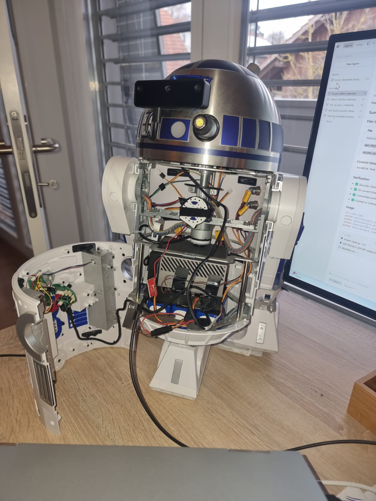

# R2D2 as a Real AI Companion

> An interactive mobile robot that recognizes you, talks with you, and learns alongside you—powered by NVIDIA Jetson AGX Orin 64GB and ROS 2 Humble.




**License:** [GPL-3.0](LICENSE) | **Copyright:** © 2025-2026 Severin Leuenberger

---

## What R2D2 Does

R2D2 is your personal AI companion robot that:

- **Knows You** — Recognizes your face and responds to your presence with visual and audio feedback
- **Talks With You** — Natural voice conversations triggered by simple hand gestures
- **Teaches You** — Acts as an intelligent tutor for robotics and programming concepts
- **Stays Connected** — Monitor and control from anywhere via web dashboard
- **Keeps Learning** — Remembers conversations and tracks your learning progress

**For complete user experience documentation, see:** [000_UX_AND_FUNCTIONS.md](000_UX_AND_FUNCTIONS.md)

---

## User Experience Overview

### Person Recognition ✅ OPERATIONAL

When you approach the robot, it automatically detects and identifies you:

- **Visual feedback:** White LED turns ON when you're recognized
- **Audio feedback:** Friendly R2D2 beep confirms recognition
- **Status indication:** 
  - 🔴 RED = Known person (ready for interaction)
  - 🟢 GREEN = Unknown face detected
  - 🔵 BLUE = No one present
- **Multi-user support:** Train the robot to recognize multiple people

### Voice Conversations ✅ OPERATIONAL

Talk naturally with R2D2 using simple gesture controls:

- **Start talking:** Show index finger pointing up (☝️)
- **Stop talking:** Show closed fist (✊)
- **Or walk away:** Conversation ends automatically after 35 seconds

The robot:
- Transcribes your speech in real-time
- Generates intelligent responses using GPT-4o
- Speaks back with natural voice synthesis
- Maintains multi-turn conversation context
- Saves all conversations to local database

**Performance:** 700-1200ms response latency (speech → response)

### Learning & Tutoring ✅ OPERATIONAL

R2D2 functions as an interactive tutor with two modes:

**Coding Tutor Mode** — Say "Turn on learning mode"
- Robot narrates code changes as AI agent works
- Uses Business Intelligence analogies for explanations
- Perfect for learning ROS 2 and robotics concepts

**General Tutor Mode** — Say "Be my tutor"
- Interactive Q&A teaching sessions
- Patient explanations with progressive concept building
- Tracks your learning progress over time

### Remote Monitoring ✅ OPERATIONAL

Access R2D2 from anywhere via web dashboard:

- **URL:** `http://100.x.x.x:8080` (via Tailscale VPN)
- **Features:**
  - Real-time recognition status (RED/GREEN/BLUE)
  - Live camera stream
  - System health metrics (CPU, GPU, temperature)
  - Service management (start/stop/restart)
  - Audio volume control
  - Face recognition training interface
- **Design:** Dark Star Wars theme, single-page layout

### Physical Controls ✅ OPERATIONAL

- **Shutdown button:** Press for graceful power-down
- **Wake button:** Press to boot from shutdown

### Movement & Navigation ⏳ PLANNED

Hardware is installed, software integration pending:

- Head rotation (left/right pan)
- Autonomous navigation
- Person following
- Obstacle avoidance

---

## Getting Started

### Prerequisites

- R2D2 robot powered on and connected to network
- Face training completed for at least one person
- Tailscale VPN installed (for remote access)

### Quick Start

**1. Clone & Setup**

```bash
git clone git@github.com:severinleuenberger/R2D2-as-real-AI-companion.git
cd R2D2-as-real-AI-companion

# Set up environment (order matters!)
source ~/depthai_env/bin/activate
export OPENBLAS_CORETYPE=ARMV8
source ~/.bashrc
cd ros2_ws
source install/setup.bash
```

**2. Launch System**

```bash
ros2 launch r2d2_bringup r2d2_camera_perception.launch.py
```

**3. Verify**

```bash
# Check camera (should be ~30 Hz)
ros2 topic hz /oak/rgb/image_raw

# Check perception (should be ~13 Hz)
ros2 topic hz /r2d2/perception/brightness

# Check face detection
ros2 topic echo /r2d2/perception/face_count
```

**4. First Interaction**

1. Stand in front of the robot
2. LED turns ON when recognized (RED status)
3. Show index finger up (☝️) to start conversation
4. Speak naturally
5. Show fist (✊) to stop, or walk away

---

## Hardware

The iconic 1:2 DeAgostini R2-D2 rebuilt with modern robotics hardware.


| Component | Model | Status |
|-----------|-------|--------|
| **Chassis** | DeAgostini R2-D2 1:2 Kit (48 cm tall) | ✅ Complete |
| **Compute** | NVIDIA Jetson AGX Orin 64GB | ✅ Running |
| **Camera** | Luxonis OAK-D Lite Auto Focus | ✅ Integrated |
| **Audio Input** | HyperX QuadCast S USB | ✅ Working |
| **Audio Output** | PAM8403 Amplifier + Speaker | ✅ Working (Jan 8, 2026) |
| **Audio Output (Alt)** | Bluetooth FreeBuds 4i (A2DP) | ✅ Working |
| **Audio Switch** | GPIO Toggle Switch (Pin 22) | ✅ Working (Jan 9, 2026) |
| **Drive Motors** | DeAgostini DC Motors (2×) with encoders | ⏳ Pending |
| **Motor Control** | Pololu MC33926 (2×) | ✅ Assembled |
| **Power** | 4S LiPo 5000 mAh (14.8V) | ✅ Ready |

**Total Cost:** ~$3,600 (including DeAgostini chassis)

---

## Capabilities Summary

### ✅ Operational Now

| Capability | Description |
|------------|-------------|
| **Face Recognition** | Detects and identifies trained individuals (~460ms response) |
| **Visual Feedback** | White LED indicates recognition status |
| **Audio Feedback** | R2D2 beeps on recognition and loss events |
| **Voice Conversations** | Natural speech-to-speech via OpenAI Realtime API |
| **Gesture Control** | Index finger starts, fist stops conversations |
| **Multi-turn Dialog** | Maintains conversation context |
| **Conversation Persistence** | All chats saved to SQLite database |
| **Coding Tutor** | Real-time code narration during Cursor sessions |
| **General Tutor** | Interactive Q&A teaching mode |
| **Learning Tracking** | Progress stored in database |
| **Web Dashboard** | Remote monitoring and control |
| **Camera Stream** | Live MJPEG video via web |
| **Service Management** | Start/stop/restart services remotely |
| **Volume Control** | Adjust audio via web interface |
| **Training Interface** | Train face recognition via web |
| **Power Buttons** | Physical shutdown and wake control |
| **Multi-User Support** | Train multiple people |

### ⏳ Planned (Hardware Ready)

| Capability | Description |
|------------|-------------|
| **Head Movement** | Pan rotation via dome motor |
| **Autonomous Navigation** | SLAM mapping and path planning |
| **Person Following** | Track and follow recognized person |
| **Obstacle Avoidance** | Real-time collision prevention |
| **RGB LED Animations** | Expressive status patterns |
| **LED Text Display** | Message output panels |

---

## Documentation

### User Guides

| Document | Purpose |
|----------|---------|
| [000_UX_AND_FUNCTIONS.md](000_UX_AND_FUNCTIONS.md) | **Complete user experience guide** |
| [112_WEB_UI_QUICK_START.md](112_WEB_UI_QUICK_START.md) | Web dashboard usage |
| [101_PERCEPTION_STATUS_INSTALLATION.md](101_PERCEPTION_STATUS_INSTALLATION.md) | Training faces & gestures |

### Technical Reference

| Document | Purpose |
|----------|---------|
| [001_ARCHITECTURE_OVERVIEW.md](001_ARCHITECTURE_OVERVIEW.md) | System architecture & AI models |
| [002_HARDWARE_REFERENCE.md](002_HARDWARE_REFERENCE.md) | Hardware specifications |
| [005_SYSTEMD_SERVICES_REFERENCE.md](005_SYSTEMD_SERVICES_REFERENCE.md) | Service management |
| [100_PERCEPTION_STATUS_REFERENCE.md](100_PERCEPTION_STATUS_REFERENCE.md) | Recognition system |
| [200_SPEECH_SYSTEM_REFERENCE.md](200_SPEECH_SYSTEM_REFERENCE.md) | Speech system |
| [260_AUDIO_SYSTEM_REFERENCE.md](260_AUDIO_SYSTEM_REFERENCE.md) | Audio system (speaker, Bluetooth, GPIO switch) |
| [300_AI_TUTOR.md](300_AI_TUTOR.md) | Tutor system |
| [110_WEB_UI_REFERENCE.md](110_WEB_UI_REFERENCE.md) | Web dashboard |

### Setup & Installation

| Document | Purpose |
|----------|---------|
| [003_JETSON_FLASHING_AND_DISPLAY_SETUP.md](003_JETSON_FLASHING_AND_DISPLAY_SETUP.md) | Jetson setup |
| [101_PERCEPTION_STATUS_INSTALLATION.md](101_PERCEPTION_STATUS_INSTALLATION.md) | Perception setup |
| [201_SPEECH_SYSTEM_INSTALLATION.md](201_SPEECH_SYSTEM_INSTALLATION.md) | Speech setup |
| [111_WEB_UI_INSTALLATION.md](111_WEB_UI_INSTALLATION.md) | Web UI setup |

### Troubleshooting

| Document | Purpose |
|----------|---------|
| [103_PERCEPTION_STATUS_TROUBLESHOOTING.md](103_PERCEPTION_STATUS_TROUBLESHOOTING.md) | Recognition issues |
| [203_SPEECH_SYSTEM_TROUBLESHOOTING.md](203_SPEECH_SYSTEM_TROUBLESHOOTING.md) | Speech issues |
| [000_INTERNAL_AGENT_NOTES.md](000_INTERNAL_AGENT_NOTES.md) | Development notes |

---

## Repository Structure

```
r2d2/
├── README.md                           # This file
├── 000_UX_AND_FUNCTIONS.md             # User experience guide
├── 0XX_*.md                            # Technical documentation
├── ros2_ws/                            # ROS 2 workspace
│   └── src/
│       ├── r2d2_camera/               # Camera driver
│       ├── r2d2_perception/           # Face/gesture recognition
│       ├── r2d2_speech/               # Voice conversations
│       ├── r2d2_gesture/              # Gesture control
│       ├── r2d2_audio/                # Audio feedback
│       └── r2d2_bringup/              # Launch files
├── data/                               # Models and databases
│   ├── face_recognition/models/       # Trained face models
│   ├── gesture_recognition/models/    # Trained gesture models
│   └── persons.db                     # Person registry
├── web_dashboard/                      # Web interface
├── scripts/                            # Utility scripts
├── tools/                              # Monitoring tools
├── docs/photos/                        # Build photos
└── tests/                              # Test scripts
```

---

## Contributing

**GitHub:** [severinleuenberger/R2D2-as-real-AI-companion](https://github.com/severinleuenberger/R2D2-as-real-AI-companion)

- **Found a bug?** → [Create an Issue](https://github.com/severinleuenberger/R2D2-as-real-AI-companion/issues)
- **Have an improvement?** → [Submit a Pull Request](https://github.com/severinleuenberger/R2D2-as-real-AI-companion/pulls)
- **Want to discuss?** → [Start a Discussion](https://github.com/severinleuenberger/R2D2-as-real-AI-companion/discussions)
- **Building your own?** → Document it and share!

**License:** [GPL-3.0](LICENSE) - Free to use and modify; derivative works must also be open-source

**Author:** [@s_leuenberger](https://x.com/s_leuenberger) | Switzerland

---

**Questions?** Check the [documentation](#documentation) or [open an issue](https://github.com/severinleuenberger/R2D2-as-real-AI-companion/issues).
