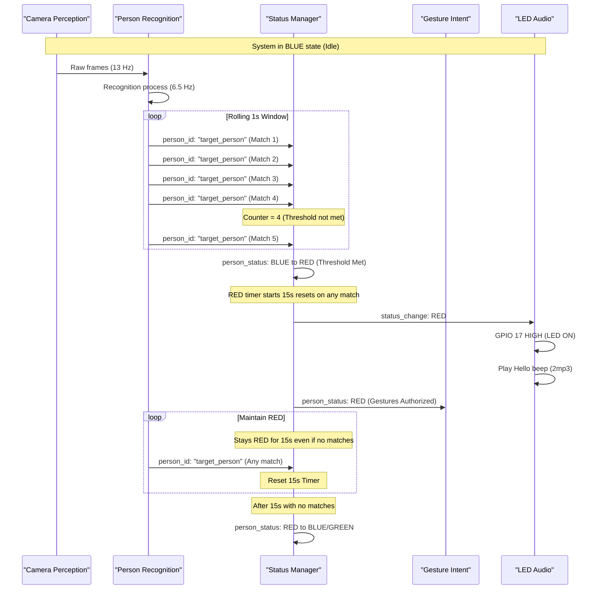

# R2D2 System - Documentation vs Implementation Discrepancies

**Date:** December 21, 2025  
**Analysis Type:** Logic Redesign & Code Verification  
**Status:** ⚠️ 6 CRITICAL DISCREPANCIES / IMPROVEMENTS FOUND

---

## Robust Targeted Person Recognition Sequence



---

## Executive Summary

Cross-verification of system documentation against actual implementation code revealed **6 major discrepancies** in timing parameters, configuration values, and core system logic.

**Impact Level:**
- 🔴 **CRITICAL:** System Logic - Robust RED Entry (NEW), Audio volume (15x difference), Watchdog timeout (8.5x difference)
- 🟡 **MODERATE:** Face presence threshold (6.7x difference), Recognition confidence (2.1x difference)
- 🟢 **MINOR:** Gesture cooldowns (shorter in code, better UX)

---

## Discrepancy 6: System Logic - Robust Targeted Person Entry (RED Status) ⚠️ CRITICAL

### Current Implementation
- **Logic:** Status switches to RED immediately upon the first recognition of the target person.
- **Location:** `audio_notification_node.py` lines 264-297
- **Vulnerability:** Single-frame misidentifications can trigger false positive RED status.

### Proposed Rock Solid Logic
- **Requirement:** 3-5 recognitions of the targeted person within a 1-second rolling window.
- **Trigger:** Status only switches to RED when this threshold is met.
- **Persistence:** Once in RED, the system stays RED for at least 15 seconds (existing logic).
- **Reset:** Every subsequent recognition of the targeted person resets the 15-second timer.

---

## COMPLETE CODE CHANGE SPECIFICATION

### Overview: Files Requiring Changes

| File | Change Type | Scope |
|------|-------------|-------|
| `audio_notification_node.py` | **MODIFY** | Add rolling window filter for RED entry |
| `image_listener.py` | NO CHANGE | Already publishes at correct rate (6.5 Hz) |
| `gesture_intent_node.py` | NO CHANGE | Already subscribes to person_status |
| `status_led_node.py` | NO CHANGE | Already subscribes to person_status |
| `database_logger_node.py` | NO CHANGE | Already subscribes to person_status |

**Conclusion:** Only ONE file needs modification: `audio_notification_node.py`

---

### Detailed Changes for `audio_notification_node.py`

**File Path:** `ros2_ws/src/r2d2_audio/r2d2_audio/audio_notification_node.py`

---

#### CHANGE 1: Add New Parameters (After line 95)

**Current Code (lines 90-95):**
```python
self.declare_parameter('red_status_timeout_seconds', 15.0)  # Simple 15s timeout, resets on recognition
self.declare_parameter('cooldown_seconds', 2.0)   # Min between recognition alerts
self.declare_parameter('recognition_cooldown_after_loss_seconds', 5.0)  # Quiet period after loss alert
self.declare_parameter('recognition_audio_file', 'Voicy_R2-D2 - 2.mp3')  # Recognition alert audio
self.declare_parameter('loss_audio_file', 'Voicy_R2-D2 - 5.mp3')  # Loss alert audio
self.declare_parameter('enabled', True)
```

**Insert After line 95:**
```python
# Robust RED entry parameters (rolling window filter)
self.declare_parameter('red_entry_match_threshold', 3)  # Matches required in window
self.declare_parameter('red_entry_window_seconds', 1.0)  # Rolling window duration
```

---

#### CHANGE 2: Get New Parameter Values (After line 110)

**Current Code (lines 105-110):**
```python
self.red_status_timeout = self.get_parameter('red_status_timeout_seconds').value
self.cooldown_seconds = self.get_parameter('cooldown_seconds').value
self.recognition_cooldown_after_loss = self.get_parameter('recognition_cooldown_after_loss_seconds').value
recognition_audio_filename = self.get_parameter('recognition_audio_file').value
loss_audio_filename = self.get_parameter('loss_audio_file').value
self.enabled = self.get_parameter('enabled').value
```

**Insert After line 110:**
```python
# Robust RED entry parameters
self.red_entry_match_threshold = self.get_parameter('red_entry_match_threshold').value
self.red_entry_window_seconds = self.get_parameter('red_entry_window_seconds').value
```

---

#### CHANGE 3: Add State Variable for Rolling Buffer (After line 126)

**Current Code (lines 117-126):**
```python
# Status tracking (for LED, STT-LLM-TTS, database)
self.current_status = "blue"  # "red" (recognized) | "blue" (lost) | "green" (unknown)
self.current_person = "no_person"  # "severin" | "unknown" | "no_person"
self.status_changed_time = time.time()
self.unknown_person_detected = False
self.last_known_state = "unknown"

# Track face count to detect when no faces are visible
self.last_face_count = None
self.last_face_count_time = None
```

**Insert After line 126:**
```python
# Rolling buffer for robust RED entry (list of (timestamp, person_id) tuples)
self.recognition_buffer = []
```

---

#### CHANGE 4: Modify person_callback() - Replace Immediate RED Transition

**Current Code (lines 264-297) - REPLACE ENTIRELY:**
```python
# MULTI-USER: Any recognized person (not "unknown", not empty) triggers RED
# The training itself is the authorization - if LBPH recognizes them, they're authorized
if person_id and person_id != "unknown":
    # Trained person recognized - RESET 15s countdown timer
    was_red = (self.current_status == "red")
    self.last_recognition_time = current_time  # ← KEY: Reset timer
    
    # Reset smoothing timers when entering RED
    self.face_detected_start_time = None
    self.face_absent_start_time = None
    
    if not was_red:
        # Transition to RED (from any state)
        old_status = self.current_status
        self.current_status = "red"
        self.current_person = person_id  # Use actual person name
        self.status_changed_time = current_time
        self.unknown_person_detected = False
        
        # Publish status FIRST
        self._publish_status("red", person_id, confidence=0.95)
        
        # Play "Hello!" beep (with cooldown)
        if self.last_recognition_beep_time is None or \
           (current_time - self.last_recognition_beep_time) >= self.cooldown_seconds:
            self._play_audio_file(self.recognition_audio, alert_type="RECOGNITION")
            self.last_recognition_beep_time = current_time
            self._publish_event(f"🎉 Recognized {person_id}!")
        
        self.get_logger().info(f"✓ {person_id} recognized ({old_status} → RED)")
    else:
        # Already RED - just reset timer and update duration
        self._publish_status("red", self.current_person, confidence=0.95)
        self.get_logger().debug(f"RED: Timer reset ({person_id} seen)")
```

**NEW Code (Replace lines 264-297):**
```python
# MULTI-USER: Any recognized person (not "unknown", not empty) triggers RED
# The training itself is the authorization - if LBPH recognizes them, they're authorized
if person_id and person_id != "unknown":
    # Add to rolling buffer
    self.recognition_buffer.append((current_time, person_id))
    
    # Clean buffer: remove entries older than window
    cutoff_time = current_time - self.red_entry_window_seconds
    self.recognition_buffer = [(t, p) for t, p in self.recognition_buffer if t >= cutoff_time]
    
    # Count matches for THIS person in the window
    match_count = sum(1 for t, p in self.recognition_buffer if p == person_id)
    
    was_red = (self.current_status == "red")
    
    if was_red:
        # Already RED - just reset 15s timer (no threshold needed to stay RED)
        self.last_recognition_time = current_time
        self._publish_status("red", self.current_person, confidence=0.95)
        self.get_logger().debug(f"RED: Timer reset ({person_id} seen, {match_count} in window)")
    
    elif match_count >= self.red_entry_match_threshold:
        # THRESHOLD MET - Transition to RED
        self.last_recognition_time = current_time
        
        # Reset smoothing timers when entering RED
        self.face_detected_start_time = None
        self.face_absent_start_time = None
        
        # Transition to RED (from any state)
        old_status = self.current_status
        self.current_status = "red"
        self.current_person = person_id
        self.status_changed_time = current_time
        self.unknown_person_detected = False
        
        # Publish status FIRST
        self._publish_status("red", person_id, confidence=0.95)
        
        # Play "Hello!" beep (with cooldown)
        if self.last_recognition_beep_time is None or \
           (current_time - self.last_recognition_beep_time) >= self.cooldown_seconds:
            self._play_audio_file(self.recognition_audio, alert_type="RECOGNITION")
            self.last_recognition_beep_time = current_time
            self._publish_event(f"🎉 Recognized {person_id}!")
        
        self.get_logger().info(
            f"✓ {person_id} recognized ({old_status} → RED) "
            f"[{match_count}/{self.red_entry_match_threshold} matches in {self.red_entry_window_seconds}s]"
        )
    else:
        # Threshold NOT met yet - waiting for more matches
        self.get_logger().debug(
            f"Recognition buffered: {person_id} ({match_count}/{self.red_entry_match_threshold} in window)"
        )
```

---

#### CHANGE 5: Update Logging Output (Line ~237)

**Current Code (lines 230-245):**
```python
self.get_logger().info(
    f"Audio Notification Node initialized (Audio Files):\n"
    f"  Target person: {self.target_person}\n"
    f"  Recognition audio: {self.recognition_audio.name}\n"
    f"  Loss audio: {self.loss_audio.name}\n"
    f"  Audio volume: {self.audio_volume*100:.0f}%\n"
    f"  ALSA device: {self.alsa_device}\n"
    f"  RED status timeout: {self.red_status_timeout}s (resets on recognition)\n"
    f"  GREEN entry delay: {self.green_entry_delay}s (BLUE→GREEN smoothing)\n"
    f"  BLUE entry delay: {self.blue_entry_delay}s (GREEN→BLUE smoothing)\n"
    f"  Alert cooldown: {self.cooldown_seconds}s (min between alerts)\n"
    f"  Recognition cooldown after loss: {self.recognition_cooldown_after_loss}s (quiet period after loss alert)\n"
    f"  Enabled: {self.enabled}\n"
    f"  Audio player: {self.audio_player_path}\n"
    f"  State Machine: RED is primary (ignores non-target while active)"
)
```

**Add to logging (after "RED status timeout" line):**
```python
f"  RED entry threshold: {self.red_entry_match_threshold} matches in {self.red_entry_window_seconds}s window\n"
```

---

#### CHANGE 6: Clear Buffer on RED Exit (In check_loss_state, after line 480)

**Add after transitioning out of RED (both GREEN and BLUE paths):**
```python
# Clear recognition buffer on RED exit
self.recognition_buffer = []
```

**Specific locations:**
- After line 446 (GREEN transition): Add `self.recognition_buffer = []`
- After line 469 (BLUE transition): Add `self.recognition_buffer = []`

---

### Build and Deploy Commands

```bash
# 1. Edit the file
nano ~/dev/r2d2/ros2_ws/src/r2d2_audio/r2d2_audio/audio_notification_node.py

# 2. Rebuild the package
cd ~/dev/r2d2/ros2_ws
colcon build --packages-select r2d2_audio

# 3. Restart the service
sudo systemctl restart r2d2-audio-notification.service

# 4. Monitor logs
journalctl -u r2d2-audio-notification.service -f
```

---

### Testing Verification

1. **Test: Walk into camera view**
   - Expected: LED should NOT turn on immediately
   - Expected: LED turns on after ~0.5-1 second (3+ matches accumulated)
   - Log should show: `"3/3 matches in 1.0s window"`

2. **Test: Quick pass-by (< 0.5 seconds)**
   - Expected: LED should NOT turn on
   - Log should show: `"Recognition buffered: severin (1/3 in window)"`

3. **Test: Stay in view after RED**
   - Expected: LED stays on, resets 15s timer on each recognition
   - Log should show: `"RED: Timer reset (severin seen, X in window)"`

4. **Test: Leave camera view while RED**
   - Expected: After 15s, LED turns off
   - Expected: recognition_buffer is cleared

---

## Other Discrepancies (Unchanged)

### Discrepancy 1: Audio Volume ⚠️ CRITICAL
- **Documentation:** 0.30 (30%)
- **Code:** 0.02 (2%)
- **Recommendation:** Update documentation to 0.02

### Discrepancy 2: Watchdog Timeout ⚠️ CRITICAL
- **Documentation:** 35 seconds
- **Code:** 300.0 seconds (5 minutes)
- **Recommendation:** Change code to 35 seconds in `gesture_intent_node.py` line 58

### Discrepancy 3: Face Presence Threshold 🟡 MODERATE
- **Documentation:** 2.0 seconds
- **Code:** 0.3 seconds
- **Recommendation:** Update documentation to 0.3 seconds

### Discrepancy 4: Recognition Confidence Threshold 🟡 MODERATE
- **Documentation:** 70.0
- **Code:** 150.0
- **Recommendation:** Update documentation to 150.0

### Discrepancy 5: Gesture Cooldowns 🟢 MINOR
- **Documentation:** 5.0s / 3.0s
- **Code:** 2.0s / 1.0s
- **Recommendation:** Update documentation to 2.0s / 1.0s

---

## Summary of All Required Code Changes

| Priority | File | Change | Lines |
|----------|------|--------|-------|
| 🔴 HIGH | `audio_notification_node.py` | Add rolling window RED entry filter | 95, 110, 126, 264-297, 237, 446, 469 |
| 🔴 HIGH | `gesture_intent_node.py` | Change watchdog 300→35s | Line 58 |
| 🟢 NONE | All other files | No changes required | - |

---

**Document Status:** COMPLETE - Ready for implementation  
**Verified:** All downstream subscribers (LED, Gesture, Database) require NO changes  
**Created:** December 21, 2025  
**Author:** AI Assistant (Code Verification Analysis)
