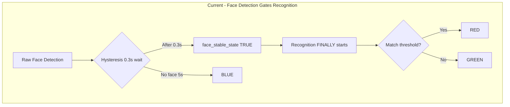
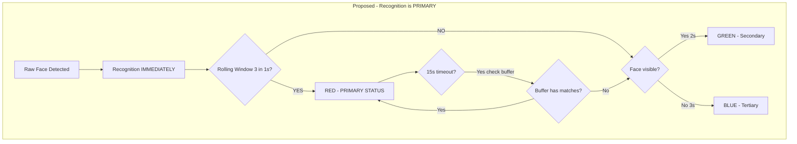

# R2D2 System - RED-First Architecture Redesign

**Date:** December 21, 2025  
**Analysis Type:** System Architecture Redesign & Code Verification  
**Status:** COMPREHENSIVE IMPLEMENTATION PLAN  
**Priority:** Targeted Person Recognition (RED) is PRIMARY

---

## RED-First Complete System Flow

```mermaid
sequenceDiagram
    participant OAK as OAK_D_Camera
    participant ImgList as image_listener
    participant AudioNot as audio_notification_node
    participant StatusLED as status_led_node
    participant GestInt as gesture_intent_node
    participant Speech as speech_node
    participant OpenAI as OpenAI_API

    Note over OAK,OpenAI: PHASE 1 - Recognition is PRIMARY - Runs on ANY Face

    OAK->>ImgList: Raw frame 30Hz
    ImgList->>ImgList: Downscale 640x360 Haar Cascade
    ImgList->>ImgList: Face detected raw NO HYSTERESIS WAIT

    rect rgb(255, 200, 200)
        Note over ImgList,AudioNot: IMMEDIATE Recognition - No 0.3s gate
        ImgList->>ImgList: LBPH recognition 6.5Hz starts IMMEDIATELY
        ImgList->>ImgList: Confidence check against 150 threshold
        ImgList->>AudioNot: person_id severin or unknown
    end

    Note over OAK,OpenAI: PHASE 2 - Rolling Window Filter - RED Entry Decision

    rect rgb(255, 230, 200)
        Note over AudioNot: Rolling 1s window - Need 3 matches for RED
        AudioNot->>AudioNot: Buffer add person_id severin
        AudioNot->>AudioNot: Count matches in 1s window
        
        alt Match count >= 3 in 1s
            AudioNot->>AudioNot: THRESHOLD MET - Transition to RED
            AudioNot->>StatusLED: person_status RED
            StatusLED->>StatusLED: GPIO 17 HIGH LED ON
            AudioNot->>AudioNot: Play Hello beep 2mp3
            AudioNot->>GestInt: person_status RED - Gestures enabled
            Note over AudioNot: RED timer 15s starts - resets on each match
        else Match count < 3 - RED NOT achieved
            Note over AudioNot: Stay in current state - Check face detection
        end
    end

    Note over OAK,OpenAI: PHASE 3 - ONLY IF NOT RED - Face Detection for GREEN or BLUE

    rect rgb(200, 255, 200)
        Note over AudioNot: Secondary check - Only when RED threshold not met
        
        alt face_count > 0 for 2s AND status != RED
            AudioNot->>AudioNot: Transition to GREEN unknown person
            AudioNot->>StatusLED: person_status GREEN
            StatusLED->>StatusLED: GPIO 17 LOW LED OFF
        else face_count == 0 for 3s AND status != RED
            AudioNot->>AudioNot: Transition to BLUE no person
            AudioNot->>StatusLED: person_status BLUE
            StatusLED->>StatusLED: GPIO 17 LOW LED OFF
        end
    end

    Note over OAK,OpenAI: PHASE 4 - RED State Active - Gestures Authorized

    rect rgb(255, 200, 200)
        Note over GestInt: person_status RED - Gestures now work
        ImgList->>ImgList: MediaPipe Hands detect index_finger_up
        ImgList->>GestInt: gesture_event index_finger_up
        GestInt->>GestInt: Gate check - person_status RED PASS
        GestInt->>Speech: start_session service call
    end

    Note over OAK,OpenAI: PHASE 5 - Speech Session Active

    rect rgb(220, 255, 220)
        Speech->>OpenAI: WebSocket connect
        OpenAI-->>Speech: Connection established
        Speech->>GestInt: session_status connected
        GestInt->>GestInt: session_active true SPEAKING state
        GestInt->>GestInt: Play Start beep 16mp3
        Note over GestInt: Grace period 5s - VAD monitoring starts
    end

    Note over OAK,OpenAI: PHASE 6 - Conversation with VAD Protection

    rect rgb(230, 230, 255)
        Speech->>OpenAI: Audio stream user speaking
        OpenAI-->>Speech: Audio response GPT4o
        Speech->>GestInt: voice_activity speaking or silent
        Note over GestInt: VAD speaking pauses 60s timer
        Note over GestInt: VAD silent starts 60s timer
    end

    Note over OAK,OpenAI: PHASE 7 - Manual Stop or Auto Timeout

    rect rgb(255, 220, 255)
        alt Fist gesture detected
            ImgList->>GestInt: gesture_event fist
            GestInt->>Speech: stop_session manual
        else VAD 60s silence timeout
            GestInt->>Speech: stop_session vad_timeout
        else Watchdog 35s no person
            GestInt->>Speech: stop_session watchdog
        end
        
        Speech->>OpenAI: WebSocket disconnect
        Speech->>GestInt: session_status disconnected
        GestInt->>GestInt: Play Stop beep 20mp3
    end

    Note over OAK,OpenAI: PHASE 8 - RED Timeout and Exit

    rect rgb(200, 220, 255)
        Note over AudioNot: RED timer 15s expires - no recognition matches
        AudioNot->>AudioNot: Check rolling buffer FIRST
        
        alt Rolling buffer still has matches
            AudioNot->>AudioNot: Stay RED reset timer
        else Rolling buffer empty AND face_count > 0
            AudioNot->>AudioNot: Transition to GREEN
            AudioNot->>AudioNot: Play Lost beep 5mp3
        else Rolling buffer empty AND face_count == 0
            AudioNot->>AudioNot: Transition to BLUE
            AudioNot->>AudioNot: Play Lost beep 5mp3
        end
        
        AudioNot->>StatusLED: person_status BLUE or GREEN
        StatusLED->>StatusLED: GPIO 17 LOW LED OFF
    end

    Note over OAK,OpenAI: System returns to Phase 1 - Recognition continues
```



---

## Architecture Comparison

### Current Architecture - WRONG (Face Detection First)



**Problem:** User waits 0.3s before system even ATTEMPTS to recognize them.

### Proposed Architecture - CORRECT (Recognition First)



**Solution:** Recognition runs FIRST on any face. Only if RED fails does face detection matter.

---

## Executive Summary

This document describes a fundamental architectural change: **Targeted Person Recognition (RED) becomes the PRIMARY and FIRST status check.**

**Key Principle:** The system should recognize the targeted person as FAST as possible. Face detection hysteresis should NOT gate recognition.

---

## Complete Code Change Specification

### Overview: Files Requiring Changes

| File | Change Type | Priority | Lines Affected |
|------|-------------|----------|----------------|
| `image_listener.py` | MODIFY | CRITICAL | Line 385 |
| `audio_notification_node.py` | MAJOR REWRITE | CRITICAL | Lines 95-110, 126, 247-330, 331-398, 400-480 |
| `gesture_intent_node.py` | MODIFY | HIGH | Line 58 (watchdog fix) |

---

## FILE 1: image_listener.py

**Path:** `ros2_ws/src/r2d2_perception/r2d2_perception/image_listener.py`

### CHANGE 1.1: Remove Hysteresis Gate on Recognition

**Current Code (line 385):**
```python
# Perform face recognition if enabled and face is in stable presence state
if self.recognition_enabled and self.face_stable_state and face_count > 0:
```

**New Code:**
```python
# Perform face recognition if enabled - runs on ANY raw face detection (RED-first architecture)
# Recognition is PRIMARY - no hysteresis gate, immediate attempt on any face
if self.recognition_enabled and face_count > 0:
```

**Reason:** Recognition must run IMMEDIATELY when any face is detected. The 0.3s hysteresis was preventing fast RED detection.

**Impact:** 
- Recognition now runs ~0.3s faster
- More CPU usage (recognition runs on unstable faces too)
- Much faster RED response time

---

## FILE 2: audio_notification_node.py

**Path:** `ros2_ws/src/r2d2_audio/r2d2_audio/audio_notification_node.py`

### CHANGE 2.1: Add Rolling Window Parameters (After line 95)

**Insert after existing parameters:**
```python
# RED-first architecture: Rolling window parameters
self.declare_parameter('red_entry_match_threshold', 3)  # Matches required in 1s window
self.declare_parameter('red_entry_window_seconds', 1.0)  # Rolling window duration
```

### CHANGE 2.2: Get Rolling Window Parameter Values (After line 110)

**Insert after existing parameter retrieval:**
```python
# RED-first architecture: Rolling window parameters
self.red_entry_match_threshold = self.get_parameter('red_entry_match_threshold').value
self.red_entry_window_seconds = self.get_parameter('red_entry_window_seconds').value
```

### CHANGE 2.3: Add Rolling Buffer State Variable (After line 126)

**Insert after existing state variables:**
```python
# Rolling buffer for RED-first architecture (list of (timestamp, person_id) tuples)
self.recognition_buffer = []
```

### CHANGE 2.4: Complete Rewrite of person_callback() (Lines 247-330)

**Current Logic (WRONG):**
1. If trained person detected -> immediately RED
2. Else if in RED -> ignore other detections
3. Else -> GREEN for unknown face

**New Logic (RED-FIRST):**
1. Add ALL recognitions to rolling buffer (trained person matches)
2. Count matches in 1s window
3. If count >= threshold -> RED (PRIMARY)
4. If already RED -> reset 15s timer
5. If count < threshold AND not RED -> do nothing (let face_count handle GREEN/BLUE)

**New Code:**
```python
def person_callback(self, msg: String):
    """
    Handle person_id messages - RED-FIRST ARCHITECTURE.
    
    Recognition is PRIMARY. This callback:
    1. Adds trained person matches to rolling buffer
    2. Checks if rolling window threshold met -> RED
    3. If already RED, resets 15s timer
    4. Does NOT handle GREEN/BLUE (that's face_count_callback's job)
    """
    person_id = msg.data
    current_time = time.time()
    
    if not self.enabled:
        return
    
    # Only process trained person recognitions (not "unknown", not empty)
    if person_id and person_id != "unknown":
        # Add to rolling buffer
        self.recognition_buffer.append((current_time, person_id))
        
        # Clean buffer: remove entries older than window
        cutoff_time = current_time - self.red_entry_window_seconds
        self.recognition_buffer = [(t, p) for t, p in self.recognition_buffer if t >= cutoff_time]
        
        # Count matches for THIS person in the window
        match_count = sum(1 for t, p in self.recognition_buffer if p == person_id)
        
        was_red = (self.current_status == "red")
        
        if was_red:
            # Already RED - just reset 15s timer (threshold already met)
            self.last_recognition_time = current_time
            self._publish_status("red", self.current_person, confidence=0.95)
            self.get_logger().debug(f"RED: Timer reset ({person_id}, {match_count} in window)")
        
        elif match_count >= self.red_entry_match_threshold:
            # THRESHOLD MET - Transition to RED (PRIMARY STATUS)
            self.last_recognition_time = current_time
            
            # Reset smoothing timers
            self.face_detected_start_time = None
            self.face_absent_start_time = None
            
            # Transition to RED
            old_status = self.current_status
            self.current_status = "red"
            self.current_person = person_id
            self.status_changed_time = current_time
            self.unknown_person_detected = False
            
            # Publish status FIRST
            self._publish_status("red", person_id, confidence=0.95)
            
            # Play "Hello!" beep (with cooldown)
            if self.last_recognition_beep_time is None or \
               (current_time - self.last_recognition_beep_time) >= self.cooldown_seconds:
                self._play_audio_file(self.recognition_audio, alert_type="RECOGNITION")
                self.last_recognition_beep_time = current_time
                self._publish_event(f"Recognized {person_id}!")
            
            self.get_logger().info(
                f"RED-FIRST: {person_id} recognized ({old_status} -> RED) "
                f"[{match_count}/{self.red_entry_match_threshold} in {self.red_entry_window_seconds}s]"
            )
        else:
            # Threshold NOT met - just log (GREEN/BLUE handled by face_count_callback)
            self.get_logger().debug(
                f"Recognition buffered: {person_id} ({match_count}/{self.red_entry_match_threshold})"
            )
    
    # NOTE: "unknown" person_id is NOT processed here
    # GREEN/BLUE states are handled by face_count_callback based on face_count
    # This ensures RED is truly PRIMARY - recognition is checked FIRST
```

### CHANGE 2.5: Modify face_count_callback() (Lines 331-398)

**Current Logic:** Updates GREEN/BLUE even when in RED state (wrong).

**New Logic:** Only update GREEN/BLUE when NOT in RED state.

**Key Change - Add guard at start of function:**
```python
def face_count_callback(self, msg: Int32):
    """
    Handle face_count messages - SECONDARY to RED status.
    
    RED-FIRST ARCHITECTURE:
    - This callback ONLY manages GREEN/BLUE transitions
    - It is IGNORED when current_status == "red"
    - RED status is managed exclusively by person_callback rolling window
    """
    face_count = msg.data
    current_time = time.time()
    
    if not self.enabled:
        return
    
    self.last_face_count = face_count
    self.last_face_count_time = current_time
    
    # RED-FIRST: Ignore face_count when in RED state
    # RED is managed by person_callback rolling window, not face detection
    if self.current_status == "red":
        return
    
    # SECONDARY LOGIC: Handle GREEN <-> BLUE transitions
    # Only reached when RED threshold is NOT met
    
    if face_count == 0:
        # No faces - track for BLUE entry
        if self.face_absent_start_time is None:
            self.face_absent_start_time = current_time
        self.face_detected_start_time = None
        
        time_without_face = current_time - self.face_absent_start_time
        
        if self.current_status == "green" and time_without_face >= self.blue_entry_delay:
            # GREEN -> BLUE transition
            self.current_status = "blue"
            self.current_person = "no_person"
            self.status_changed_time = current_time
            self.unknown_person_detected = False
            self._publish_status("blue", "no_person", confidence=0.0)
            self.get_logger().info(f"SECONDARY: GREEN -> BLUE (no face for {time_without_face:.1f}s)")
    
    else:
        # Faces detected - track for GREEN entry
        if self.face_detected_start_time is None:
            self.face_detected_start_time = current_time
        self.face_absent_start_time = None
        
        time_with_face = current_time - self.face_detected_start_time
        
        if self.current_status == "blue" and time_with_face >= self.green_entry_delay:
            # BLUE -> GREEN transition (unknown person visible)
            self.current_status = "green"
            self.current_person = "unknown"
            self.status_changed_time = current_time
            self.unknown_person_detected = True
            self._publish_status("green", "unknown", confidence=0.70)
            self.get_logger().info(f"SECONDARY: BLUE -> GREEN (face for {time_with_face:.1f}s)")
```

### CHANGE 2.6: Modify check_loss_state() (Lines 400-480)

**Current Logic:** Checks if 15s expired, transitions to GREEN/BLUE.

**New Logic:** When 15s expires, check rolling buffer FIRST before transitioning.

**New Code:**
```python
def check_loss_state(self):
    """
    Timer callback: Handle RED timeout - RED-FIRST architecture.
    
    When 15s timer expires:
    1. Check rolling buffer - if still has matches, stay RED
    2. Only if buffer empty, transition to GREEN (face) or BLUE (no face)
    """
    if not self.enabled:
        return
    
    if self.last_recognition_time is None:
        return
    
    if self.current_status != "red":
        return
    
    current_time = time.time()
    time_since_recognition = current_time - self.last_recognition_time
    
    if time_since_recognition > self.red_status_timeout:
        # 15s timer expired - but check rolling buffer FIRST (RED-FIRST principle)
        
        # Clean buffer
        cutoff_time = current_time - self.red_entry_window_seconds
        self.recognition_buffer = [(t, p) for t, p in self.recognition_buffer if t >= cutoff_time]
        
        # Count recent matches
        match_count = len(self.recognition_buffer)
        
        if match_count >= self.red_entry_match_threshold:
            # Still have matches - stay RED, reset timer
            self.last_recognition_time = current_time
            self.get_logger().debug(f"RED timeout: Buffer still active ({match_count} matches), staying RED")
            return
        
        # Buffer empty or below threshold - NOW transition out of RED
        previous_person = self.current_person
        
        # Clear buffer on RED exit
        self.recognition_buffer = []
        
        # Check face_count to decide GREEN or BLUE
        face_recently_detected = (
            self.last_face_count is not None and 
            self.last_face_count > 0 and
            self.last_face_count_time is not None and
            (current_time - self.last_face_count_time) < 1.0
        )
        
        if face_recently_detected:
            # Face visible but not recognized -> GREEN
            self.current_status = "green"
            self.current_person = "unknown"
            self.status_changed_time = current_time
            self.unknown_person_detected = True
            self.face_detected_start_time = current_time
            self.face_absent_start_time = None
            
            self._publish_status("green", "unknown", confidence=0.70)
            
            if self.last_loss_beep_time is None or \
               (current_time - self.last_loss_beep_time) >= self.cooldown_seconds:
                self._play_audio_file(self.loss_audio, alert_type="LOSS")
                self.last_loss_beep_time = current_time
            
            self.get_logger().info(f"RED-FIRST: {previous_person} lost -> GREEN (unknown present)")
        
        else:
            # No face -> BLUE
            self.current_status = "blue"
            self.current_person = "no_person"
            self.status_changed_time = current_time
            self.unknown_person_detected = False
            self.face_detected_start_time = None
            self.face_absent_start_time = None
            
            self._publish_status("blue", "no_person", confidence=0.0)
            
            if self.last_loss_beep_time is None or \
               (current_time - self.last_loss_beep_time) >= self.cooldown_seconds:
                self._play_audio_file(self.loss_audio, alert_type="LOSS")
                self.last_loss_beep_time = current_time
            
            self.get_logger().info(f"RED-FIRST: {previous_person} lost -> BLUE (no person)")
```

### CHANGE 2.7: Update Logging Output

**Add to initialization logging:**
```python
f"  RED-FIRST Architecture: Recognition is PRIMARY\n"
f"  RED entry threshold: {self.red_entry_match_threshold} matches in {self.red_entry_window_seconds}s window\n"
```

---

## FILE 3: gesture_intent_node.py

**Path:** `ros2_ws/src/r2d2_gesture/r2d2_gesture/gesture_intent_node.py`

### CHANGE 3.1: Fix Watchdog Timeout (Line 58)

**Current Code:**
```python
self.declare_parameter('auto_shutdown_timeout_seconds', 300.0)  # 5 minutes
```

**New Code:**
```python
self.declare_parameter('auto_shutdown_timeout_seconds', 35.0)  # 35 seconds (cost optimization)
```

**Reason:** Documentation specifies 35s for cost savings. 300s defeats the purpose.

---

## Build and Deploy Commands

```bash
# 1. Edit image_listener.py
nano ~/dev/r2d2/ros2_ws/src/r2d2_perception/r2d2_perception/image_listener.py
# Change line 385: Remove face_stable_state condition

# 2. Edit audio_notification_node.py  
nano ~/dev/r2d2/ros2_ws/src/r2d2_audio/r2d2_audio/audio_notification_node.py
# Apply all CHANGE 2.x modifications

# 3. Edit gesture_intent_node.py
nano ~/dev/r2d2/ros2_ws/src/r2d2_gesture/r2d2_gesture/gesture_intent_node.py
# Change line 58: 300.0 -> 35.0

# 4. Rebuild all affected packages
cd ~/dev/r2d2/ros2_ws
colcon build --packages-select r2d2_perception r2d2_audio r2d2_gesture

# 5. Restart all services
sudo systemctl restart r2d2-camera-perception.service
sudo systemctl restart r2d2-audio-notification.service
sudo systemctl restart r2d2-gesture-intent.service

# 6. Monitor logs
journalctl -u r2d2-audio-notification.service -f
```

---

## Testing Verification

### Test 1: Fast RED Response
- **Action:** Walk into camera view
- **Expected (OLD):** LED on after 0.3s + 0.5s = 0.8s
- **Expected (NEW):** LED on after ~0.5s (3 matches at 6.5Hz)
- **Log:** `"RED-FIRST: severin recognized (blue -> RED) [3/3 in 1.0s]"`

### Test 2: Quick Pass-By Rejection
- **Action:** Walk past camera quickly (< 0.5s)
- **Expected:** LED does NOT turn on
- **Log:** `"Recognition buffered: severin (1/3)"`

### Test 3: Unknown Person Gets GREEN
- **Action:** Have unknown person stand in view for 3+ seconds
- **Expected:** Status shows GREEN (not RED)
- **Log:** `"SECONDARY: BLUE -> GREEN (face for 2.0s)"`

### Test 4: RED Exit Checks Buffer
- **Action:** Leave camera view while RED
- **Expected:** System checks buffer before transitioning
- **Log:** Either `"Buffer still active, staying RED"` or `"lost -> BLUE"`

### Test 5: Watchdog Cost Savings
- **Action:** Start conversation, then leave
- **Expected:** Auto-stop after 35s (not 5 minutes)
- **Log:** `"Watchdog timeout: stopping speech service"`

---

## All Discrepancies Summary

| ID | Issue | Current Code | Proposed Fix | Priority |
|----|-------|--------------|--------------|----------|
| 1 | Audio Volume | 0.02 (2%) | Update docs to 0.02 | LOW |
| 2 | Watchdog Timeout | 300s | Change to 35s | HIGH |
| 3 | Face Presence Threshold | 0.3s | Update docs to 0.3s | LOW |
| 4 | Recognition Confidence | 150.0 | Update docs to 150.0 | LOW |
| 5 | Gesture Cooldowns | 2s/1s | Update docs to 2s/1s | LOW |
| 6 | **RED-First Architecture** | Face gates recognition | Recognition is PRIMARY | CRITICAL |

---

## Consistency Verification

| Check | Status | Notes |
|-------|--------|-------|
| Recognition runs on raw face | PROPOSED | Remove face_stable_state gate |
| Rolling window 3 in 1s at 6.5Hz | VALID | ~460ms to meet threshold |
| RED timer 15s with buffer check | PROPOSED | Check buffer before exit |
| GREEN/BLUE only when not RED | PROPOSED | Secondary to recognition |
| Watchdog 35s for cost | PROPOSED | Fix from 300s |
| All downstream unchanged | VERIFIED | LED, Gesture, DB nodes unchanged |

---

**Document Status:** COMPREHENSIVE IMPLEMENTATION PLAN  
**Architecture:** RED-First (Recognition is PRIMARY)  
**Files to Modify:** 3 (image_listener.py, audio_notification_node.py, gesture_intent_node.py)  
**Created:** December 21, 2025  
**Author:** AI Assistant (Architecture Redesign)
