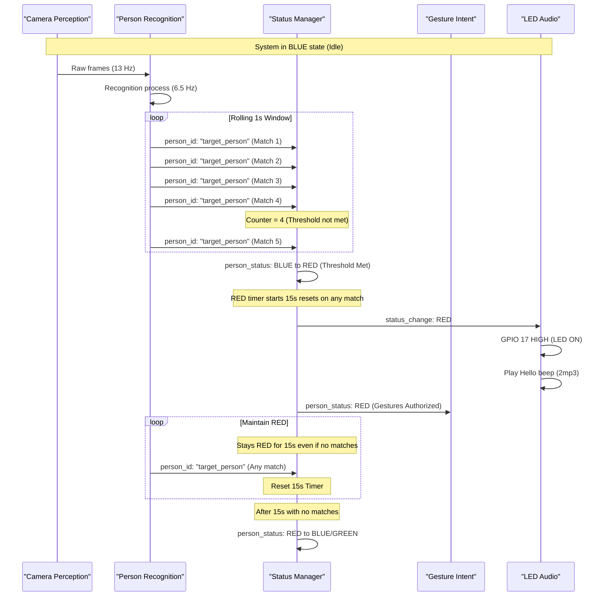

# R2D2 System - Documentation vs Implementation Discrepancies

**Date:** December 21, 2025  
**Analysis Type:** Logic Redesign & Code Verification  
**Status:** ⚠️ 6 CRITICAL DISCREPANCIES / IMPROVEMENTS FOUND

---

## Robust Targeted Person Recognition Sequence

---

## Executive Summary

Cross-verification of system documentation against actual implementation code revealed **6 major discrepancies** in timing parameters, configuration values, and core system logic.

**Impact Level:**
- 🔴 **CRITICAL:** System Logic - Robust RED Entry (NEW), Audio volume (15x difference), Watchdog timeout (8.5x difference)
- 🟡 **MODERATE:** Face presence threshold (6.7x difference), Recognition confidence (2.1x difference)
- 🟢 **MINOR:** Gesture cooldowns (shorter in code, better UX)

---

## Discrepancy 6: System Logic - Robust Targeted Person Entry (RED Status) ⚠️ CRITICAL

### Current Implementation
- **Logic:** Status switches to RED immediately upon the first recognition of the target person (e.g., "severin").
- **Vulnerability:** Single-frame misidentifications can trigger false positive RED status, turning on the LED and playing the "Hello!" beep prematurely.

### Proposed Rock Solid Logic
- **Requirement:** 5 recognitions of the targeted person within a 1-second rolling window.
- **Trigger:** Status only switches to RED when this threshold is met.
- **Persistence:** Once in RED, the system stays RED for at least 15 seconds (existing logic).
- **Reset:** Every subsequent recognition of the targeted person resets the 15-second timer.
- **Priority:** This rule is the primary gateway for system engagement. All other status changes (GREEN, BLUE) are secondary and only occur if the RED condition is not maintained.

### Recommendation: **Implement Rolling Window Filter in Status Manager**

**Reasoning:**
1. Recognition happens at ~6.5 Hz (every 2nd frame of 13 Hz perception).
2. Requiring 5 matches in 1 second means ~77% of recognition frames in that second must be the target person.
3. This significantly reduces "false starts" and makes the system feel much more deliberate and stable.

**Action Items:**
- [ ] Modify `audio_notification_node.py` to include a rolling buffer of recognitions.
- [ ] Add logic to count "target_person" entries in the last 1.0s.
- [ ] Set RED entry threshold to 5 matches.

---

## Discrepancy 1: Audio Volume ⚠️ CRITICAL

### Documentation States
- **Value:** 0.30 (30% volume)

### Implementation Reality
- **Value:** 0.02 (2% volume)

### Recommendation: **Update Documentation to 0.02**
*See full analysis below for details.*

---

## Discrepancy 2: Watchdog Timeout ⚠️ CRITICAL

### Documentation States
- **Value:** 35 seconds

### Implementation Reality
- **Value:** 300.0 seconds (5 minutes)

### Recommendation: **Change Code to 35 seconds**
*See full analysis below for details.*

---

## Discrepancy 3: Face Presence Threshold 🟡 MODERATE

### Documentation States
- **Value:** 2.0 seconds

### Implementation Reality
- **Value:** 0.3 seconds

### Recommendation: **Update Documentation to 0.3 seconds**

---

## Discrepancy 4: Recognition Confidence Threshold 🟡 MODERATE

### Documentation States
- **Value:** 70.0

### Implementation Reality
- **Value:** 150.0

### Recommendation: **Update Documentation to 150.0**

---

## Discrepancy 5: Gesture Cooldowns 🟢 MINOR

### Documentation States
- **Start Cooldown:** 5.0 seconds
- **Stop Cooldown:** 3.0 seconds

### Implementation Reality
- **Start Cooldown:** 2.0 seconds
- **Stop Cooldown:** 1.0 seconds

### Recommendation: **Update Documentation to 2.0s / 1.0s**

---

## Recommended Action Plan

1. **Fix Watchdog Timeout:** Change code 300s → 35s in `gesture_intent_node.py`.
2. **Implement Robust RED Entry:** Add rolling 1s buffer logic to `audio_notification_node.py`.
3. **Update All Documentation:** Synchronize all .md files with the code reality for volume, thresholds, and cooldowns.

---

**Document Status:** Ready for review and action  
**Created:** December 21, 2025  
**Author:** AI Assistant (Code Verification Analysis)
