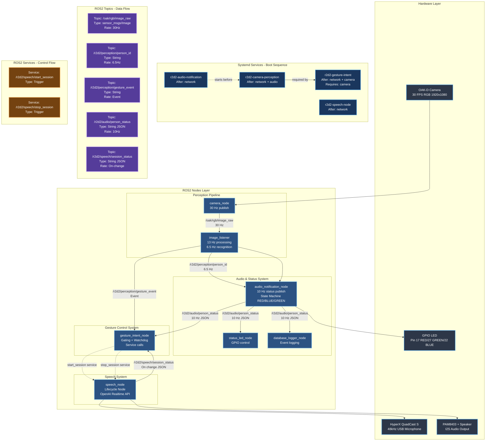
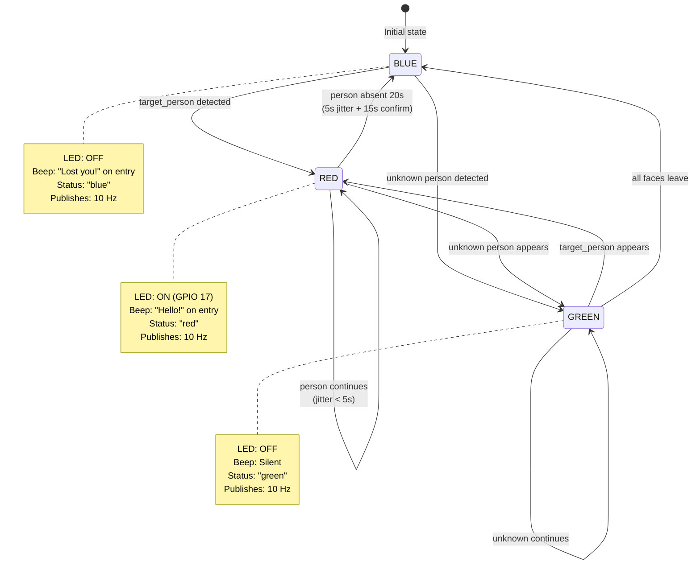
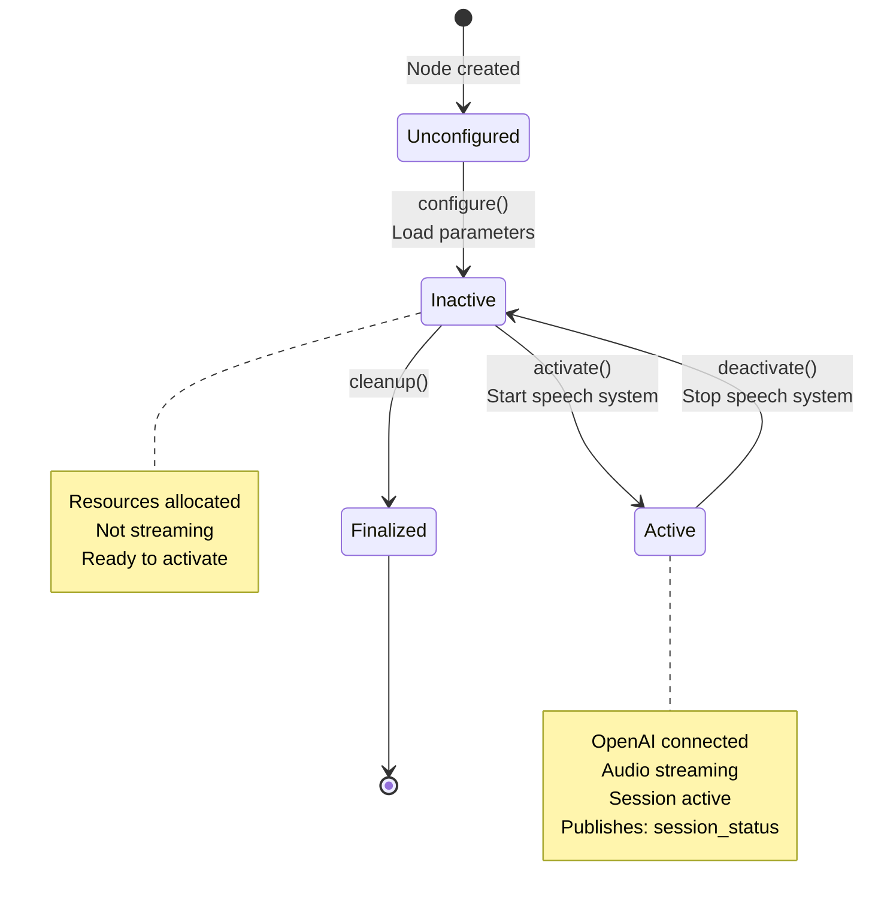
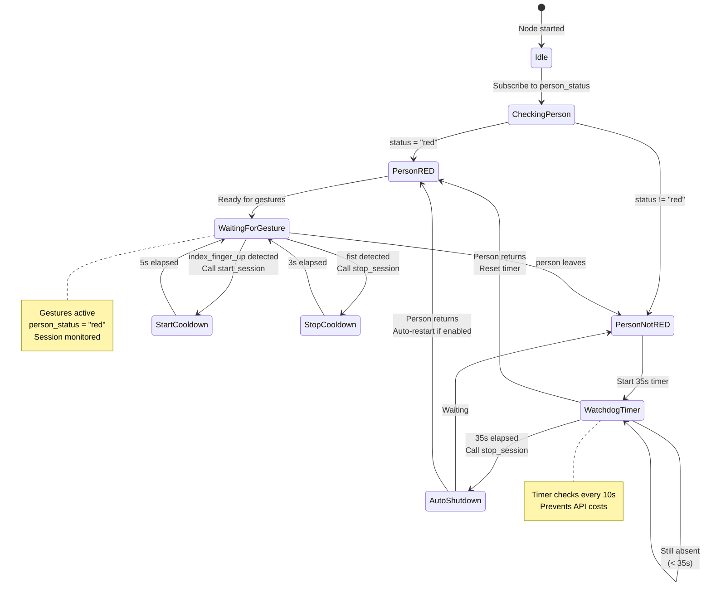
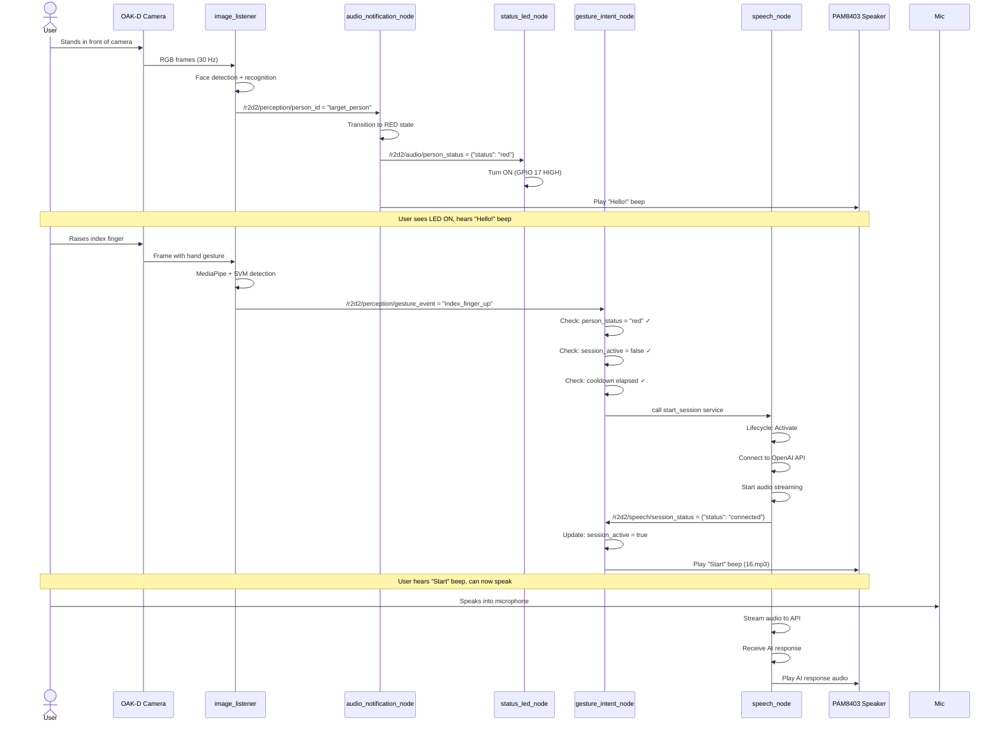
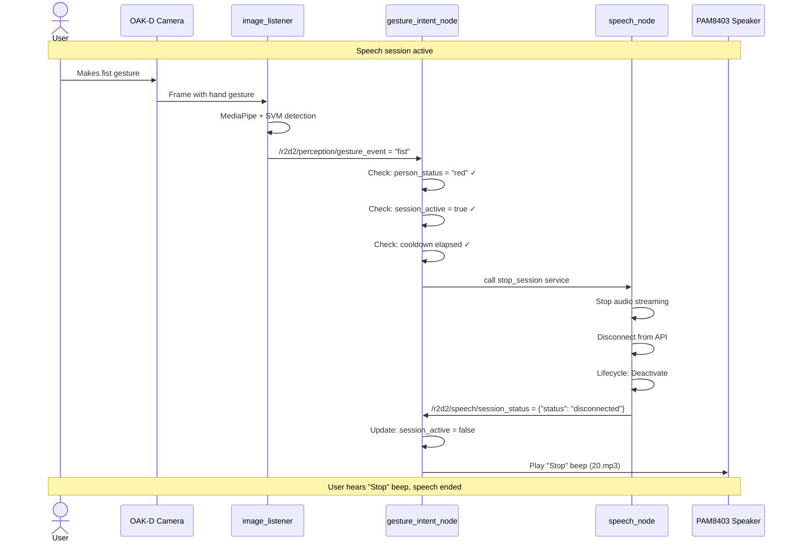
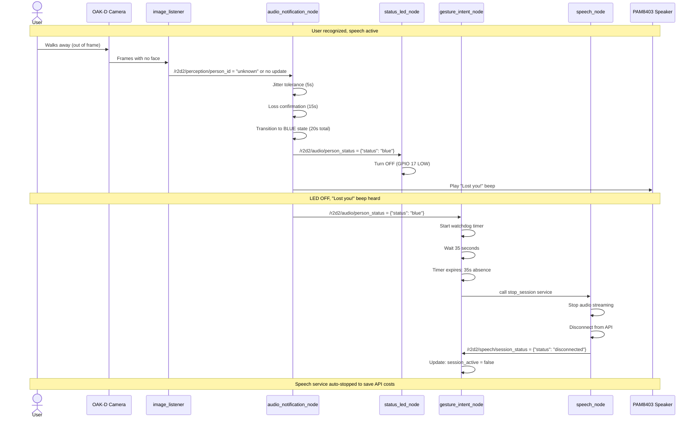
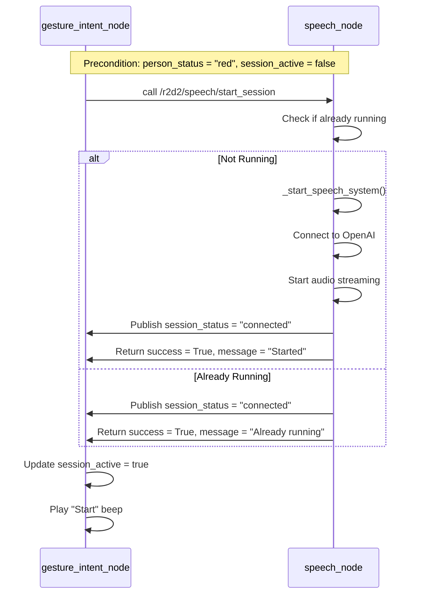

# R2D2 System Architecture - Goal State (How It Should Work)

**Date:** December 18, 2025  
**Purpose:** Comprehensive system map showing ideal architecture based on documentation  
**Focus:** UX flows for recognition → gestures → speech activation → feedback (LED/beeps)

---

## Executive Summary

This document describes how the R2D2 gesture-controlled speech system SHOULD work according to the documentation. The system should provide seamless user experience where:

1. **Recognition**: Camera detects user → Face recognition → RED status → LED ON → "Hello!" beep
2. **Gesture Understanding**: User raises finger → Gesture detected (only when RED) → System responds
3. **Action**: Index finger up → Speech service starts → "Start" beep | Fist → Speech service stops → "Stop" beep
4. **Status Feedback**: LED color shows recognition state, beeps confirm actions
5. **Automatic Shutdown**: User walks away → BLUE status after 20s → Watchdog stops speech after 35s

---

## Complete System Architecture Diagram



---

## State Machines

### 1. Person Recognition State Machine (audio_notification_node)



### 2. Speech Session State Machine (speech_node lifecycle)



### 3. Gesture Intent State Machine (gesture_intent_node)



---

## UX Flow: Complete User Journey

### Scenario 1: User Starts Conversation



### Scenario 2: User Stops Conversation



### Scenario 3: User Walks Away (Watchdog Auto-Shutdown)



---

## System Layers and Dependencies

### Layer 1: Hardware (Physical Layer)

| Component | Connection | Purpose | Status Output |
|-----------|------------|---------|---------------|
| **OAK-D Lite Camera** | USB 3.0 | Capture RGB frames (30 FPS) | RGB video stream |
| **HyperX QuadCast S** | USB | Capture audio (48kHz) | Audio input to speech_node |
| **PAM8403 + Speaker** | J511 I2S (Pin 9) | Play audio output | AI responses + beeps |
| **White LED (GPIO 17)** | 40-pin header Pin 22 | Visual status (ON/OFF) | Recognition state |

**Key Hardware Constraint:** Camera has exclusive access - only one node can use it at a time.

### Layer 2: Systemd Services (Boot & Lifecycle)

| Service | Depends On | Nodes Launched | Auto-Start | Purpose |
|---------|------------|----------------|------------|---------|
| **r2d2-audio-notification** | network.target | audio_notification_node<br/>status_led_node<br/>database_logger_node | ✅ Yes | Person status state machine |
| **r2d2-camera-perception** | network.target<br/>audio-notification.service | camera_node<br/>image_listener | ✅ Yes | Camera + face + gesture recognition |
| **r2d2-gesture-intent** | network.target<br/>**Requires:** camera-perception | gesture_intent_node | ✅ Yes | Gesture-to-speech control |
| **r2d2-speech-node** | network.target | speech_node | ✅ Yes | OpenAI Realtime API integration |

**Boot Sequence:**
1. network.target ready
2. r2d2-audio-notification starts (no dependencies)
3. r2d2-camera-perception starts (After audio-notification)
4. r2d2-gesture-intent starts (After + Requires camera-perception)
5. r2d2-speech-node starts independently (After network)

**Critical Dependencies:**
- gesture-intent **Requires** camera-perception (hard dependency)
- camera-perception **After** audio-notification (soft dependency for ordering)
- All services **After** network.target (network must be available)

### Layer 3: ROS2 Nodes (Runtime Layer)

| Node | Package | Publishes | Subscribes | Services | State |
|------|---------|-----------|------------|----------|-------|
| **camera_node** | r2d2_camera | /oak/rgb/image_raw (30 Hz) | — | — | Stateless |
| **image_listener** | r2d2_perception | /r2d2/perception/brightness (13 Hz)<br/>/r2d2/perception/face_count (13 Hz)<br/>/r2d2/perception/person_id (6.5 Hz)<br/>/r2d2/perception/gesture_event (Event) | /oak/rgb/image_raw | — | Stateless |
| **audio_notification_node** | r2d2_audio | /r2d2/audio/person_status (10 Hz JSON)<br/>/r2d2/audio/notification_event (Event) | /r2d2/perception/person_id<br/>/r2d2/perception/face_count | — | State Machine (RED/BLUE/GREEN) |
| **status_led_node** | r2d2_audio | — | /r2d2/audio/person_status | — | Stateless |
| **database_logger_node** | r2d2_audio | — | /r2d2/audio/person_status | — | Stateless |
| **gesture_intent_node** | r2d2_gesture | — | /r2d2/perception/gesture_event<br/>/r2d2/audio/person_status<br/>/r2d2/speech/session_status | Client: start_session<br/>Client: stop_session | State Machine (Gating + Watchdog) |
| **speech_node** | r2d2_speech | /r2d2/speech/user_transcript (Event)<br/>/r2d2/speech/assistant_transcript (Event)<br/>/r2d2/speech/session_status (On-change JSON) | /r2d2/speech/commands<br/>/r2d2/speech/assistant_prompt | Provider: start_session<br/>Provider: stop_session | Lifecycle Node (Unconfigured → Inactive → Active) |

### Layer 4: Topic Data Flow

```
Camera Output (30 Hz):
  /oak/rgb/image_raw (sensor_msgs/Image)
      ↓
Perception Output (13 Hz, 6.5 Hz):
  /r2d2/perception/brightness (Float32, 13 Hz)
  /r2d2/perception/face_count (Int32, 13 Hz)
  /r2d2/perception/person_id (String, 6.5 Hz) — CRITICAL for state machine
  /r2d2/perception/gesture_event (String, Event-driven) — CRITICAL for gesture control
      ↓
Audio Status Output (10 Hz):
  /r2d2/audio/person_status (String JSON, 10 Hz) — CRITICAL for gating + watchdog + LED
  /r2d2/audio/notification_event (String, Event)
      ↓
Speech Status Output (On-change):
  /r2d2/speech/session_status (String JSON, On-change) — CRITICAL for gesture gating
  /r2d2/speech/user_transcript (String, Event)
  /r2d2/speech/assistant_transcript (String, Event)
```

**Key Topic Dependencies:**
1. `/r2d2/perception/person_id` → `/r2d2/audio/person_status` (audio_notification_node transforms person_id into status JSON)
2. `/r2d2/audio/person_status` → gesture_intent_node (gating: must be "red" for gestures)
3. `/r2d2/audio/person_status` → gesture_intent_node (watchdog: tracks absence time)
4. `/r2d2/perception/gesture_event` → gesture_intent_node (gesture commands)
5. `/r2d2/speech/session_status` → gesture_intent_node (gating: prevents duplicate start/stop)

### Layer 5: Service Control Flow



---

## Critical Timing and Synchronization

### Timing Table

| Event | Expected Latency | Tolerance | Notes |
|-------|------------------|-----------|-------|
| **Camera → Perception** | 33ms | ±10ms | Frame time |
| **Face detected → person_id published** | 50-100ms | ±50ms | Recognition processing |
| **person_id → person_status published** | 10-50ms | ±20ms | State machine update |
| **person_status → LED update** | 10-50ms | ±20ms | GPIO update |
| **Gesture detected → gesture_event published** | 33-100ms | ±50ms | Frame time + MediaPipe |
| **gesture_event → service call** | 10-50ms | ±20ms | ROS2 service call |
| **Service call → session_status published** | 500-2000ms | ±1000ms | OpenAI connection time |
| **session_status → beep played** | 50-200ms | ±100ms | Audio playback start |
| **Person absence → BLUE status** | 20 seconds | exact | 5s jitter + 15s confirmation |
| **BLUE status → watchdog auto-stop** | 35 seconds | exact | Configurable timeout |

### Synchronization Requirements

**Topic Subscription Order (Critical):**
1. audio_notification_node MUST subscribe to `/r2d2/perception/person_id` BEFORE image_listener starts publishing
2. gesture_intent_node MUST subscribe to `/r2d2/audio/person_status` BEFORE audio_notification_node starts publishing
3. gesture_intent_node MUST subscribe to `/r2d2/speech/session_status` BEFORE speech_node starts publishing

**Service Availability (Critical):**
- gesture_intent_node MUST wait for `/r2d2/speech/start_session` to be available before calling
- speech_node MUST be in Active lifecycle state to accept service calls

**Status Publishing Requirements:**
- audio_notification_node MUST publish person_status at 10 Hz continuously (even if person_id stops)
- speech_node MUST publish session_status on EVERY state change (including "Already running")
- Status updates MUST be published BEFORE returning from service calls

---

## Gating Logic (Strict Mode)

### Gesture Detection Gating (image_listener)

```
FOR EACH frame:
  IF enable_gesture_recognition = true:
    IF frame_counter % gesture_frame_skip == 0:
      IF last_person_id == target_person_gesture_name:
        gesture_name, confidence = detect_gesture()
        IF confidence > gesture_confidence_threshold:
          IF gesture_name != last_gesture:
            PUBLISH /r2d2/perception/gesture_event = gesture_name
            last_gesture = gesture_name
```

**Gating Rule 1:** Gestures only detected when `last_person_id == target_person_gesture_name`

### Gesture Intent Gating (gesture_intent_node)

```
ON gesture_event received:
  IF enabled = false: RETURN
  
  IF gesture_name == "index_finger_up":
    # Gate 1: Person status
    IF person_status != "red": 
      LOG "Gesture ignored: wrong person"
      RETURN
    
    # Gate 2: Session state
    IF session_active = true:
      LOG "Gesture ignored: session already active"
      RETURN
    
    # Gate 3: Cooldown
    IF time_since_last_trigger < cooldown_start_seconds:
      LOG "Gesture ignored: cooldown"
      RETURN
    
    # All gates passed
    CALL start_session service
    last_trigger_time = now()
    
  ELSE IF gesture_name == "fist":
    # Similar gating for stop gesture
    IF person_status != "red": RETURN
    IF session_active = false: RETURN
    IF time_since_last_trigger < cooldown_stop_seconds: RETURN
    CALL stop_session service
    last_trigger_time = now()
```

**Gating Rule 2:** Gestures only trigger when person_status = "red"  
**Gating Rule 3:** Start only works when session_active = false  
**Gating Rule 4:** Stop only works when session_active = true  
**Gating Rule 5:** Cooldowns prevent rapid re-triggering (5s start, 3s stop)

### Watchdog Gating

```
ON watchdog_timer (every 10 seconds):
  IF auto_shutdown_enabled = false: RETURN
  
  IF person_status != "red":
    # Person absent
    IF last_red_status_time == None:
      last_red_status_time = now()
      LOG "Person absent, starting timer"
    
    time_since_red = now() - last_red_status_time
    
    IF time_since_red > auto_shutdown_timeout_seconds:
      IF session_active = true AND auto_shutdown_triggered = false:
        LOG "Auto-stopping speech service (35s absence)"
        CALL stop_session service
        auto_shutdown_triggered = true
  
  ELSE:
    # Person present (RED)
    IF last_red_status_time != None:
      LOG "Person returned, timer reset"
    last_red_status_time = None
    auto_shutdown_triggered = false
```

---

## Expected System Behavior

### Normal Operation Flow

1. **Boot Sequence (0-10 seconds)**
   - All systemd services start in order
   - ROS2 nodes initialize and subscribe to topics
   - Services wait for dependencies to be available

2. **Idle State (waiting for user)**
   - camera_node publishing at 30 Hz
   - image_listener processing at 13 Hz
   - audio_notification_node in BLUE state (publishing at 10 Hz)
   - LED OFF
   - speech_node in Inactive lifecycle state

3. **User Appears**
   - Face detected → Face recognition → person_id = "target_person"
   - audio_notification_node transitions to RED state
   - LED turns ON
   - "Hello!" beep plays
   - person_status = "red" published at 10 Hz

4. **User Raises Index Finger**
   - Gesture detected → gesture_event = "index_finger_up"
   - gesture_intent_node checks gates (all pass)
   - start_session service called
   - speech_node activates (connects to OpenAI)
   - session_status = "connected" published
   - gesture_intent_node receives status, updates session_active = true
   - "Start" beep (16.mp3) plays
   - User can now speak

5. **Conversation Active**
   - Audio streams from mic to OpenAI
   - AI responses stream from OpenAI to speaker
   - Transcripts published to ROS2 topics
   - person_status = "red" continues at 10 Hz
   - LED stays ON

6. **User Makes Fist**
   - Gesture detected → gesture_event = "fist"
   - gesture_intent_node checks gates (all pass)
   - stop_session service called
   - speech_node deactivates (disconnects from OpenAI)
   - session_status = "disconnected" published
   - gesture_intent_node receives status, updates session_active = false
   - "Stop" beep (20.mp3) plays

7. **User Walks Away**
   - Face lost → person_id = "unknown" or stops publishing
   - audio_notification_node starts jitter tolerance (5s)
   - If absence continues: loss confirmation (15s more)
   - After 20s total: Transition to BLUE state
   - LED turns OFF
   - "Lost you!" beep plays
   - gesture_intent_node watchdog starts 35s timer
   - After 35s absence: auto-stops speech service (if still active)

### Expected State Synchronization

**Critical State Variables:**

| Node | Variable | Source | Update Timing | Purpose |
|------|----------|--------|---------------|---------|
| audio_notification_node | `current_status` | Internal state machine | Immediate on state change | RED/BLUE/GREEN state |
| audio_notification_node | `is_currently_recognized` | person_id topic | On person_callback | Boolean recognition flag |
| gesture_intent_node | `person_status` | /r2d2/audio/person_status topic | On person_status_callback | Gating for gestures |
| gesture_intent_node | `session_active` | /r2d2/speech/session_status topic | On session_status_callback | Gating for start/stop |
| gesture_intent_node | `last_trigger_time` | Internal | On gesture trigger | Cooldown tracking |
| gesture_intent_node | `last_red_status_time` | /r2d2/audio/person_status topic | On person_status_callback | Watchdog timer |
| speech_node | `current_status` | Internal lifecycle state | On lifecycle transitions | Lifecycle tracking |
| image_listener | `last_person_id` | Internal face recognition | On recognition | Gesture gating |

**Expected Synchronization:**
- All state variables should update within 100ms of triggering event
- Status topics should publish immediately after internal state changes
- Service responses should include updated status
- Late-subscribing nodes should receive current status within 100ms (via periodic publishing)

---

## Configuration and Parameters

### Per-Node Configuration

**image_listener:**
- `enable_face_recognition`: true (required)
- `enable_gesture_recognition`: true (required)
- `target_person_name`: "severin" (must match training)
- `target_person_gesture_name`: "severin" (must match gesture training)
- `gesture_frame_skip`: 5 (balance between latency and CPU)

**audio_notification_node:**
- `target_person`: "severin" (must match perception target)
- `audio_volume`: 0.05 (5% volume for alerts)
- `jitter_tolerance_seconds`: 5.0 (brief gap tolerance)
- `loss_confirmation_seconds`: 15.0 (total 20s to loss alert)

**gesture_intent_node:**
- `cooldown_start_seconds`: 5.0 (prevent rapid start triggers)
- `cooldown_stop_seconds`: 3.0 (prevent rapid stop triggers)
- `auto_shutdown_enabled`: true (cost savings)
- `auto_shutdown_timeout_seconds`: 35.0 (35 seconds)
- `audio_feedback_enabled`: true (beeps on start/stop)

**speech_node:**
- `auto_start`: true (lifecycle auto-activates on launch)
- `realtime_voice`: "sage" (R2D2 personality)
- `mic_device`: "" (auto-detect HyperX)
- `sink_device`: "default" (auto-detect speaker)

---

## Expected User Experience (UX)

### UX Goal: Seamless Gesture-Controlled Conversation

**User Actions → System Response:**

1. **I stand in front of camera**
   - EXPECT: LED turns ON within 1 second
   - EXPECT: "Hello!" beep within 1 second
   - FEEDBACK: System recognizes me

2. **I raise my index finger**
   - EXPECT: "Start" beep within 1 second
   - EXPECT: Can immediately speak (audio streams to API)
   - FEEDBACK: Speech session started

3. **I speak into microphone**
   - EXPECT: AI responds within 2 seconds
   - EXPECT: AI response plays through speaker
   - FEEDBACK: Conversation active

4. **I make a fist**
   - EXPECT: "Stop" beep within 1 second
   - EXPECT: Speech session ends immediately
   - FEEDBACK: Conversation ended

5. **I walk away**
   - EXPECT: LED turns OFF after 20 seconds
   - EXPECT: "Lost you!" beep after 20 seconds
   - EXPECT: If speech was active, auto-stops after 35 seconds total
   - FEEDBACK: System knows I'm gone

6. **I return to camera**
   - EXPECT: LED turns ON within 1 second
   - EXPECT: "Hello!" beep within 1 second
   - EXPECT: Can raise finger to start new conversation
   - FEEDBACK: System recognizes me again

### UX Failure Scenarios (Should Never Happen)

**Recognition Failures:**
- ❌ LED doesn't turn ON when I appear → Face recognition not working
- ❌ "Hello!" beep doesn't play → Audio notification not working
- ❌ LED turns OFF while I'm standing there → False loss detection (jitter too short)

**Gesture Failures:**
- ❌ I raise finger but no "Start" beep → Gesture not detected OR gating failed
- ❌ I raise finger but speech doesn't start → Service call failed OR speech_node not Active
- ❌ Speech starts but no beep → Beep not triggered on session_status update
- ❌ I make fist but no "Stop" beep → Gesture not detected OR gating failed

**Status Failures:**
- ❌ LED doesn't match actual state → Status not publishing OR LED node not subscribed
- ❌ Beeps play at wrong times → Status publishing incorrect data
- ❌ Gestures work when I'm not recognized → Gating not working
- ❌ Watchdog doesn't auto-stop → Watchdog not tracking absence correctly

---

## Key Design Principles

### 1. Event-Driven Architecture
- Gesture events published only on state change (not continuous)
- Status updates published on state transitions
- Service calls triggered by events

### 2. Strict Gating
- Multiple gates prevent false triggers
- Person must be RED for gestures to work
- Session state must match gesture intent
- Cooldowns prevent rapid re-triggering

### 3. State Synchronization
- All nodes have current view of system state
- Status published at regular intervals (10 Hz)
- Status published on every service call
- Late subscribers receive current status quickly

### 4. Fail-Safe Defaults
- Speech auto-activates on launch (auto_start = true)
- Watchdog enabled by default (prevents API waste)
- Audio feedback enabled by default (UX clarity)
- Cooldowns prevent accidental triggers

### 5. Cost Optimization
- Watchdog auto-stops speech when absent (35s default)
- Frame skipping reduces CPU usage
- Gesture detection only when target person present
- Lifecycle management for resource control

---

## Success Criteria

**System is working correctly when:**

✅ LED reflects actual recognition state (ON = recognized, OFF = not recognized)  
✅ "Hello!" beep plays exactly once when user first appears  
✅ "Lost you!" beep plays exactly once after 20s absence  
✅ Index finger gesture starts speech (plays "Start" beep)  
✅ Fist gesture stops speech (plays "Stop" beep)  
✅ Gestures only work when LED is ON (RED state)  
✅ Speech auto-stops after 35s of user absence  
✅ System recovers correctly when user returns  
✅ No duplicate beeps, no missed beeps  
✅ No false gesture triggers  

---

**Document Version:** 1.0  
**Date:** December 18, 2025  
**Purpose:** Goal state architecture for debugging "works once then stops" issue  
**Next Step:** Compare with as-built implementation to find gaps

