# R2D2 System Architecture - Gap Analysis

**Date:** December 18, 2025  
**Purpose:** Compare goal state vs as-built state to identify gaps causing "works once then stops" issue  
**Status:** Analysis complete, root cause identified, fixes recommended  
**Priority:** Fix #1 is critical for UX

---

## Executive Summary

**Root Cause Found:** The `speech_node` parameter `auto_start = true` causes the speech system to immediately start a session on boot, before any gesture is made. This blocks the first index finger gesture because `gesture_intent_node` sees the session as already active.

**User Experience Impact:**
- After reboot: User raises finger → System says "already active" → No beep, no speech
- User makes fist first → Stops auto-started session → NOW can raise finger to start
- This creates confusion: "Why do I need to stop first if I didn't start anything?"

**Fix:** Set `auto_start = false` in speech_node configuration

---

## Detailed Gap Comparison

### Gap 1: Speech Session Auto-Start Behavior

| Aspect | Goal State | As-Built State | Gap | Impact |
|--------|------------|----------------|-----|--------|
| **Documented Behavior** | speech_node waits for gesture to start | speech_node auto-starts on activation | ❌ Major deviation | **PRIMARY ROOT CAUSE** |
| **Parameter** | `auto_start` not mentioned in docs | `auto_start = true` (default) | ❌ Undocumented | User unaware of behavior |
| **UX Flow** | User gesture triggers first session | Auto-started session blocks first gesture | ❌ Broken UX | User confused |
| **Service File** | Should set auto_start=false | No auto_start parameter in service file | ❌ Missing | Uses code default (true) |

**Why This Breaks UX:**

```mermaid
sequenceDiagram
    participant User
    participant System as System (Boot)
    participant Speech as speech_node
    participant Gesture as gesture_intent_node
    
    Note over System: Boot sequence
    System->>Speech: Start service
    Speech->>Speech: on_configure() ✓
    Speech->>Speech: on_activate()
    Speech->>Speech: auto_start = true
    Speech->>Speech: _start_speech_system()
    Speech->>Speech: Connect to OpenAI ✓
    Speech->>Gesture: session_status = "connected"
    
    System->>Gesture: Start service (parallel or after)
    Gesture->>Gesture: Subscribe to session_status
    Gesture->>Gesture: Receive "connected"
    Gesture->>Gesture: session_active = true
    
    Note over User: User appears and raises finger
    User->>Gesture: index_finger_up gesture
    Gesture->>Gesture: Check: person_status = "red" ✓
    Gesture->>Gesture: Check: session_active = true ✗
    Gesture->>User: LOG: "Start ignored: already active"
    
    Note over User: ❌ No beep, no action, user confused
```



**Fix Priority:** 🔴 **CRITICAL** - Breaks first-time UX

---

### Gap 2: Service Wait Timeout

| Aspect | Goal State | As-Built State | Gap | Impact |
|--------|------------|----------------|-----|--------|
| **Documented Behavior** | Should wait until services ready | Waits only 1 second, then gives up | ❌ Too short | May fail on slow boot |
| **Retry Logic** | Should retry or wait longer | No retry, fails silently | ❌ Missing | User sees no feedback |
| **UX Impact** | User gesture always works when ready | May fail if system still booting | ⚠️ Race condition | Occasional failures |

**Code Location:** `gesture_intent_node.py` line 266

```python
# ACTUAL:
if not client.wait_for_service(timeout_sec=1.0):  # ⚠️ Too short
    self.get_logger().warn(f'Service {service_name} not available')
    return  # ⚠️ Silently fails

# SHOULD BE:
if not client.wait_for_service(timeout_sec=5.0):  # Longer timeout
    self.get_logger().error(f'Service {service_name} not available after 5s')
    # Maybe retry or provide user feedback
```

**Fix Priority:** 🟡 Medium - May cause boot-time failures

---

### Gap 3: Lifecycle State Visibility

| Aspect | Goal State | As-Built State | Gap | Impact |
|--------|------------|----------------|-----|--------|
| **State Exposure** | Lifecycle state should be visible to clients | Lifecycle state not published to topics | ❌ Missing | Can't distinguish available vs functional |
| **Readiness Check** | Should have explicit readiness service | No readiness service | ❌ Missing | Can't verify speech_node is Active |
| **Service Functional Check** | Should verify node is Active before calling | No verification, assumes service existence = functional | ❌ Missing | May call services before node ready |

**Scenario:**
- speech_node creates service providers in on_configure (state = Inactive)
- Services are "available" but node can't actually handle them yet
- gesture_intent_node sees services, calls them
- speech_node may return "Failed" if not yet Active

**Fix Priority:** 🟡 Medium - Could cause boot-time issues

---

### Gap 4: Status Publishing on "Already Running"

| Aspect | Goal State | As-Built State | Gap | Impact |
|--------|------------|----------------|-----|--------|
| **Documented Behavior** | Always publish status on service calls | Originally didn't publish if "Already running" | ✅ FIXED | Was blocking beeps |
| **Current State** | Should be fixed | Fixed in recent commit | ✅ Fixed | Should work now |

**Status:** ✅ **FIXED** on December 17, 2025

**Verification Needed:** Ensure fix is deployed to all running instances

---

### Gap 5: Configuration Parameter Mismatches

| Parameter | Docs | Code Default | Service File | Actual Runtime | Issue |
|-----------|------|--------------|--------------|----------------|-------|
| `auto_start` | Not mentioned | `true` | Not set | `true` | ❌ Undocumented, causes issue |
| `auto_shutdown_timeout` | 35s | 300s (5 min) | 35s | 35s | ⚠️ Code default wrong |
| `cooldown_start_seconds` | 5s | 2s | 5s | 5s | ⚠️ Code default wrong |

**Inconsistency Impact:**
- Documentation doesn't match code defaults
- Service files override code defaults
- If service file not applied, wrong behavior
- Users debugging from code see wrong values

**Fix Priority:** 🟢 Low - Service files work, but documentation should be updated

---

## Side-by-Side Comparison: Goal vs As-Built

### System Startup

| Phase | Goal Behavior | Actual Behavior | Match? | Issue |
|-------|---------------|-----------------|--------|-------|
| **Boot (0-2s)** | Network ready, services starting | ✅ Same | ✅ | None |
| **Audio Start (2-3s)** | audio-notification starts, publishes person_status = "blue" | ✅ Same | ✅ | None |
| **Speech Start (2-4s)** | speech_node starts, waits in Inactive state | ❌ Starts AND activates immediately | ❌ | **Causes auto-start issue** |
| **Camera Start (3-5s)** | camera-perception starts, publishes person_id + gesture_event | ✅ Same | ✅ | None |
| **Gesture Start (6-8s)** | gesture-intent starts, subscribes to topics, waits for services | ⚠️ Same but only waits 1s | ⚠️ | May timeout if speech slow |
| **Ready State (10s)** | All nodes ready, waiting for user | ❌ Speech session already active | ❌ | User can't start with gesture |

### First User Interaction

| Step | Goal Behavior | Actual Behavior | Match? | Issue |
|------|---------------|-----------------|--------|-------|
| **1. User appears** | Face recognized → RED → LED ON → "Hello!" beep | ✅ Same | ✅ | Works correctly |
| **2. User raises finger** | Gesture detected → start_session called → Speech starts → "Start" beep | ❌ Gate fails: "already active" → No action, no beep | ❌ | **UX FAILURE** |
| **3. User confused** | Should work on first gesture | Must stop first, then start | ❌ | Extra step required |
| **4. User makes fist** | Stops active session | ✅ Stops auto-started session | ⚠️ | Unintended but works |
| **5. User raises finger again** | Starts session | ✅ Now works | ⚠️ | Works after manual stop |

### Subsequent Interactions

| Step | Goal Behavior | Actual Behavior | Match? | Issue |
|------|---------------|-----------------|--------|-------|
| **Conversation cycle** | Raise finger → speak → fist | ✅ Works correctly | ✅ | None after initial workaround |
| **Watchdog auto-stop** | After 35s absence, auto-stops | ✅ Works correctly (if parameter applied) | ✅ | None |
| **User returns** | Raise finger → start new session | ✅ Should work | ✅ | Unless speech_node restarted |

---

## Critical Code Paths: Goal vs Actual

### Path 1: Boot to First Gesture

**GOAL:**
```
Boot → Services start → Nodes ready → User appears → RED status → 
User raises finger → start_session called → Speech activates → "Start" beep
```

**ACTUAL:**
```
Boot → Services start → speech_node auto-activates → session_active = true →
User appears → RED status → User raises finger → GATE FAILS ("already active") →
No action, no beep → User confused
```

**Deviation:** Auto-activation on boot breaks expected flow

### Path 2: After Manual Stop

**GOAL:**
```
Session active → User makes fist → stop_session called → Speech deactivates →
"Stop" beep → User raises finger → start_session called → Speech activates → "Start" beep
```

**ACTUAL:**
```
Session auto-activated → User makes fist → stop_session called → Speech deactivates →
"Stop" beep → session_active = false → User raises finger → start_session called →
Speech activates → "Start" beep
```

**Status:** ✅ Works correctly after initial workaround

### Path 3: After Reboot (Second Time)

**GOAL:**
```
Reboot → Services start → Nodes ready → User appears → Raise finger → Works
```

**ACTUAL:**
```
Reboot → Services start → speech_node auto-activates AGAIN → session_active = true →
User appears → Raise finger → GATE FAILS ("already active") AGAIN →
Must stop first AGAIN
```

**Status:** ❌ Same issue repeats on every reboot

---

## Timing Analysis: Goal vs Actual

### Service Availability Timing

**GOAL: gesture_intent_node should not call services until speech_node is ready**

**ACTUAL:**
| Event | Goal Timing | Actual Timing | Gap | Impact |
|-------|-------------|---------------|-----|--------|
| speech_node service created | After on_configure (~3s) | After on_configure (~3s) | ✅ | None |
| speech_node ready for calls | After on_activate (~4s) | After on_activate (~4s) | ✅ | None |
| gesture_intent waits for services | Should wait until ready | Waits only 1 second | ❌ | May timeout |
| First gesture trigger | User dependent (~10-30s) | User dependent (~10-30s) | ✅ | None |

**Observation:** In normal boot sequence, speech_node IS ready before first gesture (10-30s user reaction time > 4s boot time). The 1s timeout is usually not an issue UNLESS speech_node has problems during activation.

### Status Update Timing

**GOAL: All status updates should reach subscribers within 100ms**

**ACTUAL:**
| Status Type | Goal Publishing | Actual Publishing | Gap | Impact |
|-------------|-----------------|-------------------|-----|--------|
| person_status | 10 Hz continuous | ✅ 10 Hz timer (every 100ms) | ✅ | None |
| session_status | On change only (docs) | On change + 1 Hz timer | ✅ Better | Actually improves reliability |
| gesture_event | Event-driven | ✅ Event-driven (on state change) | ✅ | None |

**Observation:** Status publishing is actually BETTER than documented (speech_node has periodic 1 Hz updates)

---

## Gap-by-Gap Analysis

### Gap #1: AUTO_START Parameter (CRITICAL)

**What the Docs Say:**
- 200_SPEECH_SYSTEM_REFERENCE.md line 369: `auto_start | bool | true | Auto-start session on activation`
- Documentation describes this as "Auto-start session on activation" but doesn't explain UX implications
- No documentation says this should be false for gesture-controlled operation

**What the Code Does:**
- `speech_node.py` line 53: `self.declare_parameter('auto_start', True)`
- `speech_node.py` lines 137-150: If auto_start=true, immediately calls `_start_speech_system()` during `on_activate`
- `speech_params.yaml` line 15: `auto_start: true`
- Service file: Does NOT override this parameter

**The Gap:**
- **Documentation assumes** gesture triggers first session
- **Code implements** immediate session start on boot
- **No reconciliation** between documented UX flow and auto_start behavior

**Impact on UX:**
1. ❌ First index finger gesture after boot is blocked
2. ❌ User must first make fist (stop) before they can start
3. ❌ Counter-intuitive UX (stop before start)
4. ❌ Repeats on every reboot
5. ❌ Confusing error logs: "Start gesture ignored: session already active"

**Recommended Fix:**
```yaml
# In ros2_ws/src/r2d2_speech/config/speech_params.yaml line 15:
auto_start: false  # ← Change from true

# Or in r2d2-speech-node.service ExecStart:
ExecStart=/bin/bash -c 'source install/setup.bash && ros2 launch r2d2_speech speech_node.launch.py auto_start:=false'
```

**Fix Priority:** 🔴 **CRITICAL** - Fixes primary UX issue

---

### Gap #2: Service Wait Timeout

**What the Docs Say:**
- No specific mention of service wait timeout
- Implies services should be available before gestures processed

**What the Code Does:**
- `gesture_intent_node.py` line 266: `if not client.wait_for_service(timeout_sec=1.0):`
- Only waits 1 second for services
- Returns silently if timeout (logs warning)
- No retry mechanism

**The Gap:**
- **Documentation implies** services always available when needed
- **Code implements** short timeout with no retry
- **May fail** if speech_node slow to activate (network issues, API slow response)

**Impact on UX:**
1. ⚠️ May fail on first gesture if speech_node still activating
2. ⚠️ No user feedback (silent failure, just log warning)
3. ⚠️ User must retry gesture (confusion)

**Recommended Fix:**
```python
# In gesture_intent_node.py line 266:
if not client.wait_for_service(timeout_sec=5.0):  # ← Increase from 1.0
    self.get_logger().error(f'Service {service_name} not available after 5s - speech_node may not be active')
    # Consider: Play error beep or provide other feedback
    return
```

**Fix Priority:** 🟡 Medium - Improves reliability

---

### Gap #3: Lifecycle State Visibility

**What the Docs Say:**
- speech_node is a Lifecycle Node
- States: Unconfigured → Configured → Inactive → Active
- Services should be called when node is Active

**What the Code Does:**
- Lifecycle states exist internally
- Service providers created in on_configure (Inactive state)
- Services are "available" but node may not be ready to handle them
- No lifecycle state published to topics
- No way for gesture_intent_node to verify speech_node is Active

**The Gap:**
- **Documentation implies** services are functional when available
- **Code reality** services exist before node is functional
- **No mechanism** to check if node is Active vs Inactive

**Impact on UX:**
1. ⚠️ gesture_intent may call services before speech_node is Active
2. ⚠️ Calls may fail with "Failed" response
3. ⚠️ No clear indication of why failure occurred

**Recommended Fix:**
```python
# Option A: Add lifecycle state to session_status
def _publish_and_update_status(self, status, session_id=None):
    status_data = {
        "status": status,
        "lifecycle_state": self.get_current_state().label,  # NEW
        "session_id": session_id
    }
    # ...publish

# Option B: Add readiness service
def _check_ready_callback(self, request, response):
    response.success = (self.get_current_state().label == 'active')
    response.message = self.get_current_state().label
    return response

# In gesture_intent_node: Check before calling
if speech_node_ready:
    self._start_session()
```

**Fix Priority:** 🟢 Low - Nice to have, not root cause

---

### Gap #4: Configuration Documentation

**What the Docs Say:**
- `auto_start = true` is documented in parameters table
- No explanation of UX implications
- No mention that this conflicts with gesture-triggered operation

**What the Code Does:**
- Implements auto_start correctly according to parameter
- But parameter's UX impact not documented
- Gesture system documentation doesn't mention interaction with auto_start

**The Gap:**
- **Documentation gap** between parameter description and UX flow
- **No warning** that auto_start breaks gesture-triggered first start
- **No recommended configuration** for gesture-controlled operation

**Impact:**
1. ❌ Users follow gesture documentation but system doesn't work as expected
2. ❌ No indication that auto_start should be false for gesture control
3. ❌ Parameter tables don't explain UX implications

**Recommended Fix:**
```markdown
# In 200_SPEECH_SYSTEM_REFERENCE.md parameters section:
| `auto_start` | bool | **false** | Auto-start session on activation
**NOTE:** Set to `false` for gesture-controlled operation. If `true`, speech 
session starts immediately on boot, which blocks the first gesture trigger.

# In 300_GESTURE_SYSTEM_OVERVIEW.md integration section:
**IMPORTANT:** For gesture-controlled operation, ensure speech_node has `auto_start: false`
```

**Fix Priority:** 🟡 Medium - Improves documentation

---

### Gap #5: Systemd Service Dependencies

**What the Docs Say:**
- gesture-intent should start after camera-perception
- speech-node can start independently

**What the Code Does:**
- ✅ `r2d2-gesture-intent.service` has `After=r2d2-camera-perception.service` and `Requires=r2d2-camera-perception.service`
- ❌ `r2d2-camera-perception.service` has `After=audio-notification.service` but NOT `Requires`
- ❌ `r2d2-speech-node.service` has NO dependencies on other R2D2 services

**The Gap:**
- **Expected:** speech-node should have no dependencies (correct)
- **Actual:** ✅ speech-node has no dependencies
- **But:** No coordination between speech-node and gesture-intent startup
- **Result:** Race condition where speech_node may activate before or after gesture_intent subscribes

**Impact:**
1. ⚠️ Timing-dependent behavior (may work or fail depending on boot speed)
2. ⚠️ If speech_node activates before gesture_intent subscribes, may miss initial status
3. ✅ Mitigated by periodic status publishing (1 Hz)

**Status:** ⚠️ Minor issue, mitigated by periodic publishing

---

## UX Flow Comparison: Goal vs Actual

### Flow 1: User Arrives and Starts Conversation

**GOAL:**
```
User appears
  → Face recognized
  → person_status = "red" (within 1s)
  → LED ON + "Hello!" beep (within 1s)
  → User raises finger
  → Gesture detected (within 0.5s)
  → start_session called
  → Speech activates
  → session_status = "connected"
  → "Start" beep plays
  → User can speak
TOTAL TIME: ~2-3 seconds from appearance to speech ready
```

**ACTUAL (First Time After Boot):**
```
User appears
  → Face recognized
  → person_status = "red" ✓
  → LED ON + "Hello!" beep ✓
  → User raises finger
  → Gesture detected ✓
  → Gate check: person_status = "red" ✓
  → Gate check: session_active = true ✗  ← AUTO-STARTED ON BOOT
  → LOG: "Start gesture ignored: session already active"
  → NO ACTION, NO BEEP
  → User confused
```

**ACTUAL (After Manual Stop):**
```
User makes fist first
  → stop_session called
  → session_active = false
  → "Stop" beep plays
THEN:
User raises finger
  → Gesture detected ✓
  → All gates pass ✓
  → start_session called → "Already running" → Publishes "connected"
  → session_active updates true
  → "Start" beep plays ✓
  → Works correctly
```

**Gap:** First gesture after boot fails due to auto-start

### Flow 2: Conversation Active

**GOAL:**
```
User speaks
  → Audio streams to OpenAI
  → AI responds
  → Audio plays from speaker
EXPECTED: Works continuously
```

**ACTUAL:**
```
User speaks
  → ✅ Audio streams to OpenAI
  → ✅ AI responds
  → ✅ Audio plays (with 24kHz → 44.1kHz resampling - FIXED)
ACTUAL: Works correctly when session active
```

**Gap:** ✅ None - Works as expected

### Flow 3: User Walks Away

**GOAL:**
```
User leaves
  → Face lost
  → Jitter tolerance (5s)
  → Loss confirmation (15s)
  → person_status = "blue" (20s total)
  → LED OFF + "Lost you!" beep
  → Watchdog starts (35s)
  → Speech auto-stops (35s absence)
TOTAL: 55 seconds from leaving to speech stopped (20s + 35s)
```

**ACTUAL:**
```
User leaves
  → Face lost
  → ✅ Jitter tolerance (5s)
  → ✅ Loss confirmation (15s)
  → ✅ person_status = "blue" (20s total)
  → ✅ LED OFF + "Lost you!" beep
  → ✅ Watchdog timer starts
  → ✅ After 35s, calls stop_session
  → ✅ Speech stops
TOTAL: ✅ 55 seconds as expected
```

**Gap:** ✅ None - Works as expected

---

## Root Cause Summary

### Primary Issue: Auto-Start on Boot

**What Happens:**
1. speech_node boots with `auto_start = true`
2. Immediately connects to OpenAI and starts session
3. Publishes session_status = "connected"
4. gesture_intent_node sees session_active = true
5. First index finger gesture fails gate check
6. User must manually stop before starting

**Why It's Confusing:**
- Documentation shows gesture-triggered operation
- Code implements auto-start by default
- No mention in gesture system docs that auto_start must be false
- User expects gesture to work immediately

**How to Verify This is the Issue:**
```bash
# Check current auto_start value
ros2 param get /speech_node auto_start

# Check if session is active after boot (before any gesture)
ros2 topic echo /r2d2/speech/session_status --once

# If shows {"status": "connected"}, auto_start is the problem
```

### Secondary Issues

**Issue 2:** Service wait timeout (1s) may be too short on slow boots  
**Issue 3:** No lifecycle state visibility (can't distinguish available vs functional)  
**Issue 4:** Configuration defaults don't match service file overrides  

---

## Recommended Fixes (Prioritized)

### Fix #1: Disable Auto-Start (CRITICAL)

**Priority:** 🔴 **MUST FIX** - Resolves primary UX issue

**Change 1:** Update speech_params.yaml
```yaml
# File: ros2_ws/src/r2d2_speech/config/speech_params.yaml
# Line 15:
auto_start: false  # ← Change from true
```

**Change 2:** Update speech_node.py default
```python
# File: ros2_ws/src/r2d2_speech/r2d2_speech_ros/speech_node.py
# Line 53:
self.declare_parameter('auto_start', False)  # ← Change from True
```

**Change 3:** Update service file (belt and suspenders)
```bash
# File: r2d2-speech-node.service
# Line 14:
ExecStart=/bin/bash /home/severin/dev/r2d2/start_speech_node.sh auto_start:=false
```

**Change 4:** Update start_speech_node.sh
```bash
# File: start_speech_node.sh
# Line 14:
exec ros2 launch r2d2_speech speech_node.launch.py auto_start:=false
```

**After Fix:**
- speech_node boots and goes to Active state
- Does NOT immediately start session
- Waits for first gesture trigger
- User raises finger → start_session called → Speech starts → Works!

**Testing:**
```bash
# After applying fix:
sudo systemctl restart r2d2-speech-node
sleep 5
ros2 topic echo /r2d2/speech/session_status --once
# Should show: {"status": "inactive"} or no "connected"

# Then test gesture:
# 1. Stand in front of camera (LED ON, "Hello!")
# 2. Raise finger → Should hear "Start" beep immediately
# 3. Speak → Should get AI response
# 4. Fist → Should hear "Stop" beep
```

---

### Fix #2: Increase Service Wait Timeout (RECOMMENDED)

**Priority:** 🟡 Medium - Improves reliability

**Change:**
```python
# File: ros2_ws/src/r2d2_gesture/r2d2_gesture/gesture_intent_node.py
# Line 266:
if not client.wait_for_service(timeout_sec=5.0):  # ← Change from 1.0
    self.get_logger().error(f'Service {service_name} not available after 5s')
    return
```

**Benefit:** Handles slow boot or network delays better

---

### Fix #3: Update Documentation (RECOMMENDED)

**Priority:** 🟡 Medium - Prevents future confusion

**Changes Needed:**

1. **200_SPEECH_SYSTEM_REFERENCE.md** - Add note about auto_start
2. **300_GESTURE_SYSTEM_OVERVIEW.md** - Mention auto_start=false requirement
3. **001_ARCHITECTURE_OVERVIEW.md** - Update speech system integration notes

**Content to Add:**
```markdown
### IMPORTANT: Gesture-Controlled Operation

For gesture-controlled speech activation, the speech_node `auto_start` parameter 
MUST be set to `false`. Otherwise, the speech system will auto-start on boot and 
block the first gesture trigger.

Configuration:
- Set `auto_start: false` in `speech_params.yaml`
- Or pass `auto_start:=false` in launch command
- Or set in systemd service file startup script

Without this setting, users must manually stop the auto-started session (fist gesture) 
before they can start a new session (index finger gesture).
```

---

### Fix #4: Align Code Defaults with Service Files (RECOMMENDED)

**Priority:** 🟢 Low - Cleanup, reduces confusion

**Changes:**
```python
# In gesture_intent_node.py line 58:
self.declare_parameter('auto_shutdown_timeout_seconds', 35.0)  # ← Change from 300.0

# In gesture_intent_node.py line 54:
self.declare_parameter('cooldown_start_seconds', 5.0)  # ← Change from 2.0
```

**Benefit:** Code defaults match deployed configuration, easier debugging

---

## Testing Plan: Verify Fixes

### Test 1: Fresh Boot → First Gesture

**Setup:** Apply Fix #1 (auto_start=false), reboot system

**Steps:**
1. System boots completely (~30s)
2. Check session status: `ros2 topic echo /r2d2/speech/session_status --once`
   - **EXPECT:** `{"status": "inactive"}` or `{"status": "disconnected"}`
   - **NOT:** `{"status": "connected"}`
3. Stand in front of camera
4. **EXPECT:** LED ON + "Hello!" beep
5. Raise index finger
6. **EXPECT:** "Start" beep within 1s + Can speak
7. Speak test phrase
8. **EXPECT:** AI response heard
9. Make fist
10. **EXPECT:** "Stop" beep within 1s

**Success Criteria:**
- ✅ No auto-started session on boot
- ✅ First gesture works without manual stop first
- ✅ All beeps play at correct times
- ✅ LED reflects correct state

### Test 2: Conversation Cycle

**Setup:** After Test 1

**Steps:**
1. Raise finger → Start session
2. Speak multiple phrases
3. Make fist → Stop session
4. Wait 5s (cooldown)
5. Raise finger → Start session again
6. Repeat 3-5 times

**Success Criteria:**
- ✅ All gestures work
- ✅ All beeps play
- ✅ No blocked gestures
- ✅ No duplicate beeps

### Test 3: Watchdog Auto-Shutdown

**Setup:** After starting session

**Steps:**
1. Start session with gesture
2. Walk away from camera
3. **EXPECT:** "Lost you!" beep after 20s
4. **EXPECT:** LED OFF
5. **EXPECT:** Speech auto-stops after 35s more (55s total)
6. Check logs: Should see "Auto-stopping speech service"

**Success Criteria:**
- ✅ Watchdog triggers at correct time (35s after person loss)
- ✅ Session stops automatically
- ✅ No errors in logs

### Test 4: Return After Absence

**Setup:** After Test 3

**Steps:**
1. Return to camera
2. **EXPECT:** LED ON + "Hello!" beep
3. Raise finger
4. **EXPECT:** "Start" beep + Session starts
5. Verify conversation works

**Success Criteria:**
- ✅ System recognizes return
- ✅ First gesture after return works
- ✅ No need to stop auto-started session

---

## Comparison Matrix

| Feature | Goal (Docs) | Actual (Code) | Match? | UX Impact | Fix Priority |
|---------|-------------|---------------|--------|-----------|--------------|
| **Auto-Start Behavior** | Gesture-triggered | Auto-start on boot | ❌ | ❌❌❌ Breaks first gesture | 🔴 Critical |
| **Service Wait Timeout** | Wait until ready | 1 second only | ❌ | ⚠️ May fail on slow boot | 🟡 Medium |
| **Lifecycle Visibility** | Should be visible | Not exposed | ❌ | ⚠️ Hard to debug | 🟢 Low |
| **Status Publishing** | On change + continuous | On change + periodic | ✅ | ✅ Works well | None |
| **Gating Logic** | Strict 3-gate | ✅ All 3 gates | ✅ | ✅ Works correctly | None |
| **Watchdog Logic** | 35s auto-stop | ✅ 35s (via service file) | ✅ | ✅ Works correctly | None |
| **Beep Triggers** | On session_status changes | ✅ Implemented | ✅ | ✅ Works (needs status publish) | None |
| **LED Updates** | Synchronized with person_status | ✅ 10 Hz updates | ✅ | ✅ Works correctly | None |
| **Person Recognition** | RED/BLUE/GREEN state machine | ✅ Implemented | ✅ | ✅ Works correctly | None |
| **Gesture Detection** | MediaPipe + SVM | ✅ Implemented | ✅ | ✅ Works correctly | None |

---

## Conclusion

### Primary Root Cause

**The "works once then stops" issue is caused by `speech_node` auto-starting on boot.**

**Evidence:**
1. ✅ User reports: "got it working once" → After manually stopping auto-started session
2. ✅ User reports: "then not anymore" → Because system rebooted or restarted, auto-start kicked in again
3. ✅ Code analysis: `auto_start = true` immediately starts session during activation
4. ✅ Gate analysis: gesture_intent correctly blocks start when session_active = true
5. ✅ Log analysis: "Start gesture ignored: session already active" confirms gate blocking

### Why Other Components Work Correctly

**✅ Working Correctly:**
- Person recognition state machine (RED/BLUE/GREEN)
- Gesture detection (MediaPipe + SVM)
- Gating logic (all 3 gates function correctly)
- Watchdog auto-shutdown (35s timeout)
- Status publishing (both person_status and session_status)
- LED updates (synchronized with person_status)
- Beep triggers (triggered by session_status changes)

**The Problem is NOT:**
- Face recognition
- Gesture recognition  
- Status synchronization
- Service calls
- State machines

**The Problem IS:**
- speech_node starting a session without user request
- This pre-started session blocks the expected gesture-triggered start
- User must manually stop it first (counter-intuitive)

### Recommended Action

**Immediate Fix:** Set `auto_start = false` in speech_node configuration

**Verification:** After fix, first gesture after boot should work without needing to stop first

**Long-term:** Update documentation to explain auto_start implications for gesture-controlled operation

---

## Next Steps for User

1. **Review these maps with the user** to confirm analysis matches observed behavior
2. **Verify Fix #1** is correct solution based on user's understanding of system intent
3. **Apply Fix #1** if user confirms
4. **Test thoroughly** using test plan above
5. **Update documentation** with lessons learned
6. **Consider Fix #2 and #3** for additional robustness

---

**Document Version:** 1.0  
**Date:** December 18, 2025  
**Analysis Status:** Complete  
**Root Cause:** Identified (auto_start parameter)  
**Solution:** Ready for implementation  
**Confidence:** High (code analysis + UX report match perfectly)

