# R2D2 System Flow - Complete Sequence Diagram

**Date:** December 21, 2025  
**Purpose:** Visual representation of complete system flow from camera input to conversation  
**Status:** RED-First Architecture (Production)

---

## Complete System Flow Sequence

```mermaid
sequenceDiagram
    participant OAK as OAK_D_Camera
    participant ImgList as image_listener
    participant AudioNot as audio_notification_node
    participant StatusLED as status_led_node
    participant GestInt as gesture_intent_node
    participant Speech as speech_node
    participant OpenAI as OpenAI_API

    Note over OAK,OpenAI: PHASE 1 - Recognition is PRIMARY - Runs on ANY Face

    OAK->>ImgList: Raw frame 30Hz
    ImgList->>ImgList: Downscale 640x360 Haar Cascade
    ImgList->>ImgList: Face detected raw NO HYSTERESIS WAIT

    rect rgb(255, 200, 200)
        Note over ImgList,AudioNot: IMMEDIATE Recognition - No 0.3s gate
        ImgList->>ImgList: LBPH recognition 6.5Hz starts IMMEDIATELY
        ImgList->>ImgList: Confidence check against 150 threshold
        ImgList->>AudioNot: person_id target_person or unknown
    end

    Note over OAK,OpenAI: PHASE 2 - Rolling Window Filter - RED Entry Decision

    rect rgb(255, 230, 200)
        Note over AudioNot: Rolling 1s window - Need 3 matches for RED
        AudioNot->>AudioNot: Buffer add person_id target_person
        AudioNot->>AudioNot: Count matches in 1s window
        
        alt Match count >= 3 in 1s
            AudioNot->>AudioNot: THRESHOLD MET - Transition to RED
            AudioNot->>StatusLED: person_status RED
            StatusLED->>StatusLED: GPIO 17 HIGH LED ON
            AudioNot->>AudioNot: Play Hello beep 2mp3
            AudioNot->>GestInt: person_status RED - Gestures enabled
            Note over AudioNot: RED timer 15s starts - resets on each match
        else Match count < 3 - RED NOT achieved
            Note over AudioNot: Stay in current state - Check face detection
        end
    end

    Note over OAK,OpenAI: PHASE 3 - ONLY IF NOT RED - Face Detection for GREEN or BLUE

    rect rgb(200, 255, 200)
        Note over AudioNot: Secondary check - Only when RED threshold not met
        
        alt face_count > 0 for 2s AND status != RED
            AudioNot->>AudioNot: Transition to GREEN unknown person
            AudioNot->>StatusLED: person_status GREEN
            StatusLED->>StatusLED: GPIO 17 LOW LED OFF
        else face_count == 0 for 3s AND status != RED
            AudioNot->>AudioNot: Transition to BLUE no person
            AudioNot->>StatusLED: person_status BLUE
            StatusLED->>StatusLED: GPIO 17 LOW LED OFF
        end
    end

    Note over OAK,OpenAI: PHASE 4 - RED State Active - Gestures Authorized

    rect rgb(255, 200, 200)
        Note over GestInt: person_status RED - Gestures now work
        ImgList->>ImgList: MediaPipe Hands detect index_finger_up
        ImgList->>GestInt: gesture_event index_finger_up
        GestInt->>GestInt: Gate check - person_status RED PASS
        GestInt->>Speech: start_session service call
    end

    Note over OAK,OpenAI: PHASE 5 - Speech Session Active

    rect rgb(220, 255, 220)
        Speech->>OpenAI: WebSocket connect
        OpenAI-->>Speech: Connection established
        Speech->>GestInt: session_status connected
        GestInt->>GestInt: session_active true SPEAKING state
        GestInt->>GestInt: Play Start beep 16mp3
        Note over GestInt: Grace period 5s - VAD monitoring starts
    end

    Note over OAK,OpenAI: PHASE 6 - Conversation with VAD Protection

    rect rgb(230, 230, 255)
        Speech->>OpenAI: Audio stream user speaking
        OpenAI-->>Speech: Audio response GPT4o
        Speech->>GestInt: voice_activity speaking or silent
        Note over GestInt: VAD speaking pauses 60s timer
        Note over GestInt: VAD silent starts 60s timer
    end

    Note over OAK,OpenAI: PHASE 7 - Manual Stop or Auto Timeout

    rect rgb(255, 220, 255)
        alt Fist gesture detected
            ImgList->>GestInt: gesture_event fist
            GestInt->>Speech: stop_session manual
        else VAD 60s silence timeout
            GestInt->>Speech: stop_session vad_timeout
        else Watchdog 35s no person
            GestInt->>Speech: stop_session watchdog
        end
        
        Speech->>OpenAI: WebSocket disconnect
        Speech->>GestInt: session_status disconnected
        GestInt->>GestInt: Play Stop beep 20mp3
    end

    Note over OAK,OpenAI: PHASE 8 - RED Timeout and Exit

    rect rgb(200, 220, 255)
        Note over AudioNot: RED timer 15s expires - no recognition matches
        AudioNot->>AudioNot: Check rolling buffer FIRST
        
        alt Rolling buffer still has matches
            AudioNot->>AudioNot: Stay RED reset timer
        else Rolling buffer empty AND face_count > 0
            AudioNot->>AudioNot: Transition to GREEN
            AudioNot->>AudioNot: Play Lost beep 5mp3
        else Rolling buffer empty AND face_count == 0
            AudioNot->>AudioNot: Transition to BLUE
            AudioNot->>AudioNot: Play Lost beep 5mp3
        end
        
        AudioNot->>StatusLED: person_status BLUE or GREEN
        StatusLED->>StatusLED: GPIO 17 LOW LED OFF
    end

    Note over OAK,OpenAI: System returns to Phase 1 - Recognition continues
```

---

## Key Phases Summary

**Phase 1:** Camera → Face Detection → Recognition (IMMEDIATE, no hysteresis)  
**Phase 2:** Rolling Window Filter (3 matches in 1.0s) → RED status  
**Phase 3:** If RED not achieved → GREEN (unknown) or BLUE (no face)  
**Phase 4:** RED status enables gestures → Index finger up detected  
**Phase 5:** Speech session starts → OpenAI connection established  
**Phase 6:** Conversation active → VAD-based protection (60s silence)  
**Phase 7:** Session stops (manual/VAD/watchdog)  
**Phase 8:** RED timer expires → Check buffer → Exit to GREEN/BLUE  

---

## Notes

- **RED-First Architecture:** Recognition is PRIMARY, runs immediately on any face
- **Multi-User Support:** Any trained person triggers RED (person_id resolved from PersonRegistry)
- **Rolling Window:** Prevents false positives (3 matches required)
- **VAD Protection:** 60s silence timeout prevents premature disconnects
- **Watchdog:** 35s auto-stop for cost optimization
- **LED:** White LED (GPIO 17), ON=RED, OFF=GREEN/BLUE

---

**Created:** December 21, 2025  
**Source:** Extracted from TEMP_DISCREPANCIES_AND_RECOMMENDATIONS.md  
**Status:** Current production implementation

