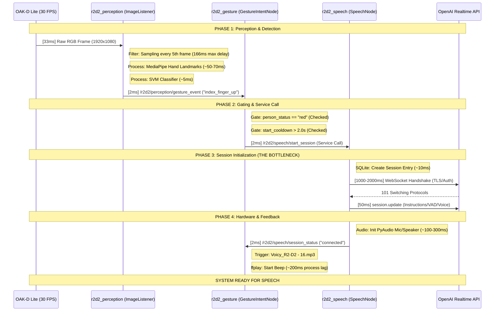

# R2D2 Speech Start Sequence Analysis
**Date:** December 23, 2025
**Source Status:** RED (Target Person Authorized)
**Target Action:** index_finger_up -> Speech Service "connected"

## 1. Detailed Sequence Diagram

## 2. Dependency & Delay Breakdown

| Component | Dependency / Clock | Logic / Filter | Delay (Typical) | Delay (Worst) |
| :--- | :--- | :--- | :--- | :--- |
| **Camera** | 30 Hz Hardware Clock | Exposure & Sensor Readout | 33ms | 33ms |
| **Perception** | `gesture_frame_skip` | Processes only every 5th frame | 33ms | 166ms |
| **MediaPipe** | CPU (Jetson Orin) | Hand Landmark Extraction (21 points) | 50ms | 80ms |
| **Gating** | ROS 2 Subscription | `person_status == "red"` | <1ms | <1ms |
| **Cooldown** | `cooldown_start_seconds` | Prevents rapid re-triggering | 0ms | 2000ms |
| **Network** | TCP/TLS Handshake | **OpenAI WebSocket Connect** | **1200ms** | **3000ms** |
| **API Init** | `session.update` | Remote JSON config acknowledgment | 50ms | 200ms |
| **Hardware** | HyperX / PAM8403 | PyAudio stream initialization | 150ms | 400ms |
| **Feedback Beep** | `session_status` | **Voicy_R2-D2 - 16.mp3** (ffplay) | **200ms** | **400ms** |

### Total Path Latency (to first response)
*   **Minimum (Perfect conditions):** ~1.7 seconds
*   **Maximum (Typical load/Network jitter):** ~4.5 seconds

## 3. Critical Observations

1.  **Reactive Connection:** The current code connects to OpenAI *after* the gesture. This accounts for ~70% of the total wait time.
2.  **Sampling Gap:** The `gesture_frame_skip: 5` creates a 166ms window where gestures are invisible.
3.  **Feedback Lag (Late Beep):** The "Start Beep" (`Voicy_R2-D2 - 16.mp3`) only plays *after* the network connection is confirmed. This means you wait ~2 seconds in silence before hearing the "OK" beep.

