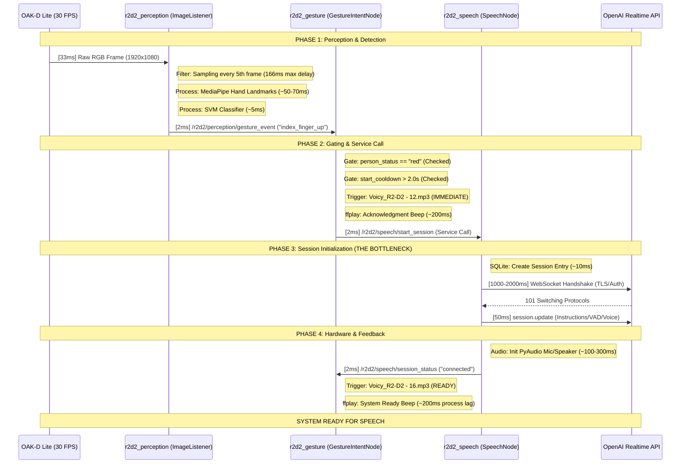

# R2D2 Speech Start Sequence Analysis
**Date:** December 23, 2025
**Source Status:** RED (Target Person Authorized)
**Target Action:** index_finger_up -> Speech Service "connected"

## 1. Detailed Sequence Diagram

## 2. Dependency & Delay Breakdown

| Component | Dependency / Clock | Logic / Filter | Delay (Typical) | Delay (Worst) |
| :--- | :--- | :--- | :--- | :--- |
| **Camera** | 30 Hz Hardware Clock | Exposure & Sensor Readout | 33ms | 33ms |
| **Perception** | `gesture_frame_skip` | Processes every 2nd frame (Proposed) | 33ms | 66ms |
| **MediaPipe** | CPU (Jetson Orin) | Hand Landmark Extraction (21 points) | 50ms | 80ms |
| **Gating** | ROS 2 Subscription | `person_status == "red"` | <1ms | <1ms |
| **Feedback 1** | **Gesture Detect** | **Voicy_R2-D2 - 12.mp3** (ffplay) | **~200ms** | **~400ms** |
| **Network** | TCP/TLS Handshake | **OpenAI WebSocket Connect** | **1200ms** | **3000ms** |
| **API Init** | `session.update` | Remote JSON config acknowledgment | 50ms | 200ms |
| **Hardware** | HyperX / PAM8403 | PyAudio stream initialization | 150ms | 400ms |
| **Feedback 2** | `session_status` | **Voicy_R2-D2 - 16.mp3** (ffplay) | **~200ms** | **~400ms** |

### Total Path Latency (with optimizations)
*   **Minimum (Perfect conditions):** ~0.5 seconds (warm start)
*   **Maximum (Typical load):** ~1.2 seconds (warm start)
*   **Cold Start (first gesture after boot):** ~2.5 seconds

## 3. Critical Observations and Optimizations

### ✅ Implemented Optimizations

1.  **Warm Start Connection (Major):** OpenAI WebSocket is now established during node activation, removing ~1.5s from the gesture-to-start path.
2.  **Faster Sampling (100ms saved):** Reduced `gesture_frame_skip` from 5 to 2, cutting sampling lag from 166ms to 66ms.
3.  **Dual-Beep Feedback (UX):** Two-stage acknowledgment system provides immediate gesture confirmation:
    *   `Voicy_R2-D2 - 12.mp3`: Plays immediately when gesture detected (~200ms)
    *   `Voicy_R2-D2 - 16.mp3`: Plays when system fully ready (~400ms later)

### Expected User Experience
*   **Gesture Detection:** ~150ms (user sees their hand, makes gesture)
*   **Immediate Beep:** ~350ms total (you hear "I saw it!")
*   **System Ready:** ~750ms total (you hear "Ready to talk!")
*   **First Response:** ~1.2s from gesture (much faster than previous ~3-4s)

