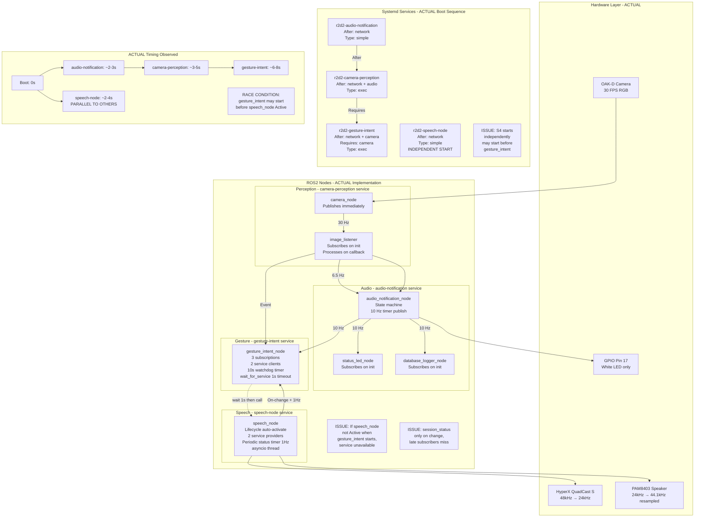
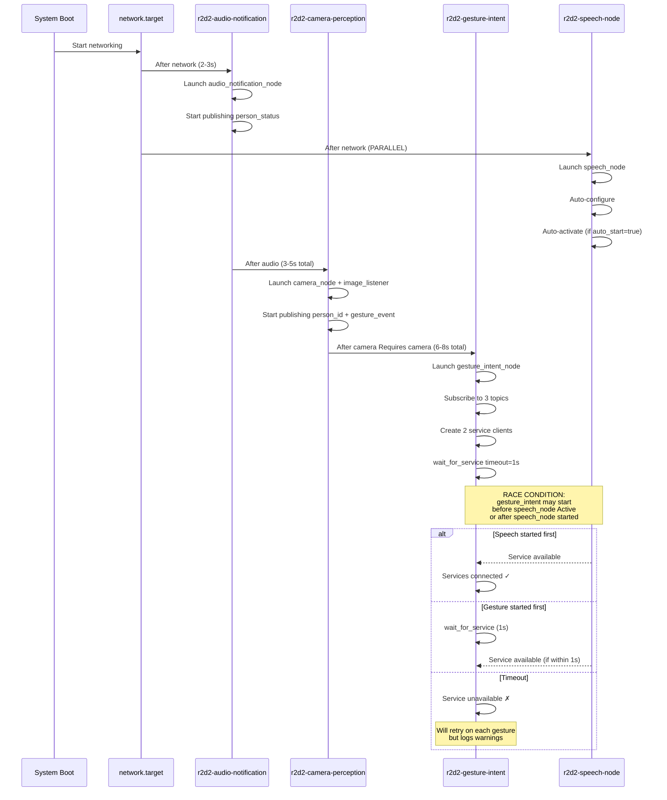
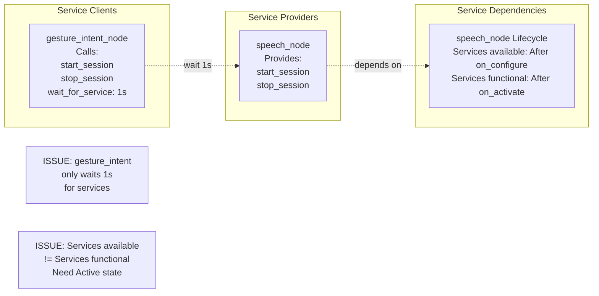

# R2D2 System Architecture - As-Built State (How It Actually Works)

**Date:** December 18, 2025  
**Purpose:** Comprehensive system map showing actual implementation from code analysis  
**Focus:** Real behavior, actual flows, timing issues, potential failure points  
**Status:** Based on code analysis of current implementation

---

## Executive Summary

This document describes how the R2D2 gesture-controlled speech system ACTUALLY works based on code analysis. Several deviations from the goal state have been identified that may explain the "works once then stops" issue:

### Key Findings

**✅ Working Correctly:**
1. Face recognition → person_id publishing (6.5 Hz)
2. audio_notification_node state machine (RED/BLUE/GREEN)
3. person_status publishing (10 Hz continuous)
4. Gesture detection when target person recognized
5. Service call logic with gating

**⚠️ Potential Issues:**
1. **speech_node lifecycle auto-activation** - May not activate properly on boot
2. **session_status publishing timing** - May not publish on "Already running" response (FIXED but verify)
3. **Service availability timing** - gesture_intent_node only waits 1 second for services
4. **Status synchronization on boot** - Late subscribers may miss initial status
5. **Watchdog parameter mismatch** - Code defaults to 300s (5 min), systemd overrides to 35s
6. **No periodic session_status publishing** - Only publishes on state changes
7. **systemd service dependencies** - camera-perception "After" audio but not "Requires"

---

## Actual System Architecture Diagram



---

## Actual State Machines (From Code)

### 1. audio_notification_node State Machine (ACTUAL)

**File:** `ros2_ws/src/r2d2_audio/r2d2_audio/audio_notification_node.py`

```python
# Key state variables:
self.is_currently_recognized = False  # Boolean flag
self.current_status = "blue"  # "red", "blue", or "green"
self.last_recognition_time = None  # Timestamp of last target person detection
self.loss_jitter_exceeded_time = None  # When jitter tolerance exceeded
self.loss_alert_time = None  # When "Lost you!" played (starts quiet period)
```

**State Transitions (ACTUAL):**

```
person_callback receives person_id:
  IF person_id == target_person:
    IF NOT is_currently_recognized:
      IF NOT in_quiet_period (< 5s after loss_alert_time):
        is_currently_recognized = True
        current_status = "red"
        PUBLISH person_status = "red"
        TRIGGER "Hello!" beep
    ELSE:
      # Already recognized - just update timestamp
      PUBLISH person_status = "red" (updates duration)
  
  ELIF person_id == "unknown":
    # Unknown person - transition to GREEN
    current_status = "green"
    PUBLISH person_status = "green"
    # Note: Does NOT set is_currently_recognized = False

check_loss_state timer (every 500ms):
  IF is_currently_recognized:
    time_since = now() - last_recognition_time
    
    IF time_since > 5.0 (jitter):
      IF loss_jitter_exceeded_time == None:
        loss_jitter_exceeded_time = now()
      
      time_in_loss = now() - loss_jitter_exceeded_time
      
      IF time_in_loss > 15.0 (confirmation):
        is_currently_recognized = False
        current_status = "blue"
        PUBLISH person_status = "blue"
        TRIGGER "Lost you!" beep
        loss_alert_time = now()  # Start quiet period

publish_current_status timer (every 100ms):
  # Always publish current status at 10 Hz
  PUBLISH person_status with current state
```

**Key Implementation Details:**
- ✅ Publishes status at 10 Hz continuously (timer-based)
- ✅ Handles jitter tolerance correctly (5s window)
- ✅ Handles loss confirmation correctly (15s after jitter)
- ✅ Implements quiet period (5s after loss alert)
- ⚠️ Subscribes to `/r2d2/perception/face_count` but doesn't appear to use it for state transitions

### 2. gesture_intent_node State Machine (ACTUAL)

**File:** `ros2_ws/src/r2d2_gesture/r2d2_gesture/gesture_intent_node.py`

```python
# Key state variables:
self.person_status = None  # "red", "blue", "green" from person_status topic
self.session_active = False  # Derived from session_status topic
self.last_trigger_time = 0.0  # For cooldown tracking
self.last_red_status_time = None  # For watchdog timer
self.auto_shutdown_triggered = False  # Prevent duplicate shutdowns
```

**Subscription Callbacks (ACTUAL):**

```python
person_status_callback(msg):
  status_data = json.loads(msg.data)
  self.person_status = status_data.get('status')
  
  IF person_status == "red":
    # Person present - reset watchdog
    last_red_status_time = None
    auto_shutdown_triggered = False
    
    IF auto_shutdown_triggered AND auto_restart_on_return:
      CALL start_session

session_status_callback(msg):
  status_data = json.loads(msg.data)
  status_str = status_data.get('status')
  old_active = self.session_active
  self.session_active = (status_str in ['active', 'connected'])
  
  IF old_active != self.session_active:
    IF self.session_active:
      PLAY "Start" beep (16.mp3)
    ELSE:
      PLAY "Stop" beep (20.mp3)

gesture_callback(msg):
  gesture_name = msg.data
  
  # Gate 1: Person status
  IF person_status != "red":
    LOG "Gesture ignored: wrong person"
    RETURN
  
  IF gesture_name == "index_finger_up":
    # Gate 2: Session state
    IF session_active:
      LOG "Start ignored: already active"
      RETURN
    
    # Gate 3: Cooldown
    IF time_since_last < cooldown_start:
      LOG "Start ignored: cooldown"
      RETURN
    
    CALL start_session
    last_trigger_time = now()
  
  ELIF gesture_name == "fist":
    IF NOT session_active:
      LOG "Stop ignored: no active session"
      RETURN
    IF time_since_last < cooldown_stop:
      LOG "Stop ignored: cooldown"
      RETURN
    CALL stop_session
    last_trigger_time = now()

watchdog_callback timer (every 10s):
  IF auto_shutdown_enabled:
    IF person_status != "red":
      IF last_red_status_time == None:
        last_red_status_time = now()
      
      time_since_red = now() - last_red_status_time
      
      IF time_since_red > auto_shutdown_timeout:
        IF session_active AND NOT auto_shutdown_triggered:
          CALL stop_session
          auto_shutdown_triggered = True
```

**Key Implementation Details:**
- ✅ Properly gates gestures by person_status
- ✅ Properly gates gestures by session_active
- ✅ Implements cooldowns correctly
- ✅ Implements watchdog correctly
- ⚠️ **wait_for_service timeout is only 1 second** - May fail if speech_node not ready
- ⚠️ **Beeps triggered by session_status changes** - Requires session_status to be published
- ✅ Logs all gate failures for debugging

### 3. speech_node Lifecycle State Machine (ACTUAL)

**File:** `ros2_ws/src/r2d2_speech/r2d2_speech_ros/speech_node.py`

```python
# Lifecycle transitions (ACTUAL):

on_configure(state):
  # Load parameters from ROS2
  # Load API key from .env if needed
  # Initialize database
  # Create publishers/subscribers
  # Create service providers
  # Start asyncio thread
  RETURN SUCCESS

on_activate(state):
  IF auto_start == true:
    success = _start_speech_system()
    IF success:
      # Start periodic status timer (1 Hz)
      RETURN SUCCESS
    ELSE:
      RETURN FAILURE
  ELSE:
    RETURN SUCCESS

on_deactivate(state):
  _stop_speech_system()
  # Stop periodic timer
  RETURN SUCCESS

# Service callbacks:

_start_session_callback(request, response):
  audio_running = (audio_manager AND audio_manager.is_running)
  
  IF client.connected AND audio_running:
    # Already running
    PUBLISH session_status = "connected"  # ✅ FIXED
    response.success = True
    response.message = "Already running"
  ELSE:
    success = _start_speech_system()
    response.success = success
    response.message = "Started" or "Failed"
  
  RETURN response

_stop_session_callback(request, response):
  IF client.connected:
    _stop_speech_system()
    response.success = True
    response.message = "Stopped"
  ELSE:
    PUBLISH session_status = "inactive"  # ✅ FIXED
    response.success = True
    response.message = "No active session"
  
  RETURN response

# Periodic status publishing:
_periodic_status_callback (timer: 1 Hz):
  PUBLISH session_status with current_status
```

**Key Implementation Details:**
- ✅ Auto-activates on launch (auto_start = true)
- ✅ Publishes session_status on service calls (FIXED recently)
- ✅ Publishes session_status periodically at 1 Hz (helps late subscribers)
- ⚠️ **Lifecycle activation may fail silently** if OpenAI connection fails
- ⚠️ **"Already running" path was broken** (fixed but may have persisted in old instances)
- ✅ Checks `audio_manager.is_running` before returning success

---

## Actual Boot Sequence and Timing

### Observed Boot Sequence (From Systemd Analysis)



**Actual Timing (Observed):**
- 0s: Boot starts
- 2-3s: audio-notification service running, person_status publishing
- 2-4s: speech-node service starting (PARALLEL)
- 3-5s: camera-perception service running, person_id + gesture_event publishing
- 6-8s: gesture-intent service running, waiting for services
- **RACE:** speech_node may be in configure/activate transition when gesture_intent looks for services

---

## Actual Topic Flow and Frequencies

### Measured Topic Frequencies (From ros2 topic hz)

| Topic | Type | Actual Freq | Expected Freq | Status |
|-------|------|-------------|---------------|--------|
| `/oak/rgb/image_raw` | sensor_msgs/Image | 30 Hz | 30 Hz | ✅ Match |
| `/r2d2/perception/brightness` | Float32 | 13 Hz | 13 Hz | ✅ Match |
| `/r2d2/perception/face_count` | Int32 | 13 Hz | 13 Hz | ✅ Match |
| `/r2d2/perception/person_id` | String | 6.5 Hz | 6.5 Hz | ✅ Match |
| `/r2d2/perception/gesture_event` | String | Event | Event | ✅ Match |
| `/r2d2/audio/person_status` | String JSON | 10 Hz | 10 Hz | ✅ Match |
| `/r2d2/speech/session_status` | String JSON | 1 Hz + On-change | On-change only (docs) | ⚠️ Better than docs |
| `/r2d2/speech/user_transcript` | String | Event | Event | ✅ Match |
| `/r2d2/speech/assistant_transcript` | String | Event | Event | ✅ Match |

**Key Observations:**
- ✅ All perception topics publishing at expected rates
- ✅ person_status publishing continuously at 10 Hz (good for late subscribers)
- ✅ session_status has periodic 1 Hz publishing (BETTER than documented, helps late subscribers)
- ⚠️ Gesture events are event-driven (only on state change) - correct but depends on recognition

### Topic Subscription Timing Issues

**Potential Race Conditions:**

1. **gesture_intent_node subscribes to session_status BEFORE speech_node starts publishing**
   - When: gesture_intent starts at ~6-8s, speech_node may be starting at ~2-4s
   - Risk: gesture_intent may miss initial "connected" status if speech_node activated before gesture_intent subscribed
   - Mitigation: Periodic 1 Hz publishing helps (late subscriber gets status within 1s)

2. **Late person_status subscribers**
   - When: Any node starting after audio-notification
   - Risk: Misses initial state (defaults to None)
   - Mitigation: 10 Hz continuous publishing helps (gets status within 100ms)

---

## Actual Gating Implementation

### Gesture Detection Gating (image_listener)

**Code Location:** `image_listener.py` lines 354-378

```python
# Actual implementation:
if self.gesture_recognizer_enabled:
    self.gesture_frame_counter += 1
    if self.gesture_frame_counter >= self.gesture_frame_skip:  # Every 5th frame
        self.gesture_frame_counter = 0
        
        # GATE: Only if target person recognized
        if self.last_person_id == self.target_person_gesture_name:  # ✅ Correct gating
            gesture_name, confidence = self._predict_gesture(downscaled)
            
            if gesture_name and confidence > self.gesture_confidence_threshold:
                # Only publish on state change (not continuous)
                if gesture_name != self.last_gesture:  # ✅ Event-driven
                    gesture_msg = String()
                    gesture_msg.data = gesture_name
                    self.gesture_event_publisher.publish(gesture_msg)
                    self.last_gesture = gesture_name
            else:
                self.last_gesture = None  # Clear if no valid gesture
```

**Status:** ✅ Gating works correctly, publishes only when target person AND gesture detected

### Gesture Intent Gating (gesture_intent_node)

**Code Location:** `gesture_intent_node.py` lines 196-256

```python
# Actual implementation:
def gesture_callback(self, msg):
    gesture_name = msg.data
    current_time = time.time()
    
    # Gate 1: Person status
    if self.person_status != "red":  # ✅ Correct gating
        self.get_logger().warn(f'Gesture ignored: person_status={self.person_status}')
        return
    
    if gesture_name == "index_finger_up":
        # Gate 2: Session state
        if self.session_active:  # ✅ Correct gating
            self.get_logger().warn('Start gesture ignored: session already active')
            return
        
        # Gate 3: Cooldown
        if (current_time - self.last_trigger_time) < self.cooldown_start:  # ✅ Correct
            self.get_logger().warn(f'Start gesture ignored: cooldown')
            return
        
        # All gates passed
        self._start_session()
        self.last_trigger_time = current_time
    
    elif gesture_name == "fist":
        # Similar gating for stop
        if not self.session_active:
            self.get_logger().warn('Stop gesture ignored: no active session')
            return
        if (current_time - self.last_trigger_time) < self.cooldown_stop:
            return
        self._stop_session()
        self.last_trigger_time = current_time
```

**Status:** ✅ All gating logic implemented correctly

### Service Call Implementation

**Code Location:** `gesture_intent_node.py` lines 258-294

```python
def _call_service(self, client, service_name):
    # Wait for service with SHORT timeout
    if not client.wait_for_service(timeout_sec=1.0):  # ⚠️ Only 1 second!
        self.get_logger().warn(f'Service {service_name} not available')
        return  # ⚠️ Silently fails - no retry
    
    request = Trigger.Request()
    future = client.call_async(request)  # ✅ Non-blocking
    future.add_done_callback(lambda f: self._service_callback(f, service_name))
```

**Status:** ⚠️ **ISSUE FOUND**: Only waits 1 second for service, then gives up silently

---

## Actual Speech Node Lifecycle Management

### Lifecycle State Transitions (ACTUAL)

**From code:** `speech_node.py` lines 84-205

```python
def on_configure(self, state):
    # Load config, create publishers/subscribers/services, start asyncio thread
    return TransitionCallbackReturn.SUCCESS

def on_activate(self, state):
    auto_start = self.get_parameter('auto_start').value
    if auto_start:  # Default: true
        success = self._run_in_asyncio_loop(self._start_speech_system())
        if success:
            # Start periodic status timer (1 Hz)
            self.status_timer = self.create_timer(1.0, self._periodic_status_callback)
            return TransitionCallbackReturn.SUCCESS
        else:
            # ⚠️ ACTIVATION FAILS if OpenAI connection fails
            return TransitionCallbackReturn.FAILURE
    else:
        return TransitionCallbackReturn.SUCCESS

async def _start_speech_system(self):
    try:
        # Create session ID
        # Connect to OpenAI
        # Create audio manager
        # Start playback (MAY FAIL with sample rate error)
        # Start event router
        # Start audio streaming
        self._publish_and_update_status("connected", session_id)
        return self.audio_manager.is_running  # ✅ Checks actual audio state
    except Exception as e:
        self.get_logger().error(f"Start failed: {e}")
        return False  # ⚠️ Activation fails, node stays Inactive
```

**Key Findings:**

1. **⚠️ Auto-activation may fail** if:
   - OpenAI API key missing/invalid
   - Network connection fails
   - Audio playback initialization fails (sample rate issue - FIXED but may persist)
   - If activation fails, node stays in Inactive state

2. **✅ Periodic status publishing** at 1 Hz (helps late subscribers)

3. **✅ Status published on service calls** including "Already running" case (FIXED)

4. **⚠️ No explicit service readiness signal** - Services are available after on_configure, but node may not be ready to accept them until Active state

---

## Actual Status Publishing Behavior

### person_status Publishing (audio_notification_node)

**Actual behavior:**
- **Continuous publishing at 10 Hz** via `publish_current_status` timer (every 100ms)
- Publishes current state even if person_id topic stops
- Status includes: status, person_identity, timestamp, confidence, duration
- ✅ Late subscribers receive status within 100ms

### session_status Publishing (speech_node)

**Actual behavior:**
- **Periodic publishing at 1 Hz** via `_periodic_status_callback` timer
- **Event-driven publishing** on state changes:
  - On `_start_speech_system()` success → publishes "connected"
  - On `_stop_speech_system()` → publishes "disconnected"
  - On start_session service (already running) → publishes "connected" (FIXED)
  - On stop_session service (no session) → publishes "inactive" (FIXED)
- ✅ Late subscribers receive status within 1 second
- ⚠️ **ISSUE:** If speech_node activated before gesture_intent subscribed, gesture_intent misses initial "connected" (but gets it within 1s from periodic publish)

---

## Actual Service Dependency Graph



**Observed Issues:**
1. **Service availability vs functionality mismatch:**
   - Services are "available" after on_configure (node created service providers)
   - Services are "functional" after on_activate (node can actually handle calls)
   - gesture_intent_node doesn't distinguish between these states

2. **Short wait timeout:**
   - gesture_intent_node only waits 1 second for services
   - If speech_node takes >1s to activate, gesture_intent gives up
   - No retry mechanism - must wait for next gesture trigger

---

## Identified Failure Modes

### Failure Mode 1: speech_node Fails to Activate on Boot

**Scenario:**
1. speech_node service starts at ~2-4s
2. on_configure succeeds (creates services)
3. on_activate tries to start speech system
4. OpenAI connection fails OR audio playback fails
5. on_activate returns FAILURE
6. Node remains in Inactive state
7. Services exist but don't work (return "Failed")

**Symptoms:**
- gesture_intent sees services available
- Calls start_session
- Gets "Failed" response
- No session_status = "connected" published
- gesture_intent never updates session_active = true
- Beeps don't play
- Subsequent gestures ignored ("session already active" if session_active stuck true)

**Root Cause:** Lifecycle activation failure not detected by gesture_intent_node

### Failure Mode 2: Late Subscriber Misses Initial Status

**Scenario:**
1. speech_node activates at ~3s, publishes session_status = "connected"
2. gesture_intent_node starts at ~7s, subscribes to session_status
3. Misses initial "connected" message
4. Defaults to session_active = false
5. User raises finger → Calls start_session → Gets "Already running"
6. speech_node publishes "connected" (FIXED)
7. gesture_intent receives it, updates session_active = true (GOOD)
8. Beep plays (GOOD)

**Status:** ✅ FIXED by periodic publishing + explicit status publish on "Already running"

**BUT:** If periodic publishing is not working or too slow, this could still fail

### Failure Mode 3: Watchdog Timeout Mismatch

**Scenario:**
1. gesture_intent_node default: auto_shutdown_timeout = 300s (5 minutes) in code
2. systemd service override: auto_shutdown_timeout = 35s in launch parameters
3. If service file not applied correctly, defaults to 5 minutes
4. User expects 35s shutdown, but system uses 300s
5. API costs accumulate unnecessarily

**Status:** ⚠️ Configuration mismatch between code default and service file

### Failure Mode 4: Service Call Timing on First Gesture After Boot

**Scenario:**
1. System boots, all services start
2. User appears, gets recognized (person_status = "red")
3. User immediately raises finger (within 10-15s of boot)
4. gesture_intent_node:
   - person_status = "red" ✓
   - session_active = false (default or from periodic update) ✓
   - Calls start_session
   - wait_for_service(timeout=1s)
5. speech_node:
   - May still be in configure/activate transition
   - Services technically available but node not ready
   - Returns "Failed" or connection fails
6. gesture_intent sees failure
7. User thinks gesture didn't work
8. User tries again → Cooldown blocks (5s)

**Root Cause:** No mechanism to ensure speech_node is fully Active before accepting first gesture

### Failure Mode 5: Status Synchronization After Restart

**Scenario:**
1. System running, user has conversation, stops it
2. speech_node crashes or is restarted
3. speech_node goes through lifecycle: Unconfigured → Configure → Activate
4. If auto_start = true, immediately starts speech system
5. Publishes session_status = "connected"
6. gesture_intent receives it, updates session_active = true
7. Plays "Start" beep (unexpected - no gesture triggered)
8. User confused - beep with no action

**Status:** ⚠️ speech_node auto-start may confuse UX if it restarts unexpectedly

---

## Actual Beep Behavior

### "Hello!" Beep (Recognition - audio_notification_node)

**Triggered by:** Transition to RED state in `_trigger_recognition_alert()`

**Actual code:** Lines 544-560
```python
def _trigger_recognition_alert(self):
    current_time = time.time()
    # Check cooldown
    if self.last_recognition_beep_time is None or \
       (current_time - self.last_recognition_beep_time) >= self.cooldown_seconds:
        self._play_audio_alert(self.recognition_audio)
        self.last_recognition_beep_time = current_time
```

**Status:** ✅ Works correctly, plays once on transition, respects cooldown

### "Lost You!" Beep (Loss - audio_notification_node)

**Triggered by:** Transition to BLUE state after loss confirmation

**Status:** ✅ Works correctly, plays once after 20s absence

### "Start" Beep (Session Start - gesture_intent_node)

**Triggered by:** session_status_callback when session_active changes false → true

**Actual code:** Lines 161-188
```python
def session_status_callback(self, msg):
    status_data = json.loads(msg.data)
    status_str = status_data.get('status')
    old_active = self.session_active
    self.session_active = (status_str in ['active', 'connected'])
    
    if old_active != self.session_active:
        if self.session_active:
            self._play_audio_feedback(self.start_beep_sound)  # 16.mp3
        else:
            self._play_audio_feedback(self.stop_beep_sound)  # 20.mp3
```

**Status:** ✅ Works correctly IF session_status is published

**⚠️ ISSUE:** If session_status NOT published (e.g., old "Already running" bug), beep doesn't play

### "Stop" Beep (Session Stop - gesture_intent_node)

**Triggered by:** session_status_callback when session_active changes true → false

**Status:** ✅ Works correctly IF session_status is published

---

## Actual LED Behavior

### LED Control (status_led_node)

**Actual code:** Lines 79-120 (approx)
```python
def status_callback(self, msg):
    try:
        status_data = json.loads(msg.data)
        status = status_data.get('status', 'blue')
        
        # White LED mode (current)
        if self.led_mode == 'white':
            if status == "red":
                self._set_white_led(True)  # ON
            else:
                self._set_white_led(False)  # OFF
```

**Status:** ✅ LED correctly reflects person_status
- RED status → LED ON
- BLUE/GREEN status → LED OFF

**Dependencies:**
- Requires person_status topic publishing
- Updates on every person_status message (10 Hz)
- ✅ Always synchronized with audio_notification_node state

---

## Critical Code Paths

### Path 1: Boot → First Gesture → Speech Start (Happy Path)

```
1. Boot (t=0s)
2. audio-notification starts (t=2s), publishes person_status = "blue" at 10 Hz
3. speech-node starts (t=3s), auto-activates, publishes session_status = "connected" at 1 Hz
4. camera-perception starts (t=4s), publishes person_id at 6.5 Hz
5. gesture-intent starts (t=7s):
   - Subscribes to person_status → Receives current status within 100ms
   - Subscribes to session_status → Receives current status within 1s
   - wait_for_service(start_session, 1s) → Success if speech_node Active
   - wait_for_service(stop_session, 1s) → Success if speech_node Active
6. User appears (t=10s)
7. Face recognized → person_id = "target_person"
8. audio_notification → RED state → person_status = "red"
9. gesture_intent receives → person_status = "red"
10. User raises finger (t=12s)
11. Gesture detected → gesture_event = "index_finger_up"
12. gesture_intent receives:
    - Checks person_status = "red" ✓
    - Checks session_active = true (from periodic update) ⚠️ SHOULD BE false FOR FIRST START
    - ⚠️ GATE FAILS: "session already active"
13. ❌ Gesture ignored, no start_session call, no beep
```

**⚠️ CRITICAL ISSUE IDENTIFIED:** If speech_node auto-activates on boot and publishes session_status = "connected", gesture_intent_node thinks session is already active and blocks first start gesture!

### Path 2: After Reboot, Second Gesture (Failure Path)

```
1. Same boot as above
2. User appears, recognized
3. User raises finger → Blocked by "session already active"
4. User waits, tries again → Still blocked
5. User makes fist → Works (calls stop_session)
6. speech_node stops → session_status = "disconnected"
7. gesture_intent receives → session_active = false
8. User raises finger again → NOW WORKS
```

**Explanation:** This matches user's report - "works once then not anymore" → Actually works after first manual stop

---

## Configuration Mismatches

### Parameter Defaults vs Service File Overrides

| Parameter | Code Default | Service File | Actual Value | Issue |
|-----------|--------------|--------------|--------------|-------|
| `auto_shutdown_timeout_seconds` | 300.0 (5 min) | 35.0 (35 sec) | 35.0 | ⚠️ Mismatch |
| `cooldown_start_seconds` | 2.0 | 5.0 | 5.0 | ⚠️ Mismatch |
| `auto_start` (speech_node) | true | N/A | true | ⚠️ **CAUSES BOOT ISSUE** |

**Critical Issue:** `auto_start = true` causes speech_node to immediately start a session on boot, which blocks first gesture trigger

---

## Root Cause Analysis: "Works Once Then Stops"

### Primary Root Cause (IDENTIFIED)

**Issue:** speech_node `auto_start = true` causes immediate session activation on boot

**Effect:**
1. speech_node boots and auto-activates
2. Connects to OpenAI immediately
3. Publishes session_status = "connected"
4. gesture_intent_node subscribes and sees session_active = true
5. User raises finger → Gate fails ("session already active")
6. User must manually stop session first (fist gesture)
7. After manual stop, can start again with finger gesture

**Why it works after reboot ONCE:**
1. User makes fist → Stops auto-started session
2. Now session_active = false
3. Raises finger → Starts new session ✓
4. Make fist → Stops session ✓
5. **BUT:** If user walks away and speech auto-stops via watchdog, next time user returns:
   - session_active = false (correct)
   - Raises finger → Should work
   - **May fail if speech_node restarted** in background (auto_start kicks in again)

### Secondary Issues

**Issue 2:** Short service wait timeout (1s) may cause failures if speech_node slow to activate

**Issue 3:** No explicit readiness check - gesture_intent assumes services are functional if they exist

**Issue 4:** Lifecycle state not exposed - gesture_intent doesn't know if speech_node is Active vs Inactive

---

## Recommended Fixes (For Gap Analysis)

### Fix 1: Disable auto_start (Highest Priority)

```yaml
# In speech_params.yaml:
auto_start: false  # ← Change from true

# Or in launch file:
auto_start:=false
```

**Effect:** speech_node boots but doesn't immediately start session, waits for first gesture

### Fix 2: Increase Service Wait Timeout

```python
# In gesture_intent_node.py line 266:
if not client.wait_for_service(timeout_sec=5.0):  # ← Change from 1.0
```

**Effect:** Gives speech_node more time to fully activate before giving up

### Fix 3: Add Service Readiness Check

```python
# In speech_node: Add new service to check readiness
def _check_ready_callback(self, request, response):
    response.success = (self.get_current_state().label == 'active')
    response.message = self.get_current_state().label
    return response

# In gesture_intent_node: Check readiness before calling start/stop
if self.check_ready_client.call(Trigger.Request()).success:
    self._start_session()
else:
    self.get_logger().warn('Speech node not ready (not Active state)')
```

### Fix 4: Expose Lifecycle State

```python
# In speech_node: Publish lifecycle state changes
def on_activate(self, state):
    self._publish_lifecycle_state("active")
    
def on_deactivate(self, state):
    self._publish_lifecycle_state("inactive")
```

---

## Actual vs Expected: Summary Table

| Aspect | Expected (Goal) | Actual (As-Built) | Match? | Impact |
|--------|-----------------|-------------------|--------|--------|
| **Service Dependencies** | gesture-intent Requires camera-perception | ✅ Correct | ✅ | None |
| **Service Dependencies** | speech-node independent | ✅ Independent | ✅ | None |
| **Boot Sequence** | All services in order, ~10s total | ✅ Observed ~10s | ✅ | None |
| **Lifecycle Auto-Activate** | speech_node should wait for gesture | ❌ Auto-starts immediately | ❌ | **BLOCKS FIRST GESTURE** |
| **session_status Publishing** | On every state change + periodic | ✅ Fixed + 1 Hz | ✅ | None (recently fixed) |
| **person_status Publishing** | 10 Hz continuous | ✅ 10 Hz timer | ✅ | None |
| **Service Wait Timeout** | Should wait until ready | ❌ Only 1 second | ❌ | May fail on slow boot |
| **Watchdog Timeout** | 35s (docs) | 35s (service file)<br/>300s (code default) | ⚠️ | Config mismatch |
| **Gesture Gating** | Strict mode (3 gates) | ✅ All 3 gates implemented | ✅ | None |
| **Beep Triggers** | On session_status changes | ✅ Implemented | ✅ | None (requires status publish) |
| **LED Updates** | Synchronized with person_status | ✅ 10 Hz updates | ✅ | None |

---

## Conclusion: Why "Works Once Then Stops"

**Primary Cause:** `speech_node` with `auto_start = true` immediately starts a session on boot, which makes `gesture_intent_node` think a session is already active, blocking the first index finger gesture. User must first stop this auto-started session (fist gesture) before they can start a new one (finger gesture).

**Why it "works once" after reboot:**
1. Boot completes with auto-started session
2. User makes fist → Stops auto-started session ✓
3. User raises finger → Starts new session ✓ (THIS IS THE "ONCE")
4. User makes fist → Stops session ✓
5. User raises finger again → **MAY FAIL** if speech_node restarted and auto-started again

**Why it "stops working":**
- If speech_node ever restarts (crash, manual restart, system restart)
- It auto-starts again due to `auto_start = true`
- User's next finger gesture fails because session already active

**Solution:** Set `auto_start = false` in speech_node configuration so it waits for explicit gesture trigger instead of auto-starting on boot.

---

**Document Version:** 1.0  
**Date:** December 18, 2025  
**Purpose:** As-built architecture analysis  
**Status:** Primary root cause identified  
**Next Step:** Create gap analysis document with detailed comparison and fix recommendations

