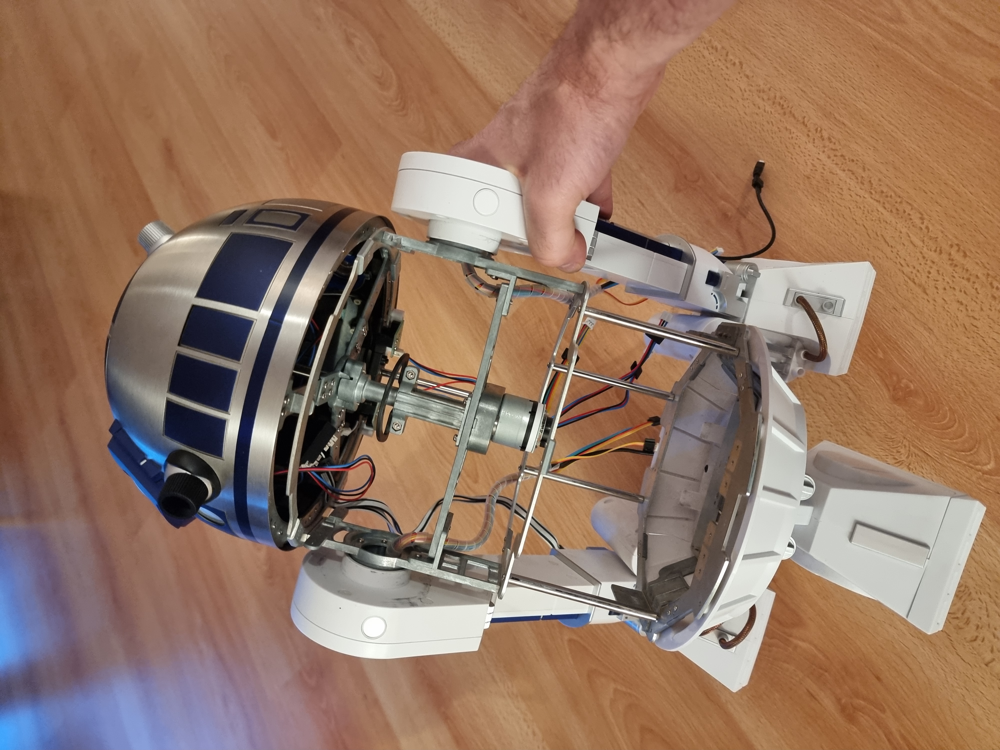
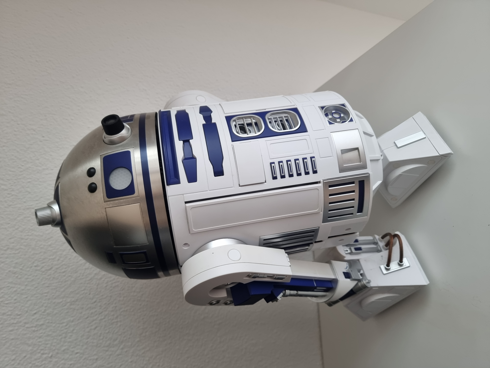

# AI R2-D2 Companion Bot



*1:2-Scale DeAgostini R2-D2 → Autonomous AI Companion: Indoor Nav, Person Recognition, Conversation (Llama-3-8B + Grok-4 Fallback), Fetch/Carry.*



**Core:** Jetson AGX Orin 64GB, ROS2 Humble, OAK-D Lite, ReSpeaker mic. 1/2 Scale: 48cm tall.

**Goal:** Convert stock kit DeAgostini 1:2 R2-D2 to autonomous AI companion:  90% pre-built ROS2 packages; <50 lines custom code. Focus: Modularity, reliability. With 
 indoor nav, person recognition, real speach conversations  (local Llama-3-8B + Grok-4 fallback if conf <70%).

**Assumptions:** specified parts/tutorials available

---

## Quick Start

### Prerequisites
- Flash Jetson AGX Orin with [JetPack 6.x](https://developer.nvidia.com/embedded/jetpack) (Ubuntu 22.04).
- Install ROS2 Humble: Follow [official docs](https://docs.ros.org/en/humble/Installation/Ubuntu-Install-Debs.html).
- Clone repo: `git clone https://github.com/severinleuenberger/R2D2-as-real-AI-companion.git && cd R2D2-as-real-AI-companion`.
- Build: `colcon build --symlink-install && source install/setup.bash`.

### Launch
```bash
# In one terminal (for nav + interaction)
ros2 launch r2d2_navigation nav_launch.py  # SLAM + Nav2

# In another terminal
ros2 launch r2d2_llm tts_stt_launch.py     # Speech → LLM → Actions
````


### Section: 1. Features and Requirements

## 1. Features and Requirements

### 1.1 Intelligent Speech with Fallback Logic
- **Pipeline:** Speech → STT → Local LLM → (if logprobs <0.7) → Grok-4 API → TTS/Action.
- **Local LLM:** Llama-3-8B via [llama.cpp](https://github.com/ggerganov/llama.cpp) + [llama_ros](https://github.com/mgonzs13/llama_ros).
- **Fallback:** Custom ROS2 node evaluates confidence; switches to [xAI Grok-4 API](https://x.ai/api).
- **Impl:** [jetson-voice](https://github.com/dusty-nv/jetson-voice) for audio + Python requests node (≤30 lines).

### 1.2 Person Recognition & Memory

**Status: 🔄 15% (YOLO detection launched; integrating ReMEmbR embeddings)**

- **Face Detection:** [Isaac ROS YOLOv8](https://nvidia-isaac-ros.github.io/concepts/perception/detection/yolo.html) or [dusty-nv/jetson-inference](https://github.com/dusty-nv/jetson-inference) for real-time bounding boxes (~30 FPS on Orin via TensorRT).
  - Input: OAK-D Lite RGB feed; outputs `/detections` (vision_msgs/Detection2DArray).
- **Identity Persistence:** Face embeddings via **[NVIDIA ReMEmbR](https://developer.nvidia.com/blog/multimodal-conversational-memory-with-remembr)** (multimodal retrieval for audio/visual linking) + SQLite DB.
  - Stores: Embeddings (vector col) + metadata (person_id, timestamps) in `r2d2_memory.db`.
  - Matching: Cosine similarity threshold >0.8 for recall; ~5-10ms/query on Orin.
- **Memory Management:** Voice command ("delete my data") triggers DB row deletion via custom ROS2 service (`/delete_memory`, ≤20 lines in `src/r2d2_perception/memory_manager.py`).
- **ROS2 Interface:** Publishes `/person_embedding` (std_msgs/Float64MultiArray); subscribes to `/face_detections`. Integrates with LLM via `/person_id` topic.

**Quick Setup**:
```bash
# Install Isaac ROS (Jetson quickstart: https://nvidia-isaac-ros.github.io/getting_started/dev_env_setup.html)
sudo apt install ros-humble-isaac-ros-yolo

# Init DB & ReMEmbR (in perception package)
cd ~/ros2_ws/src/r2d2_perception
python3 scripts/init_db.py  # Creates SQLite schema
colcon build && source ../install/setup.bash
ros2 launch r2d2_perception person_detection.launch.py  # YOLO + embeddings
````

### 1.3 Contextual Conversation
- **I/O:** [ros2_speech_recognition](https://github.com/Roboy/ros2_speech_recognition) (Roboy).
- **Association:** Link face/audio to thread.
- **Storage:** Per-person history in SQLite (see `src/r2d2_llm/memory.py`).
- **Impl:** Custom node for thread management (≤20 lines).

### 1.4 Autonomous Navigation & Mapping
- **SLAM:** [slam_toolbox](https://github.com/SteveMacenski/slam_toolbox) (online sync mode).
- **Stack:** AMCL localization + Nav2 planning/avoidance.
- **Ref:** [Waveshare UGV Rover Tutorial](https://www.waveshare.com/wiki/ROS2-based_UGV_ROVER_Tutorial) for launch files.
- **Impl:** Adapted launch in `src/r2d2_navigation/`.

### 1.5 Multi-Room & Semantic Mapping
- **Merging:** slam_toolbox multi-session.
- **Semantics:** [Isaac ROS Segmentation](https://github.com/NVIDIA-ISAAC-ROS/isaac_ros_image_segmentation) + jetson-inference labels.
- **Memory:** Object poses in map YAML.
- **Impl:** YAML extensions + perception node.

### 1.6 Object Manipulation
- **Control:** [ros2_control](https://github.com/ros-controls/ros2_control).
- **Pick/Place:** Adapt [ROS2_pick_and_place_UR5](https://github.com/JuoTungChen/ROS2_pick_and_place_UR5).
- **Gripper:** Servo mount (see `hardware/cad/`).
- **Impl:** ros2_control config for DeAgostini arms.

## Bill of Materials (BOM)

| Qty | Item | Model / Part Number | Purpose | Approx. Price (USD) | Link / Source | Status |
|-----|------|---------------------|--------|---------------------|---------------|--------|
| 1   | DeAgostini R2-D2 1:2 Kit | Complete 100-issue set | Main body, legs, dome, panels | ~1,385  | eBay / RPF Forums | Done |
| 1   | NVIDIA Jetson AGX Orin 64 GB | 945-13730-0005-000 | Main AI brain (ROS2 + Grok fallback) | 1,999 | NVIDIA / Amazon | Open |
| 1   | OAK-D Lite depth camera | Luxonis OAK-D-Lite | SLAM, person recognition, obstacle avoidance | 149 | Luxonis Store | Open |
| 1   | ReSpeaker 4-Mic Array for Raspberry Pi | Seeed Studio | Voice input for LLM node | 30 | Seeed / Amazon | Open |
| 2   | Pololu Dual MC33926 Motor Driver | #2135 | Drives stock DeAgostini DC motors | 20 × 2 = 40 | Pololu | Open |
| 2   | Stock DeAgostini DC motors + gearboxes | Original leg motors | Locomotion (2-wheel diff-drive) | Included in kit | — | Done |
| 1   | LiPo battery 4S 22.2 V 5000 mAh | Turnigy / HobbyKing | Main power | 40–60 | HobbyKing | Done |
| 1   | DC-DC buck converter 14 V → 12 V / 5 V | Various | Powers Jetson, ReSpeaker, motors | 10 | Amazon / AliExpress | Done |
| 1   | IMU (in OAK-D Lite) | BMI270 + BMM150 | Used by robot_localization EKF | Included | — | Done |

**Total estimated cost (without DeAgostini kit):** ~2,200 USD  
**Total with full DeAgostini kit:** ~3,600 USD


## 2. Hardware Components

### Base Model
| Spec | Value |
|------|-------|
| DeAgostini 1:2-Scale R2-D2 Kit | [Buy the kit or some magazines out of it](https://www.fanhome.com/us/star-wars/r2d2-build-up) |
| Height | 48 cm |
| Width | 28 cm |
| External Ø | 20 cm |
| Internal Volume | 4.5–7.2 L |
| Reuse | Drive/arms/dome, LED |
| Cost | 300–700 CHF |

### Compute
| Part | Specs | Link |
|------|--------|------|
| NVIDIA Jetson AGX Orin 64GB Dev Kit | 100×87×47 mm, 15–60 W | [Reichelt](https://www.reichelt.com/ch/de/shop/produkt/nvidia_jetson_agx_orin_dev_kit_12-kern_cpu_64_gb_ddr5-383698) |

### Sensors
| Part | Link |
|------|------|
| Luxonis OAK-D Lite Auto Focus | [Mouser](https://www.mouser.ch/ProductDetail/Luxonis/OAK-D-Lite-AF) |
| ReSpeaker 2-Mic HAT | [Reichelt](https://www.reichelt.com/de/de/shop/produkt/respeaker_2-mic_hat_fuer_raspberry_pi-248718) |

### Drive System
| Part | Link |
|------|------|
| Stock R2-D2 Motors | Reuse DeAgostini |
| Pololu Dual MC33926 | [Pololu](https://www.pololu.com/product/2995) |

### Power
| Part | Specs | Link |
|------|--------|------|
| 4× Turnigy 2200mAh 4S 60C LiPo | 14.8V, ~32.56Wh ea., 107×35×36mm, 255g | [HobbyKing](https://hobbyking.com/) |
| ISDT 608AC Charger | 50W AC/200W DC, 8A | [AliExpress](https://de.aliexpress.com/item/1005007512739386.html) |


## 3. Software Stack

**Why this Stack?** Optimized for Jetson edge-AI; leverages NVIDIA/ROS2 pre-builts for fast integration (fits ≤50 lines custom code goal).

### Base System
- **OS:** [JetPack 6.x](https://docs.nvidia.com/jetson/jetpack/index.html) (Ubuntu 22.04).
- **ROS2:** Humble ([Dockerized](https://docs.ros.org/en/humble/Installation.html) for easy Jetson deploys).

### Navigation & Mapping
- **SLAM:** [slam_toolbox](https://github.com/SteveMacenski/slam_toolbox) [](https://navigation.ros.org/).
- **Nav:** Nav2 for planning/avoidance [](https://navigation.ros.org/tutorials/docs/index.html).

### Perception
- **Visual AI:** [NVIDIA Isaac ROS](https://github.com/NVIDIA-ISAAC-ROS) (cuVSLAM, YOLOv8, FoundationPose).
- **Processing:** OpenCV + [jetson-inference](https://github.com/dusty-nv/jetson-inference).

### Interaction
- **Speech:** [ros2_speech_recognition](https://github.com/Roboy/ros2_speech_recognition).
- **TTS:** gTTS or [jetson-voice](https://github.com/dusty-nv/jetson-voice).


### Local LLM & Fallback
**Status: 🔄 20% (Ollama setup complete; integrating with llama_ros)**

- **Engine**: Llama-3-8B via **[Ollama](https://ollama.com/)** (Jetson AI Lab tutorial) + **[llama_ros](https://github.com/mgonzs13/llama_ros)** for ROS2 integration.
  - Ollama provides easy, quantized inference (4-bit for ~5-8GB VRAM on Orin), with ~200-500ms latency for 128-token responses (tested on JetPack 6.x).
  - Context window: 8K tokens; per-person history stored in SQLite via custom node (`src/r2d2_llm/memory.py`, ≤20 lines).
- **Fallback**: Logprobs < 0.7 triggers switch to **[xAI Grok-4 API](https://x.ai/api)** (via `requests` in a ROS2 node, ≤30 lines). API key in `.env` (gitignored).
- **ROS2 Interface**: Publishes to `/llm_response` (std_msgs/String); subscribes to `/llm_input` from STT. Launch via `ros2 launch r2d2_llm llm_bridge.launch.py`.

**Quick Setup**:
```bash
# Install Ollama (Jetson tutorial: https://jetson-ai-lab.com/ollama.html)
curl -fsSL https://ollama.com/install.sh | sh
ollama pull llama3:8b  # Downloads quantized model (~4.7GB)

# ROS2 Integration
cd ~/ros2_ws/src/r2d2_llm
colcon build
ros2 launch r2d2_llm llm_bridge.launch.py

````

### Control
- **Actuators:** [ros2_control](https://control.ros.org/) for motors/servos.

### Integration Strategy
- **Pre-Builts:** Launch files from [Waveshare UGV](https://www.waveshare.com/wiki/ROS2_based_ROS_Car_Kit), [Isaac ROS Examples](https://github.com/NVIDIA-ISAAC-ROS/isaac_ros_common), [Yahboom ROSMASTER](https://category.yahboom.net/blogs/news), [Stereolabs ZED](https://www.stereolabs.com/docs/ros2/).
- **Custom:** YAML params + tiny Python nodes (≤50 lines total).


## Repo Layout

```text
.
├─ docs/photos/          # Build progress pics (e.g., empty shell)
├─ hardware/
│   ├─ wiring/           # Schematics (Pololu MC33926)
│   └─ cad/              # 3D prints (gripper STEP/STL)
├─ src/                  # ROS2 packages
│   ├─ r2d2_description/ # URDF (48cm model)
│   ├─ r2d2_navigation/  # Nav2 + slam_toolbox launches
│   ├─ r2d2_perception/  # YOLO + ReMEmbR
│   └─ r2d2_llm/         # grok_fallback.py + memory DB
├─ docker/               # Dockerfile.humble + compose


## Docker Setup

Docker Compose simplifies running the project in a containerized environment, ensuring consistent dependencies across setups (e.g., ROS2 Humble, Jetson libraries). It's ideal for Jetson AGX Orin to avoid polluting the host OS and make reproducibility easy for collaborators.

- **What is `docker compose up`?** It's a command that starts all defined services (containers) from a `docker-compose.yml` file. For this project, it launches the ROS2 workspace, handling networking and volumes automatically.
- **What is it for?** Defines multi-container apps (e.g., one for core ROS2, another for LLM if needed). Here, it sets up the full stack with one command.
- **Why use it?** Reproducible builds (same env for all users), isolation (no host conflicts), easy testing/updates. Fits the <50 lines custom code goal by leveraging pre-built images.

### Create `docker-compose.yml`
Save this in the `docker/` folder (create if missing):

```yaml
version: '3.8'

services:
  ros2-r2d2:
    build:
      context: ..
      dockerfile: docker/Dockerfile.humble  # Assumes you have a Dockerfile for ROS2 Humble on Jetson
    image: r2d2-companion:humble
    privileged: true  # For hardware access (GPIO, CUDA)
    network_mode: host  # ROS2 discovery
    volumes:
      - /dev:/dev  # Device access (OAK-D, ReSpeaker)
      - ./src:/ros2_ws/src  # Mount workspace
      - ~/.grok_api_key:/root/.grok_api_key:ro  # API key (gitignored)
    environment:
      - ROS_DOMAIN_ID=42  # Avoid conflicts
      - DISPLAY=:0  # If GUI (rviz)
    command: >
      bash -c "source /opt/ros/humble/setup.bash &&
               colcon build --symlink-install &&
               source install/setup.bash &&
               ros2 launch r2d2_navigation nav_launch.py"
Usage

Install Docker on Jetson: Follow NVIDIA guide.
From repo root: cd docker && docker compose up --build.
For LLM separately: Add another service if scaling (e.g., ollama container).

````


├─ .gitignore            # Ignore API keys
├─ LICENSE               # MIT (code + hardware)
└─ README.md

````

---

### Section: Status (November 16, 2025)

| Component | Progress | Notes |
|-----------|----------|-------|
| Whole project planned       |10%      | ...   |
|R2D2 body bought, tested, then cleaned out again, everything I do not need      |20%      | ...   |


## Community & Contributing

- [@s_leuenberger](https://x.com/s_leuenberger) | Switzerland |
- **Contribute:** Fork, PR for launch tweaks. Report issues: [New Issue](https://github.com/severinleuenberger/R2D2-as-real-AI-companion/issues).
- **License:** [MIT](LICENSE) – Free to copy/modify/distribute (code + CAD).

